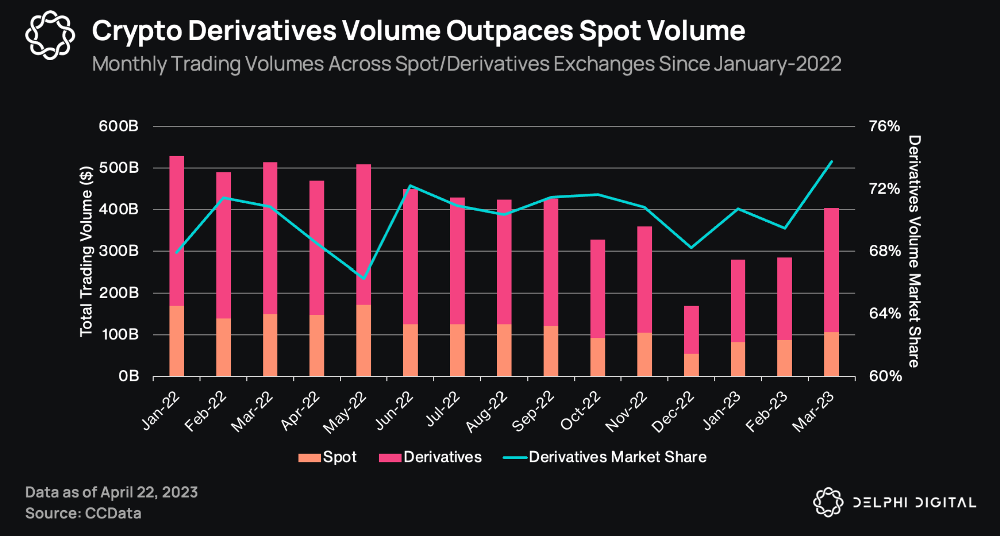
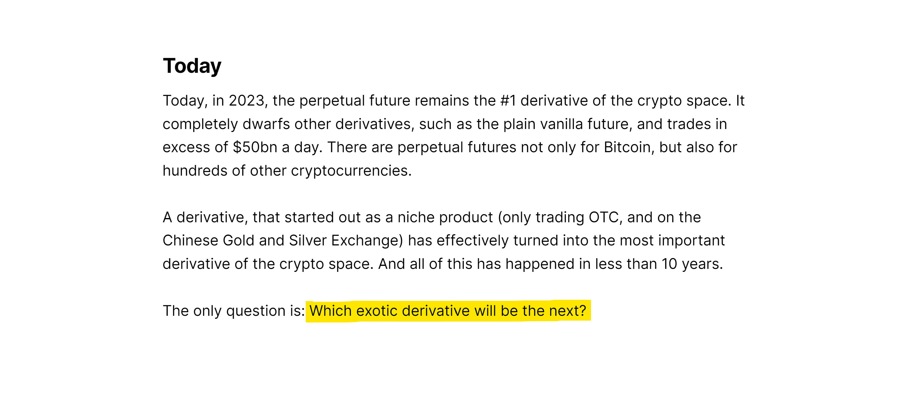
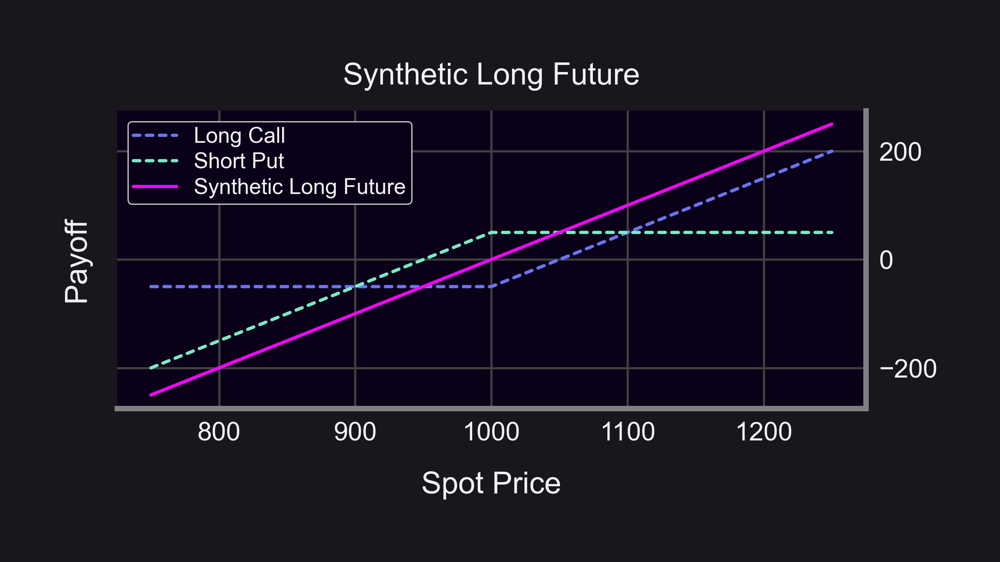
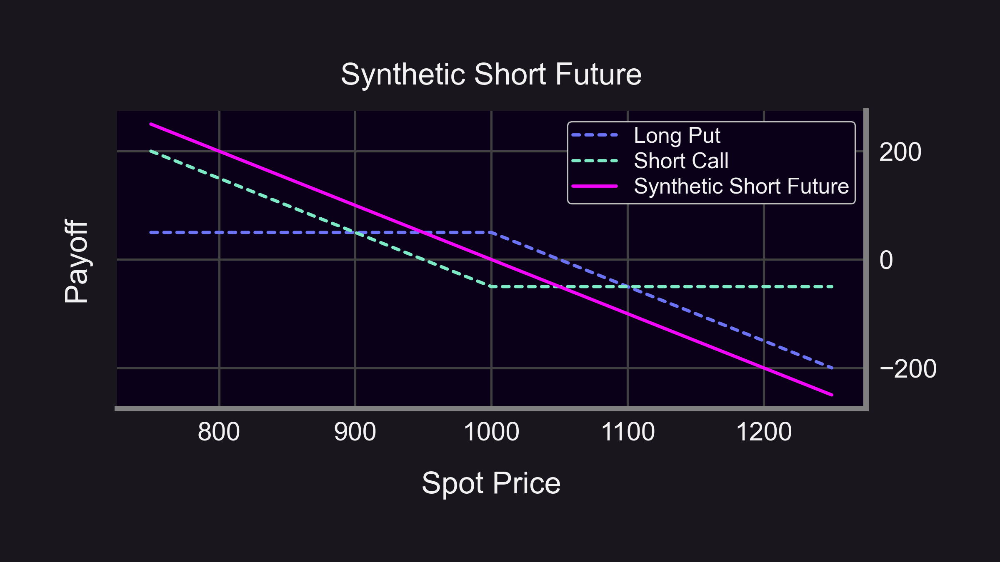

# The Evolution of Financial Systems: Spot → Derivatives Derivatives are inevitable.

It happened in TradFi and DeFi, and now it's happening to NFTs with JPEG "perps".

- How did we get here?
- What are NFT perps?
- What's next?

<!--truncate-->

----------

### How did we get here?
First, some background. Recent [research from Delphi Digital](https://members.delphidigital.io/reports/the-rise-of-nft-perpetual-futures) shows crypto derivatives outpace spot trading, with NFT "perps" slowly emerging.

- Why are derivatives so popular?
- How are they better than spot?

We'll explain 👇

#### Spot vs. Derivatives
- Spot: This includes stocks, bonds, commodities, currencies, crypto, etc.
- Derivatives: Derive their value from underlying assets which can either be spot assets or other derivatives (derivative-ception 🤯). Includes futures, forwards, swaps, and options.

What can derivatives do that spot can't?
- Lock in prices
- Hedge positions
- Capital Efficient
- More liquid
- 24/7 trading
- Speculate on assets moving down, moving sideways, moving, not moving, and more...

#### The evolution of TradFi & DeFi: Spot → Derivatives
Derivatives volume massively overshadows spot in traditional financial markets. Crypto is following suit, b/c derivatives are superior for the reasons listed above. Crypto derivatives volume market share is already >65%.

<blockquote class="twitter-tweet" data-conversation="none">
1/ 📈 Crypto derivatives, like futures and options, derive value from assets like BTC and ETH. They let traders speculate or hedge without buying the assets themselves.   A three-month streak of increasing derivatives volume shows a growing preference for this trading approach. <a href="https://t.co/ZRRmJOPGN3">pic.twitter.com/ZRRmJOPGN3</a>
&mdash; yh.ΞTH🦇🔊 | Delphi Digital (@yh_0x) <a href="https://twitter.com/yh_0x/status/1658738985529905152?ref_src=twsrc%5Etfw">May 17, 2023</a></blockquote> 

### What are NFT perps?

#### The Evolution of NFTs: Spot → Derivatives
As NFT spot markets mature, higher demand for liquidity, shorting, leverage, and hedging leads to derivative products entering the NFT space. Derivatives include fractionalization, indexes (e.g. floor prices), and now perps!

<blockquote class="twitter-tweet" data-conversation="none">
1/12 The weekly volume on all NFT trading platforms was $120M last week. This includes BAYC, CryptoPunks, LOOT, Azuki, etc.  But...  $23 billion (yes, with a B) of value was traded on Uni V3 as financial NFTs 📈  Here&#39;s 8 reasons why <a href="https://twitter.com/Panoptic_xyz?ref_src=twsrc%5Etfw">@Panoptic_xyz</a> is bullish on financial NFTs🧵 <a href="https://t.co/nQf7zsCPwQ">pic.twitter.com/nQf7zsCPwQ</a>
&mdash; Panoptic (@Panoptic_xyz) <a href="https://twitter.com/Panoptic_xyz/status/1624128589137584128?ref_src=twsrc%5Etfw">February 10, 2023</a></blockquote> 

#### NFT → NFT Perps
Protocols like [nftperp](https://twitter.com/nftperp) and [Tribe3](https://twitter.com/Tribe3Official) use perpetual futures to fill this demand:
- Track NFT floor price or bid/ask mid-price
- Long/short
- Up to 5-10x leverage
- "Cash" settled (with ETH)
- More liquidity

This financial breakthrough was powered by [Perp Protocol](https://twitter.com/perpprotocol)'s innovative vAMM design for perpetual futures trading.

### What's next?
What's next? Tell us your best guess!

NFTs → NFT Perpetual Futures → ?

#### DeFi Derivatives Landscape
Similar to NFT markets, the more mature DeFi market has also quickly adopted derivatives like [perpetual futures](https://blog.everstrike.io/how-an-obscure-otc-traded-derivative-took-over-crypto/). But what's next?

Tokens → Perpetual Futures → ?

#### DeFi Perpetual Options: Tokens → Perpetual Futures → Perpetual Options

Like futures, options provide directionality and leverage. But unlike futures, options provide added flexibility:
- Capped losses
- Market-neutral
- Volatility bets
- Custom probability of profit and profit potential

You can replicate futures with options, but not the other way around!
- Futures:
    - Linear payoff
    - Static delta (∆ = ±1)
    - No gamma (Γ = 0)
- Options:
    - Non-linear payoff
    - Dynamic delta (-1 ≤ ∆ ≤ 1)
    - Dynamic gamma (-1 ≤ Γ ≤ 1)

    
Combining options can yield a static delta with no gamma (just like a futures contract)! 🤯

Similarly, you can replicate "perps" (perpetual futures) with "XPOs" (perpetual options). You'll soon be able to trade perpetual options and synthetic perpetual futures on Panoptic with [up to 3.33x leverage](https://panoptic.xyz/docs/trading/multi-leg-strategies#synthetic-positions).

Options provide traders with added flexibility that futures fall short of. As crypto and NFT markets evolve and mature, they will follow the inevitable pattern of financial markets: Spot → Derivatives → (Perpetual) Futures → (Perpetual) Options