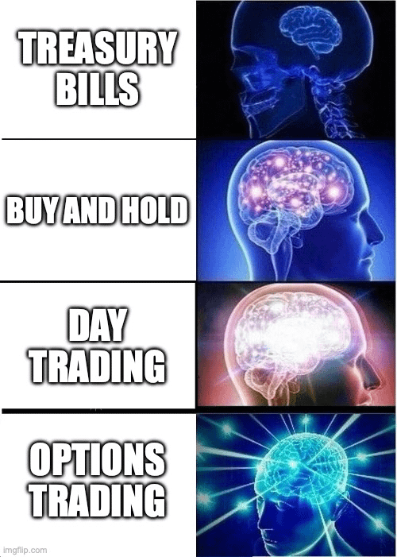
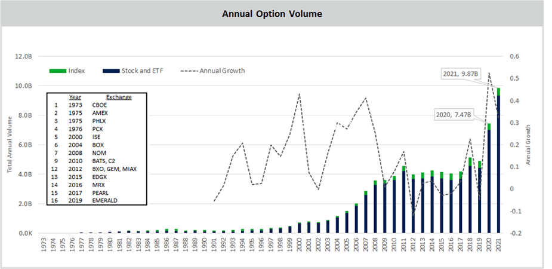
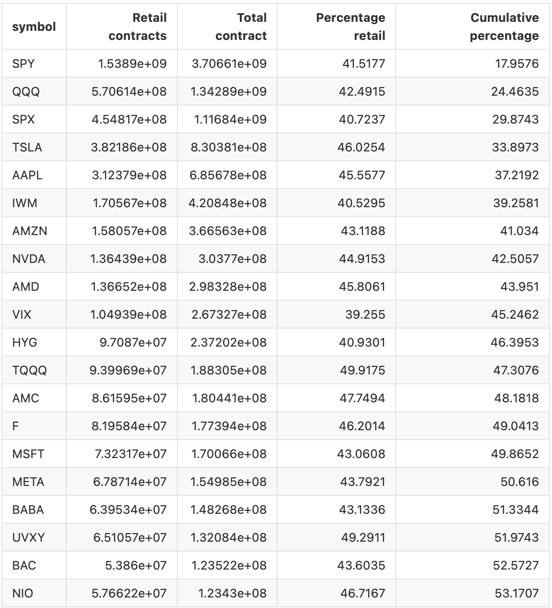
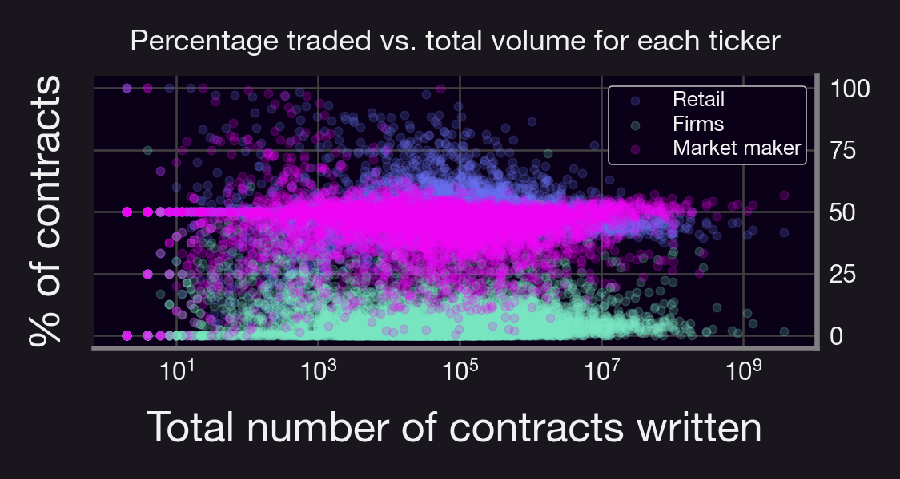
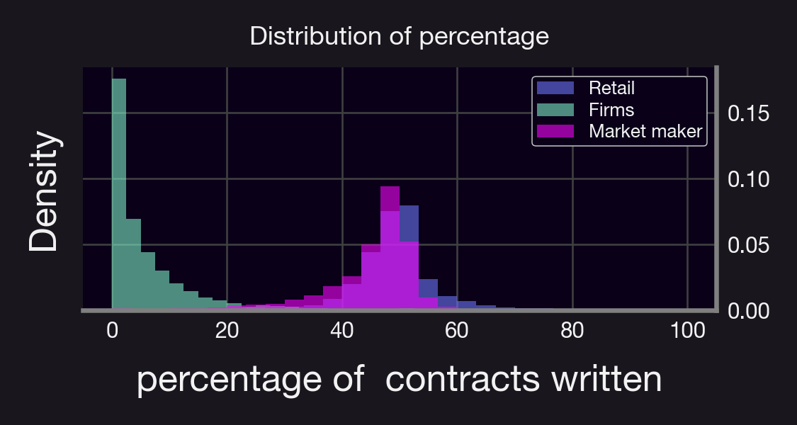
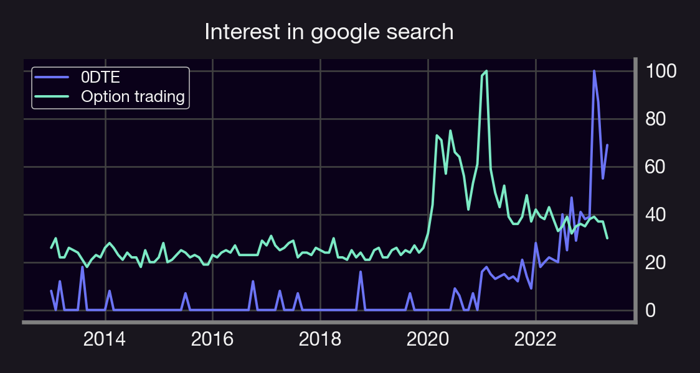

We keep hearing that options trading is only for institutional investors. Is it true? Or is it just a misconception? Let's dive in!

<!--truncate-->

---
In this research bite we will discuss:
- Options trading volume
- The proportion of retail volume
- Why it is increasing

### Overview
First, options trading (in general) is booming! Volume has been in an upwards trend for several years.

- 2019: ~4.5B contracts
- 2020: ~7.4B contracts
- 2021: ~9.87B contracts
- 2022: ~ 20.6B contracts!

This is across CBOE, AMEX, PHLX, ISE, etc. (Source: CBOE & OCC)

### Explosive Growth in Retail Volume
So there's an increasing interest in options, but what about retail?
- In 2020, retail investors accounted for 25% of all options contracts traded on U.S. exchanges. This was up from just 10% in 2010!
- 2021 was similar, and 2022 absolutely took off! 📈📈📈

(Source: CBOE)

According to data obtained from the OCC, in 2022 retail volume accounted for 44.3% of the total traded volume! In practice this means that almost 9B options contracts traded last year were retail.

(Source: [OCC](http://theocc.com/Market-Data/Market-Data-Reports/Other-Market-Data-Info/Batch-Processing/Volume-by-Account-Type-Download-Batch-Processing))

A few insights on this data:
- Options on the top 20% of underlying account for 50%+ of all traded volume.
- These top contracts are mostly on ETFs or in the tech sector.
- About 40% of SPY options are retail!

- Could be related to surging trends in 0DTEs & meme stocks.
- No clear trend between total volume and retail volume

- Market Makers get largest % of institutional trades (vs firms)

### Drivers
So what's causing this retail options boom? There's a few potential reasons:
- New, low-cost trading platforms
- Increase in education & communities

The rise of user-friendly, low-cost, or no-cost platforms like Robinhood and TD Ameritrade has democratized options trading. Online platforms and communities have made it easier for retail traders to learn about options and take part in the action. Groups like r/WallStreetBets or r/0DTEs are indicative of this trend.

We can see an increase of Google searches on these categories:

In addition, an E*Trade 2021 [survey](https://www.businesswire.com/news/home/20210928006079/en/E\*TRADE-Study-Suggests-Young-Investors-Want-Professional-Guidance-as-Much-as-Digital-Content) suggested that ~50% of young investors (ages 18-34) planned to move into options trading. That’s up from ~35% just two years prior. Millennials and Gen Z are leading the retail options trading revolution!

--- 

The trend is clear. Retail investors are increasingly participating in the options market, shaping trends, and influencing markets. The days of option trading being the exclusive domain of big institutions are changing! Going forward, we expect this trend to continue. As more retail investors educate themselves and gain confidence, we're likely to see retail option trading continue to rise.

Ultimately, the growth of retail options trading underscores the democratization of finance. Retail traders now have access to the same tools as institutional traders, leveling the playing field.