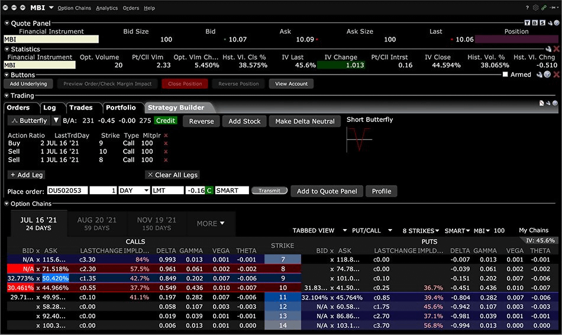
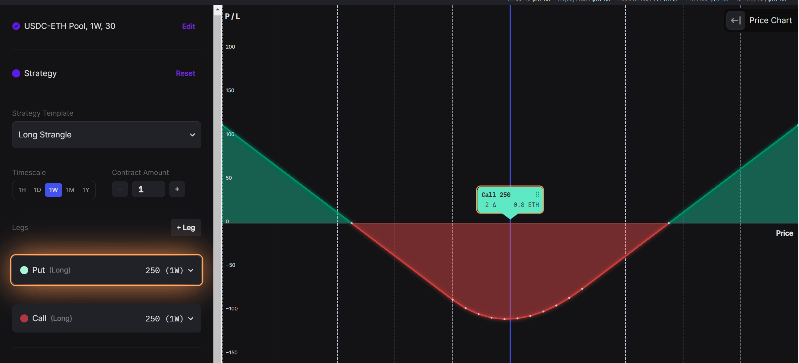

With the increasing trend of retail options trading in TradFi, it's only a matter of time before this trend sweeps into DeFi. Here's 8 reasons why retail options will overtake DeFi and how Panoptic will be at the center of it all.

<!--truncate-->

---

This is the final part of our series of investigating why retail options trading volume in TradFi will spread to DeFi. If you missed it, you can read [part one](https://panoptic.xyz/research/defi-advantages-over-traditional-finance) (*8 Advantages of DeFi over TradFi*) and [part two](https://panoptic.xyz/research/retail-options-volume) (*How Much Options Trading Volume Is Retail?*).

### 1. It's About Access 🎯
DeFi democratizes finance by making it accessible to everyone with an internet connection, regardless of geographic or economic barriers. Panoptic is a permissionless protocol, so soon you'll be able to trade crypto options from anywhere!

### 2. Data Availability 📲 
Historical option data is rarely freely-available in TradFi, meaning that users (retail & institutional) have to pay hefty subscription fees for it. In DeFi, everything is recorded on the blockchain, which anyone can access.

### 3. User-friendliness 🫧
Have you ever traded options in TradFi? Most platforms have an ugly & obfuscated UI (left).

Compare that to Panoptic's beautiful & streamlined UI (right).

Additionally, no one will be selling order book data since all data is publicly available.

### 4. Market Availability 💤
Panoptic will offer round-the-clock trading. Unlike traditional markets with set trading hours, DeFi never sleeps.

### 5. Ease of Innovation 💡
Due to its decentralized and permissionless nature, DeFi is an excellent environment for new, complex options products. This is the case of Panoptic, for example, which offers a new perpetual type of option that does not exists outside crypto.

### 6. Fees 💸
Fees on TradFi options go toward the exchange owners, whereas fees in DeFi can go toward the actual liquidity providers. In Panoptic, commission fees will go directly to Panoptic liquidity providers (PLPs).

### 7. Composability in DeFi 🔄
could allow for innovative options strategies. One DeFi protocol could borrow liquidity from another, creating a web of interconnected protocols and markets.

### 8. Financial Literacy 💼
As more retail traders educate themselves about options, they'll look for platforms that provide the tools and transparency to execute their strategies - and DeFi can deliver.

---

For all of these reasons, we are extremely bullish that by facilitating the integration of options trading into DeFi, Panoptic will be a game changer for both institutional and retail traders.