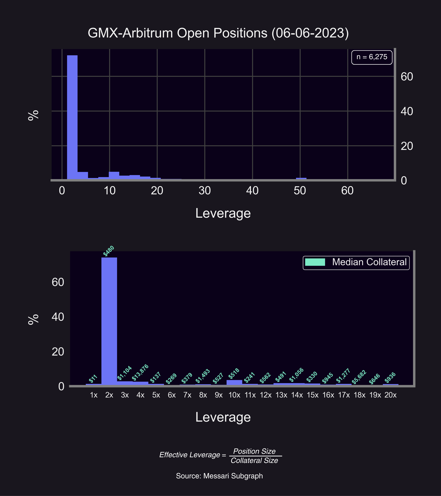
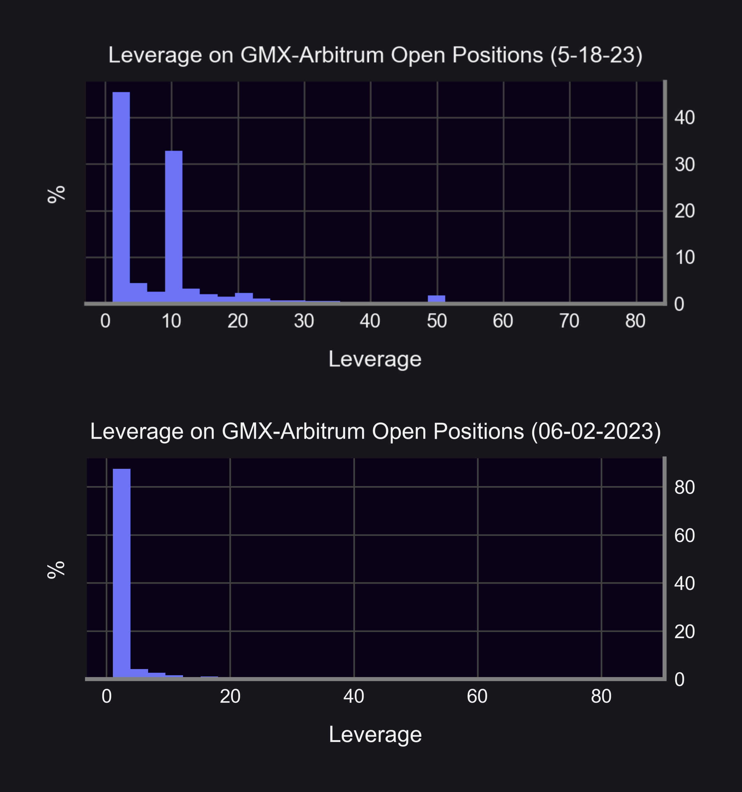
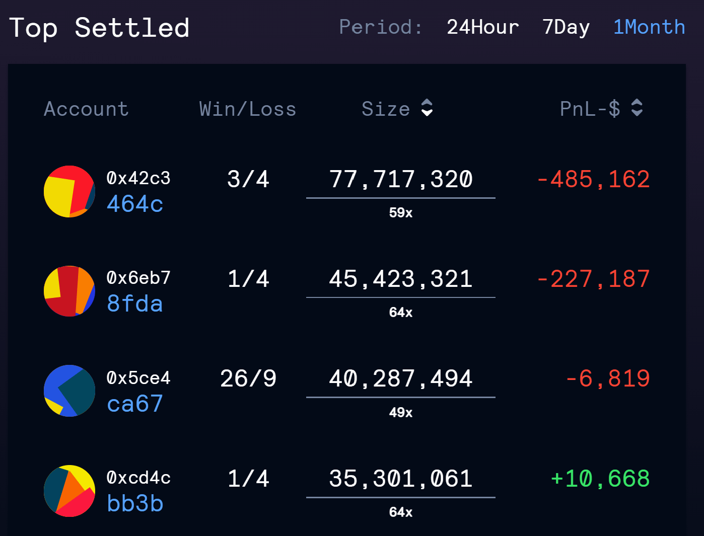

A common myth is that crypto users don't want options. The argument goes as follows:

> *"Retail only wants leverage—not options—and perps already fill this role."*

But recent on-chain evidence shows otherwise: retail users prefer 2x leverage over 125x leverage. In this post, we'll debunk the myth that crypto retail want max leverage.

<!--truncate-->

### Results

For our study, we take on-chain snapshots of open positions on GMX-Arbitrum, one of the most popular perpetual futures ('perps') platform.

<blockquote class="twitter-tweet">
GMX and dYdX are the two largest perps DEXs in terms of TVL, making up over 84% of the subsector’s TVL. GMX has consistently outperformed and surpassed dYdX in TVL mainly due to its revenue-sharing scheme with stakers of GMX and GLP tokens. <a href="https://t.co/DRF7EYxRoM">pic.twitter.com/DRF7EYxRoM</a>
&mdash; The Block Pro (@TheBlockPro__) <a href="https://twitter.com/TheBlockPro__/status/1626635330307620866?ref_src=twsrc%5Etfw">February 17, 2023</a></blockquote> 

Our reasons for choosing GMX are that GMX is the number one perps decentralized exchange (DEX) by total value locked (TVL), GMX users are primarily retail (indicated by the small collateral size of positions), and data is readily accessible.

We find the following results:
- Nearly 80% of open positions were only 2-3x leveraged.
- Less than 20% exceeded 10x leverage.

These results are consistent over time. Random snapshots find that 2-3x leverage is most popular.

### Comparison To Other Platforms

The biggest perps exchanges offer up to 125x leverage:
- Binance: up to 125x leverage
- GMX: up to 50x leverage
- Kwenta: up to 50x leverage
- dYdX: up to 20x leverage

So while GMX offers up to 50x leverage, users prefer much lower level of leverage around 2-3x. Future studies should analyze the leverage distribution on other exchanges.

### Panoptic Options Leverage
Panoptic easily caters to retail demand for 2-3x leverage. The maximum leverage allowed on Panoptic options differs based on the option position traded:
- Long options: up to 10x leverage
- Short options: up to 5x leverage
- Synthetic perp futures (long call + short put or long put + short call): up to 5x leverage

<blockquote class="twitter-tweet" data-conversation="none">
11/14 You can replicate futures with options, but not the other way around!  Futures: linear payoff, static delta (∆=±1), no gamma (Γ=0) Options: non-linear payoff, dynamic delta (-1≤∆≤1) and gamma (-1≤Γ≤1)  Combined options can have static delta + no gamma (= future)! 🤯 <a href="https://t.co/RgKhxrdTPE">pic.twitter.com/RgKhxrdTPE</a>
&mdash; Panoptic (@Panoptic_xyz) <a href="https://twitter.com/Panoptic_xyz/status/1661114878009180160?ref_src=twsrc%5Etfw">May 23, 2023</a></blockquote> 

### Options vs. Perps
Options are more flexible than perps, and Panoptic is poised to bring all the benefits of options to DeFi through perpetual options.

<blockquote class="twitter-tweet" data-conversation="none">
10/14 Tokens → Perpetual Futures → Perpetual Options  Like futures, options provide directionality and leverage.  But unlike futures, options provide added flexibility: • Capped losses • Market-neutral • Volatility bets • Custom probability of profit and profit potential
&mdash; Panoptic (@Panoptic_xyz) <a href="https://twitter.com/Panoptic_xyz/status/1661114864386068480?ref_src=twsrc%5Etfw">May 23, 2023</a></blockquote> 

In addition, perpetual calls/puts have all the upside of perps, none of the downside, and no liquidation risk from single-wick fluctuations!

So, why the myth? Perhaps the misconception that retail wants extreme leverage stems from leaderboards.

But don't be fooled...High leverage requires meticulous monitoring to avoid liquidations. Additionally, these positions are often just one leg of a "basis trade" — e.g. the perp is hedged via spot.

If you're trading unhedged positions on 125x leverage without active monitoring, watch out:

---

You can verify our [results](https://github.com/panoptic-labs/research/tree/main/_research-bites/20230614) on GitHub. Use our open-source Jupyter Notebooks to analyze the GMX leverage distribution any time!