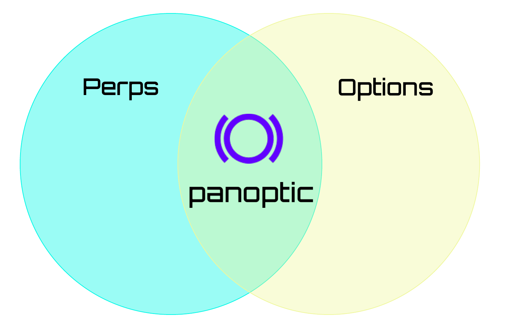
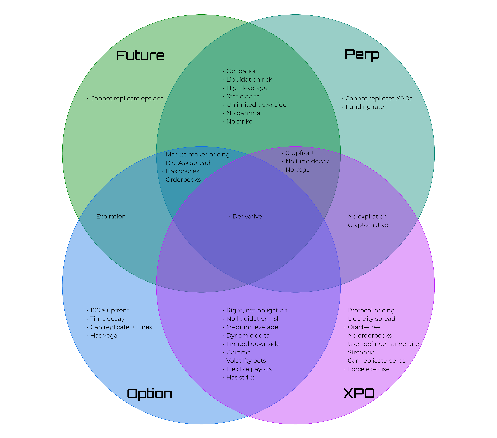
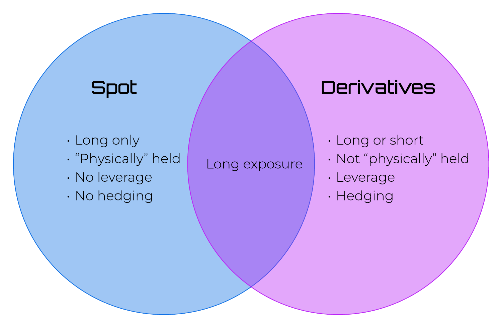
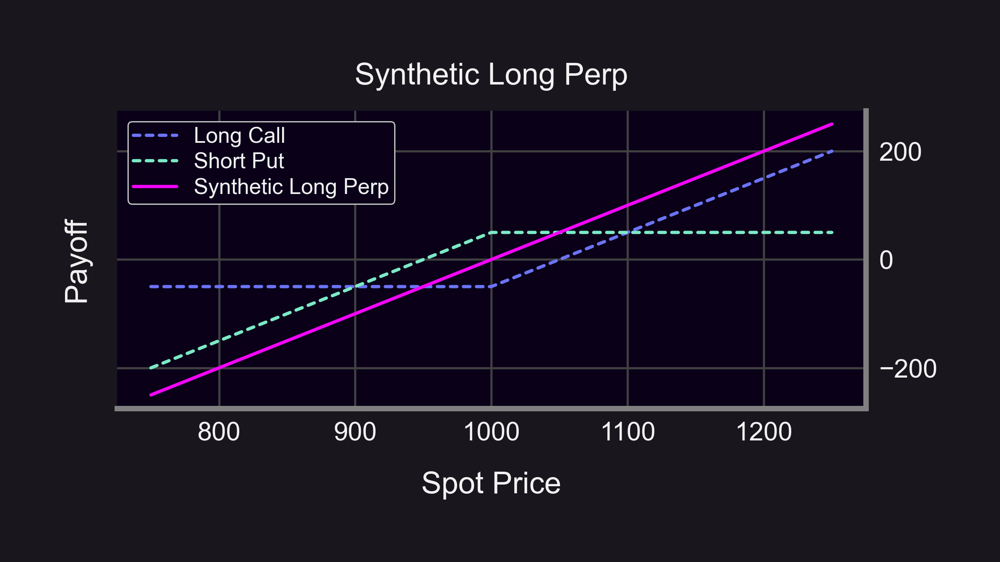
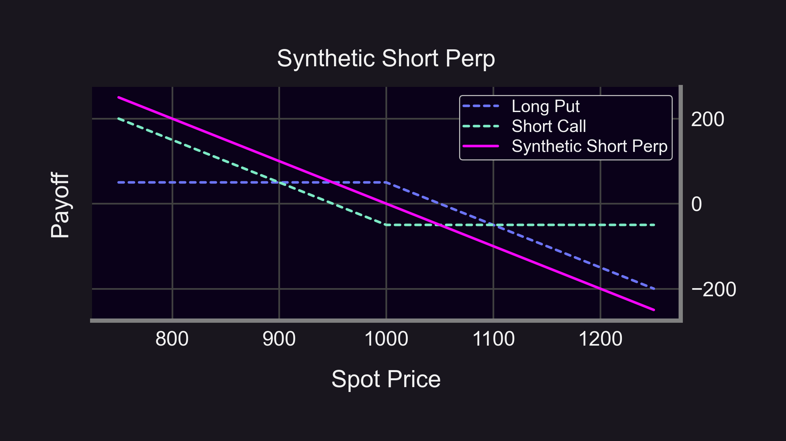
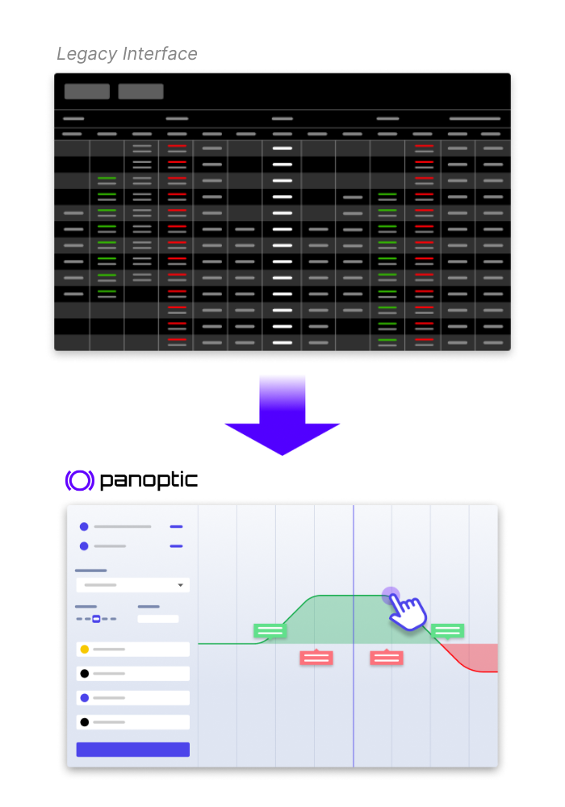

The latest derivatives innovation in decentralized finance (DeFi) is perpetual options, or expirationless options (XPOs). Over the last several months, DeFi derivatives have seen [increased trading volume](https://finance.yahoo.com/news/crypto-derivative-volumes-rose-march-161855410.html) in part thanks to perpetual futures, or [perps](https://panoptic.xyz/docs/trading/perpetual-options#how-do-perpetual-options-compare-to-perpetual-futures-perps).

  

With the introduction of XPOs and the rise of perps, it’s important to understand the similarities and differences between these two types of derivatives to gain a deeper understanding of where each of these new financial instruments are headed.

<!--truncate-->

---

## What are XPOs?

  

XPOs are non-standard, or exotic, financial options that have no expiration date. XPOs are not currently listed or actively traded anywhere.

  

Around the turn of the millenia, perpetual options were discussed in several papers by thought leaders including [Elias Shiu, Hans U. Gerber](https://www.researchgate.net/publication/265950127_Pricing_perpetual_options_for_jump_p[%E2%80%A6]X_Sheldon_Lin_and_Xiaolan_Zhang_and_a_reply_by_the_authors), and [Ernesto Mordecki](https://citeseerx.ist.psu.edu/viewdoc/download?doi=10.1.1.457.4862&rep=rep1&type=pdf). Two decades later, the concept of perpetual options in crypto gained popularity after [Everlasting Options](https://www.paradigm.xyz/static/everlasting_options.pdf) was published in May 2021 by Paradigm Research Partner, Dave White, and former CEO of the now bankrupt FTX, Sam Bankman-Fried.

  

A month later, in June 2021, CEO and inventor of the Panoptic protocol, Guillaume Lambert, identified liquidity provider (LP) positions [behave like perpetual options](https://lambert-guillaume.medium.com/uniswap-v3-lp-tokens-as-perpetual-put-and-call-options-5b66219db827) on Uniswap v3.

  

To understand XPOs, we should first understand their traditional counterpart – vanilla options.

  

### Vanilla Options

Vanilla options are traditional options with a fixed expiration date (expiry) and strike price (lock-in price) that grants the holder the right, but not the obligation, to trade an asset. The term "vanilla" means plain, and is added to contrast the "exoticness" of other, non-traditional options such as the perpetual option.

  

For more information on vanilla options, please see our [docs](https://panoptic.xyz/docs/trading/basic-concepts). Now that you’ve understood regular options, let’s discuss the benefits of XPOs’ main difference from vanilla options – being expirationless.

  

### No Expiry

XPOs have no expiration date. Consequently, holders of XPOs benefit from no expiration risk, more exercise flexibility, and no burden of having to [roll](https://www.tastylive.com/definitions/rolling-options) positions.

  

#### No expiration risk

XPOs do not have the risk of expiring worthless to holders.

  

#### More exercise flexibility

XPOs may be exercised by holders at any time.

  

#### No rolling required

XPOs do not need to be rolled since they never expire.

  

## How are XPOs Priced?

  

### Everlasting Options Pricing

In  [Everlasting Options](https://www.paradigm.xyz/static/everlasting_options.pdf), White and Bankman-Fried proposed a "funding fee" mechanism where buyers pay sellers on a regular interval (e.g. twice per day) the difference between the mark price (traded price) and the payoff divided by the number of settlement periods per day:

  

$Funding Fee_{N} = \frac{mark - payoff}{N}$

  

where $N$ is the number of settlement periods per day (e.g. $N = 2$).

  

White and Bankman-Fried further show through a no-arbitrage assumption that the price of an everlasting option for a fixed strike price X is equivalent to the price of a weighted basket of vanilla options with weights given by the set $\{(\frac{N}{N+1})^i\}$ and the basket of vanilla options given by the set $\{Regular_i\}$ where $i$ goes from one to infinity and $Regular_i$ is a vanilla option with strike price X expiring in $i$ days.

  

### Panoptic Perpetual Options Pricing

In Panoptic's [whitepaper](https://paper.panoptic.xyz), Lambert and Kristensen proposed a "streamia" (streaming premia) mechanism where buyers pay sellers the forgone liquidity provider token fees of the position in the underlying automated market maker (AMM) pool on a regular interval (i.e. every block).

  

Further, Lambert and Kristensen show that under the streamia mechanism, perpetual options pricing is path-dependent and relies on the spot price of the underlying asset. By simulating over many spot price paths, they find that the price of a perpetual option converges to the Black-Scholes price of its vanilla option [counterpart](https://panoptic.xyz/research/zero-dte-defi-options).

  

### How Does Panoptic’s Pricing Mechanism Depart from the Funding Mechanism Proposed in Everlasting Options?

By adopting the streamia model, Panoptic makes perpetual options on all crypto assets work on chain. Options require no oracles, intermediaries, counterparties, or order books.

  

Panoptic’s streamia is based on real trading activity in the underlying AMM pool. Each Panoptic pool tracks the fees collected by the corresponding AMM pool to determine the precise streamia to charge buyers. This eliminates the need for manipulable external oracles, professional market makers, order books, and computationally expensive Black-Scholes pricing.

  

The funding-fee mechanism proposed in Everlasting Options requires the retrieval of the price of the underlying asset at each funding settlement time in order to calculate the payoff of the basket of vanilla options. This would likely have to be implemented with an oracle, which carries the problems of centralized exchange (CEX) dependency and [manipulation](https://cointelegraph.com/news/decentralized-exchange-gmx-suffers-565k-price-manipulation-exploit).

  

Unlike the oracle-dependent funding mechanism of everlasting options, Panoptic’s streamia-based perpetual options are completely oracle-free and protected from the issues that stem from oracle dependency.

  

## What are Perps?

Perpetual futures, commonly known as "perps", are a type of futures contract without an expiration date. Unlike traditional futures contracts, which have a specified expiry, perps continue indefinitely, providing a seamless trading experience that eliminates the need for contract rollovers. They share some characteristics with standard futures contracts, allowing traders to speculate on the future value of an asset, but they also bring unique advantages and complexities in terms of pricing and management.

  

Perps are a relatively new instrument in the financial world, initially [used in the Chinese Gold and Silver Exchange](https://onlinelibrary.wiley.com/doi/10.1002/fut.3990080108) of Hong Kong in the late 1980s. Although their effectiveness and the advantages they bring would largely remain unseen in the rest of the traditional financial world, perps would later be adapted for use in the rapidly growing crypto markets. Today, they stand as the most popular derivatives instruments traded in crypto, demonstrating their utility in various trading and hedging strategies.

  

To understand perps, we should first understand their traditional counterpart – vanilla futures.

### Vanilla Futures

Futures contracts are a financial derivative that provide traders with the right to buy or sell an underlying asset at a predetermined price on a specific future date. The term "vanilla" means plain, and is added to contrast the "exoticness" of other, non-traditional futures such as perps.

  

Vanilla futures are time-bound and subject to liquidity constraints across different expiry dates. Perps, on the other hand, remove these limitations, offering a simplified trading mechanism for speculators and hedgers alike.

  

### No Expiry

Perps have no expiration date. Consequently, holders of perps benefit from no expiration risk and no burden of having to [roll](https://www.investopedia.com/ask/answers/073015/how-do-futures-contracts-roll-over.asp) positions.

  

#### No expiration risk

Perps do not have the risk of expiring, allowing continued exposure to the underlying asset, reducing [basis risk](https://corporatefinanceinstitute.com/resources/capital-markets/what-is-basis-risk/), and avoiding actual settlement and delivery of the underlying asset.

  

#### No rolling required

Perps do not need to be rolled since they never expire.

  

## Pricing Perps

  

The pricing mechanism of perps is different from that of traditional futures contracts. While standard futures prices converge to the spot price as the expiry date nears, perps lack an expiry date and therefore need an alternate mechanism to ensure the contract's price stays close to the underlying asset's spot price. This is where the "funding rate" comes into play.

  

### Perps Funding Rate

  

The funding rate is a unique feature of perps that facilitates an automatic "rolling" of the futures contract. Unlike regular futures which need manual rolling before expiry, perps simplify portfolio management by providing an automated rolling mechanism. This not only makes them easier to manage but also ensures they are not time-sensitive.

  

Moreover, the funding rate mechanism aggregates liquidity across various expiry periods into a single product. This greatly enhances the market depth and trading efficiency of Perps, making them an attractive instrument for a wide array of traders.

## Why are Perps Popular in Crypto?

#### Aggregated Liquidity

One of the most notable features of perps is their liquidity. Traditional futures contracts have expiry dates, which can create liquidity constraints, as the trading interest and volume are fragmented around multiple expiries. In contrast, perps have no expiry dates, which means all trading interest and volume are concentrated in one single contract per asset. This creates a high degree of liquidity, making it easier for traders to enter and exit positions without significantly impacting the market price.

#### Easy access

Another advantage of perps is their easy access. Many centralized exchanges (CEXs) and decentralized exchanges (DEXs) list perps contracts for many crypto assets, meaning that traders can easily speculate on their favorite token. This widespread availability has made perps a popular choice among crypto traders.

#### Directional

Perps also provide traders with the flexibility to take a position depending on their market outlook. Traders can go long if they expect the underlying crypto asset's price to rise, or they can go short if they expect the price to fall. This feature provides traders with the ability to profit in both rising and falling markets or hedge their holdings in all markets, increasing the appeal of perps.

#### Easy leverage

Lastly, perps allow traders to use leverage to increase their potential profits. This means traders can take on larger positions – up to 125 times larger – than their account balance would ordinarily permit. The ability to easily access leveraged exposure to crypto tokens by trading perps has made them a favorite among many traders.

## Advantages of XPOs over perps

XPOs present several unique benefits over perps that make them an exciting new way to trade.

#### More Flexible than Perps

Just as options are a more flexible version of futures, XPOs are a more flexible version of perps. Unlike Perps, where a trader can only go long or short, XPOs offer the flexibility to choose any position in between. More specifically, the slope (delta) of a perp or future payoff curve can only take on the values of positive one or negative one (±1). However, the slope of a XPO or option payoff curve can be positive one, negative one, or anything in between. This means that with XPOs, you can modify your payoffs to reflect a wide variety of trades that cannot be achieved with perps:

#### Volatility bets

Simultaneously long and short the price of the underlying asset.

#### Crab market bets

Neither long nor short the price of the underlying asset – bet on the price remaining stable.

#### Capped downside

Defined risk positions with limited loss.

#### Capped upside

Maximize your profit with options spreads at the expense of forgoing some upside.

#### Customized payoffs

Combine multiple options ("multi-legged trade") to define a custom payoff curve – Panoptic makes customizing your payoffs easy with its seamlessly draggable interface.

#### No One-Wick Liquidation Risk

A large price movement in the underlying asset price generally will not liquidate a long XPO position in Panoptic. Traders can purchase put or call XPOs to take a bullish or bearish stance, but unlike perps, XPOs remain protected from one-off price wick liquidations. This is because long XPOs accumulate losses gradually as the underlying AMM pool volatility is realized over time. Unlike perps, long XPOs are not significantly affected by sudden price swings.

Note: short XPOs (i.e. selling perpetual options) are affected by large changes in the underlying asset price and should be carefully monitored to avoid liquidation.

#### Synthetic Perps

Synthetic perps refers to the ability to use XPOs to replicate perps payoffs. The term "synthetic" is used because traders obtain similar exposure to the underlying asset as they would trading perps, but without actually purchasing perps. Synthetic perps are a corollary of synthetic futures, which are a well-known method of replicating futures payoffs with options.

  

A long perp position is replicated by purchasing a call XPO and selling a put XPO at the same strike price. This two-legged perpetual option position has a delta of one and gamma of zero, just like a long perp.

  

  

A short perp position is replicated by selling a call XPO and purchasing a put XPO at the same strike price. This two-legged perpetual option position has a delta of negative one and gamma of zero, just like a short perp.

In Panoptic, synthetic perps will have [up to 5x leverage](https://panoptic.xyz/docs/trading/capital-efficiency) with their net streamia taking on positive or negative values at each block depending on the ratio of long and short positions at the same strike price, just as perps funding fees do. The fact that XPOs can replicate perps but perps cannot replicate XPOs illustrates the flexibility and power of XPOs.

## Advantages of Perps over XPOs

Despite the numerous advantages of XPOs, perps still have some benefits.

  

#### Liquidity

Perps generally offer more liquidity than XPOs, due to the absence of strike fragmentation. Panoptic mitigates this issue for XPOs by allowing anyone to passively participate in [fungible liquidity provision](https://panoptic.xyz/docs/panoptic-protocol/protocol-roles#panoptic-liquidity-providers-plps) that is not specific to any particular strike.

  

#### Higher Leverage

Perps provide higher leverage, ranging from 20x to 125x depending on the exchange. This high leverage allows traders to take on extremely large positions with high capital efficiency. However, [recent research](https://panoptic.xyz/research/retail-prefers-2x-over-125x-leverage) shows that usage of leverage levels over 10x are not popular among retail users.

  

#### Simplicity

Just as futures are simpler products compared to options, perps are simpler than XPOs. Traders only need to choose whether to go long or short, without needing to manage the complexities of strikes or [the Greeks](https://panoptic.xyz/docs/terms/greeks). This simplicity makes perps a preferred choice for beginners or those looking for a straightforward trading mechanism. However, one must carefully manage the liquidation price and funding fee payments required at each settlement period in order to avoid liquidation.

  

While XPOs are more complicated products than perps, XPOs trading is made simple with Panoptic’s easy, intuitive, and draggable interface.

  

## Conclusion

While perps and XPOs both have unique advantages to offer to the crypto markets, they are fundamentally different financial products each with their own role to play in decentralized finance (DeFi). A healthy and efficient market will be composed of both perpetual futures and perpetual options. As DeFi markets matured over the past few years, perps saw an explosive growth in volume. Now it’s time for XPOs to shine.

_Join the growing community of Panoptimists and be the first to hear our latest updates by following us on our [social media platforms](https://links.panoptic.xyz/all). To learn more about Panoptic and all things DeFi options, check out our [docs](https://panoptic.xyz/docs/intro)  and head to our [website](https://panoptic.xyz/)._