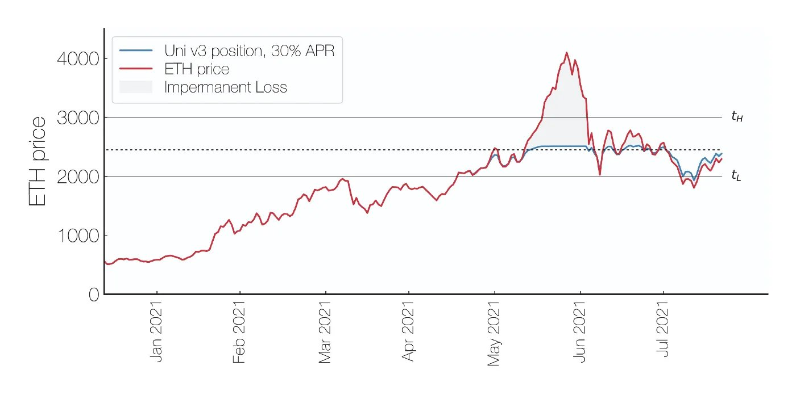
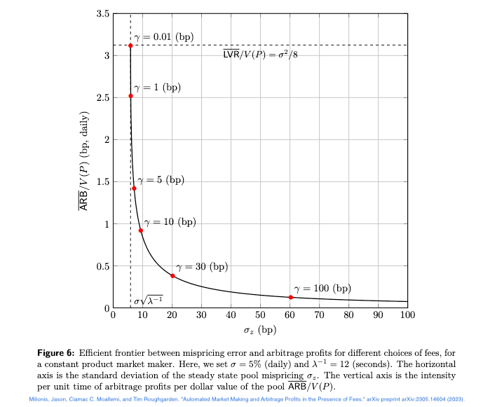
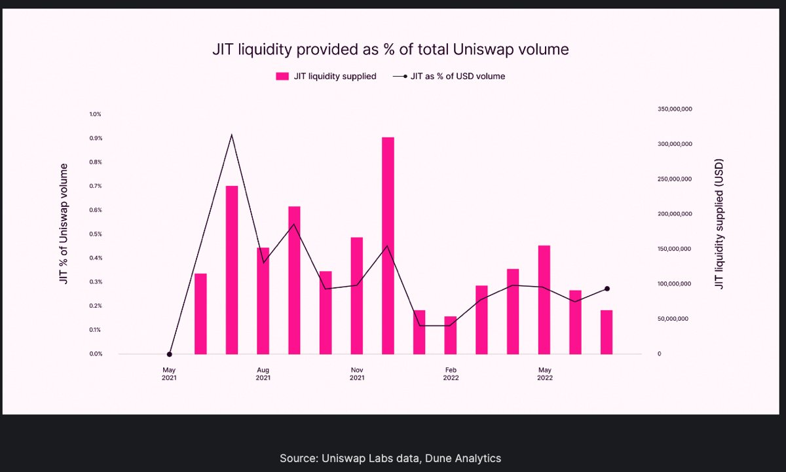

> *"Liquidity Providers (LPs) in Uniswap v3 are losing millions per year. Don’t LP unless you’re a pro!”*
  
As a retail level LP, this hasn’t been my experience at all; once I realized LPing is like selling options, it got much easier to LP successfully.  
  
Let’s use options to demystify IL/LVR/JIT/MEV.

<!--truncate-->

### 1. Impermanent loss (IL)  
  
IL was originally used to compare returns of LPing in Uniswap v2 with those of simply holding the assets separately. IL is simply gamma risk: it's the accelerating risk of assets conversion away from the initial 50:50 ratio.

How can you think like an options trader and solve IL (gamma risk)?  
  
1. Buy options to transform naked positions into spreads  
2. Keep track and neutralize your delta and gamma  
3. Trade wide positions to limit pin risk

### 2. Loss-versus-rebalancing (LVR)  
  
LVR is a metric that compares (passive) LPing to actively rebalancing a portfolio of two assets. LVR is similar to continuous hedging of options: this is the optimal scenario and difficult to achieve with non-zero gas and slippage.

How can you solve LVR (continuous hedging)? While this is difficult to do continuously in practice, here are some ways to mitigate LVR for retail LPs:
  
- Generate a diversified (low-[beta](https://panoptic.xyz/research/greeks-series-beta)) portfolio  
2. Neutralize the delta of the whole portfolio ~once a day  
3. Trade [wide](https://panoptic.xyz/research/uniswap-lp-calculate-price-range) positions (>20%)

### 3. Just-in-time (JIT) liquidity  
  
JIT is providing a large amount of single-tick liquidity for a single block to absorb a large incoming trade.  

Or: JIT is simply selling a put option that expires in 12s, and the premium received is the fees collected which are capped at 5, 30, or 100 basis points (bps).

How do you solve JIT? You don't. Selling [very short dated options](https://panoptic.xyz/research/zero-dte-defi-options) is a valid strategy, and it is typically in response to a large order that *would have* had a large price impact, but JIT limits it.
  
Is JIT profitable? Returns predicted by Black-Scholes for an options that is 12 seconds from expiry is about 2.5 bps for a 100% IV asset. A JIT LP that earns 5 bps per block absorbing a large trade is outperforming 12s options sellers, but gamma risk is through the roof.  
  
It's all about tradeoffs, but JIT is a valid strategy that shouldn't be banned 🤷‍♂️.

### 4. Maximal Extractable Value (MEV)
  
MEV due to arbitrage is used to bring the price into line with centralized exchanges (CEXs) and other decentralized exchanges (DEXs). A LARGE fraction of all volume on Uniswap is MEV arbitrage. Some believe that value extracted by MEV exploitooors is directly taken from LPs pockets. Is that true?

CEX market makers do indeed incur losses due to toxic order flow because a bad fill leads to realized losses. It's a different story for LPing: the AMM redeploys orders at no cost, so a "toxic" order is not the end because the order is still there and fees are still collected

Do we need to solve MEV? Swappers do suffer from MEV (how do you like them sandwiches?). But do LPs suffer? Not as much: each MEV-driven swap generates fees, which goes to the LPs. And the constant CEX/DEX price alignment means that LPs are sure to get an up-to-date price.

MEV and LPing is not a zero-sum game: arbitrage profits are not at the expense of LP profits. LPs aren't market making and MEV bots aren't selling options. Similarly, spot market makers in TradFi aren't competing with options market makers. Each rule over a different kingdom.

---

### Summary
To summarize:
- IL = gamma risk  
- LVR = continuous delta hedging  
- JIT = short options that expire in 12s  
- MEV = spot traders  

### Where does that leave us?
It turns out LPing is much easier to manage when dealing with it in terms of options. I've been on a quest to demonstrate that retail-level LPs can be successful, and I've been doing this by documenting my trades publicly.  
  
It *is* possible, see the following:

- Short call in ETH-CRV:
<blockquote class="twitter-tweet">
The recent Curve price turmoil meant the WETH-CRV-30bps IV was &gt;500% yesterday.   My synthetic call position was ~10% of all at-tick liquidity at that time, which yielded &gt;50% returns in &lt;1 day.  *LPing in high IV pools is extremely risky and losses are expected. Don&#39;t do it* <a href="https://t.co/HKUGuC5bez">pic.twitter.com/HKUGuC5bez</a>
&mdash; Guillaume Lambert | lambert.eth | 🦇🔊 (@guil_lambert) <a href="https://twitter.com/guil_lambert/status/1686370181709230080?ref_src=twsrc%5Etfw">August 1, 2023</a></blockquote> 

- Short strangle in ETH-1INCH:
<blockquote class="twitter-tweet">
My delta-neutral ETH-1INCH LP position had a healthy IV of ~75% IV until someone deposited ~50ETH worth of ATM liquidity across 5 ticks  Remember: IV is inversely proportional to the tick TVL  The IV is not juicy enough for me, so I closed this position for a 9.3% ROI in 21 days <a href="https://t.co/c1tHlaXhXS">pic.twitter.com/c1tHlaXhXS</a>
&mdash; Guillaume Lambert | lambert.eth | 🦇🔊 (@guil_lambert) <a href="https://twitter.com/guil_lambert/status/1684214462830575616?ref_src=twsrc%5Etfw">July 26, 2023</a></blockquote> 

- Short strangle in ETH-MRK:
<blockquote class="twitter-tweet">
MRK has been on a tear lately, but it&#39;s IV on UniV3 is also the highest it&#39;s been in 2y (81%)  I set up a straddle/delta-neutral LP position 19 days ago. Happy to close this position for 7.5% return, all the while still in the green even as my upperPrice is about to get breached <a href="https://t.co/0qvMpfS9lr">pic.twitter.com/0qvMpfS9lr</a>
&mdash; Guillaume Lambert | lambert.eth | 🦇🔊 (@guil_lambert) <a href="https://twitter.com/guil_lambert/status/1683568293376847877?ref_src=twsrc%5Etfw">July 24, 2023</a></blockquote> 
  
- Short strangle in ETH-Dai:
<blockquote class="twitter-tweet">
I minted an ETH-DAI positions 21 days ago and closed it today.   Question: What&#39;s my LVR?  -- I am attaching the specs from <a href="https://twitter.com/yewbow_?ref_src=twsrc%5Etfw">@yewbow_</a>, with more details in my next tweet.   DM me for a list of all swaps in the ETH-DAI-5bps pool between the mint and burn blocks. <a href="https://t.co/r1Jc2rRNCB">pic.twitter.com/r1Jc2rRNCB</a>
&mdash; Guillaume Lambert | lambert.eth | 🦇🔊 (@guil_lambert) <a href="https://twitter.com/guil_lambert/status/1671593549786234880?ref_src=twsrc%5Etfw">June 21, 2023</a></blockquote> 
  
I am not saying IL/LVR/JIT/MEV are not sources of concern. They are important problems. But they’re not what’s hindering retail adoption and limiting profitability.
  
The key problems I see for AMMs are:

- A bad user experience (UX)
- Low capital efficiency
- Lack of risk management tooling

We are trying to solve these problems with Panoptic. It’s been a long process but we’re finally close to [launching](https://panoptic.xyz/blog/gated-launch-sign-up). We’re very proud of the end result :)  

*Join the growing community of Panoptimists and be the first to hear our latest updates by following us on our [social media platforms](https://links.panoptic.xyz/all). To learn more about Panoptic and all things DeFi options, check out our [docs](https://panoptic.xyz/docs/intro) and head to our [website](https://panoptic.xyz/).*
