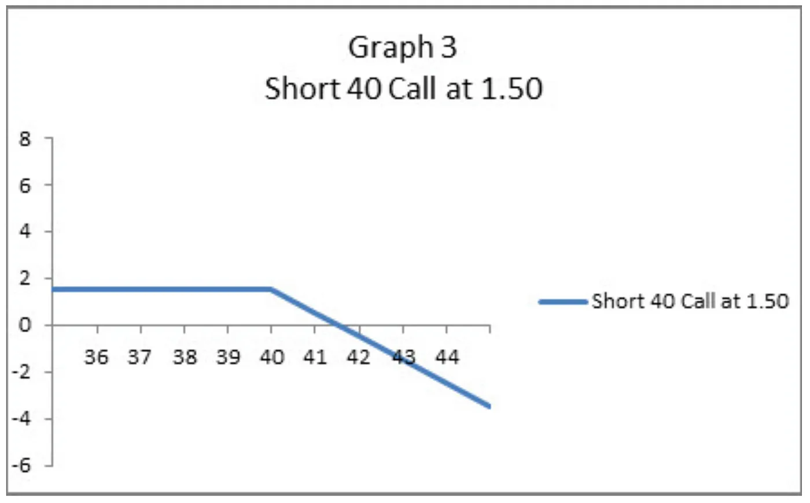
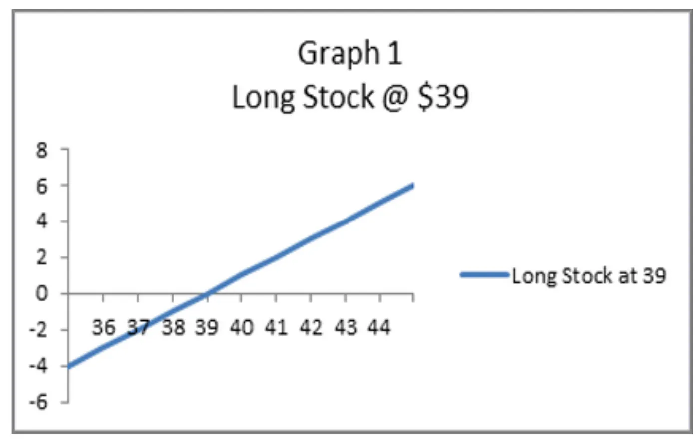
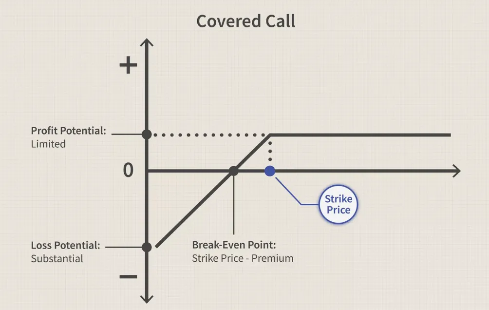
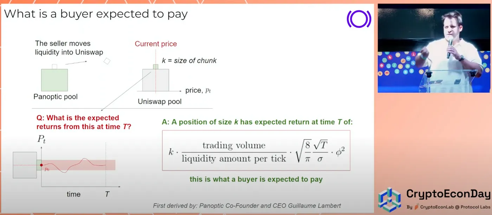
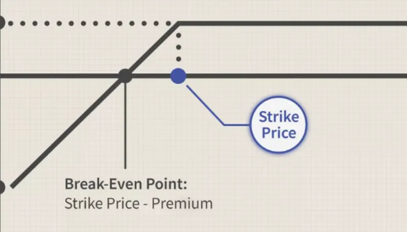
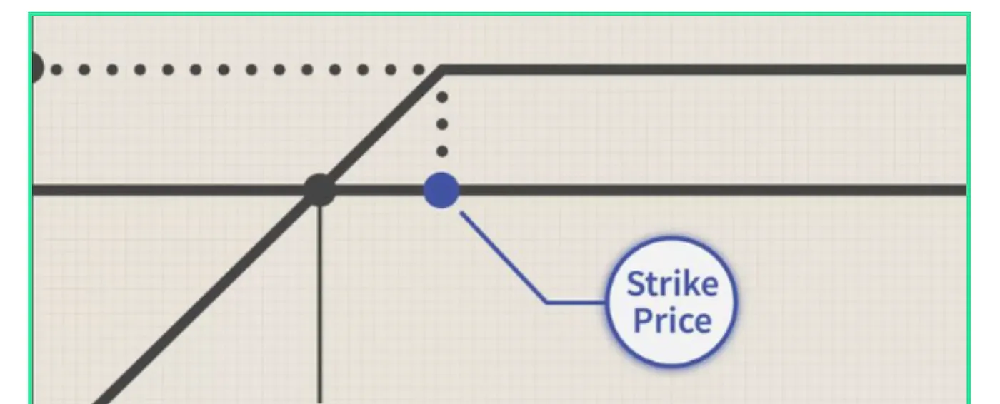
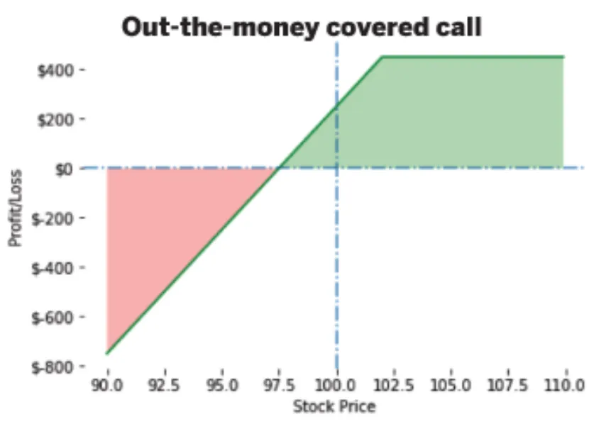
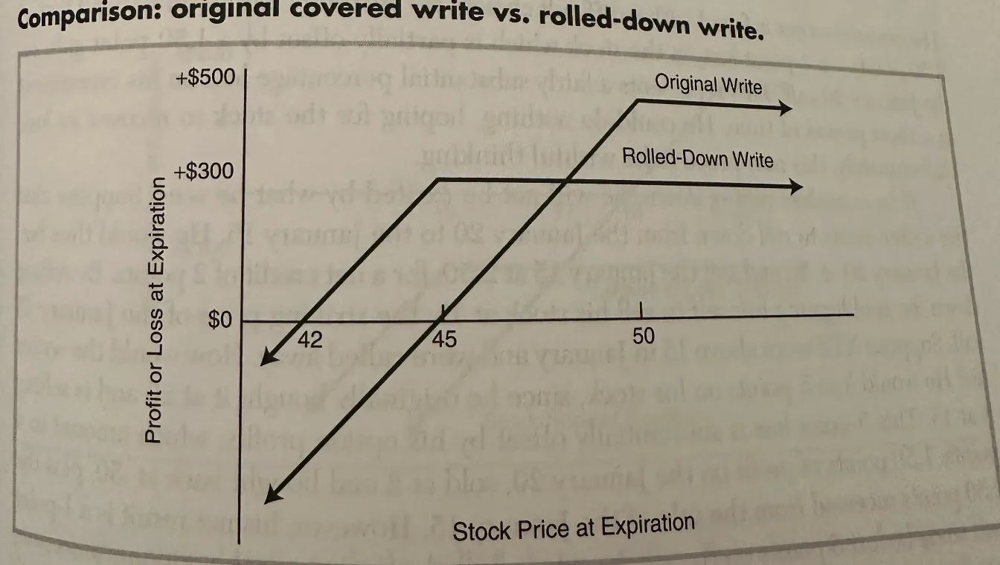
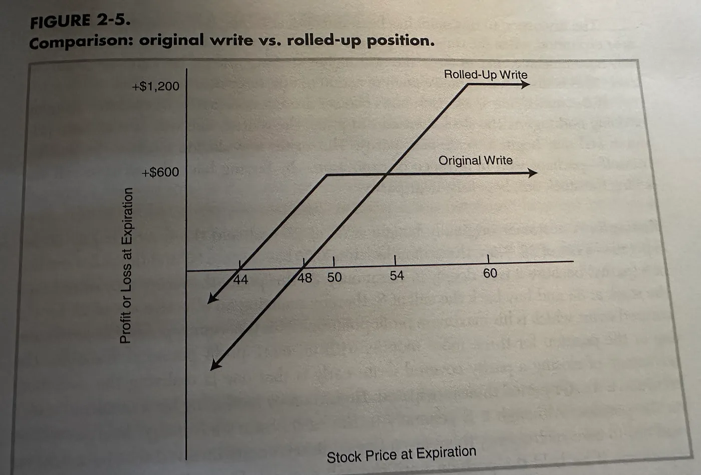
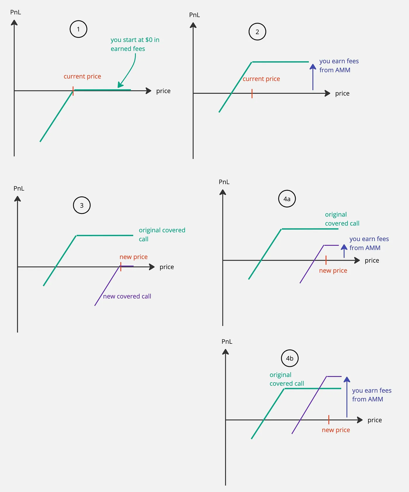

In Part II of the [series](https://panoptic.xyz/research/panoption-trading-strategies-the-basics), we will cover two main parts:

1.  Explaining what the covered call strategy is
2.  Explaining what actively managing your options position and what “rolling options” mean

<!-- truncate -->

## The Covered Call—Why?

Let’s say you own 1 ETH. Let’s say you also sell ETH call options worth 1 ETH. You now have both the ETH itself and the ETH call options (and importantly, they have the same value meaning the option is written on 1 ETH, not 2 ETH or something else). That’s perfectly allowed. Why would you want to do this? Why not do one or the other—either own the ETH or just sell the option? Why have both? It might seem odd, or it might not.

The covered write is generally considered to be a conservative strategy. This is because the covered write on the token is generally less risky than holding the token itself. Because if a decline in price happens, you have generally  [collected streamia](https://panoptic.xyz/blog/streamia-defi-native-options-pricing)  which offsets the loss.

It’s a common strategy in options trading, so let’s dive in some more:

## What can I do with a Covered Call?

By writing (selling) an option, we can earn a bit of income right now — and for Panoptic: You will start to collect income as trading happens in the AMM. As mentioned earlier, we achieve a bit of downside protection via this cash collected. Thus, we can earn some money in flat markets (how long has BTC been at $30k again?). The “covered” refers to the fact that you own the underlying ETH. So there’s a “cap,” or “cover,” on how much you can lose. This is opposed to “naked” options selling where the naked refers to you not owning the underlying ETH.

But of course, there are still trade-offs, such as limited upside potential: if the price of ETH goes up a lot, you’re not taking part in this move. If the price of ETH goes down by a lot you’re also still taking part in those losses.  [Early assignment](https://panoptic.xyz/docs/panoptic-protocol/risks#early-assignment-risk)  is another one that prevails in TradFi; this is not a risk in Panoptic.

But anyway, you need to be neutral (and potentially slightly bullish) on ETH to do this, and the point summed up is that you’re thinking:

> “I don’t think ETH will move by a whole lot. Maybe go slightly up, but that’s it. And I want to earn some money on my ETH, which is not moving anyway, to increase my portfolio yield.”

Okay, let’s get into why all this is true and the mechanics of it. We will also compare TradFi to Panoptic as we go along.

## Review Payoff Curves

As a way of review, when you sell ETH call options, your payoff curve looks like this to you as the seller—the graph is from Fidelity (though the image quality seems to be low-fidelity 🤷):

Don’t pay attention to the specific numbers or the legend since they don’t follow our example here, but notice the shape of the blue full curve: If the price increases in value, we lose money. If the price decreases, we have a capped loss (capped risk).

Okay, so writing (or selling) a call option on ETH is bearish: We lose money if it increases in value. But what happens if we now account for the ETH we owned in the first place? If the price goes up, then ETH goes up in value (because “price” means “price of ETH”), our entire portfolio consisting of the “raw” ETH and the option we sold would flatten out as the price increases, right? Because we’re holding something that goes up in value and at the same time something that goes down in value at the same exact rate. So they cancel as the price of ETH increases.

Here, the “payoff” for just owning ETH is like this (again, ignore the stonk reference and numbers, etc.—the curve is what matters):

Nothing special, just that “you make more money on ETH (y) as the price of ETH goes up (x)”... okay, fine.

Now combine those two curves, add them together, and we get:

So now the combined curve flattens out for high ETH prices. In TradFi, you’d collect money upfront for selling the call option so actually, you have earned some income now in your portfolio. This actually means that even if ETH drops a bit in price, you’re in a better spot than if you’d only owned ETH alone and not written the option. So again: That amount of money you earn on selling the call allows you a “buffer” so that if the price of ETH drops, you’re actually better off than if you hadn’t written the option.

In Panoptic, you collect fees as trading activity happens in the underlying AMM. Since you believe it’s a flat market, that’s great for you as the seller since you’re collecting a lot of fees. This offsets your risk of holding ETH and it also gives you a yield on your ETH as mentioned. In Panoptic it would work very simply:

1.  You own 1 ETH (go buy it on Uniswap, or something)
2.  Then you head to Panoptic (coming soon at app.panoptic.xyz) and sell a call option against 1 ETH (e.g. the ETH/USDC pool)

Immediately after you sell, you don’t collect anything. That’s because Panoptions are perpetual (it’s hard to price something that expires in infinite time, so we need to collect in real-time instead and kind of “settle in each block” — akin to a funding rate). But, as trading activity happens over time, you collect income from your sold option.

How do you know if the market will be flat? You build some models, backtest them, and get good at predicting flat market conditions, maybe even using Bayesian statistics or something fancy, or you do whatever you normally do to conclude that the market is flat.

We presented the math to do this in  [our original whitepaper](https://paper.panoptic.xyz/), and I also  [carried out the derivations recently at ethCC 2023](https://www.youtube.com/watch?v=9ubpnQRvxY8&ab_channel=CryptoEconLab).

Here’s a slide from that talk:

The talk has other key results, but this shows what you’re expected to earn as a seller (equal to what the buyer is expected to pay).

But anyway, the fact that you collect fees in real-time also means that this curve here actually moves up over time (it doesn't get “locked in place” upfront like in TradFi):

It could, in fact, move up by a lot if you’re collecting a lot of fees. It could also not increase if the market is not as flat as you thought.

## Diving Further: OTM vs. ITM Covered Writes

Having the basics in place, there are two broad categories of “covered writes,” namely the out-of-the-money — or “out-the-money” — (OTM) covered write and the in-the-money (ITM) covered write (and note that covered writes include covered calls and covered puts).

This refers to whether the option was OTM or ITM when we wrote the covered call.

The ITM covered call has greater downside risk protection than the OTM but also a less potential upside if the price of ETH goes up. And vice-versa for OTM writes.

So in TradFi, selling an ITM call would earn you some money upfront and selling an equivalent OTM call would earn you less money upfront. The intuition is simply that writing an ITM call is worse for you to sell because the likelihood of it getting exercised by the buyer is higher, so you earn more by selling it. Whereas the OTM call is less likely to be exercised, selling it should be cheaper (you have less risk and hence less reward as seller).

Perpetual options in Panoptic behave similarly, but with a few interesting differences. Selling an ITM call in Panoptic would earn you the in-the-money amount ([intrinsic value](https://www.tastylive.com/concepts-strategies/intrinsic-value)  of the option) upfront, and selling an equivalent OTM call would earn you nothing upfront. That’s because the ITM call is worse for you to sell because it is already in the “negative”, so you are immediately compensated for it, while the OTM call is “worthless” for the time being (e.g., has no intrinsic value). But over time, as the price of the underlying asset moves, the perpetual call in Panoptic will collect  [streamia](https://panoptic.xyz/blog/black-scholes-streamia-defi-options-pricing-models)  (streaming premia) the longer the option is sold for.

So that behavior is directionally the same but you can tell how there are some interesting difference. Specifically, ITM in Panoptic does not imply a high premium for the seller as it does in TradFi — unless that ITM is also near-the-money to collect fees.

And because the ITM write makes more money, it also offers the writer/seller more downside risk.

But since it was sold at a lower price compared to an OTM call, it also caps out earlier—the flat region starts sooner, is what I mean:

You see, where that blue dot is, the curve starts to flatten. So if we start the blue dot higher up (more OTM), we can get a higher payoff before it flattens out (the line is upward-sloping before the blue dot). So with ITM, the flat line starts sooner and thus limits your potential profit more.

So that’s the same as in Panoptic.

It would look something like this: the ITM call has the price of ETH (imagine the x-axis is the ETH price) above where the breakeven is, and we see that the higher the price goes, well, you don’t make more; it’s a flat region:

But for an OTM, we have:

So we see that as ETH increases in price, we can earn some additional profit (beyond the initial income we made selling the option).

That’s about it for the basics of the strategy. This has all been very passive thus far; we haven’t discussed what happens  _after_  you write the call. After you open your position, the market can and will move. In case the market moves either with or against us, is there something we can do to adjust our position?

Yes, and we will cover how next:

## Actively Managing Your Positions: The Concept of “Rolling Options”

First, will Panoptic allow for rolling options? Yes. But why and what is “rolling an option” anyway? I'm glad you asked right now because this section is relevant to that question, so let’s answer it.

When you open your position, you do so based on the available information and some theory/model as to where the price will go.

When writing a covered call, the price should be neutral or slightly bullish, ideally. Let’s just sidestep to explain why: if you’re very bullish on the price, then writing the covered call will limit your upside too much compared to not having sold it in the first place, and if you’re very bearish, then you should have bet on the opposite side of the market, of course; so neutral or slightly bullish are good outcomes for us.

Now, follow-up actions can be divided into three groups:

1.  protective action to take if the token drops in price
2.  aggressive action to take if the token price rises
3.  action to avoid assignment if the time premium disappears from an ITM call

Note that Panoptic does not have the risk of bullet (3), which benefits the trader.

Let’s discuss how you take the follow-up actions in cases (1) and (2):

Let’s first create an example position you just opened:

## Rolling down in TradFi

Buy 100 XYZ stonk at $51. Now sell the XYZ 50 call at 6 (to be sure, this notation means: buy the call with a strike price of $50 and a $6 premium). Your downside protection is 6 points (you just earned $600 from selling the call, so $6 per share because you hold 100 shares—or $6/$100 = 6% = 6 points) down to a price of $45.

Now let’s say the price declines to $45. Let’s also say that the XYZ 50 call costs 1 and the XYZ 45 call costs 4.

You have a loss of 6 points from the stock and a gain in the 50 call of 5 points. Should the price fall further, the loss would be even larger.

The call selling for 1 point affords only 1 more point of downside protection.

If you expect the price to fall further, you can acquire more downside protection than this by “rolling down.”

This is how it works: You would buy back the 50 call at 1 (earning you a profit) and sell the 45 call at 4 (costing you)—the result being a credit of 3, equivalent to $300. So the downside protection is now a $42 stock price instead of $45.

Moreover, if the price remains unchanged now, the writer makes an additional $300.

> So rolling down gives more downside protection against a further drop in stock price and may also produce additional income if the stock price stabilizes.

And that’s why understanding the concept of rolling down is key.

But by rolling down, note that the maximum profit potential has also been reduced: Now, if the price goes back up above $45, the writer is committing to selling the stock 5 points lower than the original position. The profits are now limited beyond $45; before, they were limited beyond $50.

So, we should roll down when we don’t expect the stock to increase in price by a lot again.

We can see visually what happens here:

*Figure 1: Example of “rolling down” a covered write.*

So here we summarize the above, but now visually, against Figure 1: The original write has limited upside at 50 (x-axis) and a max profit potential here of $500. It also had the break-even point at 45. But as we hypothesized, the stock price decreased to 45, and we believed it would decrease further. So we rolled down. And we see visually here how the rolled down write offered a new protection down to 42. But if the price were to increase again beyond 45, then the tactic is less ideal than had we not rolled down since our max profit is now capped at $300 for the rolled write.

## Rolling down in Panoptic

So how would this look in Panoptic?

In Panoptic, we can have a similar situation happen. Specifically, consider the following case:

We start with a new covered call position in Panoptic (1). We haven’t earned anything as a seller yet so the PnL (y-axis) starts at $0. The current price is within the range we deployed, though as I plotted it here, it looks more like a single-tick position; we can think of the kink in the graph as being smoothed out more to create a wider position, which would include the current price as well (but again, the single-tick looks cleaner in the plot).

Next, fees accumulate, and we earn some income/PnL. That’s (2). Next, the price drops. We close our position (and call it the “original covered call”) and open a new one (“new covered call”) to collect fees at the new price. In Panoptic, two things can happen, we collect some fees (4a) and then say, “great, I got what I came for,” and close the position (of course, gas fees and commission must be accounted for).

And interestingly, unique to Panoptic over TradFi is that the new covered call can actually have a net higher PnL than the previous position because there are no bounds to the fees you can collect. So technically, there’s an unbounded upside (in premia collected), whereas, for TradFi, the upside in this upfront-paid premium is capped. To be sure, there are pros and cons to each as they are different financial instruments.

## Comparing the Down-Rolls

In summary, rolling options positions down in TradFi improve your risk profile and reward if you believe the price will fall further (or stay nearby). But you have to be careful, because if the price whipsaws back and surges, you will have a larger cap on your total profit.

This is also true in Panoptic but with the added benefit of a potentially unlimited upside.

The same arguments hold for rolling  _up_  options positions — let’s discuss this next.

## Rolling Up in TradFi

We’ve covered most of the core concepts in rolling above, so here we just briefly discuss what happens in the other scenario where the price increases when you’ve done a covered write.

Rolling up is similar in concept to rolling down; it’s simply that the better situation happens where you were neutral to slightly bullish but the stock turned out to rally. In this case, you can roll up to capture more upside profit. However, the con is that you also decrease your downside protection. If you believe the price won’t whipsaw (aka drop again), then the downside protection is less important, and you can now, after your uproll, take part of a larger profit potential.

Example of rolling up a covered call

The figure above shows that the original write had downside protection of $44 a share, but the rolled-up position has $48. However, the rolled-up position has a profit potential of $1,200 versus half that, namely $600. This highlights the pros and cons of doing this.

## Rolling Up in Panoptic

In Panoptic, you could do the same, and we have a similar scenario as when rolling down, but now:

So again, Panoptic can create a similar situation (see 4.b) than TradFi and again two scenarios can happen (see also 4.a) in relation to how much streamia is collected.

## Conclusion

In this post, we discussed covered call strategies and what rolling option positions mean. We compared TradFi to Panoptic to show how the two relate. We introduced the concept of rolling up and rolling down.

In both cases, analogies could be drawn between TradFi and Panoptic, and importantly, there were interesting differences as well.

*Join the growing community of Panoptimists and be the first to hear our latest updates by following us on our [social media platforms](https://links.panoptic.xyz/all). To learn more about Panoptic and all things DeFi options, check out our [docs](https://panoptic.xyz/docs/intro) and head to our [website](https://panoptic.xyz/).*