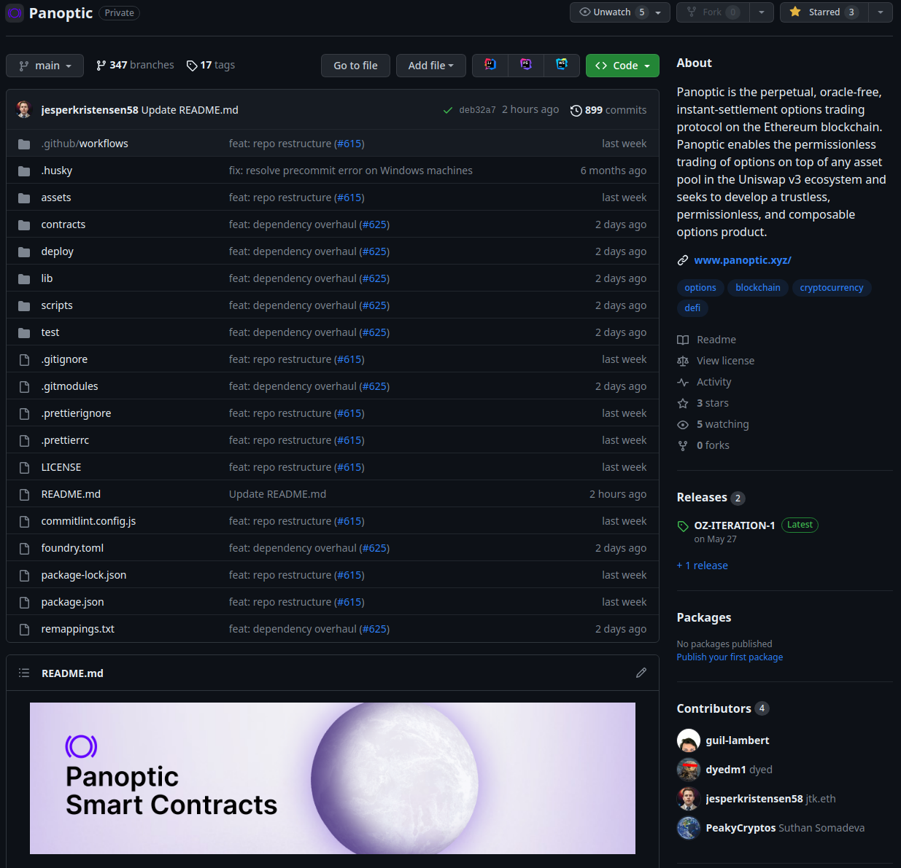

In this post, we’ll delve into Panoptic and provide a comprehensive overview of our protocol’s general architecture. You’ll also learn how to install the codebase and mint your first option on Panoptic. So whether you're a seasoned developer or a retail trader, we’re certain you'll find something valuable here!

A video walkthrough is also available:
<iframe width="560" height="315" src="https://www.youtube.com/embed/tOfImvHouUw?si=O319Em2m4c8Gb3pD" title="YouTube video player" frameborder="0" allow="accelerometer; autoplay; clipboard-write; encrypted-media; gyroscope; picture-in-picture; web-share" allowfullscreen></iframe>

## What is Panoptic?

Panoptic is a decentralized and permissionless options trading protocol built on Uniswap v3. We’ve taken a new and innovative approach that allows us to adapt a novel form of perpetual options into a DeFi protocol with oracle-free settlement. Instead of relying on thin and centralized order books, Panoptic takes the form of an advanced lending market for Uniswap positions. 

Uniswap v3 LP positions have payoff curves that are strikingly similar to those of traditional sold (short) puts. Fees collected by positions are essentially a streaming options premium (which Panoptic calls [streamia](https://panoptic.xyz/blog/streamia-defi-native-options-pricing)) that compensate Uniswap LPs for the risks their positions carry.

The Panoptic protocol leverages this unique property of Uniswap LP positions to offer a full spectrum of options exposure to *every* Uniswap v3 pool in existence. Because Uniswap LPs have payoffs similar to selling options, we can create a payoff similar to buying an option by enabling traders to borrow Uniswap v3 positions from LPs and short them by removing that liquidity — compensating those LPs with the fees (streamia) that would have been collected. 

Similarly, options sellers can create both calls *and* puts by borrowing one of the tokens in a Uniswap pool and swapping them into the constituent tokens of their position. These strategies are time-tested and have been employed by savvy retail and professional traders alike. 

In fact, our CEO and the inventor of the Panoptic Protocol, Guillaume Lambert, conceived of Panoptic through executing these very strategies. If you want to learn more about the concepts underlying Panoptic, we encourage you to read the [Panoptic’s Genesis blog post series](https://lambert-guillaume.medium.com).

Panoptic takes these options strategies to the next level. We created integrated, undercollateralized, and capital-efficient lending infrastructure for both ordinary tokens and Uniswap v3 LPs. This infrastructure supports the management of highly advanced multi-leg positions. 

This enables several firsts in the DeFi space: 

Leveraged options selling and Uniswap liquidity provision
Leveraged options buying 
A unique commission-based fee structure that options traders will find refreshingly familiar

## Tech and Licensing



Panoptic, like Uniswap, runs on [Ethereum’s EVM](https://ethereum.org/en/developers/docs/evm/) and is written in Solidity 0.8. Our protocol leverages Foundry as a testing, fuzzing, and deployment framework.

A quick note on licensing: Panoptic's proprietary code is licensed under the Business Use Source License (BUSL 1.1) for several years, after which it will convert to a General Public License (GPL). We also have some components licensed under GPL. You can find more details on this in our [LICENSE file](https://@TODO).

## Core Contracts
[//]: # "@TODO add diagram"

The Panoptic protocol is a system of contracts that can be deployed on top of any Uniswap v3 pool. There are three primary pillars that power Panoptic: 

### SemiFungiblePositionManager (SFPM) 

Panoptic’s [SFPM](https://github.com/panoptic-labs/Panoptic/blob/main/contracts/SemiFungiblePositionManager.sol) is a gas-efficient alternative to Uniswap’s [NonFungiblePositionManager](https://docs.uniswap.org/contracts/v3/reference/periphery/NonfungiblePositionManager). Our SFPM manages complex, multi-leg Uniswap positions encoded in ERC-1155 token IDs and performs swaps allowing users to mint positions with only one type of token. Most crucially, it supports the minting of both typical LP positions where liquidity is added to Uniswap and long options positions where Uniswap liquidity is burnt.

While the SFPM is enshrined as a core component of the protocol, and we consider it to be the “engine” of Panoptic, it is also a public good that we hope savvy Uniswap v3 LPs will come to see as an essential upgrade for managing their liquidity.  


### CollateralTracker

Our [CollateralTracker](https://github.com/panoptic-labs/Panoptic/blob/main/contracts/CollateralTracker.sol) is an ERC-4626 vault where token liquidity from passive Panoptic Liquidity Providers (PLPs) and collateral for option positions are deposited. CollateralTrackers are also responsible for:

Calculating collateral requirements
Paying commission fees and options streamia
Handling payments of intrinsic value for options
Distributing profit and loss 
Calculating liquidation bonuses
Determining costs for forcefully exercising another user’s options

By far the most important functionality of the CollateralTracker is to calculate the collateral requirement for every account and position. Each time positions are minted, burned, or rolled in Panoptic, the CollateralTracker updates the collateral balances and provides information on the collateral requirement to ensure that the protocol remains solvent and retains the ability to liquidate distressed positions. 

### Panoptic Pool

The [PanopticPool](https://github.com/panoptic-labs/Panoptic/blob/main/contracts/CollateralTracker.sol) 
exposes the core functionality of the protocol. If the SFPM is the “engine” of Panoptic, the Panoptic Pool is the “conductor”. All interactions with the protocol, including minting, burning, rolling, liquidating, force exercising distressed accounts, or just checking position balances and accumulated streamia, originate in this contract. 

The Panoptic Pool is responsible for orchestrating the required calls to the SFPM to create option positions in Uniswap. It tracks user balances and accumulates the streamia on those positions. Also, it calls the CollateralTracker with the data it needs to settle position changes. 

## Architecture & Actors

As we’ve discussed, Panoptic contains an advanced and capital-efficient lending protocol for both Uniswap v3 positions and their constituent tokens. 

Each instance of the Panoptic protocol on a Uniswap pool contains:

One PanopticPool that orchestrates all interactions in the protocol
Two CollateralTrackers, one for each constituent token0 and token1 in the Uniswap pool
A canonical SFPM — the SFPM manages liquidity across every Panoptic Pool

Actors within the Panoptic Ecosystem take on five primary roles:

### 1. Panoptic Liquidity Providers (PLPs)

PLPs are users who deposit tokens into one or both CollateralTracker vaults. PLP liquidity enables undercollateralized positions in Panoptic. The liquidity deposited by PLPs is borrowed by option sellers to create short positions.

In return, PLPs receive commission fees on both the notional and intrinsic values of option positions when they are minted. Note that options buyers and sellers are PLPs too — they must deposit collateral to open their positions.

Users who deposit collateral but do not _trade_ on Panoptic can be considered as “passive” PLPs.

### 2. Options Sellers

Options sellers deposit liquidity into the Uniswap pool through Panoptic, making it available for options buyers to remove. This role is similar to providing liquidity directly to Uniswap v3 but offers numerous benefits, including advanced tools to manage risky, complex positions and a multiplier on the fees (streamia) generated by their liquidity when it is removed by options buyers. 

Remember, sold options positions on Panoptic have similar payoffs to traditional options.

### 3. Options Buyers

Options buyers remove liquidity added by option sellers, moving the tokens from the Uniswap Pool back into Panoptic. The premia they pay to sellers is equivalent to the Uniswap fees that would have been generated by the removed liquidity, plus a spread multiplier based on the portion of available liquidity in their Uniswap liquidity chunk that has been removed (utilized).

### 4. Liquidators

Liquidators are responsible for liquidating distressed accounts that no longer meet the collateral requirements needed to maintain their positions. They provide the tokens necessary to close all positions in the distressed account and receive a bonus from the remaining collateral. Sometimes, they may also need to buy or sell options to allow less liquid positions to be exercised.

### 5. Force Exercisors

Force exercisors are usually options sellers. They provide the required tokens and forcefully exercise long positions (belonging to options buyers) that are out of range and are no longer generating streamia, so the liquidity from those positions is added back to Uniswap and the sellers can exercise their positions (which involves burning that liquidity). The force exercisor pays a fee to the owner of the long option for the inconvenience caused by closing the position.

## Flow

All protocol users first onboard by depositing tokens into one or both CollateralTracker vaults and being issued shares (becoming PLPs in the process). Panoptic’s CollateralTracker supports the full ERC-4626 interface, making deposits and withdrawals a simple and standardized process. Passive PLPs need not take any further actions. 

Once users have deposited, there are many options for the other actors in the protocol. Buyers and sellers can call: 

`mintOptions` - create an option position with up to four distinct legs with a specially encoded positionID and tokenID, each of which is its own short (sold/added) or long (bought/removed) liquidity chunk.

`burnOptions` - burn or exercise a position created through `mintOptions`.

`rollOptions`- Modify the liquidity chunk (strike & width) of one or more legs in an existing position, transition it to a new ID — while retaining the same size — and only pay a commission fee on the intrinsic value. `rollOptions` only modifies the required legs and is significantly cheaper and more gas-efficient than burning and minting an entire position. This action enables the frequent position management required to be an effective seller. 

Meanwhile, force exercisors and liquidators can perform their respective roles with the `forceExercise` and `liquidateAccount` functions.

That completes an overview of Panoptic’s architecture. In future videos and blog posts, we’ll dive deeper into the technical details of how the protocol works. For more information, check out our [litepaper](https://intro.panoptic.xyz), [whitepaper](https://paper.panoptic.xyz), and [protocol docs](https://docs.panoptic.xyz). We’re also active on our [Discord](https://discord.gg/panoptic) and we’re happy to answer any and all questions you may have about Panoptic there. 

## Repository Structure

Now, let’s briefly explore the rest of the codebase and learn how to mint our first Panoption!

### [contracts/univ3-libraries](https://github.com/panoptic-labs/Panoptic/tree/main/contracts/univ3-libraries)

Because Panoptic is built on top of Uniswap v3, we use several libraries from Uniswap to perform relevant calculations and interactions. All the libraries we use from Uniswap can be found in this folder. These versions of the libraries are the same time-tested ones used in Uniswap’s protocol but have been slightly modified to improve gas efficiency and compatibility with Solidity version 0.8.

### [contracts/types](https://github.com/panoptic-labs/Panoptic/tree/main/contracts/types)

Panoptic leverages several custom contract types to make code more efficient and concise. Generally, they pack multiple pieces of smaller data into 256-bit signed or unsigned integers.

A [TickStateCallContext](https://github.com/panoptic-labs/Panoptic/tree/main/contracts/types/TickStateCallContext.sol) contains a current tick, a median tick, and a caller address, and is frequently passed to the CollateralTracker from the PanopticPool — providing it with contextual information it needs to check and update collateral balances and requirements.

A [LeftRight](https://github.com/panoptic-labs/Panoptic/tree/main/contracts/types/TickStateCallContext.sol) stores two 128-bit signed or unsigned integers in a single 256-bit type. This contract type is often useful in storing data about tokens in a Uniswap v3 pool — such as a balance. Since there are two tokens in every Uniswap v3 pool, balances and other data for both of these tokens can naturally be stored in one of these containers.

A [LiquidityChunk](https://github.com/panoptic-labs/Panoptic/tree/main/contracts/types/LiquidityChunk.sol) is how we represent a single Uniswap v3 liquidity chunk in Panoptic. It contains a lower tick (tickLower), an upper tick (tickUpper), and a size (amount) of liquidity. Each leg in a Panoptic position corresponds to one liquidity chunk in Uniswap.

The [TokenId](https://github.com/panoptic-labs/Panoptic/tree/main/contracts/types/TokenId.sol) type defines the encoding of a position in Panoptic and the SFPM. Each time a position is minted, an ERC-1155 token ID with this type of encoding is minted by the SFPM and stored by the PanopticPool. 

This token ID contains a unique 64-bit identifier that specifies what pool the position is to be minted on, as well as up to four “legs” each with the ability to specify a unique liquidity chunk. This includes whether the leg is long or short, what token should be used to mint the position, its relative size compared to other legs, and more.    

### [contracts/libraries](https://github.com/panoptic-labs/Panoptic/tree/main/contracts/libraries)

Panoptic’s contracts also make use of several libraries to help perform calculations and more.

The [Errors](https://github.com/panoptic-labs/Panoptic/tree/main/contracts/libraries/Errors.sol) library contains all custom errors used in Panoptic's core contracts.

[FeesCalc](https://github.com/panoptic-labs/Panoptic/tree/main/contracts/libraries/FeesCalc.sol) is a utility for calculating up-to-date swap fees for a liquidity chunk. 

[InteractionHelper](https://github.com/panoptic-labs/Panoptic/tree/main/contracts/libraries/InteractionHelper.sol) contains helpers to perform bytecode-size-heavy interactions with external contracts like batch approvals and metadata queries. 

[Math](https://github.com/panoptic-labs/Panoptic/tree/main/contracts/libraries/Math.sol) is a library of generic math functions including abs() and several optimized 512-bit mulDiv functions. 

[PanopticMath](https://github.com/panoptic-labs/Panoptic/tree/main/contracts/libraries/PanopticMath.sol) is a library containing advanced Panoptic and Uniswap-specific functionality such as our time-weighted average price (TWAP), price conversions, and position sizing math.

[CallbackLib](https://github.com/panoptic-labs/Panoptic/tree/main/contracts/libraries/CallbackLib.sol) helps validate Uniswap v3 mint and swap callbacks, verifying the identity and features of the calling pool.

[SafeTransferLib](https://github.com/panoptic-labs/Panoptic/tree/main/contracts/libraries/SafeTransferLib.sol) is a safe ERC-20 transfer library that we use for all token transfers. It gracefully handles noncompliant tokens that may be missing return values on transfers, such as USDT.

### [contracts/tokens](https://github.com/panoptic-labs/Panoptic/tree/main/contracts/tokens)

Several of Panoptic’s contracts are also tokens! The SFPM issues ERC-1155 tokens to represent Uniswap positions, and the CollateralTracker, being an ERC-4626 vault, issues ERC-20 tokens to represent shares of collateral. Both the SFPM and the CollateralTracker inherit from the contracts in this folder, which are minimal implementations of the relevant token standards without metadata (this is specified in the inheriting contracts).

[ERC1155Minimal](https://github.com/panoptic-labs/Panoptic/tree/main/contracts/tokens/ERC1155Minimal.sol) is a minimal implementation of the ERC-1155 standard without metadata.

[ERC20Minimal](https://github.com/panoptic-labs/Panoptic/tree/main/contracts/tokens/ERC20Minimal.sol) is a minimal implementation of the ERC-20 standard without metadata.

The [IERC20Partial interface](https://github.com/panoptic-labs/Panoptic/tree/main/contracts/tokens/interfaces/IERC20Partial.sol) folder contains several functions in the ERC-20 interface we call on tokens. The `success` return value from some of the functions, such as approve, is omitted in order to ensure support for certain noncompliant tokens, such as USDT, that do not return anything.   

### [contracts/multicall/Multicall.sol](https://github.com/panoptic-labs/Panoptic/tree/main/contracts/multicall/Multicall.sol)

Finally, this multicall contract is inherited by all of our core contracts and allows users to batch multiple calls to a contract in a single transaction by passing the calldata as an array. For example, you could use the multicall feature on PanopticPool to mint five different positions simultaneously, saving gas and time.

## Minting Your First Panoption!

Now, let’s wrap things up by learning how to install the codebase and mint a Panoption.

### Installation

Let’s install the codebase by following the instructions in the [README](https://@TODO).

First, clone the git repo. Make sure you remember to pass the recurse-submodules flag, since some of our dependencies are in submodules.
```bash
git clone https://github.com/panoptic-labs/Panoptic.git --recurse-submodules
```

Then, install prettier and our pre-commit hooks by installing with npm. Every time you commit, your code will be linted automatically. 
```bash
npm i
```

To compile and run our code, you will need to make sure you have Foundry installed. If it’s not installed, go to [getfoundry.sh](https://getfoundry.sh), and follow the instructions to install the latest version of Foundry.

Try compiling the code:

```bash
forge build
```

Now that everything has been installed correctly, we can finally mint our first Panoption! 

### Deploying Panoptic

Let’s get started by deploying a new instance of Panoptic on Sepolia, an Ethereum test network for developers to try their applications. You will need some Sepolia ETH from the [Alchemy Faucet](https://sepoliafaucet.com/) for gas. The deployment script for Panoptic needs to know the private key for your account and the address of the Uniswap V3 factory as well as the address for WETH. We need to export these as environment variables, as specified in the README. 

```bash
export DEPLOYER_PRIVATE_KEY = 0xyourprivatekey
export UNISWAP_V3_FACTORY = 0x0227628f3f023bb0b980b67d528571c95c6dac1c
export WETH9 = 0xfFf9976782d46CC05630D1f6eBAb18b2324d6B14
```
Then, we can run the deployment script and deploy a new Panoptic factory.

```bash
forge script deploy/DeployProtocol.s.sol:DeployProtocol --rpc-url sepolia -vvvv --broadcast
```

Output:
```javascript
Traces:
  [16238552] DeployProtocol::run() 
    ├─ [0] VM::envUint(DEPLOYER_PRIVATE_KEY) [staticcall]
    │   └─ ← <env var value>
    ├─ [0] VM::envAddress(UNISWAP_V3_FACTORY) [staticcall]
    │   └─ ← <env var value>
    ├─ [0] VM::envAddress(WETH9) [staticcall]
    │   └─ ← <env var value>
    ├─ [0] VM::startBroadcast(<pk>) 
    │   └─ ← ()
    ├─ [4288599] → new SemiFungiblePositionManager@0x2a3c0496d0dEBA693f424680Fa629575AA0E4025
    │   └─ ← 21417 bytes of code
    ├─ [4578666] → new PanopticPool@0x67F23f65D82181eC0fe1743C70E5491F27F276FA
    │   └─ ← 22865 bytes of code
    ├─ [4348425] → new CollateralTracker@0x9AA23c0b3339d7A39a0978e3966769081c7f2E70
    │   └─ ← 21717 bytes of code
    ├─ [2857832] → new PanopticFactory@0xe26b745504c1C25cf718b26bE3F40e0146071Ea5
    │   ├─ emit OwnerChanged(oldOwner: 0x0000000000000000000000000000000000000000, newOwner: 0xc29EE4c996Aa7Ad16CFda985a06bE27148B1d8A2)
    │   └─ ← 13917 bytes of code
    ├─ [0] VM::stopBroadcast() 
    │   └─ ← ()
    └─ ← ()


Script ran successfully.

## Setting up (1) EVMs.
==========================
Simulated On-chain Traces:

  [568356] → new LiquidityAmounts@0x8a1E5D4e43a5582e61AE4030f6Dba358CCA428d0
    └─ ← 2391 bytes of code

  [296982] → new TickMath@0xdABb386b2A0D685Be3c376791E2f7Db78BD794b1
    └─ ← 1132 bytes of code

  [1321520] → new FeesCalc@0xA0D0f29ef522cC386f5fbcCA01795ED5cC34e40B
    └─ ← 5912 bytes of code

  [789422] → new InteractionHelper@0xd418B087123f8675663D7bCb7f959199a9f2F6B0
    └─ ← 3432 bytes of code

  [582684] → new PanopticMath@0x11cd4d9308c9E0926A24d411F7042De60f21ABBf
    └─ ← 2458 bytes of code

  [4651579] → new SemiFungiblePositionManager@0x2a3c0496d0dEBA693f424680Fa629575AA0E4025
    └─ ← 21417 bytes of code

  [4961114] → new PanopticPool@0x67F23f65D82181eC0fe1743C70E5491F27F276FA
    └─ ← 22865 bytes of code

  [4714741] → new CollateralTracker@0x9AA23c0b3339d7A39a0978e3966769081c7f2E70
    └─ ← 21717 bytes of code

  [3121860] → new PanopticFactory@0xe26b745504c1C25cf718b26bE3F40e0146071Ea5
    ├─ emit OwnerChanged(oldOwner: 0x0000000000000000000000000000000000000000, newOwner: 0xc29EE4c996Aa7Ad16CFda985a06bE27148B1d8A2)
    └─ ← 13917 bytes of code


==========================

Chain 11155111

Estimated gas price: 3.002118816 gwei

Estimated total gas used for script: 27310732

Estimated amount required: 0.081990062415933312 ETH

==========================

###
Finding wallets for all the necessary addresses...
##
Sending transactions [0 - 8].
⠲ [00:00:01] [#############################################################################################################################################################################################################################################################################################] 9/9 txes (0.0s)
Transactions saved to: /home/dyed/Documents/Panoptic/broadcast/DeployProtocol.s.sol/11155111/run-latest.json

Sensitive values saved to: /home/dyed/Documents/Panoptic/cache/DeployProtocol.s.sol/11155111/run-latest.json

##
Waiting for receipts.
⠴ [00:00:12] [#########################################################################################################################################################################################################################################################################################] 9/9 receipts (0.0s)
##### sepolia
✅  [Success]Hash: 0xdbe57b6df0699c0b16d6efc4d3707a8f5e6f7b144a621bcd8c5b71a2a8f507f1
Contract Address: 0x8a1E5D4e43a5582e61AE4030f6Dba358CCA428d0
Block: 4152701
Paid: 0.00170612930732372 ETH (568510 gas * 3.001054172 gwei)


##### sepolia
✅  [Success]Hash: 0xe2b1df87a47151ce27fbf6598ff860491630ec3252bbbc631f9b94b97ce4615e
Contract Address: 0xdABb386b2A0D685Be3c376791E2f7Db78BD794b1
Block: 4152701
Paid: 0.000891487150225976 ETH (297058 gas * 3.001054172 gwei)


##### sepolia
✅  [Success]Hash: 0x6ebbc87f19cc663c6e69c0ebc3d66773b759f9e1839e7f4c6d004c70a51527d5
Contract Address: 0xA0D0f29ef522cC386f5fbcCA01795ED5cC34e40B
Block: 4152701
Paid: 0.003967075503641768 ETH (1321894 gas * 3.001054172 gwei)


##### sepolia
✅  [Success]Hash: 0x9c1a3c037a1ab383ec621c1608bb6ccbedb9fee85b41a2b7bea78051506cda9f
Contract Address: 0xd418B087123f8675663D7bCb7f959199a9f2F6B0
Block: 4152701
Paid: 0.002369758418486424 ETH (789642 gas * 3.001054172 gwei)


##### sepolia
✅  [Success]Hash: 0xff760d0f4794ef5e5a39bb1257e3ff7ffe0cbf219e63557f39f39e7cf14ce59a
Contract Address: 0x11cd4d9308c9E0926A24d411F7042De60f21ABBf
Block: 4152701
Paid: 0.001749140415716824 ETH (582842 gas * 3.001054172 gwei)


##### sepolia
✅  [Success]Hash: 0x3c8769bad189697d98c0d25afb3e4333a5f2dfacdba5c87f493d47c0aca3f2c9
Contract Address: 0x2a3c0496d0dEBA693f424680Fa629575AA0E4025
Block: 4152701
Paid: 0.013963697989578132 ETH (4652931 gas * 3.001054172 gwei)


##### sepolia
✅  [Success]Hash: 0x76023fbc7d83d99db711dc1eb6ea2cadd7c072b03bab5b0ab1db1c0d11088888
Contract Address: 0x67F23f65D82181eC0fe1743C70E5491F27F276FA
Block: 4152701
Paid: 0.014892905389691976 ETH (4962558 gas * 3.001054172 gwei)


##### sepolia
✅  [Success]Hash: 0x326d0017180441a61d85852927a9df36b9f714c98d41778fe5b693b14ca747f7
Contract Address: 0x9AA23c0b3339d7A39a0978e3966769081c7f2E70
Block: 4152701
Paid: 0.014153274581623372 ETH (4716101 gas * 3.001054172 gwei)


##### sepolia
✅  [Success]Hash: 0xc7c9f4bffacb5dbd12a651e606f815c0b14473615ac5bd4a25bb2527fdb4e1d3
Contract Address: 0xe26b745504c1C25cf718b26bE3F40e0146071Ea5
Block: 4152701
Paid: 0.009371673961996568 ETH (3122794 gas * 3.001054172 gwei)


Transactions saved to: /home/dyed/Documents/Panoptic/broadcast/DeployProtocol.s.sol/11155111/run-latest.json

Sensitive values saved to: /home/dyed/Documents/Panoptic/cache/DeployProtocol.s.sol/11155111/run-latest.json


==========================

ONCHAIN EXECUTION COMPLETE & SUCCESSFUL.
Total Paid: 0.06306514271828476 ETH (21014330 gas * avg 3.001054172 gwei)

Transactions saved to: /home/dyed/Documents/Panoptic/broadcast/DeployProtocol.s.sol/11155111/run-latest.json

Sensitive values saved to: /home/dyed/Documents/Panoptic/cache/DeployProtocol.s.sol/11155111/run-latest.json

```

Make sure to save the addresses of your newly deployed `SemiFungiblePositionManager` and `PanopticFactory` (shown after [contract name]@ in the output). We will need this in the next step.

### Deploying A New Panoptic Pool
To follow along, navigate to [examples/FirstPanoption.s.sol](https://github.com/panoptic-labs/Panoptic/examples/FirstPanoption.s.sol)

You should see a template that looks a little bit like this:
```javascript
contract FirstPanoption is Script {
    using TokenId for uint256;

    function run() public {
        IUniswapV3Factory UNISWAP_V3_FACTORY = IUniswapV3Factory(
            vm.envAddress("UNISWAP_V3_FACTORY")
        );

        SemiFungiblePositionManager SFPM = SemiFungiblePositionManager();

        PanopticFactory PANOPTIC_FACTORY = PanopticFactory();

        IERC20Partial WBTC = IERC20Partial(0x29f2D40B0605204364af54EC677bD022dA425d03);
        IERC20Partial DAI = IERC20Partial(0xFF34B3d4Aee8ddCd6F9AFFFB6Fe49bD371b8a357);

        vm.startBroadcast(vm.envUint("DEPLOYER_PRIVATE_KEY"));
        // Here, deploy a Panoptic Pool and mint your first Panoption!
        vm.stopBroadcast();
    }
}
```
First, fill in the `SemiFungiblePositionManager` and `PanopticFactory` addresses you saved in the previous step.

```javascript
SemiFungiblePositionManager SFPM = SemiFungiblePositionManager(0x0000000000000000000000000000000000000000);

PanopticFactory PANOPTIC_FACTORY = PanopticFactory(0x0000000000000000000000000000000000000000);
```

Before we can do anything, we’ll need some testnet WBTC and DAI. We can grab these from the [AAVE Faucet](https://staging.aave.com/faucet/).

We’re going to deploy a Panoptic Pool on the WBTC-DAI-5bps pair. To do this, we need to approve the Panoptic Factory that we deployed earlier to spend our WBTC and DAI. This allows the factory to perform an initial full-range liquidity deployment, then call `deployNewPool` with the addresses of the tokens, the fee of the pool (5bps = 500 / 100 basis points), and a *completely random salt* used while creating the PanopticPool. We can also vary the salt to mine a vanity Panoptic Pool address.

```javascript
WBTC.approve({spender: address(PANOPTIC_FACTORY), amount: type(uint256).max});
DAI.approve({spender: address(PANOPTIC_FACTORY), amount: type(uint256).max});

PanopticPool pp = PANOPTIC_FACTORY.deployNewPool({
    token0: address(WBTC),
    token1: address(DAI),
    fee: 500,
    salt: 1337
});
```

### Minting A Panoption!

Now, we’ll need to approve the respective `CollateralTrackers` for the tokens we’re going to deposit. The Panoptic Pool exposes the addresses of these collateral tokens.

```javascript
DAI.approve({spender: address(pp.collateralToken0()), amount: type(uint256).max});
WBTC.approve({spender: address(pp.collateralToken1()), amount: type(uint256).max});
```

Let’s deposit 1 WBTC and 100 DAI as collateral:

```javascript
pp.collateralToken0().deposit({
    assets: 100 * 10 ** 18,
    receiver: vm.addr(vm.envUint("DEPLOYER_PRIVATE_KEY"))
});
pp.collateralToken1().deposit({
    assets: 10 ** 7,
    receiver: vm.addr(vm.envUint("DEPLOYER_PRIVATE_KEY"))
});
```

Now, we can begin to construct our option.

```javascript
uint256[] memory positionIdList = new uint256[](1);
positionIdList[0] = uint256(0)
    .addUniv3pool(SFPM.getPoolId(address(pp.univ3pool())))
    .addLeg({
        legIndex: 0,
        _optionRatio: 1,
        _asset: 0,
        _isLong: 0,
        _tokenType: 0,
        _riskPartner: 0,
        _strike: 5000,
        _width: 2
    });
```
Let’s dissect the parameters we’re using here. 

First, we need to add the pool ID to our tokenId so the SFPM knows which pool we’re minting our option on. 

Then, we take advantage of a handy function in the tokenId library called addLeg that takes all parameters for one leg of the option and adds it to our tokenId. The leg index is the position of the leg in the tokenId ranging from 0 to 3. Since this is our first leg, we set legIndex to 0. 

The option ratio is the relative size of the leg compared to other legs, and the position size is multiplied by this amount when creating the leg.

The asset is the token we’re using to size the leg. We pick token1 because we want to size in terms of DAI. 

We’re minting a short option, so we set isLong to 0. 

Since we’re minting a put, we set the tokenType to 0. This means that we use DAI to pay for the option and borrow from the PLPs. If the price of WBTC falls below our strike, our position will begin to decrease in value since we owe DAI to PLPs. At that point, our Uniswap LP will be composed of WBTC which is depreciating in terms of DAI. This is what makes the payoff similar to a traditional short put. 

We set the risk partner to index 0 for this leg. The risk partner is used to specify defined risk positions, such as strangles, in order to calculate collateral requirements. 

Some combinations of options have a lower risk when the options are combined, so the collateral requirement can be lowered in certain cases. The risk partner is set to the index of the other leg in a defined risk position or to its own leg's index if we're not using that feature. 

We set the strike to tick 5000. Currently, the price in the WBTC-DAI pool is at tick -1700. Since price in Uniswap is represented as token1/token0, this means that the higher the tick is, the lower the price in DAI (token0) of WBTC (token1) is. 

We are minting an out-of-the-money option, so we want the WBTC price to be above our position. As discussed, an option becomes in the money (ITM) when the price of WBTC falls below the option’s range. This means that we should pick a higher tick than -1700, and 5000 is one example of that.

We set the width to two. While Uniswap pool prices can be at any tick between the maximum and minimum ticks, most pools except for stablecoin-stablecoin pairs with a fee of 1 basis point (0.01%) have a tick spacing. This means the upper and lower ticks of LP positions can only be specified in increments of tickSpacing. 

For 5bps pools like this one, the standard tick spacing is 10. We take this into account in our sizing system. The position width specified in the tokenId is multiplied by the tickSpacing of whatever pool the position is being minted on. This means that a tickSpacing of two, as we have specified, corresponds to a tickLower and tickUpper 20 ticks apart. In this case, that corresponds to 4990 and 5010 — 10 ticks above and below the strike.  

Finally, we can mint our Panoption:

```javascript
pp.mintOptions({
    positionIdList: positionIdList,
    positionSize: 10 * 10 ** 18,
    effectiveLiquidityLimitX32: 0,
    tickLimitLow: 0,
    tickLimitHigh: 0
});    
```

First, we need to pass in a list of positions. The positionIdList contains a list of current open positions that is checked against a stored hash and used to determine account solvency. When minting options, the position being minted is placed at the end of the list. In this case, since we do not have any open positions, it is the entire list.

Then, we need to specify a position size. Since our position is out of the money (OTM), our tokenType is 0 (DAI), and we’re specifying the asset (value) in terms of DAI, putting this amount  here means that our position will be worth 10 * 10 **18 or 10 DAI. 

The effective liquidity limit is an optional parameter that allows us to specify an upper bound on liquidity utilization for a certain chunk. Option buyers will set the limit to ensure the portion of liquidity they remove, and therefore their streamia multiplier, stays below a certain threshold. Since we are selling options, we don’t need to worry about this and can leave it off.

The tick limits allow us to specify a maximum slippage value, similar to Uniswap, and the tick at the end of the option mint is verified to be between these limits. We’re going to leave these off too since we’re not worried about slippage here.

Your final script should look something like this:
```javascript
// SPDX-License-Identifier: UNLICENSED
pragma solidity =0.8.18;

// Foundry
import "forge-std/Script.sol";
// Interfaces
import {IERC20Partial} from "@tokens/interfaces/IERC20Partial.sol";
import {IUniswapV3Factory} from "univ3-core/interfaces/IUniswapV3Factory.sol";
import {IUniswapV3Pool} from "univ3-core/interfaces/IUniswapV3Pool.sol";
// Core contracts
import {PanopticFactory} from "@contracts/PanopticFactory.sol";
import {PanopticPool} from "@contracts/PanopticPool.sol";
import {CollateralTracker} from "@contracts/CollateralTracker.sol";
import {SemiFungiblePositionManager} from "@contracts/SemiFungiblePositionManager.sol";
// Types
import {TokenId} from "@types/TokenId.sol";


/**
 * @title Minting your first Panoption!
 * @author Axicon Labs Limited
 */
contract FirstPanoption is Script {
    using TokenId for uint256;

    function run() public {
        IUniswapV3Factory UNISWAP_V3_FACTORY = IUniswapV3Factory(
            vm.envAddress("UNISWAP_V3_FACTORY")
        );

        SemiFungiblePositionManager SFPM = SemiFungiblePositionManager(
            0x0000000000000000000000000000000000000000
        );

        PanopticFactory PANOPTIC_FACTORY = PanopticFactory(
            0x0000000000000000000000000000000000000000
        );

        IERC20Partial WBTC = IERC20Partial(0x29f2D40B0605204364af54EC677bD022dA425d03);
        IERC20Partial DAI = IERC20Partial(0xFF34B3d4Aee8ddCd6F9AFFFB6Fe49bD371b8a357);

        vm.startBroadcast(vm.envUint("DEPLOYER_PRIVATE_KEY"));

        WBTC.approve({spender: address(PANOPTIC_FACTORY), amount: type(uint256).max});
        DAI.approve({spender: address(PANOPTIC_FACTORY), amount: type(uint256).max});

        PanopticPool pp = PANOPTIC_FACTORY.deployNewPool({
            token0: address(WBTC),
            token1: address(DAI),
            fee: 500,
            salt: 1337
        });

        DAI.approve({spender: address(pp.collateralToken0()), amount: type(uint256).max});
        WBTC.approve({spender: address(pp.collateralToken1()), amount: type(uint256).max});

        pp.collateralToken0().deposit({
            assets: 100 * 10 ** 18,
            receiver: vm.addr(vm.envUint("DEPLOYER_PRIVATE_KEY"))
        });
        pp.collateralToken1().deposit({
            assets: 10 ** 7,
            receiver: vm.addr(vm.envUint("DEPLOYER_PRIVATE_KEY"))
        });

        uint256[] memory positionIdList = new uint256[](1);
        positionIdList[0] = uint256(0)
            .addUniv3pool(SFPM.getPoolId(address(pp.univ3pool())))
            .addLeg({
                legIndex: 0,
                _optionRatio: 1,
                _asset: 0,
                _isLong: 0,
                _tokenType: 0,
                _riskPartner: 0,
                _strike: 5000,
                _width: 2
            });

        pp.mintOptions({
            positionIdList: positionIdList,
            positionSize: 10 * 10 ** 18,
            effectiveLiquidityLimitX32: 0,
            tickLimitLow: 0,
            tickLimitHigh: 0
        });

        vm.stopBroadcast();
    }
}
```
To run our script, the process is similar to the Panoptic deployment we did earlier. 

Make sure the environment variables for your private key, Uniswap v3 factory address, and WETH address are still set, then run this command:
```bash
forge script examples/FirstPanoption.s.sol:FirstPanoption --rpc-url sepolia -vvvv --broadcast
```
Wait a minute or two for the transaction to be confirmed. When execution finishes, you should see output that looks like this:

```javascript
Traces:
  [1745098] FirstPanoption::run() 
    └─...

Script ran successfully.

## Setting up (1) EVMs.
==========================
Simulated On-chain Traces:

...

==========================

Chain 11155111

Estimated gas price: 3.008061108 gwei

Estimated total gas used for script: 2890794

Estimated amount required: 0.008695685002639752 ETH

==========================

###
Finding wallets for all the necessary addresses...
##
Sending transactions [0 - 7].
⠒ [00:00:01] [#############################################################################################################################################################################################################################################################################################] 8/8 txes (0.0s)
Transactions saved to: /home/dyed/Documents/Panoptic/broadcast/FirstPanoption.s.sol/11155111/run-latest.json

Sensitive values saved to: /home/dyed/Documents/Panoptic/cache/FirstPanoption.s.sol/11155111/run-latest.json

##
Waiting for receipts.
⠲ [00:00:06] [#########################################################################################################################################################################################################################################################################################] 8/8 receipts (0.0s)
##### sepolia
✅  [Success]Hash: 0xae2cd0409949a7b6c3b8e1afa902e06adbec68c3f637de355bb15e394e9b7d03
Block: 4152726
Paid: 0.000139900130890278 ETH (46563 gas * 3.004534306 gwei)


##### sepolia
✅  [Success]Hash: 0x0fb57360e1535d65b7097e272f9f1c560af4b5027edfa29b7960c318491bfc94
Block: 4152726
Paid: 0.000139900130890278 ETH (46563 gas * 3.004534306 gwei)


##### sepolia
✅  [Success]Hash: 0x1dc608c5e0b2139a2e967af743d9c79cc403b5be57af82767ca742e0be5d5895
Block: 4152726
Paid: 0.00397005642790463 ETH (1321355 gas * 3.004534306 gwei)


##### sepolia
✅  [Success]Hash: 0x8048e7c24d26af4a29da8ef2e3fb584244f8c6362a50313c176de9e34a6cd602
Block: 4152726
Paid: 0.000139900130890278 ETH (46563 gas * 3.004534306 gwei)


##### sepolia
✅  [Success]Hash: 0x06885563d1423400882c716716bc60f4c953a2266281743f6787c65243afc18f
Block: 4152726
Paid: 0.000139900130890278 ETH (46563 gas * 3.004534306 gwei)


##### sepolia
✅  [Success]Hash: 0xbeca287fb0f72d79873dc239968a5336fe18551037db939a87b39c1e85abc0d7
Block: 4152726
Paid: 0.000322705011670236 ETH (107406 gas * 3.004534306 gwei)


##### sepolia
✅  [Success]Hash: 0x05d76ef893d10485d955c434f732d8378b323d6182564f7f33c7d60a67a584de
Block: 4152726
Paid: 0.000322560794023548 ETH (107358 gas * 3.004534306 gwei)


##### sepolia
✅  [Success]Hash: 0x9632bb13e1074b8414b1597b245668c1dfe081eb20a5f7a244975495d8fe7390
Block: 4152726
Paid: 0.001080358427614256 ETH (359576 gas * 3.004534306 gwei)


Transactions saved to: /home/dyed/Documents/Panoptic/broadcast/FirstPanoption.s.sol/11155111/run-latest.json

Sensitive values saved to: /home/dyed/Documents/Panoptic/cache/FirstPanoption.s.sol/11155111/run-latest.json


==========================

ONCHAIN EXECUTION COMPLETE & SUCCESSFUL.
Total Paid: 0.006255281184773782 ETH (2081947 gas * avg 3.004534306 gwei)

Transactions saved to: /home/dyed/Documents/Panoptic/broadcast/FirstPanoption.s.sol/11155111/run-latest.json

Sensitive values saved to: /home/dyed/Documents/Panoptic/cache/FirstPanoption.s.sol/11155111/run-latest.json
```

If you've gotten to this point, congratulations! You've minted your first Panoption and are well on your way to becoming a full-fledged Panoptimist. 

To view your option mint, paste your last transaction hash into the [Sepolia Explorer](https://sepolia.etherscan.io/). 

Here's mine from the output above: [https://sepolia.etherscan.io/tx/0x9632bb13e1074b8414b1597b245668c1dfe081eb20a5f7a244975495d8fe7390](https://sepolia.etherscan.io/tx/0x9632bb13e1074b8414b1597b245668c1dfe081eb20a5f7a244975495d8fe7390).

## Conclusion

Thank you for joining me today in this introductory exploration of Panoptic’s code. I hope you found it interesting and informative. We encourage you to check out our [website](https://panoptic.xyz) and [documentation](https://docs.panoptic.xyz) to learn more, and feel free to reach out to us on [Twitter/X](https://x.com/Panoptic_xyz) or [Discord](https://discord.gg/Panoptic) if you have any questions or feedback.

Stay tuned for future posts and videos in this series, where we'll delve deeper into Panoptic's technology. Until then, happy trading, and see you next time!
