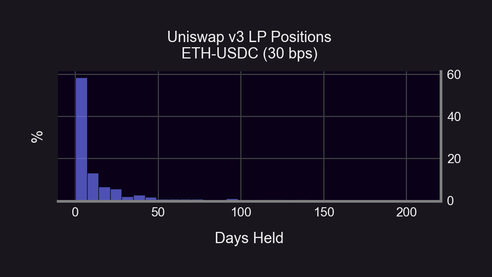
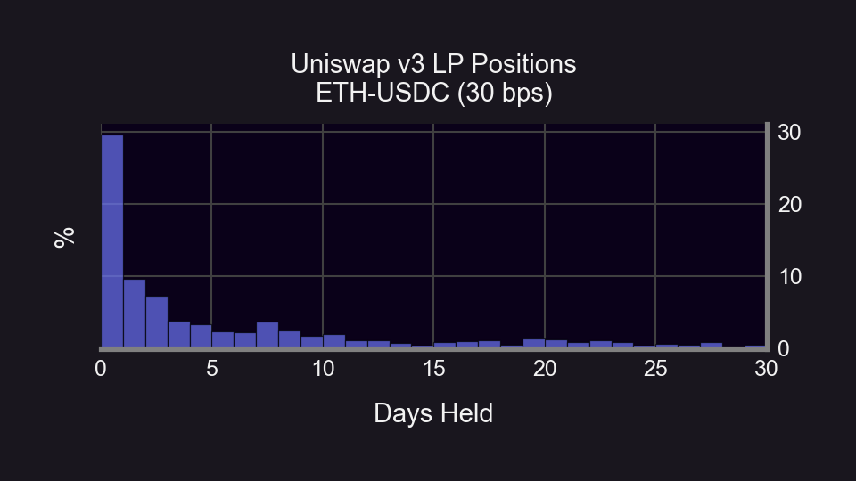
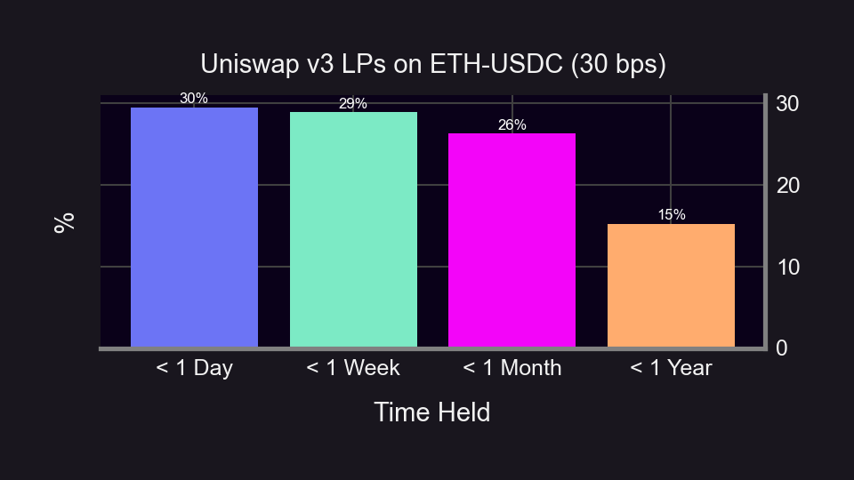
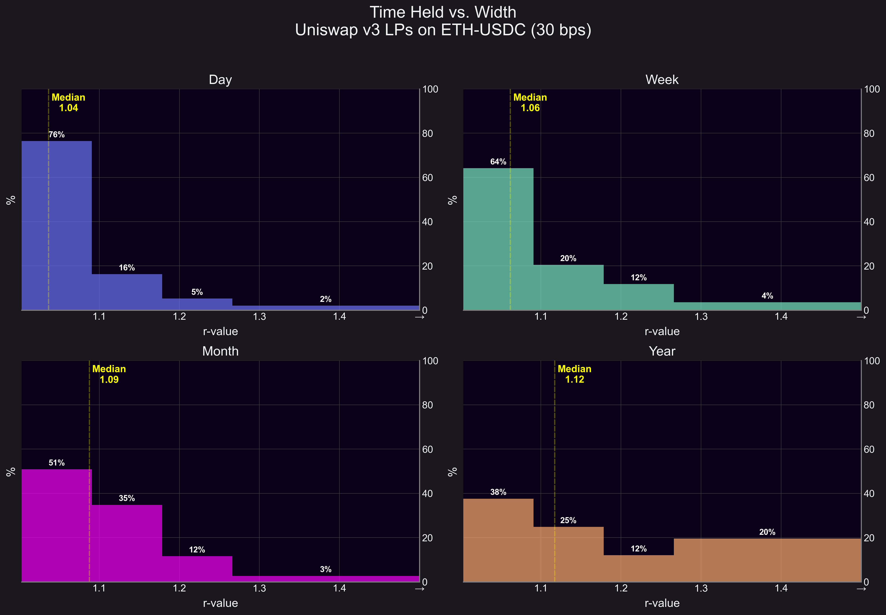

While Uniswap began as a spot market, its [LP properties](https://lambert-guillaume.medium.com/uniswap-v3-lp-tokens-as-perpetual-put-and-call-options-5b66219db827) mimic those of an options market. This article delves into the patterns of Uniswap LPs, focusing on how holding times and widths align with option expiry behavior.

<!-- truncate -->

Our investigation zooms in on the ETH-USDC (30 bps) pool of Uniswap v3, a choice driven by its vast [trading volume and TVL](https://info.uniswap.org/#/pools/0x8ad599c3a0ff1de082011efddc58f1908eb6e6d8). The study evaluates the last 1,000 closed LP positions — with the oldest opened half a year ago on March 9, 2023.

  

Currently, LPs on Uniswap can [only sell perpetual put options](https://panoptic.xyz/research/defi-put-options-uniswap-backtest), and receive swap fees as a [streaming premia](https://panoptic.xyz/blog/streamia-defi-native-options-pricing). Panoptic elevates LPs by building on Uniswap to create a full-featured options market allowing users to trade puts, calls, and more [complex strategies](https://panoptic.xyz/research/essential-options-strategies-to-know). But prior to Panoptic’s [launch](https://panoptic.xyz/blog/gated-launch-sign-up), one might wonder how the existing “short-put only” options market on Uniswap is characterized.

  

How long are Uniswap LPs selling options for? Are short-term 0DTEs (zero days to expiry) options or LEAPS (Long-Term Equity Anticipation Securities) more popular? Do the widths of the LP positions match the LPs’ time horizon?

  

We answer all these questions, and more, in our research deep dive below.

## How long are Uniswap LPs selling options for?

Surprisingly, LP positions have a short shelf life. Data reveals that a significant number of LP positions last merely a few days.

  

  

A closer inspection reveals a staggering fact - the bulk of LP positions are active for less than 24 hours. However, this short holding time makes sense under the concentrated liquidity model of Uniswap v3 which necessitates LPs to specify a price range for liquidity provision. The concentrated liquidity model demands regular monitoring and adjustment of positions.

  

  

## Which is more popular – 0DTEs or LEAPS?

  

Grouping LP durations as less than one day, one week, one month, or one year, unveils an interesting insight. Daily holdings dominate at 30%, while yearly holdings lag behind at 15%. In the lens that “LPs are perpetual options sellers”, it's evident that 0DTEs are the top preference, with longer-term options less common.

  

## What does the width of an LP position say about its “expiry”?

An LP position's width pertains to the price range selected for liquidity provision on Uniswap v3. For example, an LP providing liquidity between $1400-$1401 is narrow, whereas providing liquidity between $1400-$2000 is considerably wider. For an in-depth understanding of position width, read our [research bite](https://panoptic.xyz/research/uniswap-lp-calculate-price-range) on LP price ranges.

  

The chosen width of an LP position implies an expected time horizon on the part of the LP. This is because the volatility of the underlying asset can be used to derive a "[first exit time](https://panoptic.xyz/research/stay-in-range-uniswap-v3)" which represents when the LP position goes out of range. The first exit time can be viewed as an expected time horizon (expiry date) because the LP position (sold option) will stop receiving fees (premia) at this point.

  

  

However, there is a caveat. LP positions are not exactly like traditional options; rather, they behave like perpetual options. This means that the LP position will never expire and that the first exit time may be just the first of many entries and exits. Should the price of the underlying asset return in-range, the perpetual short option will continue generating premia and the option has not really “expired”.

  

While the concept of an implied time horizon of an LP can be shown theoretically, analyzing on-chain data can help us assess the concept in practice. Our previous findings drew [parallels](https://panoptic.xyz/research/zero-dte-defi-options) between LP position widths and option expiration dates. But to what extent do current LP positions’ widths correlate to their holding duration?

## How do widths relate to LP position “expiries”?

We find a correlation coefficient of 0.28 (excluding outliers) between holding time and position width, signifying that wider positions are generally held for extended periods. While this positive correlation exists, its moderate magnitude indicates other variables are potentially in play — such as passive liquidity management or the expectation of price reversal.

  

Width distribution, gauged by the position's "r-value", shows a trend: narrower widths align with shorter holding times. For context, an r-value of 1.1 equates to a 20% width, while 1.2 is a 40% width. For a detailed explanation on r-values, refer to our [research bite](https://panoptic.xyz/research/uniswap-lp-calculate-price-range).

  

We see that positions held for short time periods correspond to more narrow positions, while positions held for longer time periods correspond to wider positions. Over three-fourths of daily positions are narrow, while less than half of yearly positions are narrow.

  

As the holding time increases, we see that the distribution of widths becomes more right-skewed and that the median r-value increases from 1.04 (8%) to 1.12 (24%).

## Future Research

While this analysis considered all LP positions with equal weighting, the fact remains that a single wallet might hold multiple LP positions, potentially influencing our results. Furthermore, the significance of LP positions varies in terms of their size, which means smaller, shorter-term positions might be overrepresented.

  

Future studies could break down the results based on unique wallet addresses and the USD value of positions.

  

Our research notebook is open source and available on [GitHub](https://github.com/panoptic-labs/research/blob/main/_research-bites/20231009/Uniswap_v3_LPs_time_vs_width.ipynb). You can download our code to query and analyze Uniswap v3 LP data for any pool.

  
  

_Join the growing community of Panoptimists and be the first to hear our latest updates by following us on our [social media platforms](https://links.panoptic.xyz/all). To learn more about Panoptic and all things DeFi options, check out our [docs](https://panoptic.xyz/docs/intro) and head to our [website](https://panoptic.xyz/)._
