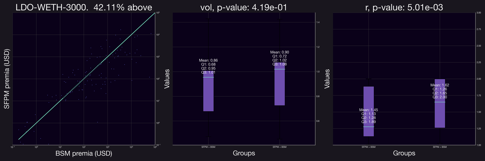
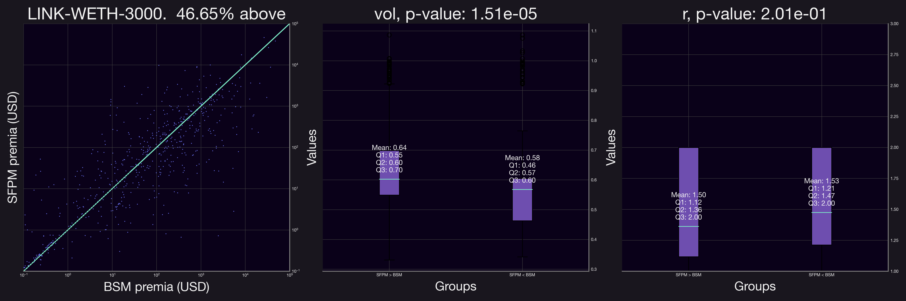
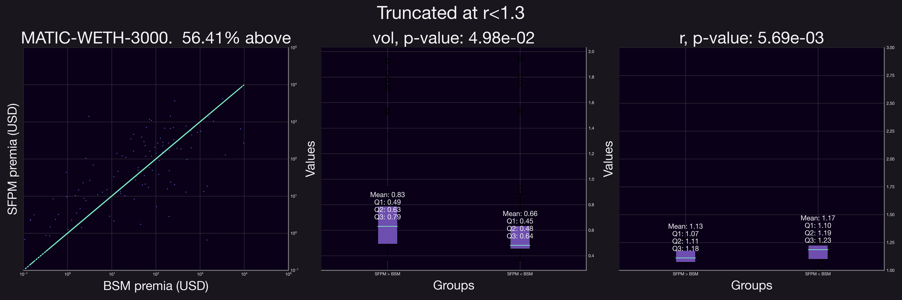
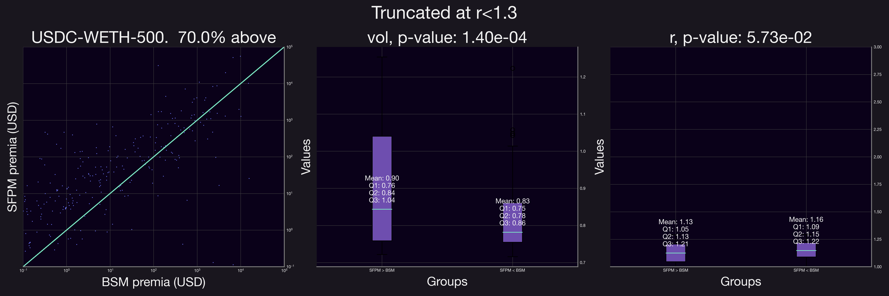
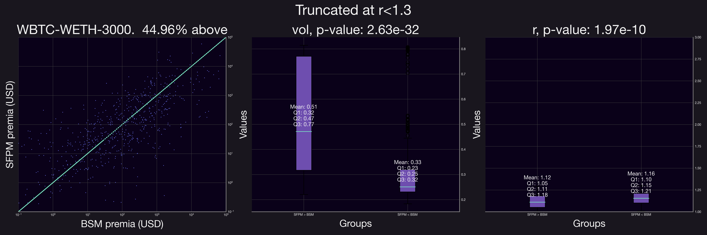
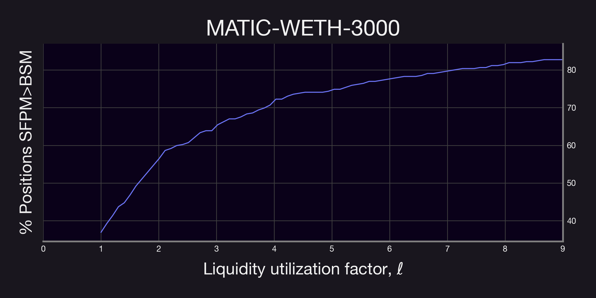
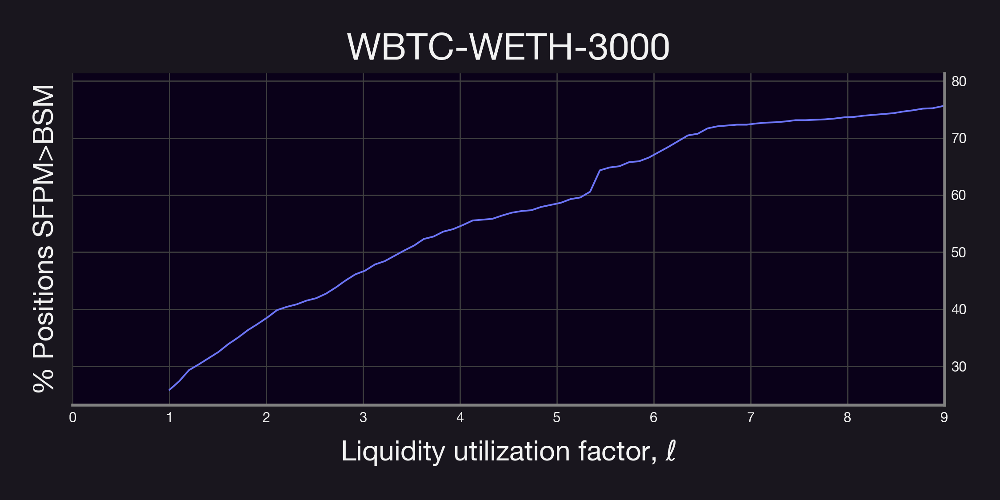

> Find the code base associated to this dive [here](https://github.com/panoptic-labs/research/tree/jp_20231120/_research-bites/20231120).  

## Introduction

This report presents a thorough investigation of Panoptic's perpetual options pricing model, [*Stremia*](https://panoptic.xyz/blog/streamia-defi-native-options-pricing), and its comparative performance against the established [Black-Scholes Model](https://panoptic.xyz/blog/black-scholes-streamia-defi-options-pricing-models) (BSM). Based on Uniswap's Non-Fungible Position Manager (NFPM), Panoptic's *Semi-Fungible Position Manager*, or SFPM, introduces a dynamic framework where, instead of options buyers paying for the contract up-front, option buyers and sellers transact premia continuously (provided that the position is *in range*), marking a departure from BSM's upfront premium structure. Ultimately, our goal is to address a pivotal question: *In what scenarios does Panoptic's SFPM prove superior to the traditional BSM for an options seller?*

Our approach involves an extensive analysis of Liquidity Provider (LP) positions in various Uniswap V3 pools. Specifically, we compare the fees generated from these positions, indicative of SFPM's baseline, with those derived from the BSM methodology.

Our experiements suggest that positions with smaller $r$ factors ($r$ = square root of the ratio of the upper and lower prices) tend to collect larger fees via the Streaming Fee Premia Model (also abbreviated as SFPM) when compared to an equivalent options position priced via the Black-Scholes model.

## Experimental Setup. 

We begin by collecting data for all positions opened in the following pools: 

- WETH-USDC-0.05%
- WBTC-WETH-0.3%
- LINK-WETH-0.3%
- LDO-WETH-0.3%

For each position within these pools, we have calculated:
1. The trading fees accumulated as of November 13, 2023
2. The total fees that would accrue under Panoptic's SFPM in various scenarios of pool utilization
3. The corresponding premia as per the Black-Scholes model

**Computing the trading fees**. 
To calculate trading fees for each position, we gathered and computed essential data like position range (lower and upper ticks, denoted as $i_l,i_u$), the price of tokens at the opening and closing of positions, liquidity ($\ell$), global fees collected by the pool (`feeGrowthGlobal{0,1}X128`), and the fees accumulated within the position range at opening (`feeGrowthInside{0,1}X128`). The total Uniswap V3 fees for each token are given by:
$$
\mathsf{FeesToken\{i\}}=\ell\left(\mathsf{Fees\{i\}\ Inside \ Range(t_1)}-\mathsf{Fees\{i\}\ Inside \ Range(t_0)}\right),
$$
where
$$
\mathsf{Fees\{i\}\ Inside \ Range}=\texttt{feeGrowthGlobal{i}X128}-\mathsf{Fees \ below }(i_u) - \mathsf{fees \ above}(i_l).
$$

**Computing Panoptic's premia**. As for the SFPM premia, recall that options sellers in Panoptic collects fees that are *at least as large* as the fees from an equivalent Uniswap V3 position. Specifically, a Panoption seller would receive 
$$\mathsf{Panoptic\ Fees} = \mathsf{Total\ Fees}\underbrace{\left(1+\nu\frac{T}{T-B}\right)}_\text{$:=\ell$}, \quad (1)$$

where $\mathsf{Total\ Fees}=\mathsf{FeesToken0+FeesToken1}$, and $\ell=\left(1+\nu\frac{T}{T-B}\right)$ is the *liquidity utilization factor*, a term that, broadly speaking, adjusts the price of the option due to supply and demand for such a position. There, $\nu\in(0,1)$ is a protocol parameter (currently set to $\nu=0.25)$, $T$ is the total amount of availabale position liquidity and $B$ is the liquidity of bought positions.

> 💡 Would you like to learn more about how we obtained and computed this data? See our previous research deep dive [here](https://panoptic.xyz/research/uniswap_vs_panoptic)

**Computing the Equivalent Black-Scholes Position**. To determine an equivalent options position for an LP using the BSM, remember that the premium $P$ of a put option is given by:

$$P = K \cdot e^{-\mu T} \cdot N(-d_2) - S \cdot N(-d_1),$$
with

$$d_1 = \frac{\ln(\frac{S}{K}) + (\mu + \frac{\sigma^2}{2}) \cdot T}{\sigma \cdot \sqrt{T}},\quad d_2 = d_1 - \sigma \cdot \sqrt{T}.$$

Here, $S$ is the current price of the of the underlying asset, $N(d_1)$ and $N(d_2)$ are values derived from the cumulative distribution function of the standard normal distribution, $K$ is the *strike price* of the option, $\mu$ is the risk-free interest rate, $T$ is the time to maturity of the option (in years), and $\sigma$ is the underlying asset's volatility.

In our context, we set $\mu=3$%, compute $\sigma$ based on a 90-day period preceding the position's creation, and take $K$ as the geometric mean of the upper and lower bounds, i.e., $K:=1.0001^{\frac{i_u+i_l}{2}}=\sqrt{\mathsf{price}(i_u)}\sqrt{\mathsf{price}(i_l)}.$ Lastly, the time to maturity $T$ is approximated using an equivalence between the range of the position and the time to expiration of an option first presented by Guillaume Lambert (co-founder of Panoptic) in a series of [blogposts](https://lambert-guillaume.medium.com/pricing-uniswap-v3-lp-positions-towards-a-new-options-paradigm-dce3e3b50125), which is given by 

$$T\approx T_r:=\frac{2\pi}{\sigma^2}\left(\frac{\sqrt{r}-1}{\sqrt{r}+1}\right), \quad \mathsf{with}\quad r:=\sqrt{\frac{\mathsf{price}(i_u)}{\mathsf{price}(i_l)}}.$$

We obtain these data using both Uniswap V3's subgraph as well as well as an archival Ethereum node in order to query historical data. The codebase to obtain these quantities can be found [here](https://github.com/panoptic-labs/research/tree/main/_research-bites/20231120).

***Remark***: *Our analysis primarily focuses on positions with expiration under three years and strike prices less than three times the underlying asset's price at the time of opening.*

## Results and Analysis

We begin our analysis with the USDC-WETH-0.05% pool, under the assumption that the *liquidity utilization factor, $\ell$, is 1*. Thus, this corresponds to the case where Panoptic would generate the same amount of fees as Uniswap V3, which is a **lower bound** on what an option seller would actually make in Panoptic.  By comparing the fees collected under the SFPM premia against those of an equivalent option priced via the Black-Scholes Model (BSM), we observe notable trends. The figure below (left panel) reveals that approximately 54.45% of the positions analyzed would have accrued higher fees using SFPM than with BSM.

To discern the specific conditions favoring higher fee collection under SFPM, we classified positions into two groups: those yielding higher SFPM premia and those with higher BSM premia, and conducted a logistic regression as well as an ANOVA test to understand the impact of several parameters on whether the SFPM produced a larger premia or not.  The test outcomes indicate that both volatility (defined here as the standard deviation of historical price fluctuations during the 90-days prior to position opening; not to be confused with *pool volatility*) and the range factor $r$ significantly influence which premium outperforms the other (evident from the middle and right panels in the figure, p-value < 0.01). Specifically for this pool, our findings are twofold:

- *Volatility and SFPM Premia:* Positions generating higher SFPM premia typically exhibited increased levels of volatility. This correlation aligns with the intuitive understanding that higher market volatility can enhance the performance of SFPM.
- *Range Factor $r$ and SFPM Premia:* Positions with superior SFPM premia generally had a smaller range factor $r$. This observation is logical, as a narrower range implies a more concentrated position. Furthermore, a reduced range factor correlates with a shorter equivalent time to expiration ($T_r$), potentially resulting in a less expensive BSM premium.

These insights suggest a clear relationship between the position's range, volatility, and the comparative performance of SFPM and BSM premia. Particularly, the SFPM appears to potentially benefit more from scenarios where price fluctuations are frequent yet remain within the position's range. This dynamic underscores the nuanced interplay between market volatility, position concentration, and premium generation.

Analyzing additional pools revealed trends similar to those observed in the initial pool. Notably, in all pools except for LDO-WETH-0.3%, the volatility was statistically significant. Similarly, in all but the LINK-WETH-0.3% pool, the range factor, $r$, was a significant indicator for SFPM premia outperforming BSM premia.

We also observe that in most cases (except for the ETH-USDC-0.05% pool) the majority of the positions have a larger BSM premia. This can be due to factors such as having a propotrion of the positions have relatively large $r$ values. 

Given these observations, we refined our analysis to focus exclusively on positions with $r\leq 1.3$. The findings from this more focused analysis are illustrated below.

Our results demonstrate a clear shift when the analysis is confined to positions with a smaller range factor, $r$. The proportion of positions accruing higher fees under SFPM compared to their equivalent BSM options increased significantly. This trend is evident in the figures above, where after applying the range factor truncation, all but one pool showed a marked preference for SFPM, indicating substantial growth across the board.

It's important to note that in the analyses above, we assumed a pool utilization factor (as referred to in Equation 1) of 1. However, in real-world scenarios, this value is influenced by the factor $\nu$ and the demand from buyers for purchasing a given option. To comprehensively understand the effect of this variable, we examined how often Panoptic's SFPM, adjusted for the pool utilization factor, would outperform the equivalent BSM-priced option in terms of fee collection. The corresponding results are presented below.

Our findings reveal a significant trend: in most cases, a liquidity utilization factor below 2 already results in higher fee generation for the vast majority of positions through Panoptic's SFPM. This observation is crucial as it provides valuable insights for optimizing the parameter $\nu$. **It suggests that even with moderate option buying demand, Panoptic's perpetual options can yield higher premia compared to traditional expiring options**. 

**Remark**. *As a remark, the plots above were computed using all positions; i.e., without restricting $r\leq1.3$. Thus, it is then likely that similar results as the ones described above will hold for even smaller $r$ values.*

## Final Remarks

This deep-dive presents a comprehensive comparison between streamia and traditional options pricing through the BSM across various liquidity provider positions in Uniswap V3 pools. By evaluating fees generated and comparing premia under both pricing models, the study highlights scenarios where SFPM demonstrates superiority over BSM in terms of returns to option sellers. The critical findings indicate that positions with higher volatility and a more concentrated range tend to benefit more from the SFPM. 

Furthermore, when analyzing positions with a smaller range factor, SFPM's advantage becomes more pronounced. The nuanced relationship between position range, market volatility, and the efficacy of the premium models is a key takeaway, providing valuable insights into the dynamics of trading both perpetual and expiring options.

In addition, we were able to observe that even when there is moderate option buying demand, the SFPM generates larger premia than an equivalent position priced via the BSM would.

Lastly, while experimental evidence suggests that Panoptic is indeed a competitive option to traditional options markets, it is worth mentioning that the fees collected via the SFPM are paid over time, while the premia for a traditional option is paid upfront. 

*Join the growing community of Panoptimists and be the first to hear our latest updates by following us on our social media platforms. To learn more about Panoptic and all things DeFi options, check out our docs and head to our website.*

