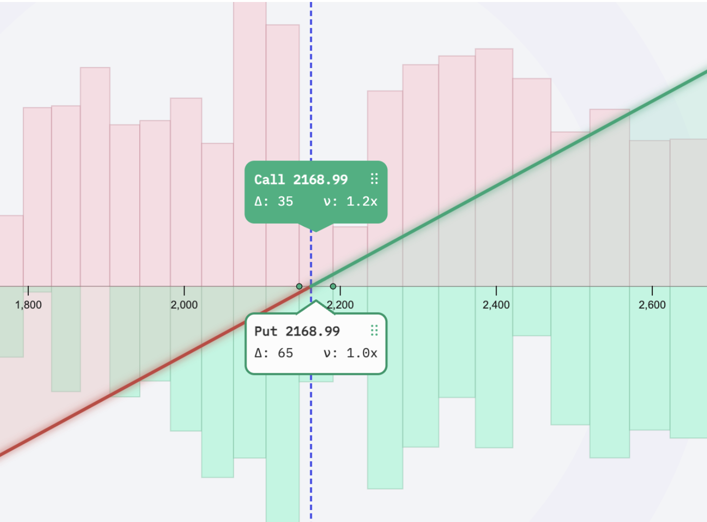
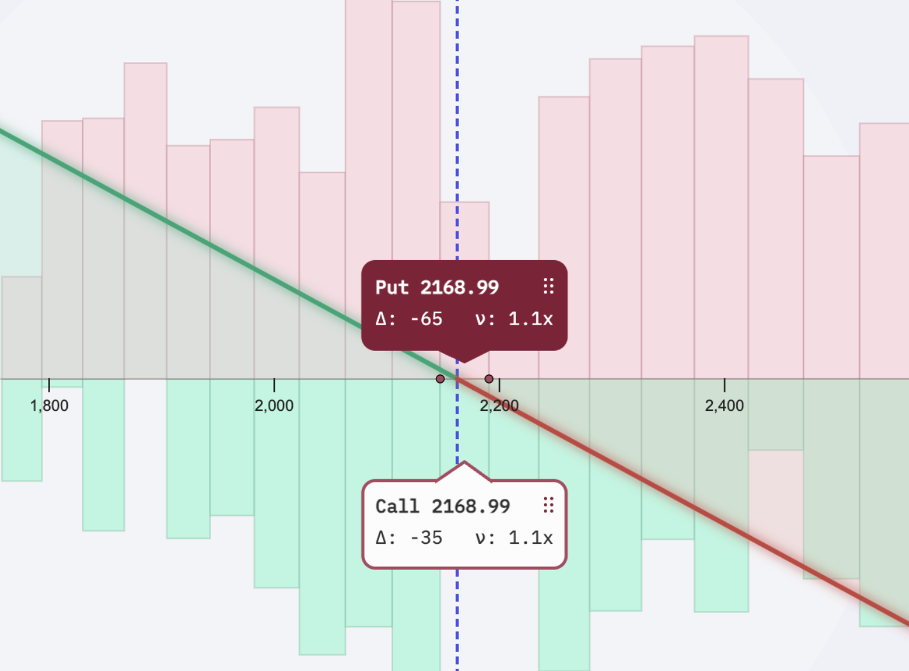
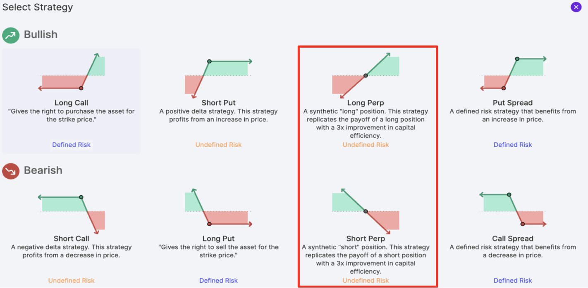

# Synthetic Perpetual Futures in Panoptic, part I: An In-Depth Exploration

In this series, we embark on an in-depth exploration of perps (perpetual futures) and their unique implementation within the Panoptic options-trading protocol. We will delve into Panoptic's synthetic perps, focusing on how they compare and contrast with traditional perps and their tradability. Specifically, we will discuss: 

- How traditional perps work
- How perps relate to perpetual options 
- How synthetic perps differ from traditional perps
- How synthetic perps can be traded in Panoptic.

## Introduction to Perps.

Before diving into *perps*, we first present a brief recap of what a *futures contract* is.  A futures contract is a standardized financial agreement or contract between two parties &mdash; typically referred to as the "buyer" and the "seller" &mdash; to buy or sell a specified asset (i.e., a token in the case of crypto) at a predetermined settlement price (the "futures price") on a specified future date. Contrary to options, both parties in the contract have the **obligation** to carry out the deal. Futures contracts are widely used in financial markets to hedge against price fluctuations, speculate on future price movements, and manage risk.

Perps &mdash; a variation on futures contracts &mdash; offer a revolutionary approach in crypto derivatives trading, blending elements of traditional finance with the digital realm. Key characteristics of perps include:

- Indefinite Duration: Unlike standard futures, perps have no expiration date, offering continuous exposure to asset price movements.
- Funding Rate Mechanism: Instead of a fixed settlement price, perps use a 'funding rate' to align their price with the underlying asset.

Furthermore, perps are primarily traded on crypto assets. There is no other major asset on which perps are traded. **At the time of writing, [there's over $1 Billion USD locked in perpetual protocols across DeFi](https://defillama.com/protocols/Derivatives)**. 

Despite perps taking off in the crypto markets, the concept of perpetual futures is not new. In fact, they were originally propose by [Shiller (1993)](https://www.nber.org/papers/t0131) with the aim of creating an enduring entitlement to the cash flows of an asset that lacked liquidity. 

## Structure of Perps

Perps are built upon several core components:

- *Price Index:* Perps are typically based on a price index of the underlying crypto asset. This index is determined by averaging prices from various crypto exchanges.
- *Funding Rate:* The key mechanism that keeps the perps price in line with the underlying asset's spot price is the funding rate. The funding rate is a recurring payment that occurs between traders to balance any price differences between the futures contract and the underlying asset. This will be defined more precisely in the following subsection.
- *Leverage:* Traders can choose to use leverage when trading perps. Leverage allows them to control a larger position with a smaller amount of capital, but it also amplifies both gains and losses.
- *Long and Short Positions:* Traders can take either long (buy) or short (sell) positions in perps. A long position profits from an increase in the underlying asset's price, while a short position profits from a decrease.
- *Trading and Funding Fees:* Traders are subject to trading fees for entering and exiting positions. Additionally, they may pay or receive funding fees at regular intervals (e.g., every 8 hours). Funding fees are determined by the difference between the perp's contract price and the underlying asset's mark price.

## Under the Hood

Having provided a brief overview of perps and their purpose, we now delve into a more formalized and comprehensive understanding of these instruments. Our approach aligns with the exposition found in [He et al., (2023)](https://arxiv.org/pdf/2212.06888.pdf). 

> **Formal Definition of Perpetual Futures**. Consider the (mark) price of an underlying asset, $\mathsf{S}$, denoted as $\{S_t, \ t\geq 0\}$, and the real-valued process known as the perp price, $\{F_t, \ t \geq 0\}$. A perpetual futures contract on $\mathsf{S}$ is defined by the following criteria:
1. Entry into the contract is free of charge.
2. Either party can terminate the contract unilaterally at any point in time $t$.
2. Prior to termination, the party holding a long position compensates the short position according to the formula:
$$
\rho_\tau\mathrm{d}\tau:=k(F_\tau-S_\tau)\mathrm{d\tau}+iS_\tau\mathrm{d}\tau, \quad k,i\in\mathbb{R}+,
$$
This compensation is calculated for each (infinitesimal) unit of time $\mathrm{d}\tau$ that the contract remains active. Here, $k$ represents a constant that modifies the funding rate, and $i$ signifies an interest rate. Consequently, the cumulative payment from longs to shorts over the period $[0,t]$ is expressed as:
$$
P_t=\int_0^t\rho_\tau\mathrm{d}\tau=\int_0^t\left(k(F_\tau-S_\tau)+iS_\tau \right)\mathrm{d\tau}.
$$
It is noteworthy that $P_t$ can be a negative value, implying a reversal in the payment direction where the shorts compensate the longs.

The **funding rate**, denoted by $\rho_t$, is arguably the most critical aspect of a perp. Ideally, this rate should hover around zero, ensuring that $F_t$ remains in proximity to $S_t$. If this balance is not maintained, the incentive for parties to enter positions could be adversely affected. The adjustment of $F_t$ to reflect supply and demand dynamics is a universal feature across different protocols, although the exact mechanism may vary.

A larger $\rho_t$ means greater payments from longs to shorts, incentivizing an increase in short positions. This, in turn, will likely cause a decrease in the perp price $F_t$, aligning it closer to $S_t$. The magnitude of $k$ plays a significant role in the rate of this adjustment, reminiscent of principles seen in Hooke's law.

Conversely, when $\rho_t$ is negative, shorts are required to pay longs. This incentivizes the opening of more long positions, which can raise the price of $F_t$, thus reducing the gap between $F_t$ and $S_t$.

Remark: These payments are proportional to the amount of liquidity or leverage in play. Thus, the actual amount exchanged between longs and shorts is the product of this liquidity factor, $\ell$, and $P_t$.

## Synthetic Perps on Panoptic
The intersection of perpetual options and perps unveils fascinating dimensions in the realm of crypto-native, expirationless derivatives. Notably, **Panoptic offers the innovative capability to create synthetic perps!** This feature opens up opportunities for leveraging market inefficiencies and discovering arbitrage strategies by juxtaposing Panoptic-created perps against those from other platforms. 

### Creating Synthetic Perps in Panoptic
To understand how synthetic perps are formulated within Panoptic, let's explore the processes for both going long and short on a perp:

**Long Perp**
1. Purchase an at-the-money (ATM) call option.
2. Sell an at-the-money (ATM) put option.

This strategy is a practical application of a [well-established financial principle](https://panoptic.xyz/research/loan-shark-with-put-call-parity), allowing the [replication of portfolio positions](https://panoptic.xyz/docs/trading/multi-leg-strategies#synthetic-positions) using options. Similarly, if one is instead interested in shorting the perp, the process is as follows:

**Short Perp**

1. Sell an ATM call option.
2. Buy an ATM put option.

These synthetic perps diverge from standard perps in two significant ways:

1. They replicate a perp portfolio (or equivalently, a long or short position on the underlying asset) using options.
2. They rely on a periodic payment method different from the traditional funding rate.

### Funding rate for Synthetic Perps

Although synthetic perps in Panoptic mirror the payoff curves of standard perps, their funding rate mechanism differs. In Panoptic, the fee structure for perpetual option transactions includes trading fees akin to those in Uniswap, augmented by an inflation factor termed vegoid. The fee computation is as follows:

$$
\mathsf{PanoptionFees}(t_0,t,j)=\mathsf{UniswapV3Fees}(t_0,t,j)\underbrace{\left(1+\frac{\nu_0 B(j,t)}{T(j,t)-B(j,t)}\right)}_\text{:=vegoid},
$$

where $\mathsf{UniswapV3Fees}(t_0,t,j)$ represent the fees collected by Uniswap at tick $j$ between times $t_0$ and $t$. The protocol parameter $\nu_0$, currently set at 0.25 and within the range $(0,1)$, along with the amounts of bought ($B(j,t)$) and total liquidity ($T(j,t)$) at tick $j$ at time $t$, define vegoid:

$$
\mathsf{vegoid}(j,t):=\left(1+\frac{\nu_0 B(j,t)}{T(j,t)-B(j,t)}\right). 
$$

Notice that such an amount needs to be paid periodically, and will also depend on the amount of demand and supply of the assets in the pool. Given this, we can define the following: 

>**Formal Definition of Synthetic Perp Funding Rate**. The funding rate of a synthetic perp on Panoptic is given by: 
$$
\rho_t^\text{synthetic perp}=\mathsf{vegoid}_\text{call}(j,t)-\mathsf{vegoid}_\text{put}(j,t)
$$

### How can I trade them? 
The process of creating synthetic perps on Panoptic is streamlined, thanks to the one-click strategy templates.  Indeed, one can simply follow the tutorial guide on [*how to open a position*](https://panoptic.xyz/research/opening-a-position-on-panoptic). The main steps are: 

1. Connecting to Panoptic: The initial step involves establishing wallet connection with the Panoptic platform, ensuring you have access to all its trading features.
2. Onboarding Tutorial: Engage with the onboarding tutorial provided by Panoptic. This step is crucial for depositing funds onto Panoptic to begin trading.
3. Market Selection: Choose the options market you want to trade in.
4. Strategy Selection: Navigate to the trading page and select your desired strategy. Panoptic offers a variety of strategic options to cater to different trading preferences and objectives.
5. Profit$^*$!

$^*$ Step 5 is optional and we can't guarantee it ;) 

## Final Thoughts
In this deep dive we delved into the intricate world of perps  and their unique implementation on Panoptic's perpetual options platform. Perps represent a significant innovation in the crypto derivatives trading landscape, offering traders indefinite holding periods and a dynamic funding rate mechanism, differentiating them from traditional futures contracts. Panoptic further innovates by allowing the creation of synthetic perps, blending traditional financial derivatives with decentralized finance (DeFi).

The key points covered include:

1. Formal Definition and Mechanics of Perps: Understanding the structure and function of perpetual futures, including their funding rate mechanism and how they differ from traditional futures.
2. Synthetic Perps in Panoptic: Discussing how Panoptic enables the creation of synthetic perps through a combination of options strategies and exploring the unique funding rate mechanism within the platform.
3. Trading on Panoptic: Outlining the process for trading synthetic perps on Panoptic, from connecting to the platform to selecting trading strategies.

This piece highlights the innovative intersection of traditional finance and DeFi through perps on Panoptic. While the underlying concepts and mechanisms are complex and nuanced, the platform simplifies the creation and trading of these instruments.

Lastly, in closing this discussion on perps and their unique implementation in Panoptic, it's evident that the literature on this subject, particularly perps, is somewhat sparse. Existing resources often cover only the basic protocols, leaving out intricate details that might be crucial for a deeper understanding. This gap in comprehensive material is particularly noticeable for those seeking a more mathematical and analytical perspective on the topic. Therefore, for readers looking to delve deeper into the complexities of perps, exploring more specialized and academically oriented resources is recommended. These might offer the detailed insights and rigorous analysis necessary to fully grasp the nuances of perps and their applications in platforms like Panoptic.
1. He, S., Manela, A., Ross, O., & von Wachter, V. (2022). *Fundamentals of Perpetual Futures*. arXiv preprint arXiv:2212.06888.
2. Ackerer, Damien,  Hugonnier J, & Jermann U. (2023). *Perpetual Futures Pricing*. arXiv preprint arXiv:2310.11771.