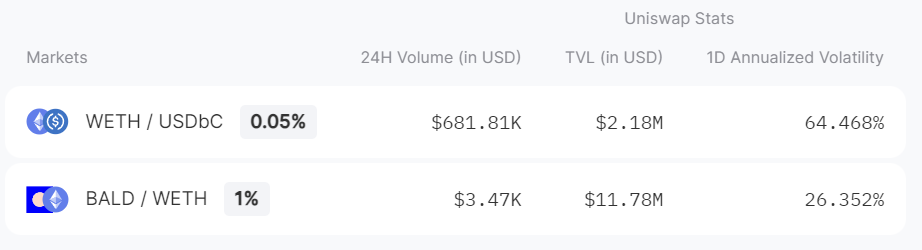
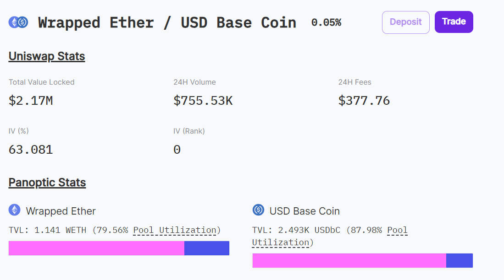
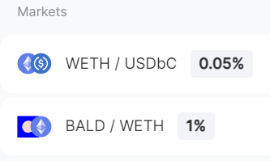

In this article, we delve into the innovative world of Panoptic and its integration with Uniswap, offering a comprehensive guide on trading options on any ERC-20 token pair. This piece aims to clarify key concepts such as markets, assets, numeraires, and the relationship between Uniswap and Panoptic, enhancing your understanding of decentralized options trading.

>### Questions We'll Answer
>
>-   What is a market in the context of Panoptic?
>-   What are an asset and a numeraire?
>-   How is Uniswap related to Panoptic?
>-   How can I trade options on any ERC-20 tokens on Panoptic?
    

  

# Panoptic's Options Trading Infrastructure

Panoptic, supported by Uniswap, presents a groundbreaking infrastructure in decentralized finance (DeFi). It allows for trading options on a vast array of assets, contrasting the limited options available on traditional digital asset options platforms.

  

## Asset vs Numeraire in Trading Pairs

-   Asset: In a trading pair, the asset (like WETH in WETH/USDbC) is the primary focus of the option trade. 
-   Numeraire: The numeraire (like USDbC in WETH/USDbC) serves as the reference currency or benchmark to express the asset's value.
    

This structure is analogous to the base asset and quote asset in traditional trading but tailored for decentralized options trading. Understanding this distinction is crucial for traders to effectively strategize their trades.

  

## What is a Market in Panoptic?

A market in Panoptic consists of a pair of an asset and a numeraire. It defines the scope of the options trade. For example, a market like WBTC/DAI sets the stage for trading options with WBTC as the asset and DAI as the numeraire.

  

## Trading Options on Markets: Understanding the Dynamics

When considering options like calls or puts in a specific market, understanding the dynamics is vital. For instance, in a WBTC-DAI market:

  

-   A call option reflects a bullish stance on the asset (WBTC) against the numeraire (DAI).
-   A put option indicates a bearish perspective on the asset (WBTC) relative to the numeraire (DAI).
    

  

This clarity helps traders make informed decisions, especially in the versatile and often complex world of decentralized finance.

  

## Challenges and Solutions in Decentralized Options Trading

Panoptic addresses several challenges in the DeFi options market:

  

-   Liquidity Fragmentation: Traditional DeFi options markets suffer from scattered capital and liquidity issues. Panoptic resolves this by tapping into Uniswap's liquidity pools, ensuring a more seamless trading experience.
    
-   Intermediaries and Oracles: Panoptic's oracle-free [streamia](https://panoptic.xyz/blog/streamia-defi-native-options-pricing) model for pricing options eliminates the need for external data sources, reducing vulnerability points.
    

  

## Panoptic and Uniswap: A Symbiotic Relationship

Uniswap's growth and success as a decentralized exchange protocol lay the foundation for Panoptic's options trading mechanism. By interfacing with Uniswap's core contracts, Panoptic enables trading options on any asset pair available on Uniswap.

### What is Uniswap?

Uniswap is a decentralized exchange protocol built on Ethereum and other blockchains. It allows for permissionless token swaps, and its automated market maker system ensures liquidity for the trading of thousands of ERC-20 tokens.

  

Uniswap’s Liquidity Providers (LPs) contribute equal value of two tokens to a liquidity pool, receiving pool tokens in return, which represent liquidity providers’ share of the pool, and can be redeemed at any time. Depending on the pool, there is an associate fee charged to traders that incentivizes liquidity providers to provide liquidity.

  

Since Uniswap’s growth over the last five years, it has emerged as the most successful on-chain trading protocol and part of its success can be attributed to its vast and immediate support for a multitude of assets – unlike many centralized exchanges. Panoptic aims to use the same underlying technology to power options for all digital assets.

### Panoptions are built on Uniswap

By directly interfacing with Uniswap v3’s core contracts, Panoptic can port over liquidity on ANY asset pair. This mechanism allows traders to leverage the liquidity and decentralized nature of Uniswap, ensuring a transparent and efficient options trading experience without the need for intermediaries.

### Fee Tiers and Implications

Panoptic's fee tiers (0.01%, 0.05%, 0.3%, or 1%) correlate with Uniswap's pool fee tiers, offering flexibility and incentive for liquidity providers. This feature opens up possibilities like trading on the BTC-ETH price directly or exploring stablecoin options, broadening the spectrum of decentralized finance.

# Conclusion

Panoptic, through its innovative approach and synergy with Uniswap, presents a transformative platform in the DeFi landscape. By understanding the nuances of assets, numeraires, and market dynamics, traders can leverage this platform to explore a vast array of options trading opportunities in a decentralized, efficient, and secure environment.

  

## Next Steps

To start trading on Panoptic or for further exploration, visit Panoptic's [official website](https://www.panoptic.xyz) and its [documentation](https://docs.panoptic.xyz). Here, you'll find detailed guidance on [opening positions](https://panoptic.xyz/research/opening-a-position-on-panoptic) and navigating the platform's offerings.