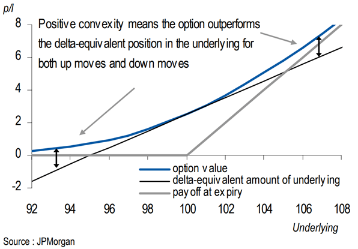
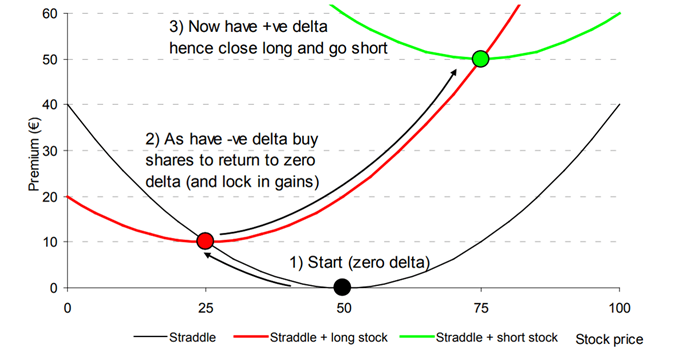
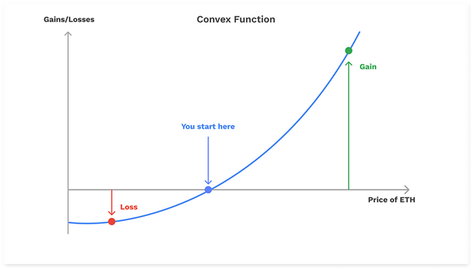
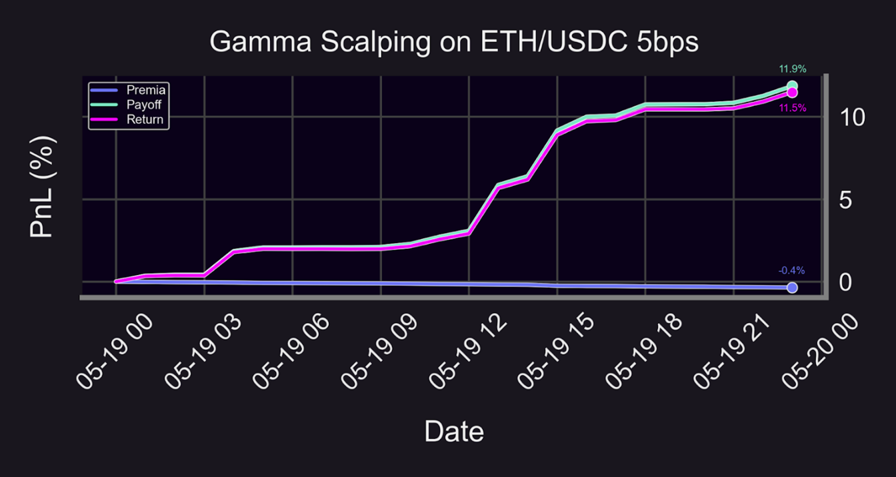

Traditional finance (TradFi) options market makers deploy an array of [strategies](https://panoptic.xyz/research/options-market-making) to actively manage risks through the [Greeks](https://panoptic.xyz/research/understanding-the-greeks-series). The primary objective of this article will be to detail one of the most prevalent options market maker tactics: gamma scalping. We will explain the concept of gamma scalping in both the context of traditional options and [perpetual](https://panoptic.xyz/docs/trading/perpetual-options) options.

Gamma scalping supplies options market makers a situational means with which to unload portfolio inventory on the underlying asset due to the recurrent objective of maintaining neutrality and to capitalize on choppy, whipsawing market conditions by applying sound relative-value options trading principles amid broader chaos.

## What is Gamma?
The options Greek of [gamma](https://panoptic.xyz/docs/terms/gamma) delineates the rate of change of [delta](https://panoptic.xyz/research/options-market-making#what-is-delta). Delta represents the slope (i.e. linear) portion of an option’s payoff curve, whereas gamma represents the curvature and convexity (i.e. nonlinear) portion of the option’s payoff curve.

The [graphic](https://derivativesacademy.com/storage/uploads/files/modules/resources/1702207867_allen_einchcomb_granger_jpm_2006_variance_swaps.pdf) below reflects how an option will always be as valuable, if not more valuable, than a linear product (such as buy-and-hold or long [perps](https://panoptic.xyz/research/perpetual-futures-vs-options#what-are-perps)) because of gamma. While the full breadth of financial products (linear or nonlinear) will contain some form of delta, the gamma of linear products will always be zero due to the lack of convexity.

The principle of convexity constitutes the nonlinearity that options allot due to the right, but not the obligation, to exercise the instrument. This is also one reason why many options traders deem gamma to be the most significant Greek. Due to the reality that delta can only account for linear risks when hedging, hedging errors will inevitably arise from the inability to properly mitigate nonlinear risks that compound with a rise in underlying movement as mirrored in the above figure. Gamma serves as the Greek that can insulate a portfolio from hazards stemming from curvature.

## Gamma Scalping
Gamma scalping entails the buying of gamma while continuously [delta-hedging](https://panoptic.xyz/research/options-market-making#delta-neutral-trading). Buying gamma typically takes place by buying [at-the-money](https://panoptic.xyz/docs/terms/at_the_money) (ATM) [straddles](https://panoptic.xyz/research/defi-option-straddle-101), and delta-hedging can be implemented by buying and selling either the underlying asset, futures, or perps.

An integral factor in successful gamma scalping is the retention of directional (or delta) neutrality. If the underlying price rises, then a gamma scalper would short the delta-specified quantity of the underlying required to reattain delta neutrality. Conversely though, if the underlying price were to fall, then a gamma scalper would buy the appropriate quantity. In deciding how often to delta-hedge, traders may base their hedging frequency on some delta threshold or time-based measure.

The above [figure](https://www.trading-volatility.com/Trading-Volatility.pdf) illustrates the natural delta-hedging progression within a hypothetical gamma scalping paradigm example. In step one, the initial delta of an ATM straddle is zero. In step two, delta gradually turns negative, the underlying is purchased, and the opposite process occurs in step three with a shift to positive delta as the underlying is then shorted.

The distilled hedging convention of a gamma scalper can therefore be interpreted as contrarian via buying into underlying downturns and selling into underlying rallies. Profits come when the gamma scalper can consistently buy low and sell high enough to offset [theta](https://panoptic.xyz/docs/terms/theta) (or time) decay. A secondary effect of this contrarian objective is also in the dampening of continuing market swings.

### How to Profit from Gamma Scalping
The core initial component of gamma scalping in being long an ATM straddle would ostensibly leave a gamma scalper in an enviable position of only being exposed to upfront premium costs and theta decay on the downside with a panoply of underlying price scenarios that could generate substantial upside profits. Since realized volatility is often heightened, the potential to generate healthy profits from a gamma scalping trade is considerably broad.

The delta-hedge progression graphic in the prior section visually lays out how a gamma scalper could cumulatively lock in profits based on underlying market oscillations. In this exact case, the gamma scalper reverts to delta-neutrality when skewing towards negative portfolio delta and nets 10 euros, then quickly scalps 40 more euros to bring total gains to 50 euros when the portfolio delta flips into positive territory. If the premium of the straddle was less than 50 euros, the scalper has already profited.

The fundamental foundation supporting gamma scalping is that there will be sufficient underlying price activity over the course of a certain window to offset the theta decay that will ensue from the purchase of an ATM straddle. There is a tug–of-war aspect to this strategy:

The [equation](https://www.amazon.com/Volatility-Smile-Wiley-Finance/dp/1118959167) above characterizes the mathematical nature of the aforementioned gamma-theta tradeoff: the gamma scalper is effectively betting that a specific threshold of underlying price action will translate to satisfactory returns that offset the premium paid to purchase the option.

### Exploiting Cheap Volatility
The overarching thought process for executing this strategy is predicated on the hypothesis that realized volatility (RV) will exceed implied volatility (IV) for some asset. RV is a standard deviation-type ($\sigma$) measure of historical asset returns for a given lookback period, whereas [IV](https://panoptic.xyz/docs/terms/implied_volatility) is a forward-looking metric that quantifies the market expectation of volatility for asset returns during a forthcoming period. However, the conceptual linchpins that are dually responsible for driving the rationale behind gamma scalping are that long options gamma signifies belief in temporarily amplified RV along with a motivation to obtain a positively convex payout profile.

The [equation](https://www.amazon.com/Positional-Option-Trading-Wiley/dp/1119583519) above captures the relative-value element of the gamma scalping trade by illustrating that the profits of a gamma scalper are generated when either the vega or IV of an ATM straddle is undervalued.

### Positive Convexity
A majorly attractive attribute when devising a gamma scalping trade is the embedded feature of having a payout with positive convexity. Positive convexity with a long options position leads to a structural profit and loss (PnL) asymmetry where losses are capped, yet gains are theoretically unlimited as depicted in the theoretical [convex](https://medium.com/opyn/squeeth-primer-a-guide-to-understanding-opyns-implementation-of-squeeth-a0f5e8b95684) payout figure below.

The convexity of the options straddle coupled with the delta-hedging technique described earlier are the main crux to implement a gamma scalping strategy. In the event of heightened price action, scalpers reap outsized profits from the convexity of their payoff curve. The main takeaway here is that being long gamma is functionally being long both realized volatility and convexity as well.

## Gamma Scalping in Uniswap
We have previously shown that Uniswap liquidity provider (LP) positions closely [resemble](https://panoptic.xyz/research/defi-put-options-uniswap-backtest) perpetual options, and that the ability to short Uniswap LP positions would enable one to gamma scalp on Uniswap. For explanatory purposes, we perform a small [backtest](https://github.com/panoptic-labs/research/blob/main/_research-bites/20240612/gamma-scalping.ipynb) of a gamma scalping strategy on the ETH/USDC 5bps Uniswap pool taking place on May 19, 2021.

The overall return for the strategy is roughly 11.5% with the premia paid amounting to approximately -0.4%. For the sake of historical context, the selected one-day period for the backtest is a particularly volatile backdrop as there were several stablecoin depegs the following day on May 20, 2021. The backtest is an illuminating case study as to how gamma scalping, in a highly mercurial environment such as the date in question, can potentially harvest immense returns over an abbreviated time horizon.

### Panoptic-Native Gamma Scalping
With regard to Panoptic, gamma scalping would involve several departures from conventional TradFi procedure. Gamma can be [capped](https://paper.panoptic.xyz/) with [Panoptions](/docs/terms/panoption) based on user preference, and theta decay is paid in the form of [streaming premia](https://panoptic.xyz/research/streamia-101) (streamia). The TradFi heuristic of options moneyness would be supplanted by [rangeness](https://panoptic.xyz/blog/streamia-defi-native-options-pricing) where a Panoption buyer would pay streamia to a seller when an option is [in-range](https://panoptic.xyz/docs/terms/in_range) (IR) and pay nothing when a Panoption is [out-of-range](https://panoptic.xyz/docs/terms/out_of_range) (OOR).

Consequently, a conducive market climate to gamma scalp and purchase an ATM straddle on Panoptic would be if a prospective gamma scalper theorizes that an underlying will begin IR and eventually move OOR, while the ongoing delta-hedging could be executed through [perps](https://panoptic.xyz/research/options-market-making#the-benefits-of-hedging-with-futures).

In a future article, we will explore the [risks](https://panoptic.xyz/research/demystifying-IL-LVR-JIT-MEV) of being short gamma, which Uniswap LP positions fall under. The parallels of impermanent loss (IL) to options gamma risk and loss-versus-rebalancing (LVR) to continuous delta-hedging lend specific insights to that effect. Prior Panoptic quantitative [analysis](https://panoptic.xyz/research/uniswap-options-lp-analysis) also demonstrates how LPs are constrained to being profitable with relation to only Uniswap v3 pools that have relatively muted underlying realized volatility.

*Join the growing community of Panoptimists and be the first to hear our latest updates by following us on our [social media platforms](https://links.panoptic.xyz/all). To learn more about Panoptic and all things DeFi options, check out our [docs](https://panoptic.xyz/docs/intro) and head to our [website](https://panoptic.xyz/).*
