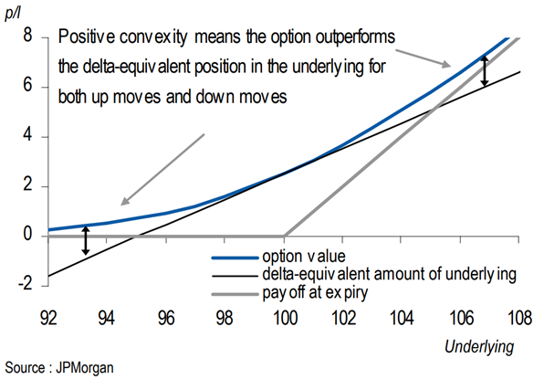
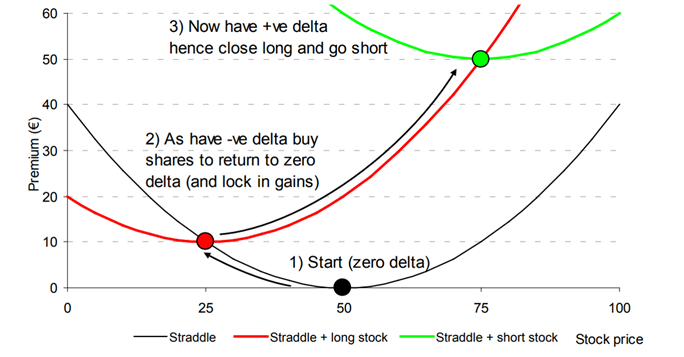
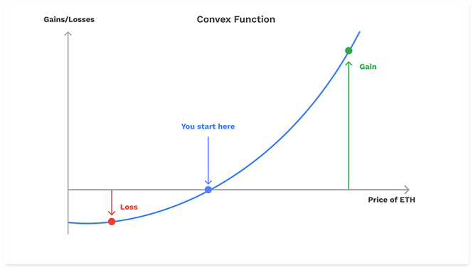
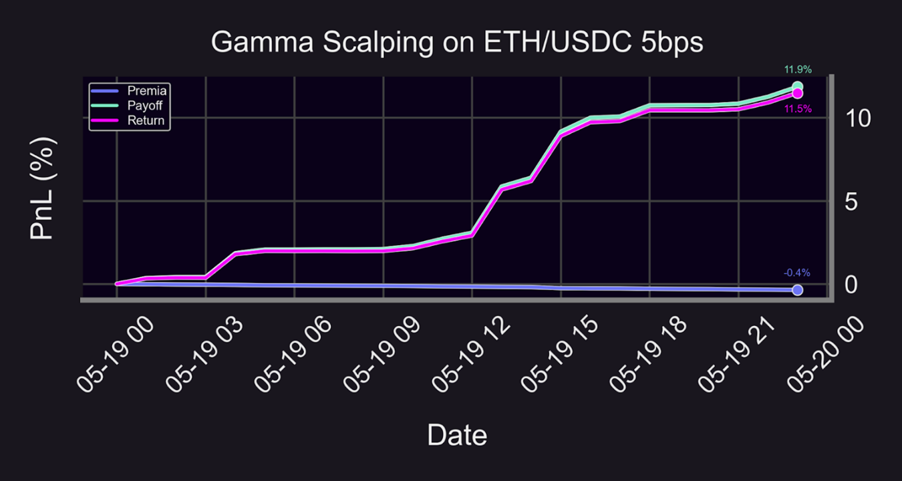

<head>
  
</head>

## What is gamma scalping?

Gamma scalping is an options strategy that buys gamma, usually with an [at-the-money](/docs/terms/at_the_money) (ATM) [straddle](/research/defi-option-straddle-101), and repeatedly [delta hedges](/research/options-market-making#delta-neutral-trading) it by trading the underlying. Each hedge sells after price rises and buys after it falls. The trade profits when realized volatility is higher than the implied volatility paid for the options.

For the short-gamma counterpart, see [reverse gamma scalping](/research/reverse-gamma-scalping).

## How gamma scalping works

Three ideas make the strategy work.

**Long gamma.** [Gamma](/docs/terms/gamma) is the rate of change of [delta](/research/options-market-making#what-is-delta). A long option position has positive gamma: as price rises, its delta grows; as price falls, its delta shrinks. A linear position such as spot or a [perp](/research/perpetual-futures-vs-options#what-are-perps) has zero gamma.

**Delta hedging.** A long straddle starts close to delta neutral. When price rises, the straddle becomes long delta, so the scalper sells the underlying to return to neutral. When price falls, the straddle becomes short delta, so the scalper buys. Every hedge is a contrarian trade: sell high, buy low.

The animation below shows the same loop on a payoff curve. As price moves away from the strike, the straddle picks up delta (the orange tangent line). The hedge removes that delta and re-centers the position, locking in a small gain each time.

<video src={require("./hedged-long-straddle.mp4").default} title="Animation: delta hedging a long straddle as price moves" autoPlay loop muted playsInline preload="metadata" width="100%" height="auto"></video>

**Realized vs implied volatility.** The hedging gains have to pay for the options. Over a short interval, the hedged position changes by approximately:

$$dV \approx \tfrac{1}{2}\,\Gamma\,dS^2 - \Theta\,dt$$

Gains grow with the square of each price move ($dS^2$), while the cost ($\Theta$, theta) accrues with time. Summed over the life of the trade, the P&L is roughly:

$$\text{P\&L} \approx \text{Vega} \times (\sigma_{\text{realized}} - \sigma_{\text{implied}})$$

So gamma scalping is a bet that the underlying will move more than the option price implies. The premium caps the loss on the long option's own payoff, while gains from large moves are open-ended thanks to its positive convexity. That cap excludes hedging costs and streamia, so it does not cap the net strategy's losses.

## Gamma scalping strategy, step by step

1. **Choose the market.** Look for an asset where you expect realized volatility to exceed implied volatility: an upcoming catalyst, a regime change, or options that look cheap against recent price action.
2. **Enter long gamma.** Buy an ATM straddle (a call and a put at the current price). Gamma is highest at the money, so an ATM straddle gives high absolute gamma for the hedging to harvest.
3. **Neutralize delta.** If the straddle is not exactly ATM, trade the underlying or a perp so net delta starts near zero.
4. **Set the hedge rule.** Rehedge when net delta crosses a threshold (for example ±0.1 per straddle), or on a fixed schedule (for example every hour). Tighter rules capture more small moves but pay more in fees and slippage.
5. **Hedge mechanically.** Sell into rallies and buy into dips back to neutral each time the rule triggers. Don't override the rule with a directional view; that turns the trade into a directional bet.
6. **Track hedging gains vs cost.** Compare cumulative hedging P&L against theta (or streamia on Panoptic). This is your running realized-vs-implied scorecard.
7. **Know when to stop.** Exit when realized volatility falls below what you are paying, when the catalyst has passed, or when price has moved far from the strike and gamma has faded. On a fixed-expiry option, at-the-money gamma generally rises as expiry approaches, while gamma falls for options far from the strike.

## Gamma scalping example

Here is a worked example with an ETH straddle, using Black-Scholes approximations.

- ETH price: **$2,500**
- Position: **long 1 ATM straddle** (1 call + 1 put, strike $2,500, 30 days)
- Implied volatility: **60%**

At these inputs the straddle has a gamma of about **0.00186 per $1** and a theta of about **$5.70 per day**.

**Day 1: ETH rises to $2,600.** Delta goes from 0 to about +0.186 (gamma × $100). The scalper sells **0.186 ETH at $2,600** to return to neutral.

**Day 2: ETH falls back to $2,500.** The straddle's delta returns to about 0, leaving the hedge net short 0.186, so the scalper buys back **0.186 ETH at $2,500**.

| | Amount |
|---|---|
| Hedge profit (0.186 ETH × $100) | **+$18.60** |
| Theta paid (2 days × $5.70) | **−$11.40** |
| Net | **+$7.20** |

ETH ended where it started, yet the trade made money because it moved enough in between. The daily break-even move is about **$78** (that is, $2{,}500 \times 60\% / \sqrt{365}$). Days with larger swings make money; quieter days lose theta.

### Backtest: gamma scalping on Uniswap

Uniswap LP positions closely [resemble](/research/defi-put-options-uniswap-backtest) perpetual options, so shorting LP positions lets you gamma scalp on Uniswap. A [backtest](https://github.com/panoptic-labs/research/blob/main/_research-bites/20240612/gamma-scalping.ipynb) on the ETH/USDC 5 bps pool on May 19, 2021, a highly volatile day, returned about **11.5%**, with streamia paid of about **−0.4%**.

## Delta-neutral gamma scalping vs delta scalping

| | Gamma scalping | Delta scalping |
|---|---|---|
| Options position | Long gamma (long straddle or strangle) | Any, often directional |
| Goal of hedges | Return to delta neutral | Trade around a target delta |
| Profits from | Realized volatility above implied | Short-term price swings, sometimes with a directional bias |
| Main cost | Theta / streamia | Fees, slippage, directional risk |

Gamma scalping is always delta neutral and always long options. "Delta scalping" is a looser term for actively trading the underlying around a position's delta, and can be done without being long gamma.

## Reverse gamma scalping and Uniswap LPs

While price is inside its selected range, a Uniswap v3 or v4 LP position is **short gamma**. As price rises, swappers buy the rising asset out of the pool, so the LP holds less of it; as price falls, they sell the falling asset into the pool, so the LP holds more. The LP's exposure shrinks before further gains and grows before further losses, the opposite of a long-gamma position. Delta-hedging that short-gamma book means buying after rallies and selling after drops (buying high and selling low), the mirror image of a gamma scalper's hedges. The LP earns swap fees in exchange. Out of range, the position is single-sided: it does not rebalance and earns no swap fees until price re-enters.

In other words, **every in-range Uniswap LP is running a reverse gamma scalp**. Impermanent loss is the hedging loss of a short-gamma position, and swap fees play the role of theta. LPs come out ahead only when fees exceed losses from realized volatility, which is why [LP returns are concentrated in lower-volatility pools](/research/uniswap-options-lp-analysis). See [reverse gamma scalping](/research/reverse-gamma-scalping) and [IL, LVR, JIT, and MEV](/research/demystifying-IL-LVR-JIT-MEV) for the full treatment.

Panoptic makes this two-sided: selling an option on Panoptic is providing Uniswap liquidity (short gamma), and buying an option removes it (long gamma). The gamma scalper and the LP are taking opposite sides of the same trade.

## How to gamma scalp on Panoptic

Panoptic [perpetual options](/docs/trading/perpetual-options) change the mechanics in three useful ways:

- **No expiry, no roll.** A perpetual straddle keeps its gamma until you close it. There is no expiry date where gamma collapses and no need to roll into a new contract.
- **Streamia instead of theta.** The buyer pays [streamia](/docs/product/streamia) to sellers each block while the option is [in range](/docs/terms/in_range), and nothing while it is [out of range](/docs/terms/out_of_range). Your hedging gains are measured against streamia instead of upfront premium and theta decay.
- **Any Uniswap pool.** You can buy gamma on tokens that trade on Uniswap, including many that no other options venue lists. Delta hedges can be placed with spot or [perps](/research/options-market-making#the-benefits-of-hedging-with-futures).

The ideal setup is the same as in traditional markets: buy an ATM straddle when you expect price to move more than the streamia you are paying implies, then delta hedge mechanically.

**[Open a straddle on Panoptic →](https://app.panoptic.xyz)**

## FAQ

### Is gamma scalping profitable?

Only when the underlying moves more than the options price implies. Hedging gains scale with the square of each move, while the cost (theta, or streamia on Panoptic) accrues with time. In quiet markets, the cost exceeds the hedging gains and the trade loses money.

### How often should you rehedge when gamma scalping?

Most traders rehedge on a delta threshold (for example, when net delta exceeds 0.1 per straddle) or on a fixed schedule. Hedging more often captures more small moves but pays more fees and slippage; hedging less often lets trends run further but leaves more directional risk between hedges.

### What is the difference between gamma scalping and delta scalping?

Gamma scalping is long options and delta neutral: the trader buys gamma and trades the underlying only to remove the delta that gamma creates. Delta scalping is a broader term for actively trading the underlying around a position's delta, and may keep a directional bias or be applied to short-gamma books.

### Are Uniswap LPs doing reverse gamma scalping?

Yes, while price is in range. An in-range LP position is short gamma: the pool sells the rising asset and buys the falling one, and earns swap fees in exchange. Out of range, it is single-sided, does not rebalance, and earns no fees until price re-enters. Impermanent loss is the hedging loss of that short-gamma position.

### Can you gamma scalp without options expiring?

Yes. Panoptic perpetual options never expire, so you can hold a long straddle without rolling it. Instead of an upfront premium and theta decay, you pay streamia to sellers while the position is in range.

*Join the growing community of Panoptimists and be the first to hear our latest updates by following us on our [social media platforms](https://links.panoptic.xyz/all). To learn more about Panoptic and all things DeFi options, check out our [docs](/docs/intro) and head to our [website](https://panoptic.xyz/).*
