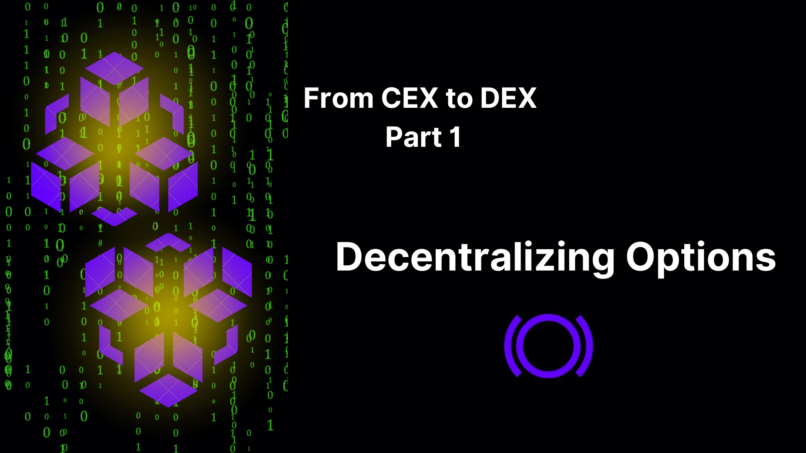

## Introduction

In the dynamic world of cryptocurrency trading, exchanges serve as the cornerstone for buying, selling, and trading digital assets. Two primary types of exchanges have emerged: centralized exchanges (CEX) and decentralized exchanges (DEX). While both platforms facilitate crypto asset transactions, they differ significantly in their operation, security and user control.

Centralized exchanges, such as Binance and Coinbase, operate under a central authority, offering deep liquidity for major tokens and user-friendly interfaces but at the cost of potential security vulnerabilities and custodial risks, including the possibility of the exchange stealing users' funds. Additionally, the opaque nature of exchange order flow and market maker activities can lead to concerns about users being front-run. On the other hand, decentralized exchanges empower users with full control over their assets, eliminating custodial risks, and enable instant token listings. However, DEXs may struggle with harnessing liquidity.

## The Differences between CEX and DEX

### Market Structure

#### Centralized Exchange (CEX)

- **Order Book Model:** CEXs typically use an order book model where buy and sell orders are matched. This structure allows for real-time price discovery and typically leads to higher liquidity and tighter spreads.
- **Central Authority:** CEXs operate under a central authority, which limits who can use the exchange.

#### Decentralized Exchange (DEX)

- **Automated Market Maker (AMM):** DEXs like Uniswap use AMM models where prices are determined by a formula based on the ratio of assets in a liquidity pool. This can result in different pricing dynamics compared to order book systems.
- **Permissionless:** DEXs operate in a permissionless manner, allowing anyone to trade and create trading markets without centralized oversight.

### Liquidity

#### Centralized Exchange (CEX)

- **Deep Liquidity:** CEXs often have higher liquidity due to the presence of institutional traders, market makers, and a broader user base.
- **Fewer Markets:** New markets take time and resources to be approved by a centralized body to ensure available liquidity and market makers, leading to fewer markets and slower token listings.

#### Decentralized Exchange (DEX)

- **Variable Liquidity:** Liquidity on DEXs can be variable and is dependent on the participation of liquidity providers. Liquidity can also be fragmented across multiple pools.
- **Many Markets:** DEXs support a broad array of markets, including numerous longtail assets that are not typically available on CEXs. This extensive range allows users to access and trade a wider variety of crypto assets, providing more opportunities to explore and invest in lesser-known or emerging projects.

### Price Discovery

#### Centralized Exchange (CEX)

- **Market Maker Pricing:** Market makers place bids and asks on an order book, collectively setting the price of the asset. As orders are filled by market makers and market sentiment changes, market makers must update bid and ask prices to remain profitable.
- **Order Types:** CEXs offer various order types (limit, market, stop-loss) that allow for more strategic flexibility when entering and exiting positions.

#### Decentralized Exchange (DEX)

- **AMM Pricing:** An AMM is an automated market maker that operates through a smart contract to automatically determine the price of tokens within the pool based on a predefined algorithm. Prices on DEXs are determined by the AMM formula. For example, Uniswap uses the formula $x \cdot y = k$, where $x$ and $y$ are the quantities of the two tokens in the pool, and $k$ is a constant. This formula ensures that the product of the quantities of the two tokens remains constant, which helps update the price as needed.

### Volatility Factors

#### Centralized Exchange (CEX)

- **Institutional Influence:** The presence of institutional traders and market makers can stabilize prices and reduce volatility.
- **Controlled Environment:** Measures such as circuit breakers and trading halts can be used to manage extreme volatility. However, these measures may appear as arbitrarily enacted by a centralized actor.

#### Decentralized Exchange (DEX)

- **Retail Dominance:** Retail traders dominate DEXs, which can lead to more pronounced market sentiment swings and higher implied volatility.
- **Protocol-Specific Risks:** Unique risks related to smart contract vulnerabilities, liquidity mining incentives, and token-specific events can affect volatility of tokens on both DEXs and CEXs. However, in a permissionless environment like a DEX, there are no circuit breakers or trading halts. This contrasts with the controlled environment of CEXs, where trading can be halted, sometimes controversially, as seen in the Robinhood case with GameStop.

## DeFi Vocabulary

Given the distinct nature of decentralized exchanges compared to centralized ones, it is essential to introduce new terminology to fully comprehend the exchange developed by Panoptic using Uniswap.

### Liquidity Pool

A collection of funds locked in a smart contract on a decentralized exchange (DEX) to facilitate trading. Users, known as liquidity providers, deposit pairs of tokens into the pool. These pools enable automated trading using algorithms, ensuring constant liquidity, and allowing users to trade tokens without relying on a traditional order book. In return, liquidity providers earn a share of the trading fees generated by the pool, proportional to their contribution.

### Liquidity Provider (LP)

An individual or entity that adds funds to a liquidity pool, providing the necessary liquidity for traders to execute transactions. LPs earn a portion of the trading fees as a reward.

### Fee Rate

In Uniswap v3, this refers to the percentage fee that traders pay when they execute a trade on the platform. This fee is distributed to the liquidity providers who have supplied liquidity to the pool in the price range where the trade occurs. Uniswap v3 offers different fee tiers to accommodate various types of trading pairs. Common fee tiers are 0.05%, 0.01%, 0.3%, and 1%. Lower fee tiers are typically used for stablecoin pairs or highly correlated assets, while higher fee tiers are used for more volatile pairs.

### Upper Price and Lower Price

- **Upper Price:** The highest price within which the LP position remains active.
- **Lower Price:** The lowest price within which the options position remains active.

### Collected Fees

The transaction fees accumulated by providing liquidity in a Uniswap v3 pool. These fees are collected every time there is a trade within the specified tick range of the liquidity. In the context of Panoptic, these fees serve as a proxy for the option premium since liquidity providers earn fees as compensation for the risks they take by providing liquidity.

### Volume

This is the amount of trading activity within the pool.

### Ticks and Price Ranges

- **Ticks:** Uniswap v3 divides the price range into discrete intervals called ticks. Each tick represents a specific price point.
- **Tick spacing:** This determines the minimum price increment between adjacent ticks.
- **Tick liquidity:** Tick liquidity refers to the amount of liquidity available in a specific price range (or between two ticks) within a Uniswap v3 pool. Uniswap v3 allows liquidity providers to concentrate their liquidity within specific price ranges, rather than providing liquidity across the entire price spectrum as in previous versions of Uniswap. This concentration allows for more efficient use of capital and potentially higher returns for liquidity providers.

- **Price range:** Liquidity providers can choose specific price ranges within which they want to provide liquidity. These ranges are bounded by the ticks.
- **Tick ranges:** LPs choose a range of ticks within which to provide liquidity. The narrower the range, the more concentrated the liquidity. It's the same concept as price ranges, just in terms of ticks.

### Liquidity Concentration

- **Concentrated liquidity:** Providers can allocate their liquidity to narrower price ranges where they believe most trading will occur. This is in contrast to Uniswap v2, where liquidity is spread evenly across all possible prices.
- **Tick liquidity:** The amount of liquidity allocated within a particular tick or price range, determining the pool's depth and its ability to handle trades at different price levels within these specified ranges.

### Liquidity Provision

- When liquidity providers (LPs) add liquidity to a Uniswap v3 pool, they specify the price range in which they want to provide liquidity.

#### Importance of Tick Liquidity

- **Price stability:** Higher tick liquidity means more of the asset is available for trading within that price range, leading to less price slippage and more stable prices.
- **Fee generation:** Higher liquidity at a specific tick allows the pool to handle larger trades without significant price impact, generating less fees for each individual LP who must split the reward amongst themselves.

## Panoptic Options Pricing

### From Traditional Options to Perpetual Options

Panoptic options are a unique type of derivative in the decentralized finance (DeFi) ecosystem that differ significantly from traditional options. In fact, option positions in Panoptic have no expiration. Here are the reasons why Panoptic options have no expiration, and why this approach might be chosen over traditional options:

#### Continuous Liquidity and Trading

- **No Expiry Pressure:** Traditional options have a set expiration date, which can lead to significant price movements and volatility as the expiration date approaches. Panoptic options avoid this by having no expiration, allowing for continuous liquidity and smoother price dynamics.
- **Constant Market Engagement:** Without expiration dates, traders can hold positions as long as they find it beneficial, leading to continuous market participation and engagement.

#### Innovative Pricing Model: Streaming Premia (Streamia)

- **Path-Dependent Pricing:** Panoptic uses a novel concept called the [streaming premium](/docs/product/streamia), where the pricing of options grows with each block provided that the spot price remains close to the strike price. This method eliminates the need for an expiration date and aligns with the continuous nature of blockchain transactions.
- **Real-Time Adjustments:** The absence of expiration allows the option's value to adjust in real-time to market conditions, providing a more accurate reflection of the underlying asset's risk and return profile.

#### Flexibility for Traders

- **Open-Ended Strategies:** Traders can enter and exit positions at any time without being constrained by expiration dates, allowing for more flexible trading strategies and risk management.
- **Avoiding Time Decay:** Traditional options suffer from time decay ([theta](/docs/terms/theta)), where the option's value erodes as it approaches expiration. Panoptic options eliminate this issue, making them more attractive for long-term strategies.

#### Enhanced Utility in DeFi

- **Decentralized and Autonomous:** In the DeFi space, the ability to create and manage derivatives autonomously without relying on centralized entities is crucial. Panoptic's no-expiration model fits well within the ethos of decentralization, offering a truly autonomous financial instrument.
- **Cost Efficiency:** Managing expirations in traditional options involves costs and complexities, such as rolling over positions. Panoptic options simplify this by removing the need for such management, reducing costs for traders.

### Why Not Just Use Traditional Options?

- **Reducing manipulation risks:** Options protocols that depend on positions expiring at a certain block are susceptible to manipulation. Bad actors can manipulate the price on that specific block, altering the status of an option from in-the-money (ITM) to out-of-the-money (OTM), or the reverse. In contrast, Panoptic's perpetual options model significantly reduces this vulnerability.
- **Incompatibility with DeFi:** Traditional options are typically managed by centralized entities and require complex, off-chain infrastructure, which is not always compatible with the decentralized, trustless nature of DeFi.
- **Higher costs and complexity:** The management of expirations, rolling contracts, and dealing with the decay of option value (theta) add costs and complexity that perpetual options avoid.
- **Limited flexibility:** Traditional options' expiration dates limit flexibility, which can be a drawback in the highly dynamic and fast-evolving crypto markets.

### What About The Mathematics Behind The New Pricing?

Formally, the streaming premium model corresponds to continuously integrating the theta of the option over the stochastic price path $S(t)$ (assuming a zero risk-free interest rate and no dividends):

$\text{Premium } P = \int_{S(t)} \theta(S_t, K, \sigma) \, dt$

where:
- $S$ is the spot price (the price of the underlying asset)
- $K$ is the strike price
- $t$ is the time to expiry
- $\sigma$ is the volatility of the underlying asset

Hence,

$\theta = -\frac{dV(S, t)}{dt} = \frac{S \sigma}{\sqrt{8 \pi t}} \exp \left( - \left[ \frac{\ln \left( \frac{S}{K} \right) + \frac{\sigma^2 t}{2}}{2 \sigma^2 t} \right]^2 \right)$

where $V$ is a put or call option (it does not matter because the theta is the same for vanilla options since we have a zero-interest rate and no dividends).

#### Important Remark

To determine if integrating theta over the price $S(t)$ results in fair options pricing, a Monte Carlo simulation was conducted to compute the integral of theta over time for thousands of simulated price paths based on Geometric Brownian Motion. The results showed **convergence** (see figure below) to the Black-Scholes price, but the distribution of option prices was quite variable. Pricing depends heavily on specific price paths, meaning the option cost could be zero if the asset's spot price never touches the strike price, or significantly higher if it does.

- Top chart: demonstrates how different price paths impact the price of a perpetual option in Panoptic relative to the Black-Scholes price.
- Bottom left chart: shows that, on average, the premium in Panoptic matches the Black-Scholes price, with a significant portion of simulations resulting in zero premium.
- Bottom right chart: indicates that the coefficient of variation (CV) for the premium decreases over time, stabilizing as the holding period increases.

#### Important Conclusion

Users only pay for the option if it is [in range](/docs/product/streamia#in-range-options-accumulate-streamia), but there's always the possibility that the spot price may touch the strike price multiple times yet end up out-of-the-money (OTM) with no intrinsic value.

### How Does It Work in Practice?

For Uniswap LPs:
- They provide liquidity to the Uniswap v3 pools.
- As trading occurs, their liquidity is used, and they earn a small fee for this service.
- The accumulated fees are their rewards, providing a yield on their provided liquidity.

**What happens with options in Panoptic?**

It turns out that the LPs in Uniswap are the same as the options sellers in Panoptic. The fees generated in Uniswap is the premium in Panoptic.

For options buyers and sellers:
- Buyers pay a premium to purchase options, and sellers receive this premium.
- The amount of premium paid or received is proportional to the trading fees generated by their options positions.
- This means that options that generate more trading activity (and thus more fees) will have higher premiums associated with them.

## Conclusion

Panoptic options provide a novel approach to trading derivatives like options in the DeFi space by eliminating expiration dates and introducing a streaming premium model. This offers continuous liquidity, flexibility, and cost efficiency, making them well-suited for the decentralized financial ecosystem. Traditional options, while effective in traditional markets, do not offer the same level of adaptability and ease of use in a decentralized context.

With the pricing model established within the on-chain ecosystem, the subsequent questions to address are:
- How is implied volatility derived?
- How do the on-chain greeks compare to the off-chain greeks?
- Is there a convergence in terms of on-chain options data to the off-chain ones?
- Do we observe the same trading patterns between the two environments?

These questions will be explored and answered in future articles.

*Join the growing community of Panoptimists and be the first to hear our latest updates by following us on our [social media platforms](https://links.panoptic.xyz/all). To learn more about Panoptic and all things DeFi options, check out our [docs](https://panoptic.xyz/docs/intro) and head to our [website](https://panoptic.xyz/).*
