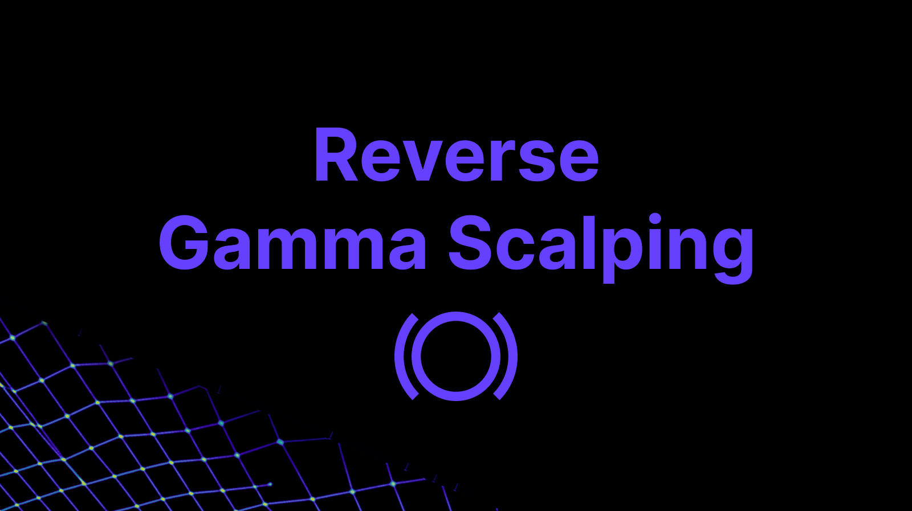
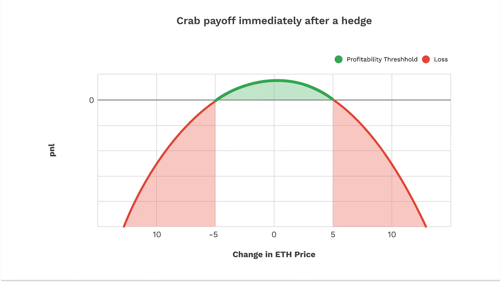

As detailed by a prior Panoptic [analysis](https://panoptic.xyz/research/gamma-scalping), the traditional finance (TradFi) options market maker strategy of gamma scalping entails the buying of [gamma](https://panoptic.xyz/docs/terms/gamma) (typically a long [at-the-money](https://panoptic.xyz/docs/terms/at_the_money)/ATM [straddle](https://panoptic.xyz/research/defi-option-straddle-101)) with continuous [delta-hedging](https://panoptic.xyz/research/options-market-making#what-is-delta) to compensate for [theta](https://panoptic.xyz/docs/terms/theta) (time) decay. Options market makers will harness both gamma and reverse gamma scalping strategies in practice for [Greeks](https://panoptic.xyz/research/understanding-the-greeks-series) management.

Panoptic-native market makers have been highlighted in a separate [article](https://panoptic.xyz/research/options-market-making#market-making-in-panoptic) as being predominantly short gamma. Reverse gamma scalping can hence be deemed a more relevant options market making tactic when considering the internal structure of Panoptic. The focal point of this article will be in detailing how reverse gamma scalping can be executed through the decentralized finance (DeFi) instrument of [perpetual options](https://panoptic.xyz/docs/trading/perpetual-options).

## Reverse Gamma Scalping

Reverse gamma scalping involves the selling of gamma (typically a short ATM straddle) while simultaneously hedging the delta of the position. Delta-hedging is employed to reduce the risks of gamma and realized price volatility.

Reverse gamma scalping involves a keen understanding of two types of volatility:

1.  Realized volatility (RV): A standard deviation-type () measure of historical asset returns for a given lookback period
    
2.  [Implied volatility (IV)](https://panoptic.xyz/docs/terms/implied_volatility): A forward-looking measure that quantifies the market expectation of asset return volatility to transpire during a forthcoming period.
    

Shorting an ATM [straddle](https://panoptic.xyz/research/defi-option-straddle-backtest) is a popular example of a short volatility bet. Selling a straddle is betting that implied volatility will be higher than realized volatility for the underlying asset. Fundamentally, the wager in this case is that prediction overshoots reality.

Long straddles are long volatility and short straddles are short volatility. Gamma scalping is an added layer to the long straddle, while reverse gamma scalping is an added layer to the short straddle. The difference between scalping and straddles is that scalping has the added benefits of gradually locking in profits and dynamically re-hedging.

The following is an example of how the price of the underlying asset can affect the delta of an ATM straddle:

-   Straddle starts in a delta-neutral position
    
-   When the price moves either upward or downward, the position ceases to be delta-neutral
    
-   There is a need to neutralize the delta back to zero by buying or selling the underlying asset
    

The main distinction between hedging in gamma scalping and reverse gamma scalping is that the hedging in gamma scalping attenuates underlying price swings while hedging in reverse gamma scalping exacerbates them.

### Prospective Profitability

While gamma scalping is more profitable during periods of explosive price volatility and moderate price swings, reverse gamma scalping requires a sustained window of muted price volatility to be profitable.

Reverse gamma scalping is ultimately a strategy designed to produce steady, incremental yield by monetizing demand from retail traders who want to hedge with options. Where gamma scalpers thrive amid pressurized market turbulence, reverse gamma scalpers structurally benefit from prolonged market paranoia with little underlying price action actually taking place. The ideal scenario for a reverse gamma scalper would include initial forecasts of catastrophic market conditions, but only minor price fluctuations end up happening.

If RV is significantly lower than IV, theta decay becomes the dominant source of returns for reverse gamma scalpers. An environment of this kind is ideal for reverse gamma scalping. This embedded feature of the strategy is encapsulated by the following equation:

Gamma/Theta Tradeoff: $dV(S,t) = Θ dt - 1/2 Γ dS^2$ ([1](https://www.amazon.com/Volatility-Smile-Wiley-Finance/dp/1118959167))

where $dV$ = change in hedged portfolio value, $S$ = underlying price, $t$ = time increments, $Θ$ = theta, and $Γ$ = gamma.

Equation 1 above outlines the following principles about reverse gamma scalping:

-   Fee collection from theta decay can outweigh losses from continuous rebalancing required to offset gamma risk.
    
-   This is mathematically similar to the premise of another Panoptic [study](https://panoptic.xyz/research/uniswap-options-lp-analysis) concerning viable Uniswap pool characteristics for the revenues of Liquidity Providers (LPs).
    
-   A drawback of reverse gamma scalping is its negative convexity, meaning the strategy takes on losses when the price moves significantly up or down.
    

### Reverse Gamma Scalping Example

The above [image](https://panoptic.xyz/research/options-market-making#delta-hedging-examples) displays how the profit threshold of a short straddle position is fairly narrow when incorporating underlying ETH price movement scenarios. As the initial portfolio delta shifts, there is an underlying rebalancing process needed to maintain delta-neutrality as the price of ETH either rises or falls.

The accompanying figure visualizes the scenario of portfolio delta turning negative as a result of an increase in the ETH price.

  

  

In order to restore delta-neutrality, additional ETH needs to be purchased.

  

Conversely, when the portfolio delta turns positive as a byproduct of decreasing ETH price, shorting ETH is necessary to return to delta-neutrality.

  

The revelation that more ETH needs to be purchased (sold) and more negative (positive) delta absorbed as ETH price rises (falls) to resume portfolio delta-neutrality reveals one of the more intriguing aspects of a reverse gamma scalping strategy. The procedure necessary to insulate an options portfolio from underlying directional moves is through buying into underlying rallies and selling into downturns.

Thus, the periodical delta-hedging counterintuitively accentuates the very underlying movements that a reverse gamma scalper would prefer to minimize. The directional rebalancing attached to reverse gamma scalping thereby amplifies the realized underlying volatility that erodes the overall gains of the strategy.

We will more fully delve into how crypto volatility markets are uniquely rife with an abundance of these “negative gamma traps” in a later Panoptic research piece. Despite this counterproductive feedback loop that amplifies RV, a major incentive for reverse gamma scalping lies in the differential of IV and RV through a long-standing empirical trait known as the Variance Risk Premium (VRP).

### Variance Risk Premium

The VRP is a phenomenon where IV tends to be priced higher than RV. The cause may be from options sellers and market makers demanding a surcharge for the asymmetric downside risk profile they undertake through the sale of de facto insurance contracts.

The formula for the VRP below tends to arrive at a negative value with most inputs.

$VRP_{t,T} = N * [RV_{t,T}^2 - IV_{t,T}^2]$

where $N$ is a notional amount, $RV$ is realized volatility, and $IV$ is implied volatility.

Reverse gamma scalping is effective with a negative VRP since this occurs when IV is greater than RV. The strategy can then be further broken down into the following formula:

Reverse Gamma Scalping P&L = $Vega * (σ_{implied} - σ_{realized})$ ([2](https://www.amazon.com/Positional-Option-Trading-Wiley/dp/1119583519)).

Equation 2 quantitatively shows how gamma scalpers rely on options vega being sufficiently overvalued as a byproduct of the VRP when ATM straddles are sold to end users. The all-encompassing exploitation of the VRP is also present within the prolific DeFi derivatives strategy known as the “[Crab Strategy](https://medium.com/friktion-research/harvest-volatility-yield-with-friktion-volt-03-2ba2c9df028b),” where the short ATM straddle position in conventional reverse gamma scalping is substituted for a short quadratic power perpetual [position](https://medium.com/opyn/squeeth-primer-a-guide-to-understanding-opyns-implementation-of-squeeth-a0f5e8b95684)  as a means to trade volatility, further evidenced by the [graphic](https://medium.com/opyn/automated-squeeth-strategies-crab-v2-is-now-live-8444246610c8) below.

Here are the key points to the Crab Strategy:

-   Its payoff looks strikingly similar to that of the reverse gamma scalping’s short straddle
    
-   [Rebalancing](https://medium.com/opyn/opyns-crab-strategy-v2-now-supports-usdc-deposits-and-withdrawals-f076424d8122) is normally executed amid a fixed time interval auction process
    
-   Its hedging process is significantly more rigid than a manual reverse gamma scalper
    

While differing in execution, the overarching objectives of reverse gamma scalping and the Crab Strategy are largely the same.

## Reverse Gamma Scalping in Uniswap

For demonstrative purposes, we perform a backtest of a reverse gamma scalping strategy on Uniswap:

-   Uniswap pool: ETH/APE 30bps
-   Period: May 19, 2023 to June 19, 2023
-   Return: ~4.2%
-   Premia (collected fees): ~7.6%
    

The backtested strategy’s return, ignoring gas and rebalancing costs, compounds to a staggering annualized return of 63.84%. Our previous gamma scalping [backtest](https://github.com/panoptic-labs/research/blob/main/_research-bites/20240612/gamma-scalping.ipynb) highlighted that gamma scalping produces magnified returns during a concentrated period of elevated realized volatility. Reverse gamma scalping, on the other hand, is a more stable, protracted method to capitalize upon a generally status quo state within volatility markets.

### Panoptic-Native Reverse Gamma Scalping

Specifically regarding the Panoptic protocol, a heightening in accumulated fees stemming from theta decay also translates to increased collection of options [streaming premia](https://panoptic.xyz/research/streamia-101) (streamia). Reverse gamma scalpers can sell [perpetual](https://panoptic.xyz/docs/trading/perpetual-options) straddles on tokens whose price is hypothesized to remain [range bound](https://panoptic.xyz/docs/terms/in_range) as opposed to tokens that have a tendency to fluctuate [out-of-range](https://panoptic.xyz/docs/terms/out_of_range).

Reverse gamma scalpers on Panoptic are still subjected to the risks of negative convexity, since Uniswap liquidity provider (LP) positions inherently have [negative convexity](https://panoptic.xyz/research/defi-put-options-uniswap-backtest). To compensate for this risk, Panoptic incentivizes LPs, option sellers, and reverse gamma scalpers with supplemental earnings from a liquidity [spread](https://panoptic.xyz/research/liquidity-spread). Trading with a wider liquidity spread and removing any [rolling](https://panoptic.xyz/research/perpetual-futures-vs-options#no-expiry) requirements also eliminate any incidence of [pin risk](https://panoptic.xyz/blog/panoptic-defi-options-protocol-introduction#advantage-of-perpetual-options).

By exploring Panoptic’s perpetual option strategies, the parallels between hedging Uniswap LP positions and reverse gamma scalping in traditional options markets come into sharper focus. But questions remain:

-   How do various risks attached to reverse gamma scalping pertain to the [hazards](https://panoptic.xyz/research/demystifying-IL-LVR-JIT-MEV) of Uniswap LP-hedging?
    
-   What can we learn about [loss-versus-rebalancing](https://panoptic.xyz/research/demystifying-IL-LVR-JIT-MEV#2-loss-versus-rebalancing-lvr) (LVR) from reverse gamma scalping?
    

We will explore all this, and more, in upcoming research deep dives.

*Join the growing community of Panoptimists and be the first to hear our latest updates by following us on our [social media platforms](https://links.panoptic.xyz/all). To learn more about Panoptic and all things DeFi options, check out our [docs](https://panoptic.xyz/docs/intro) and head to our [website](https://panoptic.xyz/).*
