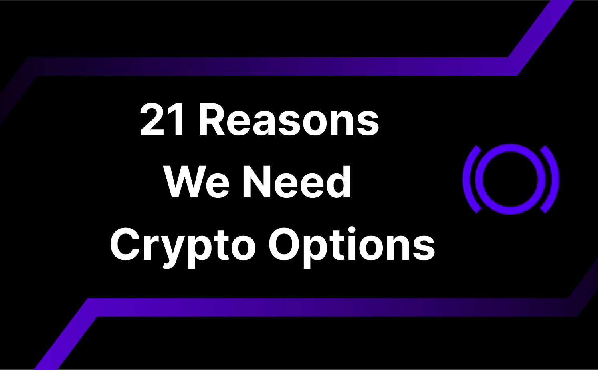

## A Little History
Options trading has a rich history dating back to ancient times, with early records of options contracts found in the commodities markets of ancient Greece. The modern era of options trading began in 1973 with the establishment of the Chicago Board Options Exchange (CBOE), which standardized options contracts and brought them into the mainstream financial markets. This move paved the way for increased transparency, liquidity, and accessibility in the options market. With the advent of online trading platforms in the late 1990s and early 2000s, the accessibility of options trading expanded dramatically. By leveraging the power of the internet, millions of traders worldwide gained access to options markets, further accelerating their growth.

By the late 1990s, options trading had become more accessible and popular due to the advent of online trading platforms and increased financial education. It is estimated that by the early 2000s, the number of options traders had surpassed one million. Therefore, it took approximately 25 to 30 years from the establishment of the CBOE for options trading to gain such widespread adoption and reach a million traders. But, how long will it take to reach one million option traders in the crypto market?

## 21 Ways Where Options Save The Day

### 1. Flexibility in Strategy
Options offer a wide range of strategies to profit in various market conditions, including bull, bear, and sideways markets.

### 2. Leverage
Options provide a way to gain significant exposure to an asset with a relatively small investment, allowing traders to leverage their positions.

### 3. Income Generation
Writing options (selling options) can generate income for traders, particularly through strategies like covered calls or cash-secured puts. It's worth noting that the writer of an option has a higher chance of making money than the option's buyer. From the buyers' standpoint, options are less risky than futures or cash markets as the premium paid represents the maximum loss from purchasing options. Conversely, options writing is riskier as the trader carries unlimited risk.

### 4. Profiting in Any Market
Options enable you to profit regardless of market conditions. Whether the market is bullish, bearish or even static.

### 5. Hedging and Risk Management
Options allow traders and investors to hedge against price volatility and protect their portfolios from adverse market movements. Options trading was first devised as a hedging tool. Say you owned stock in a company, but were worried that its price might fall in the near future. You could buy an option to sell your stock at a price that's close to its current level. Then, if your stock's price falls, you can exercise your option and limit your losses. If your stock's price increases, then you've only lost the cost of buying the option in the first place which is significantly lower than the change in market price.

### 6. Customizable Risk Exposure
Traders can customize their risk exposure by choosing specific strike prices and expiration dates that align with their market outlook and risk tolerance.

### 7. Speculative Opportunities
Options allow traders to speculate on the future direction and volatility of the underlying asset with limited risk, offering opportunities for significant returns. When the market is trending upward, you can gain by acquiring an asset below the current market price using a call option. Conversely, if the market is trending downward, a put option permits you to sell an asset at a price above the market level. While you can short the market by selling the underlying asset directly, this method requires more knowledge and capital. Options offer a way to achieve similar outcomes with less capital exposure.

### 8. Portfolio Diversification
Options provide additional instruments for diversification, enabling investors to manage risk more effectively across different asset classes.

### 9. Predictive Insights
Options trading data can provide insights into market expectations and potential future movements of the underlying assets.

### 10. Risk-Adjusted Returns
Options can improve the risk-adjusted returns of a portfolio by providing strategies that balance potential returns with acceptable levels of risk. In other words, investors can use options as a form of insurance for their portfolios.

### 11. Volatility Trading
Options are a primary tool for trading volatility, allowing traders to profit from changes in market volatility without needing to predict the direction of the underlying asset's price.

### 12. 24/7 Markets
Crypto options provide the flexibility to trade at any time.

### 13. Market Sentiment Analysis
The pricing, trading volume, volatility surface and the expiries of options can serve as indicators of market sentiment, helping traders make more informed decisions even in trading other types of derivatives or instruments.

### 14. Complement to Spot Trading
Options trading complements spot trading by offering additional avenues for profit and risk management, creating a more robust trading strategy.

### 15. Enhancing Price Discovery
The existence of options markets can enhance the overall price discovery mechanism in the crypto market by reflecting market sentiment and expectations.

### 16. Access to Advanced Trading Strategies
Options enable traders to implement complex trading strategies such as spreads, straddles, and strangles, which can optimize risk and reward profiles.

### 17. Enhanced Market Efficiency and Arbitrage Opportunities
Options can help in identifying and exploiting arbitrage opportunities, which can correct mispricings in the market, ensuring fairer pricing of assets. In other words, options contribute to market efficiency by facilitating price corrections.

### 18. Advanced Financial Engineering
Options pave the way for advanced financial engineering techniques, contributing to the development of more sophisticated and resilient financial systems. Panoptic has created an innovative pricing model for on-chain options, resulting in a new approach to option pricing and volatility.

### 19. Smooth Volatility
During periods of high volatility, options can provide mechanisms to smooth out price movements, reducing the impact of sudden market shocks.

### 20. Market Liquidity
The introduction of options can increase overall market liquidity, as it attracts more participants and provides more trading opportunities.

### 21. Market Depth
Options contribute to market depth by adding layers of bids and offers, which helps in maintaining tighter bid-ask spreads. In the case of the crypto market with Panoptic, perpetual options add layers of liquidity which maintain tighter spreads.

## Conclusion
Options play a pivotal role in the crypto market, providing a multitude of benefits that enhance trading strategies, risk management, and market efficiency. From their origins as hedging tools to their current status as versatile financial instruments, options have evolved significantly. As we continue to explore the dynamics of options in the evolving landscape of decentralized finance (DeFi), the innovative models like those developed by Panoptic pave the way for further advancements. These models enhance our understanding and application of option pricing and volatility in on-chain environments, ensuring that options remain a cornerstone of a robust and healthy financial ecosystem.

*Join the growing community of Panoptimists and be the first to hear our latest updates by following us on our [social media platforms](https://links.panoptic.xyz/all). To learn more about Panoptic and all things DeFi options, check out our [docs](https://panoptic.xyz/docs/intro) and head to our [website](https://panoptic.xyz/).*
