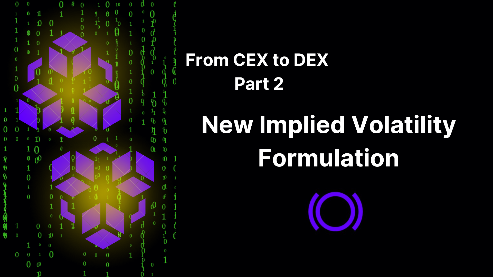
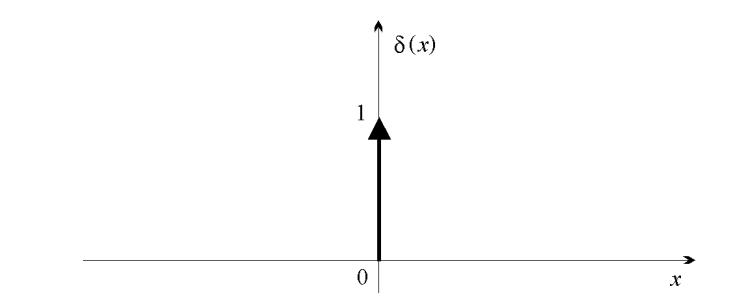
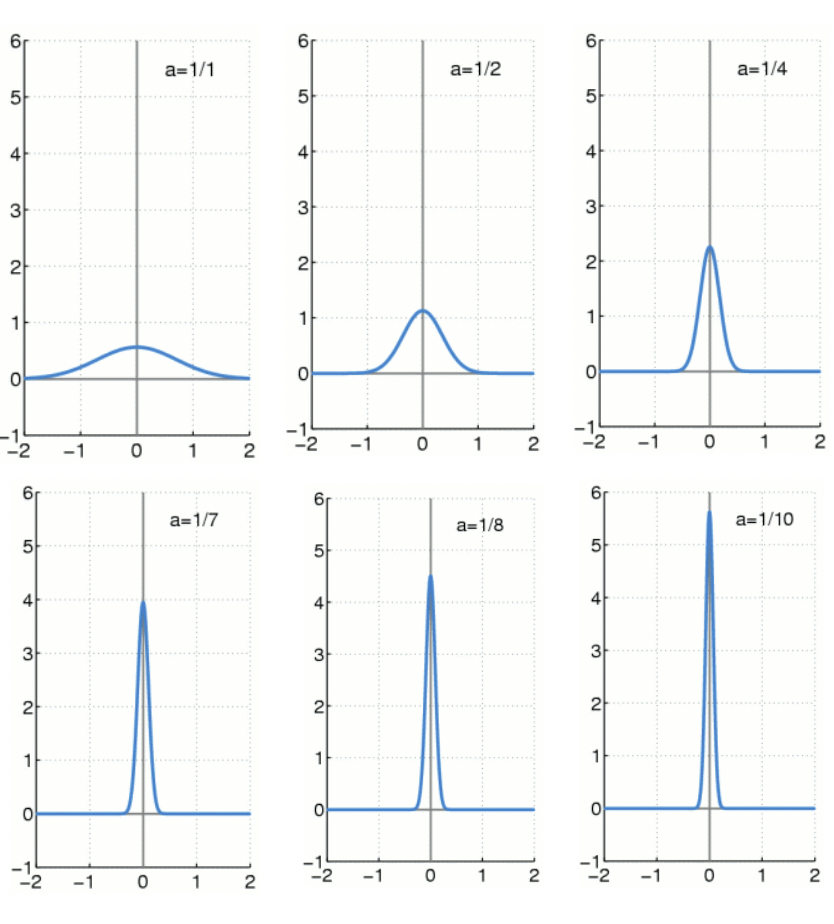
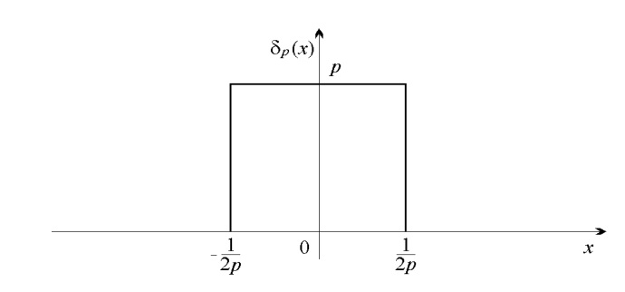
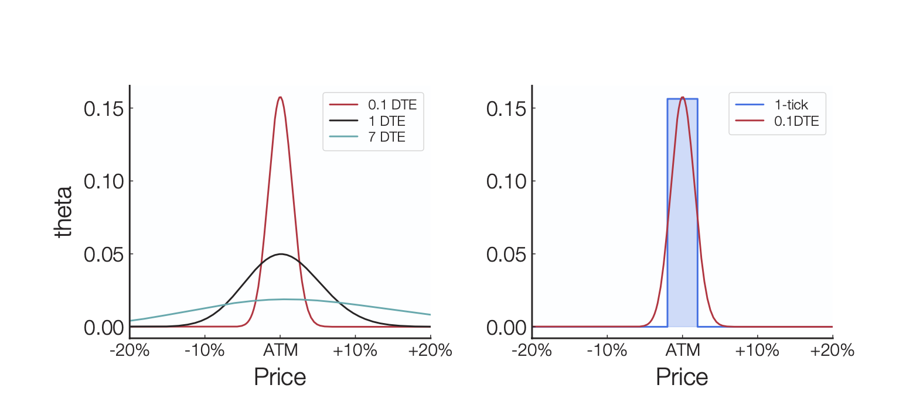

## Computing Implied Volatility from Uniswap
In the evolving landscape of decentralized finance (DeFi), the transition from [centralized to decentralized exchanges (DEX)](/research/from-centralized-to-decentralized-exchanges-options-pricing) presents unique challenges and opportunities, particularly in the computation of implied volatility (IV). This article explores the novel approach to calculating IV by leveraging the observation that liquidity provider (LP) positions in concentrated liquidity automated market makers (CLAMMs) like Uniswap v3 behave similarly to exotic options.

By taking this analogy to its fullest extent, we derive a new formula for IV that aligns with the liquidity provider DeFi (LPDfi) ecosystem. Our research details the step-by-step process of deriving IV from Uniswap's liquidity pools, providing a robust foundation for further comparisons of IV in decentralized versus centralized exchanges.

### Step 1: Uniswap as an Options Clearinghouse

As seen in part 1 of our series "From DEX to CEX," the Panoptic protocol uses a streaming premium model called "streamia" for perpetual options. The premium accumulates continuously from block to block as the underlying asset's price moves relative to the strike price. This premium is based on the collected fees from providing liquidity in a Uniswap v3 pool.

Moreover, in traditional finance, extracting implied volatility involves using order book data, calculating the mid-price, the greek vega, and applying the Newton-Raphson (or bisection) method. However, the decentralized ecosystem does not support these conventional steps due to the absence of bid and ask prices, order books, and vega. What's even more different is the presence of concentrated liquidity in Uniswap v3 that allows liquidity providers (LPs) to allocate their capital more efficiently by providing liquidity within a specific price range $[P_a, P_b]$ rather than across the entire spectrum.

The liquidity provider (LP) ecosystem on Uniswap operates similarly to an options market. The positions taken by LPs, together with the spot trading volume on Uniswap, indicate an anticipated future volatility of the pool's price. In other words, deriving implied volatility in this scenario appears independent of the option price, unlike the traditional approach. However, it will eventually become evident that the option price is connected to elements of the liquidity pool used to calculate the implied volatility.

### Step 2: Collected Fees from Liquidity Provision

In order to calculate the fees collected from a Uniswap LP position, we consider the total liquidity amount deployed at a given tick.

We have the following:

- Total fees accumulated:
  $
  \text{feeRate} \times \text{(volume per day)}
  $

  Where **feeRate** is the percentage fee that spot traders on Uniswap pay when they execute a trade.

- Fraction of those fees that goes to that LP position of size positionSize:
  $
  \frac{\text{positionSize}}{\text{tickLiquidity}}
  $

  Here, the **position size** corresponds to the amount of liquidity a liquidity provider (LP) allocates within a specific price range in the liquidity pool.

- Finally, we get:
  $
  \text{Total fees at a given tick} = \frac{\text{feeRate} \times \text{(volume per day)} \times \text{positionSize}}{\text{tickLiquidity}}
  $

### Step 3: Cumulative Premia Using Theta

The cumulative premia is the integral of theta over the asset's price path $S(t)$:

$
\text{Cumulative Premia} = \int S(t) \theta(S_t, K, \sigma) dt = \int_{+\infty}^{0} \theta(S_{\Delta t}, K, \sigma) \Delta t dS_{\Delta t}
$

Where theta ($\theta$) for an option (assuming a zero interest rate and no dividends) is given by:

$
\theta = -\frac{dV(S_t, t)}{dt} = \frac{S \sigma}{\sqrt{8\pi t}} \exp \left(-\frac{[\ln(\frac{S_t}{K}) + \frac{\sigma^2 t}{2}]^2}{2 \sigma^2 t}\right)
$

Note that $t$ is the time to expiry in traditional finance, whereas we replace it with $\Delta t$ in DeFi, representing the time spent in range by a LP position.

### Step 4: Approximating Theta Using The Dirac Distribution

#### The Dirac Distribution

The Dirac function, denoted by $\delta(x)$, is a "pseudo-function" that has the following characteristics:

$
\delta(x) = \begin{cases}
+\infty & \text{if } x = 0 \\
0 & \text{otherwise}
\end{cases}
$
$
\int_{R} \delta(x) dx = 1
$

The graph of $\delta(x)$ can therefore be represented by the entire x-axis and the positive half of the y-axis. With the "Dirac" $\delta(x)$, we aim to represent an impulse or (infinitely short) point event with finite, non-zero "energy".

**Important Definition/Theorem (See Appendix 3.2):** The Dirac function can also be perceived as the limit, as $a$ tends to 0, of the following centered Gaussian function:

$
\frac{1}{a} e^{-(x/a)^2}
$

Example: One function commonly used to approximate the Dirac delta function is $\delta_p(x) = p \cdot \text{rect}(px)$, where:

$
\text{rect}(px) = \begin{cases}
1 & \text{for } |x| \leq \frac{1}{2p} \\
0 & \text{otherwise}
\end{cases}
$

#### Comparing the Dirac Function to Theta

We aim to approximate the theta function of options by using an approximation of the Dirac function. The Dirac function increasingly resembles the theta function for options as the days to expiration (DTE) approaches 0. The figure below shows the theta of an option as a function of spot price movements for various DTEs: 7 DTE, 1 DTE, and 0.1 DTE.

**Important Remark:** The red curve is the theta of a 0.1 DTE traditional option. As $\Delta t$ being the time to expiry approaches zero, theta sharpens into a narrow peak which seems to converge towards a Dirac delta function, i.e. $\lim_{t \to 0} \theta_t(S) = \delta_p(S)$ where $p \in R$ is to be found.

To understand how this theta can have a limit resembling a Dirac delta function as $t \to 0$, we analyze the components of the two expressions: the theta function and the Dirac delta function:

1. The Dirac delta function, $\delta(x)$, is defined such that:
   $
   \delta(x) = \lim_{\epsilon \to 0} \frac{1}{\epsilon \sqrt{2\pi}} \exp \left( - \frac{x^2}{2\epsilon^2} \right)
   $
2. The given equation for theta is:
   $
   \theta = \frac{S \sigma}{\sqrt{8\pi t}} \exp \left( - \frac{[\ln(\frac{S}{K}) + \frac{\sigma^2 t}{2}]^2}{2 \sigma^2 t} \right)
   $
3. We have $A(t) := \frac{[\ln( \frac{S}{K}) + \sigma^2 t / 2]^2}{2 \sigma^2 t}$
4. Set $x := \ln \left( \frac{S}{K} \right)$ and $\epsilon^2 := \sigma^2 t$. Then,
   $
   \theta \approx_{t \to 0} K \cdot e^{x \sigma^2 / 2 \epsilon \sqrt{2\pi}} \exp \left( - \frac{x^2}{2 \epsilon^2} \right)
   $
5. Setting the limit: As $t \to 0$, the function $\theta$ approximates a Dirac delta function centered at $S_t = K$ as seen in Figure 4:
   $
   \theta \approx_{t \to 0} K \cdot e^{x \sigma^2 / 2} \delta(x)
   $
6. We need to make sure that this resulting limit is a Dirac delta function, in other words, it respects the two conditions of the definition of the Dirac delta function:
   a) At $x = 0$, we have that $e^x \delta(x) = +\infty$ and elsewhere the function equals 0.
   b) To compute the integral of the expression $e^x \delta(x)$ over the entire real line $R$, we utilize the sifting property of the delta function. This property states that for any function $f(x)$ that is continuous at $x = a$,
   $
   \int_{-\infty}^{\infty} f(x) \delta(x - a) dx = f(a)
   $

   Applying this property to the expression $e^x \delta(x)$, where $a = 0$, we have:
   $
   \int_{-\infty}^{\infty} e^x \delta(x) dx = e^0 = 1
   $

**Conclusion:** $K \sigma^2 / 2 e^x \delta(x)$ is a Dirac delta function scaled by $K \sigma^2 / 2$.

7. Now, we'll assume that the theta function converges to a Dirac delta that is similar to a rectangle (as seen in Figure 4). Hence, let's determine the optimal Dirac delta function by finding the best $p \in \mathbb{R}$ in the equation:
   $
   K e^{x \sigma^2 / 2} \delta(x) = p \cdot \text{rect}(px)
   $

**Important consequence:** The area under both functions, the theta function and the Dirac delta function, are approximately equal, and we proceed to the following calculations:

The minimum width of the Dirac delta function is intrinsically tied to the tick spacing of a Uniswap v3 pool.

| Fee Tier | Tick Spacing | Description |
| --- | --- | --- |
| 1 bp | 1 | LP positions can be created with lower and upper prices $P_a$ and $P_b$, respectively, that can be set at any multiple of 1.0001. |
| 5 bps | 10 | LP positions can be created with lower and upper prices $P_a$ and $P_b$ at any multiple of 1.0010. |
| 30 bps | 60 | LP positions can be created with lower and upper prices $P_a$ and $P_b$ at any multiple of 1.0060. |
| 100 bps | 200 | LP positions can be created with lower and upper prices $P_a$ and $P_b$ at any multiple of 1.0200. |

**Table 1:** _Uniswap v3 Pool Tick Spacing and LP Position Ranges_

Our objective is to achieve the narrowest width possible, which equates to the smallest range of an LP position, dictated by the pool's tick spacing. Given $P_a$ and $P_b$ as the lower and upper bounds of our range, respectively, and considering the width $P_b - P_a$, it is helpful to use the following transformation to effectively apply Taylor's expansion:

$K = \sqrt{P_a P_b} \quad \text{and} \quad r = \sqrt{\frac{P_a}{P_b}}$

Where $K$ is the geometric mean of the LP position's price range or alternatively the strike price of the corresponding option and $r$ is the range factor, a measure of width, of the LP position.

This allows us to express the width of an LP position as:

$
P_b - P_a = K \left( r - \frac{1}{r} \right) = K \left( r^2 - 1 \right) = 2K(r - 1) \quad \text{as} \quad r \to 1
$

**Remark:** We take $r \to 1$ to represent an extremely narrow LP position, mimicking an option near expiry. We note, however, that the Uniswap v3 smart contracts limit the minimum width to the pool's tick spacing $t_S$.

Given that $P_a = 1.0001^{t_a}$ where $t_a$ is the tick for the upper price, we can further simplify the expression:

$
2K(r - 1) = 2K \left( \left( 1 + \frac{1}{10000} \right)^{(t_b - t_a)/2} - 1 \right) \approx 2K \left( 1 + \frac{t_b - t_a}{2 \cdot 10000} - 1 \right) = \frac{Kt_S}{10000}
$

Here, $t_S = t_b - t_a$ represents the difference between the ticks for the upper and lower prices. This transformation provides a more useful formulation for our width.

With this newly formulated expression for the width of an extremely narrow LP position, we can find the approximating Dirac function to approximate theta and the cumulative premium of a corresponding option.

- The area under the theta function is approximately $\frac{K^2 \sigma^2}{2}$ (see Appendix below 3.1).
- The width of the theta function is $\frac{K \cdot t_S}{10000}$.
- The height of the theta function is: $\frac{area}{width} \approx \frac{K \sigma^2 \cdot 10000}{2 t_S}
$

Therefore, $p = \frac{K \sigma^2 \cdot 10000}{2 t_S}$.

Theta is approximated as the height of the approximating Dirac delta function multiplied by the time spent in range. Thus, the cumulative premia is:

$
\frac{K \sigma^2 \cdot 10000}{2 t_S} \times \Delta t
$

### Step 5: Derive the Implied Volatility (IV)

Equating Premia with Fees: We assert that the accumulated streaming premia (theoretical) of an option is equal to that of the fees collected from liquidity provision (actual). This aligns with our observation that LP positions behave similarly to options, and hence, their premia received is simply the fees collected by the position. By equating premia with collected fees we have:

$
\text{Premia} = \int S(t) \theta(S_t, K, \sigma) dt = \text{Total Fees at a Given Tick over Time} = \text{Collected Fees}
$

We substitute and obtain:

$
\frac{K \sigma^2}{2 t_S} \times 10000 \times \Delta t = \frac{\text{feeRate} \times \text{Volume} \times \text{positionSize} \times \Delta t}{\text{tickLiquidity}}
$

**Assumptions**:

- The relationship between the tick spacing and the fee rate is as follows: $t_S = \text{feeRate} \times 20000$
   In fact, tick spacings are 200 for 1% fee rate, 60 for 0.3%, 10 for 0.05% as seen in Table 1.
- The premia is calculated for one options contract, which corresponds to a position size of $S$ in terms of the quote asset.
- The LP position is centered around the current spot price, so the spot price $S$ is equal to its strike price $K$.

With the above assumptions, this simplifies further:

$
\frac{K \sigma^2}{2 \times \text{feeRate} \times 20000} \times 10000 \times \Delta t = \frac{\text{feeRate} \times \text{Volume} \times K \times \Delta t}{\text{tickLiquidity}}
$

Finally, we solve for $\sigma$, the implied volatility:

$
\sigma_{\text{IV}} = 2 \times \text{feeRate} \times \sqrt{\frac{\text{Volume}}{\text{tickLiquidity}}}
$

## Conclusion

The observation that liquidity provider (LP) positions in concentrated liquidity automated market makers (CLAMMs) like Uniswap v3 behave similarly to exotic options can be taken to its fullest extent by deriving a new formula for the implied volatility (IV) of these options.

We seek to identify a robust and practical formulation for the IV of LP positions in Uniswap v3, and in the upcoming research of our series, we will delve into further derivations and technical comparisons of IV in DEXs vs. CEXs.

---

## Appendix

### Proof: Area Under the Theta Function

We need to integrate $\theta$ with respect to $S$ from 0 to $+\infty$, using the change of variable $u = \ln(S/K)$:

$
S = K e^u \quad \text{and} \quad dS = K e^u du
$

The integral becomes:

$
\int_{0}^{+\infty} \theta \, dS = \int_{-\infty}^{+\infty} \frac{K e^u \sigma}{\sqrt{8\pi \Delta t}} \exp \left( -\frac{\left[u + \frac{\sigma^2 \Delta t}{2}\right]^2}{2 \sigma^2 \Delta t} \right) K e^u \, du
$

Simplifying to:

$
\int_{-\infty}^{+\infty} \frac{K^2 e^{2u} \sigma}{\sqrt{8\pi \Delta t}} \exp \left( -\frac{\left[u + \frac{\sigma^2 \Delta t}{2}\right]^2}{2 \sigma^2 \Delta t} \right) \, du
$

Which with $\mu := \frac{3\sigma^2 t}{2}$ gives us:

$
\frac{K^2 \sigma}{\sqrt{8\pi \Delta t}} \int_{-\infty}^{+\infty} \exp \left( - \frac{[u - \mu]^2}{2\sigma^2 \Delta t} \right) \exp \left( \frac{[\mu^2 - \sigma^4 \Delta t^2/4]}{2\sigma^2 \Delta t} \right) \, du
$

Using the properties of Gaussian integrals, the integral evaluates to:

$
\frac{K^2 \sigma^2}{2} \exp(\sigma \Delta t) \sim_{\Delta t \to 0} \frac{K^2 \sigma^2}{2}
$

This means that the area under the theta function in relation to the spot is $\frac{K^2 \sigma^2}{2}$.

### Gaussian Approximation of the Dirac Delta Function

Distributions like Dirac's $\delta$ are defined as continuous linear functions over the set of compactly supported, infinitely differentiable functions, $C^\infty_c(\mathbb{R})$. Limits are defined in a weak sense.

Therefore, take $\phi \in C^\infty_c(\mathbb{R})$. Then,

$
I_\epsilon := \left\langle \frac{1}{\epsilon \sqrt{2\pi}} e^{- \frac{x^2}{2 \epsilon^2}}, \phi(x) \right\rangle = \frac{1}{\epsilon \sqrt{2\pi}} \int_{-\infty}^{+\infty} e^{- \frac{x^2}{2 \epsilon^2}} \phi(x) dx = \left\{ y = \frac{x}{\epsilon} \right\} = \frac{1}{\epsilon \sqrt{2\pi}} \int_{-\infty}^{+\infty} e^{- \frac{y^2}{2}} \phi(\epsilon y) \epsilon \, dy
$

Now, by the dominated convergence theorem, where we take $e^{- \frac{y^2}{2}} \max \phi$ as the dominating function, we can take limits inside the integral:

$
I_\epsilon \rightarrow \frac{1}{\sqrt{2\pi}} \int_{-\infty}^{+\infty} e^{- \frac{y^2}{2}} \phi(0) \, dy = \frac{1}{\sqrt{2\pi}} \int_{-\infty}^{+\infty} e^{- \frac{y^2}{2}} \, dy \cdot \phi(0)
$

This shows:

$
\lim_{\epsilon \to 0} \frac{1}{\epsilon \sqrt{2\pi}} e^{- \frac{x^2}{2 \epsilon^2}} = \delta(x)
$

*Join the growing community of Panoptimists and be the first to hear our latest updates by following us on our [social media platforms](https://links.panoptic.xyz/all). To learn more about Panoptic and all things DeFi options, check out our [docs](https://panoptic.xyz/docs/intro) and head to our [website](https://panoptic.xyz/).*