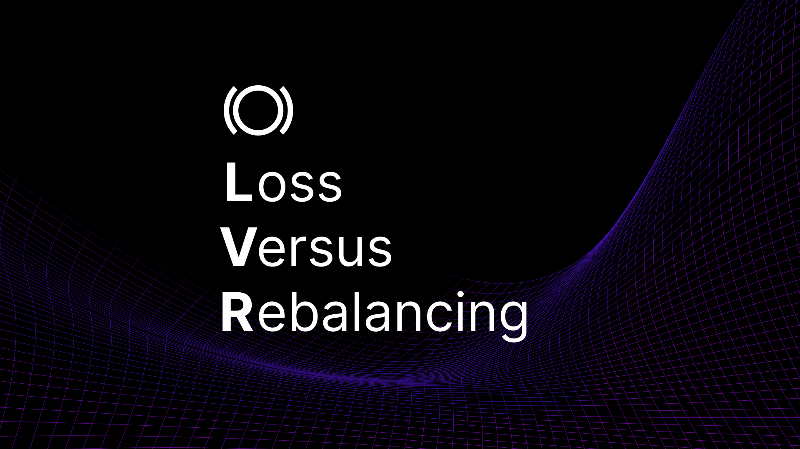
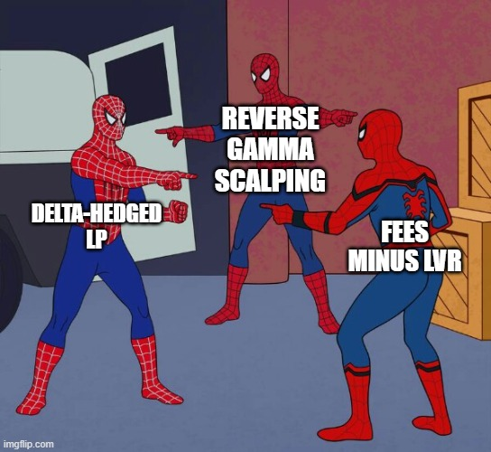
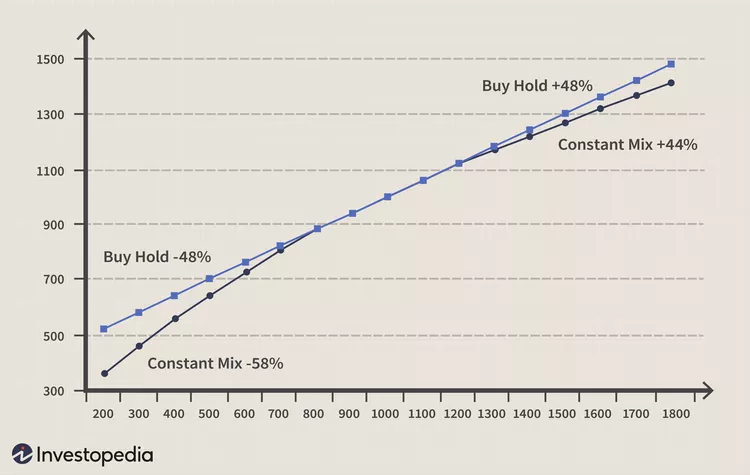
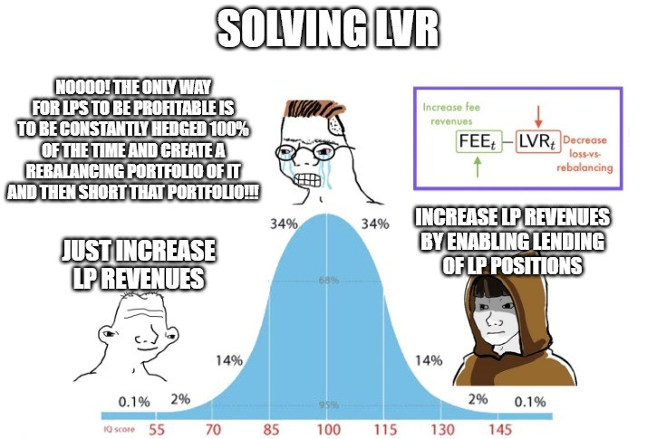
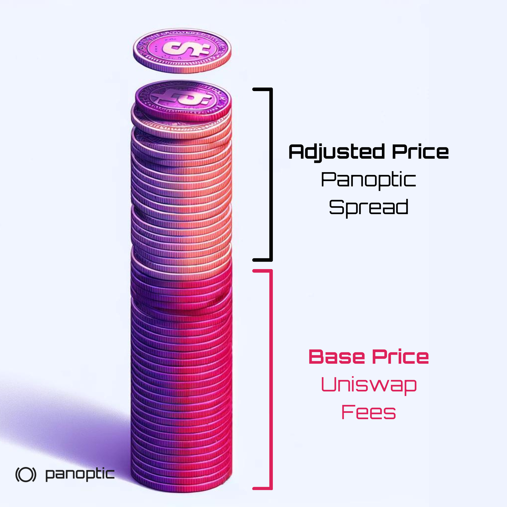
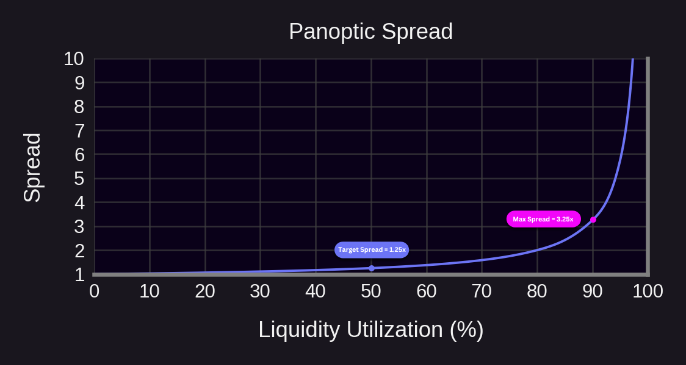
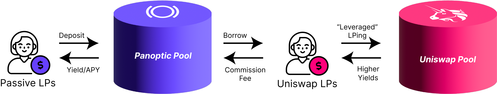
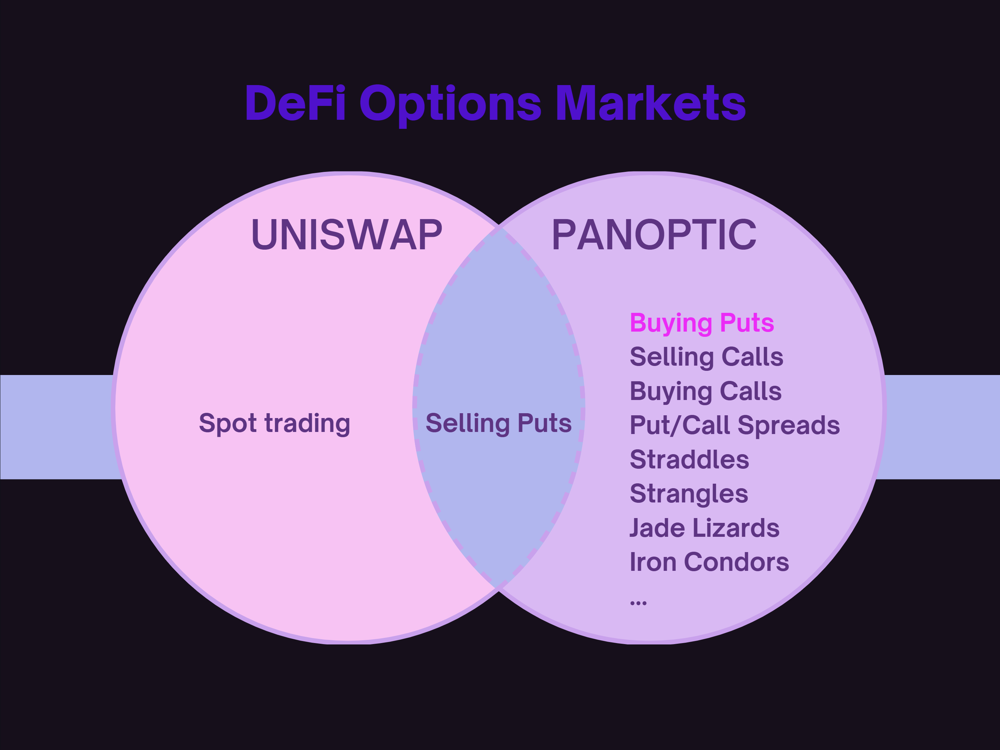
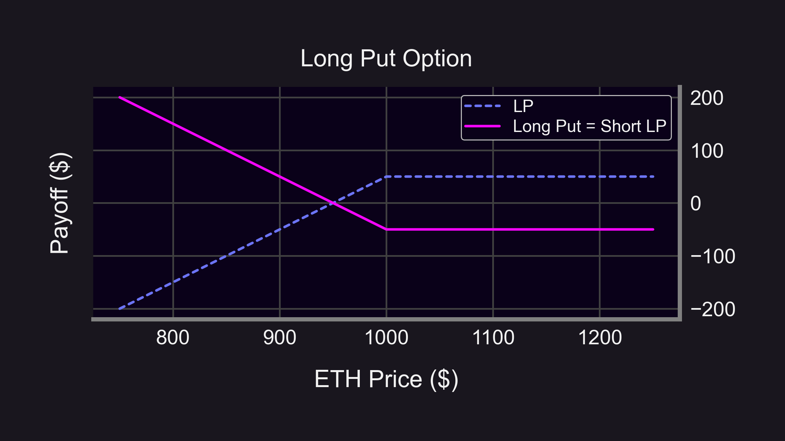

Traditionally, the performance of Uniswap liquidity providers (LPs) has been primarily measured using [impermanent loss](/research/demystifying-IL-LVR-JIT-MEV#1-impermanent-loss-il) (IL), a metric that quantifies the difference in value between holding assets in a liquidity pool versus holding them in a wallet. However, [loss-versus-rebalancing](https://anthonyleezhang.github.io/pdfs/lvr.pdf) (LVR) has been proposed as a more nuanced and comprehensive approach to evaluating LP performance.

## What is LVR?

LVR is the difference between the P&L (profit and loss) of an LP position, excluding earned fees, and a [constant-mix rebalancing portfolio](https://investresolve.com/inc/uploads/pdf/maximizing-the-rebalancing-premium.pdf).

-   **Loss**: The P&L, excluding _earned_ fees, of a Uniswap LP resulting from price movement.
-   **Versus**: The P&L of a Uniswap LP position is compared to that of a rebalancing portfolio.
-   **Rebalancing**: The P&L, excluding _paid_ fees, of a constant-mix (fixed-weight) rebalancing portfolio which “buys low and sells high” to hedge. For example, if the price of ETH goes up, the rebalancing portfolio sells ETH at the higher market price. If the price of ETH goes down, the rebalancing portfolio buys ETH at the lower market price.
  

Note that LVR has some aggressive [assumptions](https://members.delphidigital.io/learn/loss-versus-rebalancing-lvr), including:

-   Ignores fees earned by Uniswap LPs
-   Ignores fees paid by the rebalancing portfolio
-   Assumes an infinitely deep, centralized exchange (CEX) market for the underlying tokens, which is not realistic for many longtail assets on Uniswap.
    

When you account for the fees earned, LVR becomes intimately connected to a delta-hedged LP strategy. The delta-hedged LP strategy, in turn, is equivalent to an options strategy called [reverse gamma scalping](/research/reverse-gamma-scalping).

$\text{delta-hedged LP P\&L}_t = \text{FEE}_t - \text{LVR}_t$

The variable $\text{FEE}_t$ in the above formula denotes cumulative trading fees collected by an LP, but this variable also essentially constitutes the fees paid in the form of [theta decay](/docs/terms/theta). $\text{LVR}_t$ can be viewed as a representation of [gamma risk](/docs/terms/gamma) in this context, as it reflects the realized volatility risk of an LP position.

LVR can also be thought of in terms of volatility. The formula for instantaneous LVR can be expressed as $\frac{\sigma^2}{8}$, where $\sigma^2$ is the variance, or volatility squared, of the underlying token. Contrast this with the [volatility tax](https://en.wikipedia.org/wiki/Volatility_tax#Overview) that pertains to returns for all assets which is formulated to be $\frac{\sigma^2}{2}$. Hence, LVR can be interpreted as increasing the traditional volatility tax for LPs by 25%. Uniswap LPs are intrinsically short [convexity](https://arxiv.org/pdf/2106.14404) (realized variance), so they accordingly have a heightened volatility tax to combat.

Although Uniswap LPs and rebalancing portfolios are both short convexity, a delta-hedged LP position mirrors reverse gamma scalping (buy high, sell low), while the rebalancing portfolio mirrors [gamma scalping](/research/gamma-scalping) (buy low, sell high). The rebalancing portfolio is consequently able to [harvest](https://cryptoeconomicsystems.pubpub.org/pub/evans-g3m-returns/release/4) returns from mean-reverting volatility with the disparity in returns between the hedged LP and rebalancing portfolio causing LVR to arise. This lack of flexibility is why Uniswap LPs face a hiked volatility tax in the form of LVR.

  

## Proposed Solutions to LVR

One common perspective defines LVR through the lens of high-frequency trading (HFT) arbitrage. In centralized finance (CeFi), HFTs exploit faster trading speeds to gain early access to price movements, allowing them to pick off and front-run market makers by taking advantage of slower price updates. The overall impact of this HFT activity is captured by a metric known as the [latency arbitrage tax](https://ericbudish.org/wp-content/uploads/2022/02/Quantifying-the-High-Frequency-Trading-Arms-Race.pdf) — the total profits from latency arbitrage divided by the total trading volume.

From this viewpoint, LVR can be seen as a heightened form of the latency arbitrage tax. LPs bear the cost as traders arbitrage price differences between centralized exchanges (CEXs) and decentralized exchanges (DEXs), where DEXs often have less timely price feeds. As a result, LPs are vulnerable to adverse selection by HFTs operating between CEXs and DEXs.

In CeFi, this latency arbitrage tax can be reduced using [speed bumps](https://www.amazon.com/Trading-Speed-Light-Algorithms-Transforming/dp/0691211388). These technological measures favor market makers by delaying the execution of liquidity takers like HFTs, thus limiting their informational advantage.

In decentralized finance (DeFi), teams like Arrakis Finance and Sorella Labs have introduced their own versions of speed bumps, such as request for quotes (RFQs), auctions, and dynamic pool fees, to tackle LVR or what they view as an inflated latency arbitrage tax within automated market makers (AMMs).

# The Panoptic Solution to LVR

*What if LPing is more like [selling options](https://lambert-guillaume.medium.com/pricing-uniswap-v3-lp-positions-towards-a-new-options-paradigm-dce3e3b50125) than market-making?* This shift in perspective changes everything. Option traders don’t worry about arbitrage on the underlying asset price—so why should LPs? At Panoptic, we take the same approach, focusing on maximizing LP returns through options.

There are two paths to tackle LVR: decrease LVR or increase the fees earned by Uniswap LPs. We’ve chosen the latter. By boosting LP fees, we provide a more effective solution to offset LVR without complicated interventions.

  

Rather than attempting to reduce LVR through speed bumps, Panoptic focuses on boosting LP returns to help LPs offset the effects of LVR. How do we achieve this?

1.  Uniswap LPs can earn more by lending out LP tokens to option buyers on Panoptic.
2.  Uniswap LPs can alternatively take a more passive role on Panoptic, eliminating LVR.    
3.  Uniswap LP positions can also be shorted on Panoptic, effectively flipping LVR on its head.
    

### Solution 1: Increased Revenue to Uniswap LPs

Currently, no lending market exists for Uniswap v3 LP tokens. Panoptic changes this by creating the first-ever lending market for these tokens, unlocking new revenue opportunities for LPs.

In Panoptic, Uniswap LPs earn, as a baseline, the same fees they would earn on Uniswap. However, they earn [additional revenue](/docs/product/spread) if there is even a single lender on Panoptic. For instance, if a Uniswap LP earns $100 in fees on Uniswap, they would earn that $100 plus an additional amount on Panoptic. This additional revenue comes from option buyers borrowing LP tokens through Panoptic.

The extra earnings for LPs on Panoptic are determined by a [spread](https://www.desmos.com/calculator/mdeqob2m04) that increases as more borrowers participate.

Annualized LVR is [estimated](https://atise.medium.com/liquidity-provider-strategies-for-uniswap-v3-loss-versus-rebalancing-lvr-ee0ffdf1f937) to be 12% of liquidity provider funds when assuming a daily volatility of 5%. On Panoptic, LPs can increase their revenue by 12.5% with a borrow utilization rate of just 50%. In other words, when half of an LP's tokens are borrowed, the additional revenue more than compensates for the average LVR.

### Solution 2: LPs Can Be Passive on Panoptic

On Panoptic, LPs can take a [passive role](/blog/passive-liquidity-pools) and eliminate impermanent loss and LVR.

Panoptic introduces an innovative lending market specifically for Uniswap LPs, allowing them to create leveraged positions. For example, a Uniswap LP can borrow 5 ETH while only putting up 1 ETH as collateral, creating a 5x leveraged position in Uniswap v3. In return, the Uniswap LP pays a borrowing fee to passive LPs, who earn without needing to actively manage any positions.

Think of passive LPs on Panoptic like lenders on a platform such as Aave, but instead of lending to anyone, they’re lending directly to Uniswap LPs. This creates a decentralized and streamlined way for token projects to fund their Uniswap v3 pools, eliminating the need for centralized deals.

Additionally, passive LPs benefit from automatically compounded returns in Uniswap v3, similar to LPs in Uniswap v2. The presence of options buyers further boosts returns for passive LPs, as these traders also pay a borrowing fee.

While active Uniswap LPs suffer LVR, passive LPs do not. Since passive LPs keep 100% exposure to the tokens they deposit in Panoptic, their portfolio behaves similar to a HODL strategy (that also earns fees). Having a fundamentally different payoff, one that is linear rather than convex, passive LPs need not worry about LVR. In fact, passive LPs may even outperform rebalancing portfolios when the price moves in a trending fashion.

### Solution 3: Users can Short Uniswap LP Positions

Uniswap is a 'long-only' market, meaning LP positions can only be deployed, not shorted. Like other long-only markets, the absence of a shorting mechanism creates inefficient price discovery. Panoptic introduces the first two-sided market for Uniswap v3, where LP positions can be either 'longed' or 'shorted'.

If LVR is high, then instead of creating an LP position, users can short LP tokens on Panoptic. This would flip LVR on its head, so that the user going short an LP token is now exploiting LVR. The inverse of Loss-Versus-Rebalancing (LVR) is called “Gains-Versus-Rebalancing” (GVR). Shorting LP positions eliminates LVR and replaces it with GVR. While LP positions suffer during periods of high volatility, short LP positions thrive on large price swings.

Historically, Uniswap LPs have been at a disadvantage due to the rigid nature of their inherent short-volatility exposure, which gave rise to the opportunity cost of LVR. Panoptic changes this dynamic, enabling LPs to benefit from significant volatility in Uniswap’s liquidity pools, transforming a previous limitation into a strategic advantage.

Viewing LPing through the lens of options selling, shorting LP positions can be compared to options buying. A short LP position, akin to a bought option, benefits from high volatility and inverts the problem of LVR. A prior gamma scalping [backtest](/research/gamma-scalping#gamma-scalping-in-uniswap) revealed a substantial 11.9% return during an extremely volatile 24-hour period. While Uniswap LPs face magnified losses during periods of volatility, Panoptic mitigates this by enabling options buyers to capture significant profits.
  

Another DeFi instrument that similarly mitigates IL and LVR is Squeeth, the quadratic power perpetual. Like Panoptic, [Squeeth](https://medium.com/opyn/hedging-uniswap-v3-with-squeeth-bcaf1750ea11) provides a mechanism for profiting from market volatility. While Squeeth achieves this through a quadratic exposure to price movements, Panoptic allows users to exploit volatility by shorting LP positions directly. Both instruments aim to address inefficiencies present in the long-only Uniswap LP market.

# Conclusion

Panoptic revolutionizes the way LPs navigate Uniswap by addressing the problem of LVR. Unlike traditional models that aim to mitigate LVR through complex changes like speed bumps, Panoptic takes a bold and innovative approach: maximize LP returns through lending markets, passive liquidity provision, and introducing the first-ever ability to short LP tokens. This two-sided LP market allows traders to profit from volatility, transforming LVR from a burden into an opportunity.

*Join the growing community of Panoptimists and be the first to hear our latest updates by following us on our [social media platforms](https://links.panoptic.xyz/all). To learn more about Panoptic and all things DeFi options, check out our [docs](https://panoptic.xyz/docs/intro) and head to our [website](https://panoptic.xyz/).*
