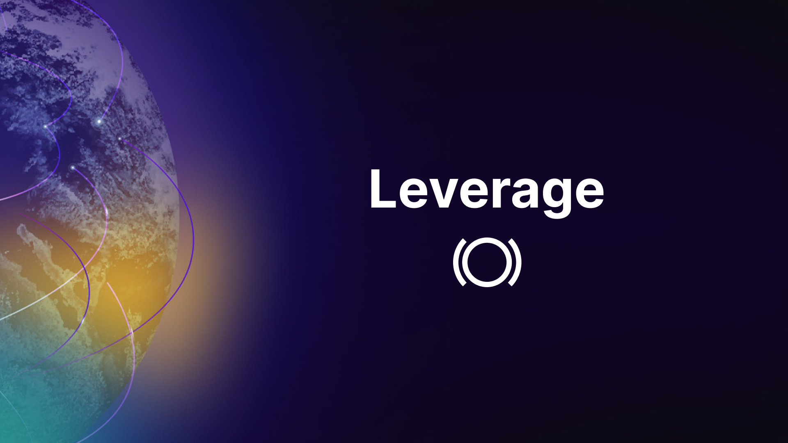
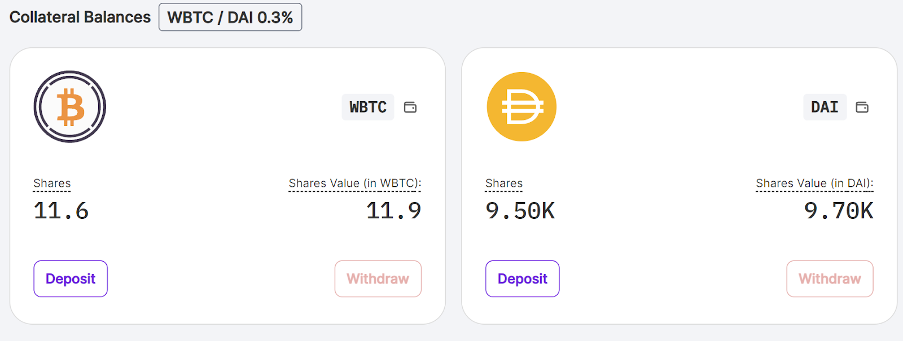
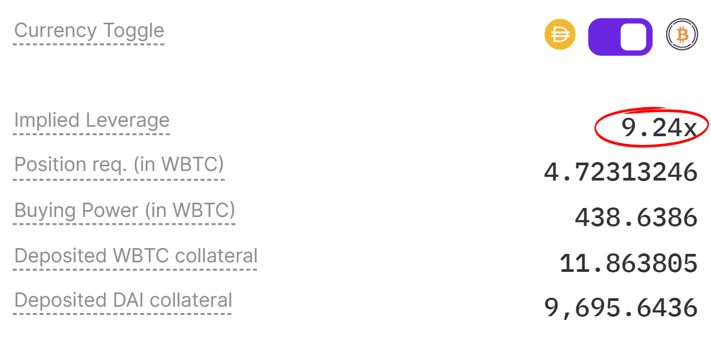

## Introduction

Leverage is a powerful tool in trading, offering the potential to magnify gains. In this article, we'll explore how leverage works in the context of Panoptic, helping traders maximize their capital efficiency while managing risks. We'll break down complex concepts into simple terms, making it easy for anyone to understand and apply these strategies.

### Questions We'll Answer

-   What is leverage?
    
-   How does collateral influence leverage?
    
-   How does leverage work in Panoptic?
    
-   How much leverage can I get in Panoptic?
    
-   How can advanced trading strategies offer higher leverage?
    

# Leverage 101: Understanding the Basics

Leverage is an investment strategy where traders control more value with less capital. It's like using a lever to lift a heavy object - a little effort moves much more weight. In trading, it’s borrowing money to amplify potential returns. However, it's important to remember that while leverage can magnify gains, it also increases [risks](https://panoptic.xyz/docs/panoptic-protocol/risks#margin-call-and-liquidation-risk).

## Leverage in Options

Panoptic integrates leverage into its trading platform, allowing traders to access more value than the collateral they deposit. Through options trading, you can gain exposure to ETH with significantly less capital upfront compared to direct purchasing (spot buying).

  

-   Spot Buying: To own 1 ETH in a traditional spot market, it would cost the full price of $2000, which is equivalent to 1x leverage.
    
-   Option Buying: In contrast, buying a call option for 1 ETH on Panoptic requires just $200 as collateral. This is effectively 10x leverage.
    

  

This comparison illustrates that with only 10% of the spot price as collateral, traders can achieve equivalent exposure to the underlying asset. It's a prime example of how leverage amplifies opportunities in options trading, allowing for substantial market participation with less capital.

# Collateral Requirements Determine Leverage

Collateral serves as a security guarantee for your trading positions. When you deposit assets, like 1 ETH, into the Panoptic pool, this acts as collateral and forms the foundation of any trading positions you open. It's a pledge that ensures you can cover a part of your trading commitments.

  

  

As a foundational step, new users on Panoptic must deposit collateral to begin trading options. These funds are channeled into a Panoptic Pool, bolstering liquidity for a diverse array of options traders within the platform. This is where leverage truly comes into play: by depositing, say, 1 ETH as collateral, a trader is empowered to buy options controlling approximately 10 ETH in value – that's a leverage of 10x.

  

  

When initiating a new position, Panoptic provides a clear view of their "implied leverage" – essentially, the ratio of the option's value they control compared to the required collateral.

  

## How Much Leverage Can I Get in Panoptic?

Typically, option traders can expect up to 10x leverage when buying and 5x leverage when selling. However, the exact [collateral requirements](https://panoptic.xyz/research/buying-power-collateral-leverage) in Panoptic vary based on market conditions such as the amount of available liquidity.

## Leverage Powered by Liquidity Providers

In Panoptic, [Liquidity Providers](https://panoptic.xyz/docs/panoptic-protocol/protocol-roles#panoptic-liquidity-providers-plps) (PLPs) play a crucial role, akin to liquidity providers in Automated Market Makers (AMMs). PLPs contribute funds to the PanopticPool, earning commissions from option trades. earning commission fees from option trades. This system fosters robust liquidity, reducing risk and enhancing the trading experience for all platform participants

  

To illustrate leverage within Panoptic's ecosystem, consider this example:

-   Pool Deposits: A Panoptic pool currently holds $1.9 million.
    
-   Trader Deposits: A trader adds $100k in collateral, elevating the pool's total to $2 million.
    
-   Leverage in Action: With the $100k collateral, the trader is able to control a $1 million long call option position.
    
-   Calculating Leverage: This setup translates to 10x leverage, derived from a $1 million position backed by $100k collateral (1,000,000 / 100,000).
    

## Advanced Strategies: Higher Leverage on Less Risky Positions

For seasoned traders, advanced strategies like [straddles, strangles, and spreads](https://panoptic.xyz/research/essential-options-strategies-to-know) offer opportunities to harness higher leverage with comparatively lower risk. Panoptic’s innovative system is designed for high capital efficiency in these scenarios, requiring collateral for just one part of a [multi-legged strategy](https://panoptic.xyz/research/panoptic-option-legs).

  

Let's delve into how this works on Panoptic:

-   Efficiency in Defined-Risk Strategies: In certain strategies involving multiple legs, such as straddles or strangles, Panoptic's system is uniquely efficient. Traders only need to meet the collateral requirement for one of the legs, essentially doubling their market exposure for the same collateral amount.
    
-   Example with ETH: Imagine ETH is currently trading at $2,000. A trader looking to sell a put option would need to provide $400 as collateral, equating to 5x leverage. However, if the same trader decides to execute a straddle by selling both a call and a put, the total collateral requirement remains at $400. This approach effectively leverages the position to 10x.
    

# Key Terms Explained

-   Leverage: Using borrowed capital to increase potential returns.
    
-   Collateral: Assets pledged as security for a position.
    
-   PLPs: Participants who provide liquidity to a trading pool.
    

# Conclusion

Understanding leverage is crucial in financial trading, especially in options. Panoptic's innovative platform allows traders to employ leverage effectively, maximizing their capital efficiency.

*Join the growing community of Panoptimists and be the first to hear our latest updates by following us on our [social media platforms](https://links.panoptic.xyz/all). To learn more about Panoptic and all things DeFi options, check out our [docs](https://panoptic.xyz/docs/intro) and head to our [website](https://panoptic.xyz/).*
