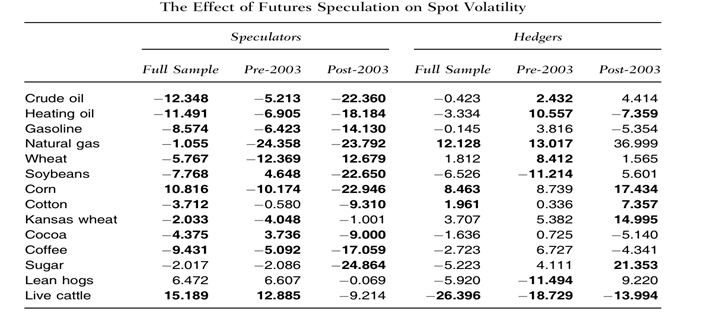

 

>“Derivatives contribute to price discovery because they allow traders to better align their strategies with the sign and magnitude of their information. The leverage in derivative securities, combined with this alignment, creates additional incentives to generate private information. In this way, trades in derivative markets may provide more refined and precise signals of the underlying asset’s value than trades of the asset itself.”

  

The above [passage](https://eso.scripts.mit.edu/docs/The-option-to-stock-volume.pdf) is a good summary of how Panoptic contributes to and refines the underlying Uniswap ecosystem. There is long-standing paranoia that derivatives market speculation destabilizes underlying spot markets. But in actuality, speculation healthily promotes overall market efficiency in most cases. In this article, we make the case that a derivatives market is essential to having a healthy spot market. We hope to allay any potential fears surrounding derivatives trading growth on underlying token markets.

  

## The Doom Loop

Crypto spot markets are uniquely susceptible to inherent downside risks arising from the “Uniswap Price Doom Loop.” Uniswap liquidity providers (LPs) often apply selling pressure when redepositing liquidity due to [rebalancing](https://x.com/guil_lambert/status/1849479327894708349) requirements when token prices migrate out of range.

  

In Uniswap, LPs must hold both tokens in a pool. If one token’s price drops, LPs may fall out of range and need to adjust their holdings to re-enter. For example, in an ETH/USDC pool, if ETH’s price drops below the LP’s range, their position will shift to be entirely in ETH. To rebalance, they must sell some ETH for USDC and redeploy around the new price, creating a continuous downward spiral on the price of ETH.

  

This spiral is on full display in the above snapshot where the spot price of ETH in the Uniswap ETH/USDC 30bps pool slides downward to $2400, out of the LP’s range of $2800 to $3500. The LP would be compelled to sell off half of its sizable $36M liquidity in ETH to iteratively lock in a 50:50 ratio, where it can be assumed due to the considerable value of the deployed liquidity that a significant market impact will be realized upon the sell-off of some of the position.

  
  
  

If LPs delta hedge their position, the doom loop is exacerbated. LP positions resemble short [perpetual put options](https://panoptic.xyz/blog/uniswap-lp-equals-options#lps-are-options-sellers). As both LP tokens and short perpetual put options have [negative convexity](https://panoptic.xyz/research/reverse-gamma-scalping#panoptic-native-reverse-gamma-scalping), the hedging of both positions would entail a self-perpetuating feedback loop where LPs and traders sell into downturns. Hence, LP-hedging would apply selling pressure to token prices.

  

The below visualization provides a graphical parallel to how hedging an LP position would be conducted with the hedge line in the chart being downward-sloping, meaning that as token prices become further depressed, LPs are forced to sell more tokens to maintain a hedge.

A similar price doom loop occurred in the [crude oil market](https://www.hsgac.senate.gov/wp-content/uploads/imo/media/doc/STMTVERLEGERPhilip0.pdf) from August 2006 to January 2007 when the WTI oil spot price dropped over 20%, largely attributable to crude oil options market makers shorting futures to hedge the crude oil put options they had previously sold. The key differentiator between the Uniswap and crude oil doom loops is that crude oil markets in this case were going through a transient price cycle. Yet, in Uniswap, this same process is an everyday recurrence for LPs.

  

What recourse do LPs and other Uniswap market participants have to compensate for this downward price asymmetry? The development of adjoining derivatives markets is the only viable outlet for such an issue. We will explain how derivatives markets (1) reduce spot volatility, (2) fundamentally complete spot markets, and (3) do not directly cause underlying prices to drop.

## Derivatives Dampen Volatility

  

>_Myth: Derivative market speculation increases volatility in underlying markets._
>
>_Reality: Derivative market speculation actually decreases volatility in the spot markets!_

The [figure](https://www.cornerstone.com/wp-content/uploads/2022/01/CME-Ether-Futures.pdf) above tracks the ETH price before and after the introduction of ETH CME futures in February 2021. ETH spot prices more than doubled in the subsequent months and price differences across exchanges [tightened](https://papers.ssrn.com/sol3/papers.cfm?abstract_id=3648406), resulting in more consistent and fair pricing across exchanges. The same [study](https://papers.ssrn.com/sol3/papers.cfm?abstract_id=3648406) that scrutinized ETH prices also found that BTC prices across exchanges tightened after the introduction of BTC futures, occurring in tandem with reduced volatility and improved spot pricing efficiency, market quality, and liquidity.

  
  

The [table](https://onlinelibrary.wiley.com/doi/abs/10.1002/fut.21716) shows data from October 1992 to July 2012, examining how futures (the TradFi equivalent of perps) speculation affects commodity prices. They found no evidence that these derivatives caused commodity prices to fall, no matter the time period (5-week, 10-week, or 20-week intervals) or the direction (long or short).

Note that the regression coefficients can be interpreted as follows:
-   Positive coefficients suggest that futures speculation has no effect on driving down prices.
-   Negative coefficients suggest an effect on driving down prices, but they aren’t statistically significant, meaning the authors can't confidently conclude there’s an effect.
    

  

The above [table](https://onlinelibrary.wiley.com/doi/abs/10.1002/fut.21716) presents the results of another regression model measuring the impact of futures speculation on volatility before and after 2003. The results show that increased derivatives speculation corresponds to a decrease in volatility for the vast majority of commodities.

  

Note that the negative coefficients indicate that futures speculators stabilize spot price volatility for commodities, rather than amplify it. Statistically significant results are in bold.

  

The year 2003 is highlighted as a turning point due to the [financialization](https://citeseerx.ist.psu.edu/document?repid=rep1&type=pdf&doi=25427eb402b3127ac7a82b5542933f181db2fef2) of commodities markets. Beginning in 2003, financial investors started participating in commodities derivatives markets, which shifted the focus from traditional hedging by producers and end users to more speculative trading. This shift is marked by the rapid growth of commodity-focused exchange-traded products (ETPs), which grew from virtually nothing in 2003 to around $250 billion by 2008. This influx of capital fundamentally changed the nature and scale of speculation in both spot and derivatives commodities markets, making 2003 a key inflection point in commodities as a financial asset class.

  

Statistical tests on developing commodities markets like [soybeans](https://www.sciencedirect.com/science/article/abs/pii/S1544612320305444) show that options markets correspond with decreased volatility in futures markets. This means that as options markets expand, price discovery improves and futures volatility is suppressed.

In summary:
-   More futures products help reduce volatility in the spot markets.
-   More options products help reduce volatility in the futures markets.
    

This demonstrates the importance of derivatives (like perps and options) in managing risk in financial markets. They play a crucial role in stabilizing prices and making markets more predictable.

The Uniswap doom loop is inherent in automated market makers (AMMs) and crypto markets. Historically, speculation in derivatives markets has reduced volatility in spot markets, particularly limiting sharp price drops. Since crypto markets are naturally prone to accelerating price declines, derivatives enabled by Panoptic can help stabilize these markets, providing balance and reducing extreme price movements.

## Derivatives Complete Spot Markets

>_Myth: Crypto spot markets have the same basic structure as spot markets in any other asset class._
>
>_Reality: Crypto spot markets have several standalone characteristics that make introducing crypto derivatives essential for effective risk transfer._

  

To understand why derivatives are vital for crypto markets, let’s define a complete market. A [complete market](https://www.amazon.com/Unperturbed-Volatility-Practitioners-Guide-Risk/dp/1791983537) is one in which market participants can construct, and hedge against or speculate on, with existing assets, the complete set of possible contingent claims covering all future states of the world (all outcomes). Currently, crypto lacks tradable derivatives to achieve this, limiting the tools for managing risks associated with future price movements.

  

Below are key roles that derivatives like perps and options play in enhancing market completeness:

1.  [**Spot-Futures Parity**](https://en.wikipedia.org/wiki/Spot%E2%80%93future_parity): Futures prices tend to align with spot prices through an arbitrage mechanism. In traditional markets, futures prices reflect the expected path of spot prices, adjusted for factors like the convenience yield—the value of holding the physical asset. In commodities, holding the asset can be advantageous during supply disruptions. This is mathematically represented as $F = S e^{(r - y)T}$, where $r$ = risk-free rate and $y$ = convenience yield.

2.  **Crypto’s Unique Incentive Structure**: In crypto markets, the incentive often [reverses](https://papers.ssrn.com/sol3/papers.cfm?abstract_id=4268371); there’s a greater benefit to owning derivatives than the underlying asset due to regulatory concerns. This results in an "inverted convenience yield," making derivatives more appealing. Consequently, crypto spot prices incorporate a [negative convenience yield](https://onlinelibrary.wiley.com/doi/abs/10.1002/fut.22216), or “[inconvenience yield](https://www.tandfonline.com/doi/pdf/10.1080/14697688.2012.723463),” which perps and futures help address.

3.  **Supporting Market Maturity**: In [early](https://www.sciencedirect.com/science/article/pii/S1544612323011819) commodities markets, futures often lead in price discovery. As markets mature, options become more [influential](https://onlinelibrary.wiley.com/doi/abs/10.1002/fut.22021) in price discovery. This trend suggests that as crypto markets evolve, options will likely complement futures in price discovery, adding depth and flexibility. Traders then become incentivized to primarily trade options rather than futures to gain informational advantages as the underlying spot market matures.

4.  **Future of Crypto ETFs**: The expected expansion of crypto spot ETFs will require derivatives like ETF options for proper hedging. Just as [options on SPDR ETFs](https://onlinelibrary.wiley.com/doi/abs/10.1002/fut.20538) lowered trading costs and improved price discovery for the underlying ETFs and entire S&P 500 ecosystem, options on crypto ETFs can reduce transaction costs and make crypto markets more efficient.
    

  

In platforms like Uniswap, liquidity positions resemble selling perpetual put options. But short puts are just one of the four foundational options pillars: short puts (neutral to bullish), long puts (bearish), short calls (neutral to bearish), and long calls (bullish). By combining these four option pillars, market participants can build strategies that cover a [huge range](https://panoptic.xyz/research/essential-options-strategies-to-know) of future market scenarios. Panoptic fills the gap left by Uniswap, allowing traders to buy and sell both puts and calls, and capture a potential [spread](https://panoptic.xyz/research/liquidity-spread) for additional returns.

  

In summary, market completeness hinges on the ability to hedge and speculate on all possible outcomes. The current structure of crypto spot markets falls short, leaving traders vulnerable to the Uniswap price doom loop. Panoptic addresses these shortfalls by allowing participants to short Uniswap LP tokens and reverse the doom loop.

  

## 'Long-Only' Markets Are Inefficient Markets

>_Myth: We should restrict shorting of tokens so that the price can’t go down._
>
>_Reality: Restrictions on shorting tokens don’t stop prices from falling, but instead create market dislocations and distortions._

  

Removing the ability to short doesn’t prevent major price declines; in fact, it can even backfire. A well-known example is the 2008 Financial Crisis, when regulators banned shorting certain financial stocks to boost confidence. The ban was [counterproductive](https://onlinelibrary.wiley.com/doi/abs/10.1002/fut.22126) and led to market dislocations, like violations of [put-call parity](https://panoptic.xyz/research/loan-shark-with-put-call-parity#put-call-lp-parity)—a natural arbitrage mechanism keeping options and futures prices aligned. Without the ability to short, options makers widened bid-ask spreads to counteract these artificial constraints, making trading less efficient.

  

Temporary bans aiming to stop price drops often end up reinforcing them. During the [2008 short-sale ban](https://www.newyorkfed.org/medialibrary/media/research/current_issues/ci18-5.pdf), some financial stocks still dropped by 12% in two weeks. Futures markets face similar [issues](https://onlinelibrary.wiley.com/doi/full/10.1002/fut.21999) due to hedging limitations pushing options-implied futures prices downward.

  

## Conclusion

The three myths vs. reality outlined in this research piece exhibit why derivatives markets are not only complementary, but [mandatory](https://panoptic.xyz/research/reasons-why-options-important-in-crypto-market), for an underlying spot environment to thrive. Uniswap falls into a unique niche as a purported spot trading venue that is actually functioning as an incomplete options market.

  

With the imminent launch of Panoptic, Uniswap LPs will be granted the opportunity to be made whole for the first time. The Uniswap price doom loop arises from the rigid structure of traditional automated market maker (AMM) designs, and Panoptic provides a versatile tool to release pent-up market forces, helping tokens reach their true equilibrium prices.

| **Uniswap LPs** | **Panoptic LPs** |
|-----------------|------------------|
| Doom loop       | Boom loop        |
| Can increase volatility | Can decrease volatility |
| Incomplete options market | Complete options market |
| Suffer losses amid market turbulence | Short Uniswap LP shares to gain amid chaos |
| No presence of perps market | Complete synthetic perps market |
| Only profitable when volatility is muted | Potentially profitable in all markets |
  

*Join the growing community of Panoptimists and be the first to hear our latest updates by following us on our [social media platforms](https://links.panoptic.xyz/all). To learn more about Panoptic and all things DeFi options, check out our [docs](https://panoptic.xyz/docs/intro) and head to our [website](https://panoptic.xyz/).*