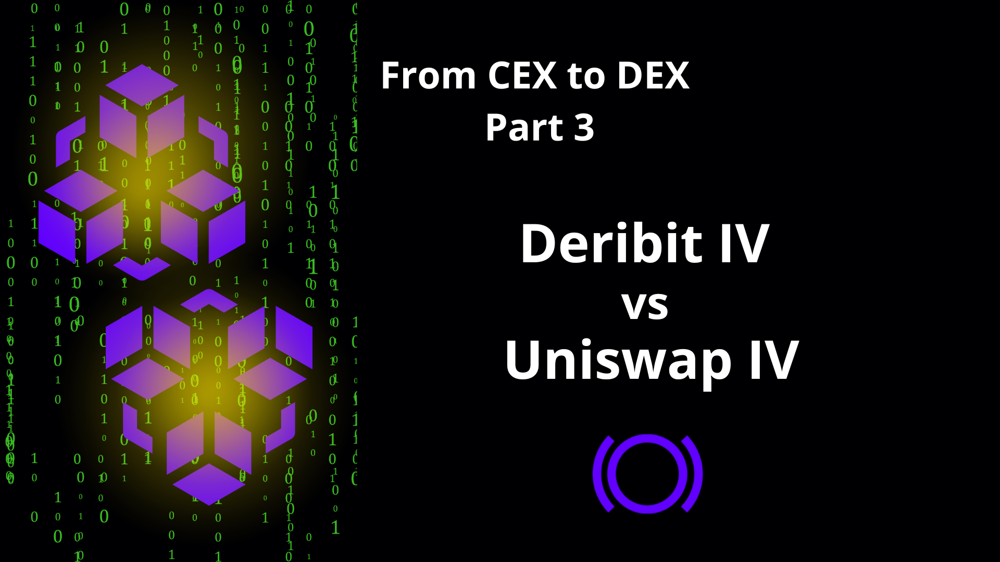
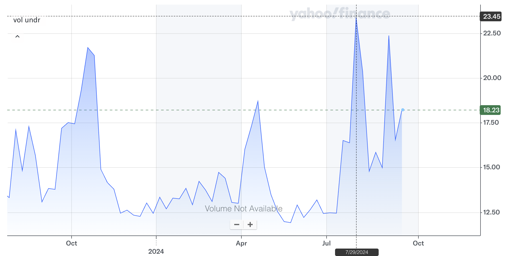
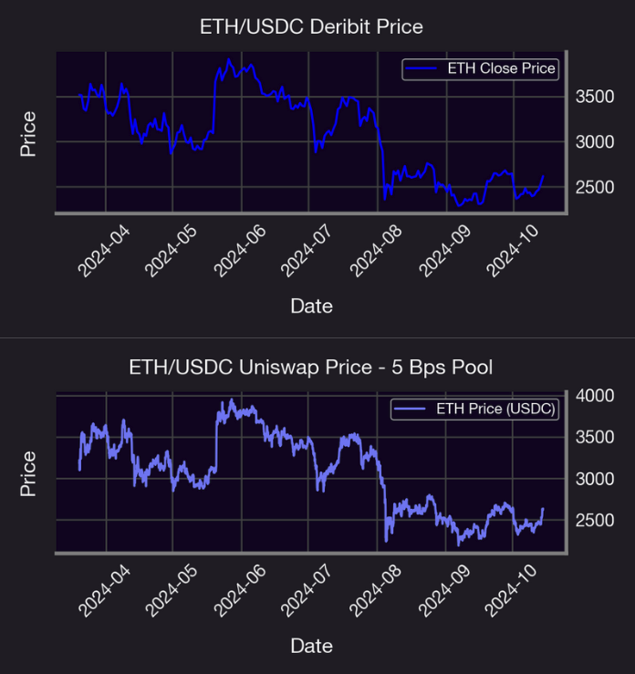
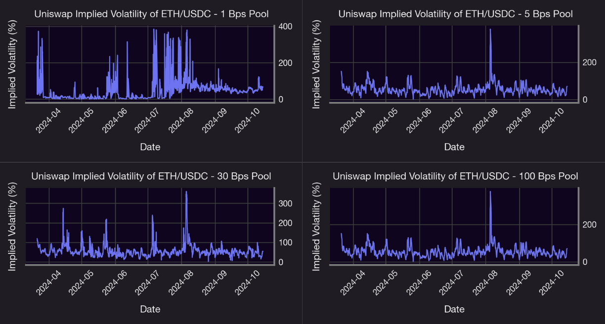
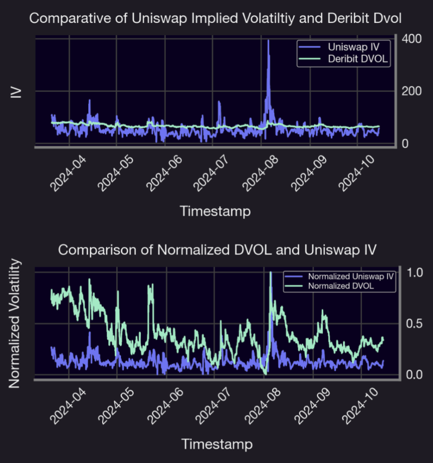
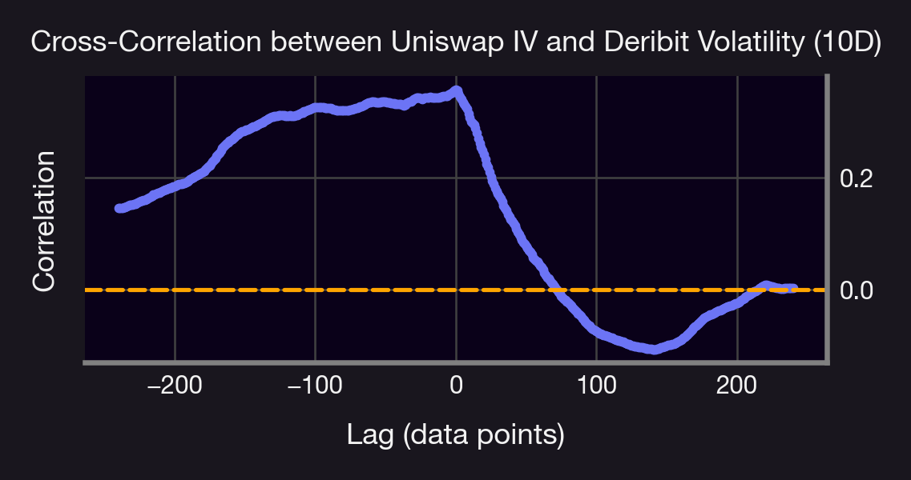

## Introduction

As part of our ongoing [From CEX to DEX](/research/from-centralized-to-decentralized-exchanges-options-pricing) series, we're inspiring TradFi and CEX professionals to explore and engage with derivative products in the DeFi space. Options are critical to having a [healthy crypto market](/research/reasons-why-options-important-in-crypto-market). One of the key metrics in options trading is [implied volatility (IV)](/research/new-formulation-implied-volatility), which reflects market expectations of future volatility and is crucial for pricing options. Understanding the differences in implied volatility on traditional and perpetual options can provide insights into market structure and arbitrage opportunities. This technical comparison between Deribit and Uniswap explores differences in implied volatility across DVOL, Uniswap, and the VIX, focusing on historical trends, peaks, troughs, correlations, and identifying any lead-lag relationships.

## Background

[Perpetual options](/docs/trading/perpetual-options), as implemented in Panoptic, represent an innovative evolution in the decentralized finance (DeFi) landscape, offering continuous, non-expiring options trading within an automated market maker framework. Unlike traditional options in centralized exchanges (CEX) and traditional finance (TradFi), which have set expiration dates and are subject to centralized oversight, Panoptic's perpetual options are embedded within the decentralized ecosystem, enhancing flexibility and transparency. This section explores the key differences, advantages, and challenges between perpetual options in Panoptic and traditional options, providing a comparative analysis of their structures, trading mechanisms, and implications for market participants.

On the other hand, Uniswap derives an implied volatility measure that reflects its liquidity dynamics, as detailed in [Panoptic's framework](/research/new-formulation-implied-volatility). This IV formulation is based on the product of the pool's fee rate and the ratio of trading volume and tick liquidity. This calculation captures the pool’s exposure to risk and expected price fluctuations, making it a unique and adaptive volatility measure within the decentralized finance ecosystem.

$IV = 2 \cdot \text{FeeRate} \cdot \sqrt{\frac{\text{Volume}}{\text{tickLiquidity}}}$

### TradFi Options vs. Panoptions

There are many differences between options in TradFi and options in DeFi. The table below provides a comparative overview of Panoptic perpetual options in DeFi and traditional options offered in CEX and TradFi. Key differences are highlighted in terms of expiration, collateral requirements, liquidity provision, and the role of oracles, illustrating the unique characteristics and advantages of decentralized, oracle-free perpetual options in DeFi.

| Feature                | Panoptic Perpetual Options (DeFi)                              | Traditional Options (CEX and TradFi)            |
|------------------------|---------------------------------------------------------------|-------------------------------------------------|
| Expiration             | No expiration date → timescales                               | Fixed expiration dates                          |
| Interest Rate          | N/A                                                           | Interest rate from bonds                        |
| Underlying Mechanism   | Built on Uniswap v3 LP positions and trading fees             | Based on standardized contracts and strike prices |
| IV (Implied Volatility)| IV from fees and liquidity in Uniswap                         | IV from option prices                           |
| Collateral Requirements| Can offer undercollateralized options (up to 5x)              | Typically requires full or significant collateral |
| Liquidity Provision    | Relies on LPs providing liquidity for options                 | Market makers or clearing houses provide liquidity |
| Settlement             | Instant, based on Uniswap v3 on-chain pools                   | May involve clearing through centralized systems |
| Pricing Model          | Oracle-less, path-dependent pricing converging to Black-Scholes | Uses models like Black-Scholes, often with oracles or market data |
| Composability          | Options can be tokenized as ERC1155 tokens, composable with DeFi protocols | Limited composability; standard contracts only |
| Fee Structure          | Dynamic fees based on liquidity and volume                    | Standardized fees or commission set by exchange |
| Arbitrage Potential    | Opportunities between Uniswap LP strategies and other trading protocols | Arbitrage mainly across different trading venues |
| Role of Oracles        | Oracle-free operation, reduces dependency on external data sources | Often relies on external price feeds and oracles |
| User Access and Roles  | Decentralized access; LPs, buyers, and sellers interact directly with smart contracts | Centralized intermediaries and exchanges facilitate transactions |
| Greeks                 | No classic Vega → Vegoid                                     | Vega                                           |

### VIX vs DVOL vs Uniswap IV

We are working with three distinct volatility metrics: DVOL (Deribit Volatility Index), the VIX, and Uniswap IV, and are examining ETH (Ethereum) as the underlying asset.

For each token pair (e.g., ETH/USDC) on Uniswap v3, there are currently four types of pools based on the fee rate charged to spot traders: 0.01% (1 bp), 0.05% (5 bps), 0.3% (30 bps), and 1% (100 bps). Each pool offers different fee rates, allowing traders and liquidity providers to choose based on their trading frequency, risk tolerance, and strategy.

| Feature                  | CEX IV                                        | Uniswap IV                                                                                   |
|--------------------------|-----------------------------------------------|----------------------------------------------------------------------------------------------|
| **Purpose**              | Volatility measure for an option contract     | Volatility measure for a liquidity chunk                                                    |
| **Granularity**          | Varies by strike price and expiration date    | Varies by tick, liquidity, fee rate, and volume of the pool                                  |
| **Arbitrage Opportunities** | Arbitrage limited to market differences across various CEXs | Allows for unique strategies involving LP positions and hedging in DeFi                               |
_**Table:** Comparison between centralized exchange (CEX) and Uniswap IV_

The table above outlines the distinctions between implied volatility metrics in CEXs and Uniswap.

| Aspect                  | DVOL (Deribit Volatility Index)                | VIX (CBOE Volatility Index)                                                                |
|-------------------------|-----------------------------------------------|-------------------------------------------------------------------------------------------|
| **Underlying Asset**    | Based on options on crypto assets (Bitcoin, Ethereum) | Based on S&P 500 Index options                                                        |
| **Market**              | Crypto market                                  | U.S. equity market (S&P 500)                                                             |
| **Calculation Method**  | Aggregates implied volatilities from Deribit options | Aggregates implied volatilities from S&P 500 options                                    |
| **Time Horizon**        | 30 days (short-term expectations)              | 30 days (short-term expectations)                                                        |
| **Trading Platform**    | Deribit (crypto derivatives exchange)          | CBOE (Chicago Board Options Exchange)                                                    |
| **Correlation with Market** | Negative correlation with crypto prices   | Negative correlation with S&P 500 prices                                                 |
| **Investability**       | Not directly investable                        | Tradable via futures, options, ETFs                                                      |
| **Launch Date**         | 2021 (Bitcoin DVOL)                            | 1993                                                                                     |
_**Table:** Comparison of DVOL and VIX_

The table above showcases the distinctions between DVOL and VIX. DVOL is constructed from crypto asset options and reflects the sentiment and implied volatility within the fast-evolving crypto landscape. In contrast, the VIX, representing the equity market, serves as the primary fear gauge for S&P 500 options, long-established in market analysis since the 1990s. The investability factor further delineates the tools available for market participants to hedge or speculate on volatility across asset classes.

## Goals

The main questions that we want to answer throughout our analysis are the following:

1. How effective and accurate is Guillaume’s implied volatility formulation for Uniswap LP positions?
2. Can Uniswap IV be considered reliable and reflective of market conditions similarly to centralized metrics like Deribit's DVOL?
3. Can DVOL or Uniswap IV be considered as predictive tools for one another?
4. How do volatility changes in one market offer insights into the other, enhancing trading strategies that leverage both DeFi dynamics and traditional crypto options?

For our analysis, we performed the following steps:

- Analyzed the underlying price of ETH between Uniswap and Deribit. This comparison provides essential context for evaluating the implied volatility (IV) from Uniswap against Deribit’s DVOL.
- Displayed normalized values of DVOL and the Uniswap IV to more easily compare the two metrics.
- Implemented statistical metrics such as mean, median, Pearson Correlation, and Mean Absolute Error (MAE) to quantify similarities and differences.
- Applied the cross-correlation metric to examine the lead-lag relationship, revealing how closely Uniswap IV and Deribit DVOL move together over time and identifying if one measure consistently leads the other.
- Conducted cointegration and FCVAR analysis to evaluate their long-term equilibrium relationship while accounting for long-memory effects. FCVAR captures both fractional integration and cointegration, highlighting whether one series persistently influences the other over time.

## Technical Comparison between Uniswap IV and Deribit Index Volatility

### Market Timeframe

To answer the question "How do IVs in Uniswap compare to IVs in Deribit?", we selected the past six months of data and conducted an initial visual analysis. Here we have this figure: the VIX chart displays significant patterns, peaks, and phases of increased volatility.

In the graph above, we notice that there are four noticeable peaks in volatility, which can indicate significant market movements or economic events. The goal is to display the DVOL (Deribit Volatility Index) and the Uniswap IV to compare the volatility patterns between centralised option exchanges (Deribit) and the decentralised exchange (Uniswap).

By analyzing key metrics like correlation and conducting the cross-corrrelation analysis and the fractionally cointegrated vector autoregressive (VAR) model we can determine if there is a lead-lag relationship between IV measures. This analysis will help reveal whether Uniswap IV tends to follow Deribit IVs and the VIX, or if they behave independently, both in terms of volatility spikes and overall trends. This comparative approach will allow us to assess if one market's volatility consistently mirrors or predicts the other's movements over this chosen timeframe.

The four distinct peaks in the VIX over the past year were likely driven by key economic and geopolitical events. Here's a summary of the primary factors influencing market volatility during this period:

- **Softening Inflation and Eased Monetary Policy:** Global inflation has begun to moderate, with inflation expected to fall from 6.8% in 2023 to 5.9% in 2024. This has prompted several central banks to adopt looser monetary policies, including interest rate cuts in the U.S., Europe, and China. However, inflationary pressures persist in certain sectors, particularly services [(WEF, 2024)](https://www.weforum.org/reports/global-risks-report-2024).

- **Geopolitical and Economic Risks:** The global economy remains vulnerable to geopolitical tensions, particularly the ongoing conflicts involving Israel and neighboring regions, as well as the conflict between Ukraine and Russia. These tensions, along with the upcoming U.S. presidential election in November 2024, are expected to significantly influence global economic policies [(WEF, 2024)](https://www.weforum.org/reports/global-risks-report-2024).

- **Debt Concerns:** Rising public debt levels are a growing risk to macroeconomic stability. Developing economies, in particular, are facing heightened debt servicing burdens, with many spending more on interest payments than on crucial services such as education or healthcare [(WEF, 2024)](https://www.weforum.org/reports/global-risks-report-2024).

- **Regional Growth Divergences:** Economic growth expectations are mixed across regions. South Asia, led by India, is projected to experience strong growth, while Europe is expected to see weak growth in 2024, with a slight improvement in 2025. Meanwhile, China's growth outlook remains subdued, with challenges from deflationary pressures [(WEF, 2024)](https://www.weforum.org/reports/global-risks-report-2024).

- **Market Volatility:** In August 2024, stock markets globally experienced significant volatility, driven by concerns about the U.S. labor market and Japan's interest rate hikes. While some of this market downturn was reversed, it underscored the fragility of the current economic environment [(WEF, 2024)](https://www.weforum.org/reports/global-risks-report-2024).

### Results
For our analysis, we use hourly data for the last six months from March to October 2024.

The graphs above represent a comparison of ETH/USDC hourly price movements on Deribit and Uniswap's 5 Bps Pool from March to October 2024, highlighting potential variations in pricing dynamics. The aim is to determine if there are notable differences in price trends between these platforms using Mean Absolute Error and Pearson Correlation. The results in the following table: 

| **Metric**                       | **Result** |
|----------------------------------|------------|
| Mean Absolute Error (MAE in %)   | 0.227      |
| Pearson Correlation Coefficient  | 1.000      |
| Pearson Correlation (p-value)    | 0.000      |

The MAE and the Pearson Correlation Coefficient indicate a strong similarity between the two price series, suggesting that their values are closely aligned. 

The comparison of ETH prices on Uniswap and Deribit establishes a crucial baseline for analyzing the behavior of implied volatility (IV) across various Uniswap pools. The next step is to examine the four ETH/USDC pools, evaluating each based on liquidity and other key metrics to determine the most suitable one for further analysis.

| **Pool**                    | **Key Observations**                                                                                                                                                 | **Analysis**                                                                                                                                                                                                                                                        |
|-----------------------------|----------------------------------------------------------------------------------------------------------------------------------------------------------------------|---------------------------------------------------------------------------------------------------------------------------------------------------------------------------------------------------------------------------------------------------------------------|
| **1 bp Pool (Top Left)**    | Extremely volatile IV with dramatic spikes exceeding 200% over the six-month period.                                                                                | The low-fee structure in the 1 bps pool is designed to attract high-frequency, low-cost trades, making it ideal for arbitrageurs and traders who rely on small price movements to execute strategies efficiently.                                                  |
|                             | Low fee tier favored for high-frequency and low-cost trades.                                                                                                        | High volatility in this pool might reflect rapid, short-term trading activity and may also suggest moments when liquidity is either added or withdrawn sharply, highlighting the fragility of low-fee pools in maintaining stable price impact.                   |
|                             | The volatility spike may be due to a one-off event, such as a large liquidity withdrawal or protocol-related issue.                                                 |                                                                                                                                                                                                                                                                     |
| **5 bps Pool (Top Right)**  | Relatively stable volatility with occasional spikes, most notably in July 2024.                                                                                     | The 5 bps fee tier strikes a balance between liquidity provider compensation and trading costs, attracting medium-volume trades.                                                                                                                                  |
|                             | IV ranges between 20%-100%, with brief spikes near 400%.                                                                                                            | Spikes in July and August suggest temporary market events or liquidity changes.                                                                                                                                                                                    |
| **30 bps Pool (Bottom Left)**| Relatively consistent volatility with notable spikes.                                                                                                              | Balance between higher fee capture for liquidity providers and reasonable trading costs for traders.                                                                                                                                                             |
|                             | Volatility peaks in April-May 2024 and July-August 2024 due to potential market events.                                                                             | Spikes indicate heightened market activity or liquidity shocks, reflecting increased uncertainty around ETH/USDC prices.                                                                                                                                          |
|                             | IV ranges between 20%-100%, with spikes up to 400.                                                                                                                 |                                                                                                                                                                                                                                                                     |
| **100 bps Pool (Bottom Right)** | Moderate volatility similar to the 30 bps pool, with sharper spikes.                                                                                               | Higher fee attracts liquidity providers willing to accept more risk for higher fee income.                                                                                                                                                                        |
|                             | Significant IV spike in August 2024, reaching over 400.                                                                                                            | The sharp increase in IV in August suggests a liquidity shock or market movement, leading to heightened uncertainty.                                                                                                                                              |

_**Table**: Key Observations and Analysis of ETH/USDC Implied Volatility Across Different Fee Tiers_

We will use the 5 bps pool, which is the most liquid Uniswap pool, to compare to Deribit's IVs.

_**Graph**: Comparison of the IV and normalised IV (to a scale of 0 to 1 to facilitate comparison) between the ETH Deribit Volatility Index (DVOL) and Uniswap for the ETH/USDC trading pair in a 5 basis points liquidity pool from March 2024 to October 2024_

We observe that the common peaks identified in both Uniswap IV and Deribit DVOL closely align with the peaks in the VIX index. This correlation suggests a broader market-wide volatility response, indicating that fluctuations in decentralized and centralized crypto markets are reflective of the global volatility trends represented by the VIX.

### Cross-Correlation

Cross-correlation is a statistical measure that quantifies the similarity between two time series as a function of the time lag applied to one of them. It is commonly used to detect time shifts or relationships between two signals or datasets. A positive peak at a negative lag indicates that the first series leads the second, enabling predictive insights. By monitoring these patterns, traders can anticipate movements in a lagging series, which is useful for optimizing trading strategies.

For instance, if Uniswap IV leads Deribit IV, portfolio adjustments can be made before volatility shifts occur. Cross-correlation can also help assess bidirectional relationships, detect time delays, and identify inverse correlations. Moreover, it validates potential causality by examining peak correlations at specific lags, allowing one to establish whether one series influences another over a particular time scale.

_**Graph**: Cross-crorrelation Over a 10-Day Rolling Window$_

The cross-correlation plot between Uniswap IV and Deribit DVOL over a 10-day lag period provides valuable insights into their temporal relationship. The positive correlation observed at negative lags suggests that past values of Uniswap IV could have predictive power for future movements in Deribit DVOL, indicating that the decentralized Uniswap market may sometimes lead the centralized Deribit market. Conversely, the declining correlation at positive lags implies that past values of Deribit DVOL may have a more prominent influence on future movements in Uniswap IV, suggesting that information flows more strongly from Deribit's centralized market to the decentralized Uniswap market under certain conditions. This bidirectional dynamic highlights opportunities for arbitrage strategies, especially for traders aiming to capitalize on the predictive lead-lag relationships between these markets.

### Statistical Metrics, Cointegration and FCVAR

This subsection presents a comprehensive analysis of key statistical metrics for Deribit DVOL and Uniswap IV. The cointegration and fractional cointegration (FCVAR) models used in the study reveal essential relationships between these two implied volatility measures, shedding light on their long-term interactions and dependencies. This comparison helps to understand the potential implications for arbitrage strategies between centralized and decentralized platforms, as well as the persistence of volatility in each context.

| **Metric**                  | **Deribit DVOL** | **Uniswap IV** |
|-----------------------------|------------------|----------------|
| **Mean**                    | 66.206668       | 54.772755      |
| **Standard Deviation**      | 6.159498        | 27.442751      |
| **Variance**                | 37.939410       | 753.104597     |
| **Skewness**                | 0.723289        | 4.184420       |
| **Kurtosis**                | -0.310795       | 31.698738      |
| **Max**                     | 86.210000       | 393.013475     |
| **Min**                     | 53.300000       | 4.756682       |
| **Mean Absolute Error (%)** | *31.725*        | *31.725*       |
| **Pearson Correlation**     | *0.358245*      | *0.358245*     |
| **Spearman Correlation**    | *0.382080*      | *0.382080*     |

_**Table**: Summary of Statistical Metrics for Deribit DVOL and Uniswap IV._

This table highlights distinct differences in the statistical properties of Deribit DVOL and Uniswap IV. Deribit DVOL shows a lower mean and smaller spread (as indicated by standard deviation and variance), suggesting more stability in its volatility readings compared to Uniswap IV. The significantly higher skewness and kurtosis of Uniswap IV indicate a higher frequency of extreme values, which aligns with the larger maximum and minimum values observed. This suggests that Uniswap IV experiences more frequent and intense implied volatility spikes than Deribit DVOL. The moderate Pearson and Spearman correlations between the two metrics reflect a partial alignment, yet their behaviors are distinct enough to suggest complementary insights in assessing volatility trends across centralized and decentralized markets.
In this analysis, we first tested the cointegration between the two implied volatility series, Uniswap IV and DVOL, using the Engle-Granger two-step approach. The results are as follows:

- **Cointegration Coefficient (slope):** 0.0804  
- **Cointegration Test Statistic:** -3.4475  
- **P-value:** 0.0373  

Since the p-value is below 0.05, we conclude that Uniswap IV and DVOL are indeed cointegrated. This indicates a statistically significant long-term equilibrium between these two implied volatility measures despite short-term fluctuations.

On the other hand, the FCVAR model, by extending the VAR model to include fractional integration and cointegration, captures long-memory dynamics in time series. This is particularly valuable for analyzing financial series like Uniswap IV and Deribit DVOL, as they often exhibit persistent, long-term dependencies not captured by traditional VAR models. Hence, applying the FCVAR model in our analysis of Uniswap IV and Deribit DVOL helps examine their long-term equilibri    um relationship and determine which series leads or follows. This analysis provides insights into the persistence of shocks and how equilibrium adjustments occur, aiding in identifying potential arbitrage opportunities between Uniswap liquidity provision and Deribit options trading.

| **Metric**                  | **Uniswap IV** | **Std Error (Uniswap IV)** | **DVOL** | **Std Error (DVOL)** |
|-----------------------------|----------------|----------------------------|----------|-----------------------|
| Long Memory Parameter ($d$) | 0.853          | 0.020                      | 0.853    | 0.020                 |
| Cointegrating Coefficient ($\beta$) | 1.000    | -                          | -3.002   | -                     |
| Adjustment Coefficient ($\alpha$)   | -0.018   | 0.005                      | 0.001    | 0.000                 |
| Level Parameter ($\mu$)     | 95.622        | 4.503                      | 77.823   | 0.634                 |
| Lag Matrix 1 ($\Gamma_1$)   | 0.164         | 0.029                      | 0.003    | 0.001                 |
|                             | 1.290         | 0.194                      | 0.263    | 0.034                 |
| Lag Matrix 2 ($\Gamma_2$)   | -0.172        | 0.020                      | -0.008   | 0.002                 |
|                             | 0.067         | 0.218                      | -0.031   | 0.020                 |

| **Metric**      | **Value**     |
|-------------------------|---------------|
| Log-likelihood          | -21911.193    |
| AIC                     | 43850.385     |
| BIC                     | 43941.601     |

_**Table:** Summary of Key Results from the FCVAR Model for Uniswap IV and Deribit DVOL._

From the FCVAR results, we can infer which series leads by examining the adjustment coefficients ($\alpha$) and the cointegration relationship. 

- The adjustment coefficients are $\alpha_{11} = -0.018$ for Uniswap IV and $\alpha_{21} = 0.001$ for Deribit DVOL, indicating how each series adjusts to deviations from the long-term equilibrium.
- The larger absolute value of $\alpha_{11}$ suggests that Uniswap IV responds more significantly to deviations from equilibrium compared to Deribit DVOL.
- Since Uniswap IV shows a stronger adjustment to deviations, this implies that Deribit DVOL could be the leading series. In other words, changes in Deribit DVOL might precede changes in Uniswap IV, with Uniswap IV adjusting its values to maintain the long-term equilibrium.

Based on these observations, we conclude that Deribit DVOL likely leads, and Uniswap IV follows by adjusting to maintain the cointegrated relationship.

## 5. Conclusion

The results of this analysis underscore the effectiveness and accuracy of the implied volatility (IV) formulation by Guillaume, as demonstrated through the comparison of Uniswap IV and Deribit DVOL. The fractional cointegration and FCVAR models have validated that these volatility measures, while originating from different market structures (LP positions for Uniswap and traditional options for Deribit), share a long-term equilibrium relationship. This finding suggests that Uniswap IV is not only reliable but also reflective of market conditions similar to those captured by traditional metrics like Deribit DVOL.

Furthermore, the statistical persistence observed through the long memory parameter and adjustment coefficients implies that traders can confidently use Uniswap IV as a predictive tool alongside DVOL. This alignment opens potential arbitrage opportunities, where discrepancies between Uniswap LPing and Deribit options can be strategically exploited. The relationship indicates that price movements or volatility changes in one market can offer insights into the other, enhancing trading strategies for market participants looking to leverage DeFi's unique dynamics alongside traditional crypto options.

Could this relationship pave the way for new arbitrage strategies based on volatility smiles and IV surfaces across decentralized and centralized markets? How might a refined understanding of these metrics influence future market behaviors and pricing models? This is a topic of future exploration.

## Appendix

### Explanation of the VIX

The VIX, or Volatility Index, is calculated based on the implied volatility of S&P 500 index options. The formula used for its calculation is:

$VIX = 100 \times \sqrt{\frac{2}{T} \sum_{i} \frac{\Delta K_i}{K_i^2} e^{RT} Q(K_i) - \frac{1}{T} \left( \frac{F}{K_0} - 1 \right)^2 }$

Where:

- $T$ is the time to expiration, measured in years.
- $\Delta K_i$ is the interval between strike prices $K_i$ (midpoint of the two surrounding strikes).
- $K_i$ is the strike price of the $i$-th option.
- $R$ is the risk-free interest rate for the relevant maturity.
- $Q(K_i)$ is the price of the out-of-the-money option with strike $K_i$. This includes both call and put options.
- $F$ is the forward price of the S&P 500 index, derived from the current index level and the risk-free interest rate.
- $K_0$ is the strike price closest to the forward index level $F$.

#### Detailed Steps

1. Select out-of-the-money (OTM) SPX call and put options for two expirations, near-term and next-term, that straddle a 30-day horizon.
2. Compute the contribution of each option to the total implied variance using the formula $\frac{\Delta K_i}{K_i^2}e^{RT}Q(K_i)$, where $e^{RT}$ accounts for the discounting of the option price to present value.
3. Sum these contributions across all selected options.
4. Use the forward index level $F$ and the strike price closest to it, $K_0$, to compute the adjustment factor $\frac{F}{K_0}-1$, which corrects for the difference between the forward price and the nearest strike price.
5. Finally, take the square root of the resulting value and annualize by multiplying by 100 to get the VIX value.

### Explanation of DVOL

The Deribit Implied Volatility Index [Deribit DVOL] serves several key purposes in the crypto options market:

- **Predictive Indicator:** Acts as a predictive indicator for future market volatility, helping market participants anticipate potential price swings.
- **Market Sentiment Gauge:** Used to gauge overall market sentiment, assisting traders in positioning based on near-term expectations of price movement.

#### How DVOL Works

DVOL is calculated based on the following:

- **Implied Volatility:** Based on the implied volatility of options with various strike prices and expiration dates, offering a broad view of market expectations.
- **Weighting Factors:** Weighted by liquidity and open interest of each option, ensuring more actively traded options contribute more to the index.
- **Comparison to Traditional Markets:** Functions similarly to the VIX in traditional finance, though specifically tailored to the crypto market (ETH or BTC).

#### DVOL Calculation Outline

1. **Select the two expiries** closest to 30 days out, on either side of the 30-day mark.
2. **Calculate the option price** using bid-ask market depth. If bid/ask spreads are too wide, use trade prices from the last minute or fallback to the mark price from one minute ago.
3. **Calculate the option implied synthetic** value or fallback to the one-minute mark price if information is insufficient.
4. **Discard ITM calls and puts** and options with very low premiums.
5. **Use the variance swap methodology** to calculate variance for the near-term and longer-term expiries, interpolate between the two, and take the square root.
6. **Filter noise and smooth the value**, yielding the final index calculation.

#### DVOL Resolutions

DVOL data is available in different time intervals, including:

- **1 second:** High-frequency data for near-instant changes.
- **1 minute (60 seconds):** Suitable for short-term volatility monitoring.
- **1 hour (3600 seconds):** Common for intraday analysis.
- **12 hours (43200 seconds):** Mid-term volatility insights.
- **1 day (1D):** Aggregated daily volatility for overall market behavior.

The **close** value from each candlestick is typically considered the most relevant DVOL for that period, as it represents the last implied volatility within that time window.

#### Why Choose the Close Value?

- The **close** value is generally used as the representative value for each period in financial data, including volatility indices like DVOL.
- It reflects the latest volatility value at the end of the specified period (e.g., end of the hour or day).

### Explanation of Some Metrics

- **Normalization Formula**:

This normalization was performed by adjusting each value in the series using:

$
\text{Normalized Value} = \frac{\text{Value} - \text{Min}}{\text{Max} - \text{Min}}
$

where *Min* and *Max* refer to the minimum and maximum values in each series. Normalizing data allows direct comparison of patterns and trends without scale differences.

- **Spearman Correlation**: Spearman Correlation measures the strength and direction of the **monotonic relationship** between two variables based on ranks, ranging from -1 to 1.

- **Pearson Correlation**: Pearson Correlation measures the strength and direction of the **linear relationship** between two variables, ranging from -1 to 1.

- **Granger Causality Test**: The Granger Causality Test assesses whether past values of one series (X) can predict future values of another (Y) by including lagged values of X in Y’s predictive model.

- **Cross-Correlation**: Given two time series $X = \{x_1, x_2, \dots, x_n\}$ and $Y = \{y_1, y_2, \dots, y_n\}$, the cross-correlation at lag $\tau$ is:

$
C_{XY}(\tau) = \sum_{i} x_i \cdot y_{i + \tau}
$

where $\tau$ (e.g. 1 day, 3 days, 1 month, etc.) is the lag between series values.

### Fractional Cointegration

Fractional Cointegration extends traditional cointegration by allowing **fractional orders of integration**. For example, two series $X_t$ and $Y_t$, integrated of order $I(1)$, are cointegrated if there exists a stationary linear combination $Z_t = Y_t - \beta X_t$. 

In fractional cointegration, $Z_t$ may be integrated of fractional order $d$, with $0 < d < 1$, indicating gradual mean reversion.

### FCVAR Model

The Fractionally Cointegrated Vector Autoregressive (FCVAR) model is an advanced econometric framework used to analyze relationships between multiple time series that are fractionally integrated and cointegrated. Unlike traditional cointegration models, which assume integer orders of integration, the FCVAR model allows for fractional (non-integer) integration, making it more flexible in capturing long-term dependencies and persistent shocks in data. This is particularly useful for financial and economic time series where standard assumptions of stationarity or full integration may not hold.

For two fractionally cointegrated series $Y_{1,t}$ and  $Y_{2,t}$, the FCVAR model is:

$
\Delta^d \mathbf{Y}_t = \alpha \beta' \mathbf{Y}_{t-1} + \sum_{j=1}^{k-1} \Gamma_j \Delta^d \mathbf{Y}_{t-j} + \mathbf{u}_t
$

where:

- $\Delta^d \mathbf{Y}_t$ is the fractional differencing operator.
- $\alpha$ and $\beta$ are matrices where:
    - $\alpha$ represents adjustment coefficients,
    - $\beta$ represents cointegrating vectors.
- $\Gamma_j$ captures short-term dynamics,
- $\mathbf{u}_t$ is white noise.

#### Key Components in FCVAR

- **Fractional Differencing $\Delta^d$**: The differencing parameter $d$ represents long memory and persistence in autocorrelations.
- **Fractional Cointegration**: Allows for fractional cointegration, where the cointegrating relationship itself can exhibit long memory.

## References

1. NBC News. "Federal Reserve's next interest rate hike." May 2023. Available at: [https://www.nbcnews.com/business/economy/federal-reserve-next-interest-rate-hike-may-2023-how-much-rcna82277](https://www.nbcnews.com/business/economy/federal-reserve-next-interest-rate-hike-may-2023-how-much-rcna82277)

2. World Economic Forum. "Global Risks Report 2024." Available at: [https://www.weforum.org/reports/global-risks-report-2024](https://www.weforum.org/reports/global-risks-report-2024)

3. JP Morgan. "Are markets too optimistic about rate cuts in 2024?" Available at: [https://am.jpmorgan.com/us/en/asset-management/adv/insights/market-insights/market-updates/on-the-minds-of-investors/are-markets-too-optimistic-about-rate-cuts-in-2024/](https://am.jpmorgan.com/us/en/asset-management/adv/insights/market-insights/market-updates/on-the-minds-of-investors/are-markets-too-optimistic-about-rate-cuts-in-2024/)

4. Deribit Insights. "DVOL: Deribit Implied Volatility Index." Available at: [https://insights.deribit.com/exchange-updates/DVOL-deribit-implied-volatility-index/](https://insights.deribit.com/exchange-updates/DVOL-deribit-implied-volatility-index/)

*Join the growing community of Panoptimists and be the first to hear our latest updates by following us on our [social media platforms](https://links.panoptic.xyz/all). To learn more about Panoptic and all things DeFi options, check out our [docs](https://panoptic.xyz/docs/intro) and head to our [website](https://panoptic.xyz/).*