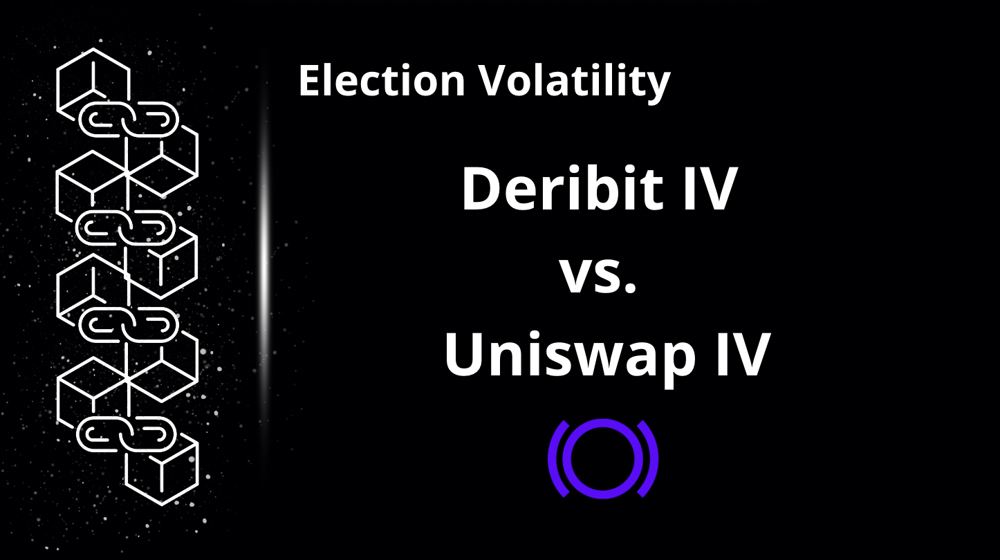
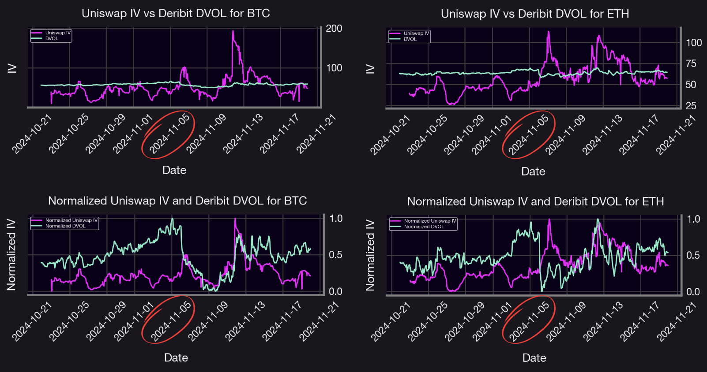
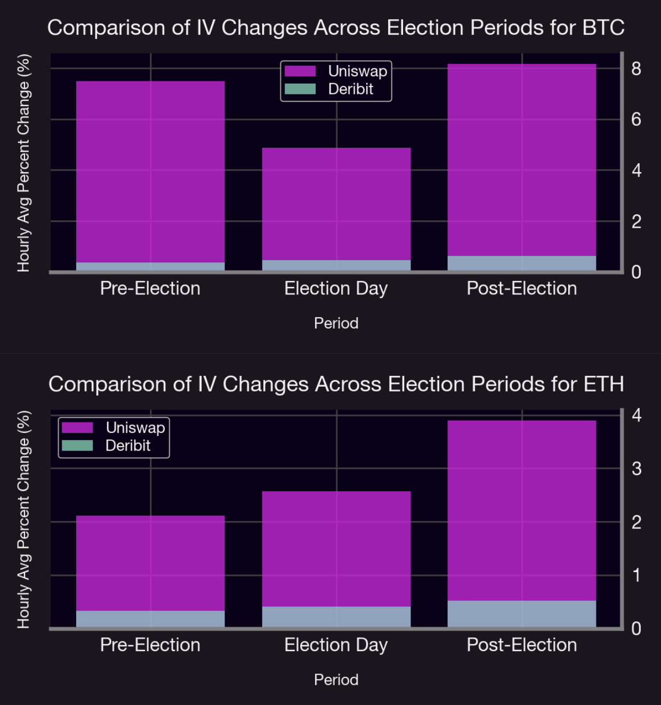
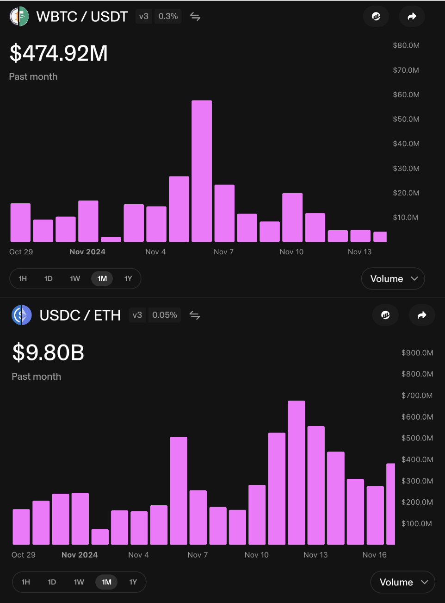
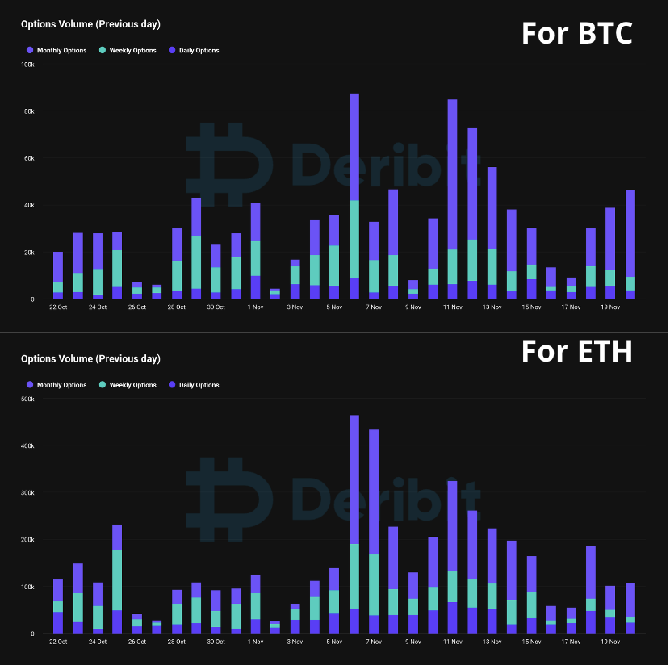

# Introduction

During politically charged periods like elections, the interplay between centralized and decentralized markets becomes a focal point for volatility analysis. By comparing hourly implied volatility (IV) trends for Bitcoin (BTC) and Ethereum (ETH) across Uniswap and Deribit exchanges, we uncover striking differences in market reactions. BTC's and ETH's decentralized markets exhibit sharp volatility spikes, reflecting heightened sensitivity to speculation. These dynamics provide valuable insights into how different ecosystems process information and present unique opportunities for traders during pre- and post-election uncertainty.

# Analysis

We are analyzing hourly data for Deribit DVOL and Uniswap IV spanning October 22, 2024, to November 20, 2024. For Uniswap, our focus is on the highly liquid USDC/ETH 5 Bps and WBTC/USDT 30 Bps pools, which rank among the top in terms of Total Value Locked (TVL).

## ETH and BTC IV

**Figure 1:** Comparative Analysis of Hourly and Normalized Implied Volatility: Uniswap IV (ETH/USDC 5 Bps Pool, WBTC/USDT 30 Bps Pool) vs. Deribit DVOL for ETH and BTC, highlighting implied volatility dynamics during the pre- and post-election period.

### Analysis Overview

The analysis of hourly implied volatility (IV) for Uniswap and Deribit DVOL across BTC and ETH reveals critical insights into market behavior surrounding the pre- and post-election period. When analyzing the charts, on Deribit, there appear to be two significant spikes in IV: one leading up to November 4 and another around November 12, for both BTC and ETH. On Uniswap, the IV also experiences two notable spikes, but with a noticeable "delayed lag" on the first one, occurring around November 5 instead of November 4. However, the second spike on November 12 aligns with Deribit's timing. This suggests that Uniswap's IV is delayed relative to Deribit on the first spike but becomes synchronized with it during the second.

For BTC, Uniswap IV demonstrates sharp spikes compared to the steadier Deribit DVOL, suggesting that decentralized markets are more reactive to events and speculative activity. The [lead-lag](https://panoptic.xyz/research/comparing-uniswap-deribit-implied-volatilities#cross-correlation) relationship highlighted in normalized IV trends implies that information from Deribit’s centralized market may influence Uniswap’s volatility during this politically sensitive time.

In contrast, ETH displays more synchronized volatility patterns between Uniswap IV and Deribit DVOL, indicating that ETH’s markets exhibit higher integration. However, occasional divergences in Uniswap IV hint at isolated moments of increased speculative interest or liquidity imbalances unique to the decentralized market.

These findings suggest that during volatile macroeconomic events like elections, BTC and ETH experience heightened sensitivity in decentralized markets. This could present unique arbitrage opportunities and signal stronger information flow dynamics.

## IV Change

In this analysis, we quantified and compared the implied volatility (IV) changes in Uniswap and Deribit markets during key election periods—pre-election, election day, and post-election. Using hourly IV data, we computed the percentage changes:

$$
\Delta IV = \frac{\lvert IV_t - IV_{t-1} \rvert}{IV_{t-1}} \times 100
$$
to measure the magnitude of fluctuations between consecutive time points. These changes were segmented into the defined election periods, and average values were calculated for each timeframe. The results revealed that Uniswap's decentralized market exhibited larger IV fluctuations compared to Deribit's centralized market, particularly in the post-election period, highlighting the heightened sensitivity of decentralized markets to political uncertainty.

### Election Period Segmentation

- **Pre-election period** (October 22, 2024, to November 4, 2024): Reflects the buildup to the election, where speculation and uncertainty typically increase.  
- **Election day** (November 5, 2024): Isolates the immediate market reaction to the voting process and potential outcomes.  
- **Post-election period** (November 6, 2024, to November 20, 2024): Focuses on the resolution phase, where markets adjust to confirmed results and their implications.  

This segmentation ensures a comprehensive analysis of implied volatility behavior across all phases of the election cycle.

**Figure 2:** Comparison of Average Hourly Absolute Percent Changes in IV Across Election Periods for BTC and ETH: Uniswap exhibits consistently higher volatility changes than Deribit, with the most significant spikes occurring post-election, highlighting the heightened sensitivity of decentralized markets to political events.

### Results Overview

The chart highlights the distinct dynamics of implied volatility changes in Uniswap and Deribit across key election periods. During the **pre-election period**, Uniswap exhibited higher IV changes compared to Deribit, reflecting greater sensitivity to speculative activity. On **election day**, both markets experienced increased IV changes, with Uniswap reacting more strongly, likely due to the ineffeciency of updating liquidity in the decentralized market. The **post-election period** saw the largest IV changes, particularly in Uniswap, indicating prolonged volatility as the market processed election outcomes. In contrast, Deribit displayed smaller and more stable changes, underscoring the resilience of centralized markets. These results emphasize Uniswap's sensitivity to macroeconomic events and reveal potential opportunities for volatility arbitrage between decentralized and centralized ecosystems.

# Explanation

- **U.S. Presidential Election:** The impending election has heightened market uncertainty, leading to increased expectations of price swings in Bitcoin.  
- **Market Anticipation:** Traders are preparing for potential market movements resulting from these significant events, contributing to the rise in implied volatility.  
- **Post-Election Decline in IV:** The decrease in IV immediately following the election (starting Nov 6) can be justified by the conclusion of the U.S. elections tempering implied volatilities, a phenomenon commonly referred to as *volatility crush*.

## Uniswap

The Uniswap implied volatility, as defined by the formula below, increases when trading volume is high and tick liquidity is low, and decreases under the opposite conditions.

$$
IV = 2 \cdot \text{feeRate}\cdot  \sqrt{\frac{\text{Volume}}{\text{tickLiquidity}}}
$$

| Pool                | Daily Volume (Before Election) | Daily Volume (On Election Day) | Daily Volume (Post Election)     |
|---------------------|--------------------------------|--------------------------------|----------------------------------|
| USDC / ETH (5 Bps)  | Between $60M - $244M                  | $184M                          | Between $163M - $675M                   |
| WBTC / USDT (30 Bps)| Between $2M - $14M                    | $26.7M                         | Between $616K - $58M                    |

**Table:** Two weeks before and after the election are considered for the pre- and post-election periods, respectively, along with data from election day itself.

**Figure 3:** Daily volumes of ETH/USDC (5bps) and WBTC/USDT (30 bps) pools from October 29th to November 16th. The chart depicts trading volumes in the USDC/ETH and WBTC/USDT pools over the past month. USDC/ETH shows significantly higher activity, with peaks around November 5th and 12th, indicating periods of heightened market activity. In contrast, WBTC/USDT has lower overall volume and a peak on November 6th, reflecting synchronized market movements across both pools.

## Deribit

In traditional finance and centralized exchanges like Deribit, implied volatility is derived from the Black-Scholes pricing model for options. As a result, the factors driving it differ fundamentally from those in decentralized exchanges (DEXs). Key influences include:

1. **Supply and Demand Dynamics:** High demand raises prices and IV, leading to higher option premiums, while excess supply reduces IV and premiums.  
2. **Time Value:** Short-dated options typically have lower IV due to reduced uncertainty, while long-dated options show higher IV due to greater potential for price swings.  
3. **Trading Volumes:** Volume surges during major events drive IV higher, reflecting increased demand and heightened risk expectations. Conversely, low volumes cause IV to decline.  
4. **Imbalances in Trading Activity:** Heavy call or put buying can skew IV and amplify market reactions.

 
 
**Figure 4:** Options trading volume by timeframe for BTC and ETH on Deribit pre and post 2024 US election. Notable peaks in volume occur after November 5th, highlighting key trading activity periods and shifts in market focus across different option timeframes and justifying the increase in DVOL after the US election.

The chart displays options trading volumes for BTC and ETH across monthly, weekly, and daily contracts. Both assets exhibit significant spikes in activity around November 5th and 11th, with BTC showing higher overall volumes compared to ETH. The prominence of monthly options suggests they dominate trading activity, while weekly and daily options see increased use during periods of market volatility.

Both assets exhibit significant spikes in activity around November 5th and 11th, with BTC showing higher overall volumes compared to ETH. The prominence of monthly options suggests they dominate trading activity, while weekly and daily options see increased use during periods of heightened market volatility. This aligns with the observed increases in Deribit DVOL post-election, as traders recalibrate their strategies based on unfolding events and evolving risk expectations.

# Conclusion

The analysis underscores the dynamic interplay between decentralized and centralized markets during politically sensitive periods like elections. Uniswap's higher IV fluctuations and delayed reaction to centralized market movements highlight its speculative and liquidity-sensitive nature, providing unique opportunities for arbitrage and trading strategies. In contrast, Deribit's relatively stable IV patterns reflect its resilience and efficiency in absorbing information.

By leveraging insights from implied volatility trends across both ecosystems, traders can better navigate the complexities of market behavior during macroeconomic events. Furthermore, innovations like Panoptic's securitization of Uniswap IV offer promising pathways to enhance the tradability and equilibrium of decentralized volatility, paving the way for a more integrated and efficient DeFi landscape.

*Join the growing community of Panoptimists and be the first to hear our latest updates by following us on our [social media platforms](https://links.panoptic.xyz/all). To learn more about Panoptic and all things DeFi options, check out our [docs](https://panoptic.xyz/docs/intro) and head to our [website](https://panoptic.xyz/).*