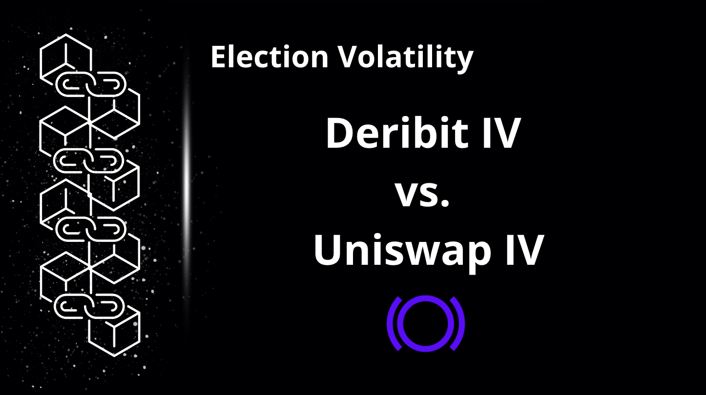
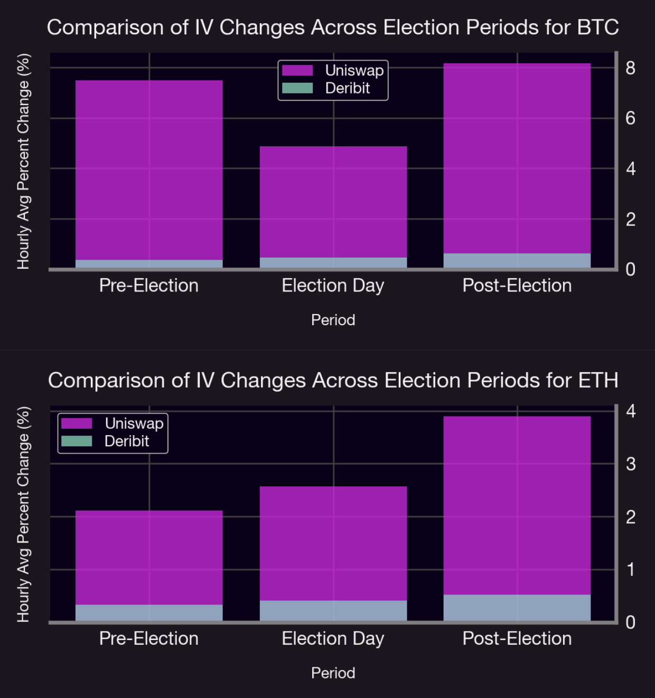
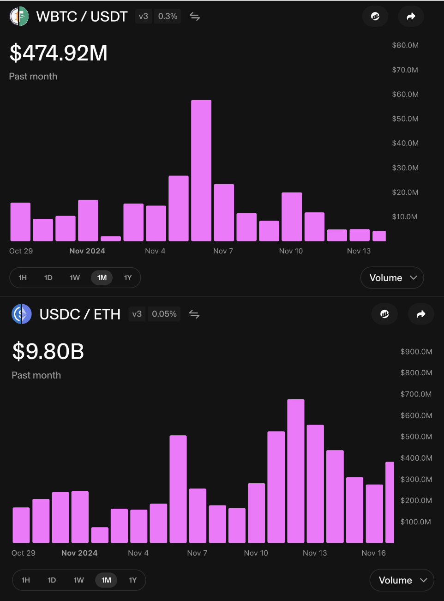
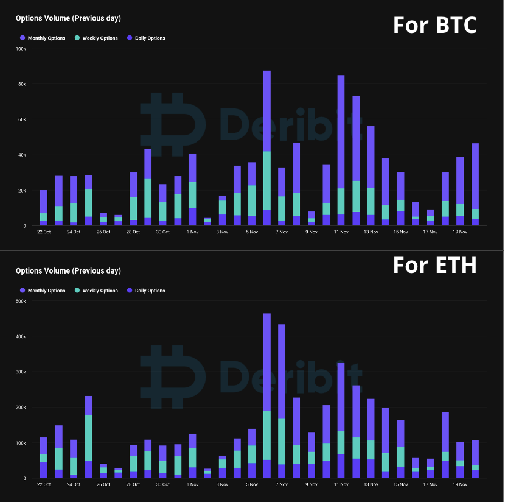

## Introduction

During politically charged periods like the U.S. presidential elections, volatility in financial markets takes center stage. By analyzing implied volatility (IV) trends for Bitcoin (BTC) and Ethereum (ETH) across centralized (Deribit) and decentralized (Uniswap) platforms, we uncover how different ecosystems react to uncertainty. Our findings reveal sharper and occasionally delayed IV spikes in decentralized markets, offering unique opportunities for traders during periods of heightened macroeconomic activity.

## Comparing Deribit vs. Uniswap

We analyze hourly data from October 22 to November 20, 2024, covering [Deribit DVOL](/research/comparing-uniswap-deribit-implied-volatilities#explanation-of-dvol) and [Uniswap IV](/research/new-formulation-implied-volatility) trends. For Uniswap, we focused on the liquid ETH/USDC (5 bps) and WBTC/USDT (30 bps) pools, which consistently rank high in Total Value Locked (TVL).

**Figure 1:** Comparative Analysis of Hourly and Normalized Implied Volatility: Uniswap IV (ETH/USDC 5 Bps Pool, WBTC/USDT 30 Bps Pool) vs. Deribit DVOL for ETH and BTC, highlighting implied volatility dynamics during the pre- and post-election period.

Key Observations:
1. **Delayed Reaction on Uniswap**: The first IV spike occurred on November 4 for Deribit but lagged until November 5 on Uniswap. However, the second spike on November 12 was synchronized between both platforms.
2. **Sharper Spikes in Decentralized Markets**: BTC on Uniswap experienced more pronounced volatility swings than on Deribit, suggesting decentralized markets are more reactive to macroeconomic uncertainty.
3. **More Integrated ETH Behavior**: ETH's IV trends were more aligned across both platforms, though occasional divergences hinted at speculative activity or liquidity imbalances in decentralized markets.

These differences reveal Uniswap's heightened sensitivity to election-related events and underscore the importance of understanding the [lead-lag relationship](https://panoptic.xyz/research/comparing-uniswap-deribit-implied-volatilities#cross-correlation) between centralized and decentralized markets.

### Segmenting Election Volatility

To better understand market behavior, we segmented the election cycle into three key periods:
1. **Pre-election period** (October 22, 2024, to November 4, 2024): Reflects the buildup to the election, where speculation and uncertainty increase.  
2. **Election day** (November 5, 2024): Isolates the immediate market reaction to the voting process and potential outcomes.  
3. **Post-election period** (November 6, 2024, to November 20, 2024): Focuses on the resolution phase, where markets adjust to confirmed results and their implications.  

In this analysis, we quantified and compared the implied volatility (IV) changes in Uniswap and Deribit markets during key election periods: pre-election, election day, and post-election. Using hourly IV data, we computed the percentage changes:

$$
\Delta IV = \frac{\lvert IV_t - IV_{t-1} \rvert}{IV_{t-1}} \times 100
$$

to measure the magnitude of fluctuations between consecutive points in time. These changes were segmented into the defined election periods, and average values were calculated for each timeframe. The results revealed that Uniswap's decentralized market exhibited larger IV fluctuations compared to Deribit's centralized market, particularly in the post-election period, highlighting the heightened sensitivity of decentralized markets to political uncertainty.

**Figure 2:** Comparison of Average Hourly Absolute Percent Changes in IV Across Election Periods for BTC and ETH: Uniswap exhibits consistently higher volatility changes than Deribit, with the most significant spikes occurring post-election, highlighting the heightened sensitivity of decentralized markets to political events.

The chart highlights the distinct dynamics of implied volatility changes in Uniswap and Deribit across key election periods.

During the **pre-election period**, Uniswap exhibited larger IV changes compared to Deribit, reflecting greater sensitivity to market movements.

On **election day**, both markets experienced increased IV changes, with Uniswap reacting more strongly, perhaps an indication of an inefficiency in LPs updating their positions on Uniswap.

The **post-election period** saw the largest IV changes, particularly in Uniswap, indicating prolonged volatility as the market processed election outcomes. In contrast, Deribit displayed smaller and more stable changes.

These results emphasize Uniswap's sensitivity to macroeconomic events and reveal potential opportunities for volatility arbitrage between DEX LPs and CEX options.

### Election Period Analysis
- **U.S. Presidential Election:** The impending election has heightened market uncertainty, leading to increased expectations of price swings in Bitcoin.
- **Market Anticipation:** Traders are preparing for potential market movements resulting from these significant events, contributing to the rise in implied volatility.  
- **Post-Election Decline in IV:** The decrease in IV immediately following the election (starting November 6) can be justified by the conclusion of the U.S. elections tempering implied volatilities, a phenomenon commonly referred to as *volatility crush*.

### Volume Breakdown

The Uniswap implied volatility, as defined by the [formula](/research/new-formulation-implied-volatility) below, increases when trading volume is high and tick liquidity is low, and decreases under the opposite conditions.

$$
IV = 2 \cdot \text{feeRate}\cdot  \sqrt{\frac{\text{Volume}}{\text{tickLiquidity}}}
$$

| Pool                | Daily Volume (Before Election) | Daily Volume (On Election Day) | Daily Volume (Post Election)     |
|---------------------|--------------------------------|--------------------------------|----------------------------------|
| USDC / ETH (5 Bps)  | Between $60M - $244M                  | $184M                          | Between $163M - $675M                   |
| WBTC / USDT (30 Bps)| Between $2M - $14M                    | $26.7M                         | Between $616K - $58M                    |

**Table:** Two weeks before and after the election are considered for the pre- and post-election periods, respectively, along with data from election day itself.

**Figure 3:** Daily volumes of ETH/USDC (5bps) and WBTC/USDT (30 bps) pools from October 29 to November 16. The chart depicts trading volumes in the USDC/ETH and WBTC/USDT pools over the past month. ETH/USDC shows significantly higher activity, with peaks around November 5 and 12, indicating periods of heightened market activity. In contrast, WBTC/USDT has lower overall volume and a peak on November 6, reflecting synchronized market movements across both pools.

In traditional options exchanges like Deribit, implied volatility is derived from the Black-Scholes pricing model for options. As a result, the factors driving IV differ from those in perpetual options on Uniswap. Key influences include:

1. **Supply and Demand Dynamics:** High demand for buying options raises prices and IV, leading to higher option premiums, while excess supply reduces IV and premiums.
2. **Time Value:** Short-dated options typically have lower IV due to reduced uncertainty, while long-dated options show higher IV due to greater potential for price swings. 
3. **Trading Volumes:** Volume surges during major events can drive IV higher, reflecting increased demand and heightened risk expectations. Conversely, low volumes can cause IV to decline.
4. **Imbalances in Trading Activity:** Heavy call or put buying can skew IV and amplify market reactions.

 
**Figure 4:** Options trading volume by timeframe for BTC and ETH on Deribit pre- and post-2024 US elections. Notable peaks in volume occur after November 5, coinciding with post-election increases in DVOL.

The chart displays options trading volumes for BTC and ETH across monthly, weekly, and daily contracts. Both assets exhibit significant spikes in activity around November 5 and 11, with BTC showing higher overall volumes compared to ETH. The prominence of monthly options suggests they dominate trading activity, while weekly and daily options see increased use during periods of market volatility.

Both assets exhibit significant spikes in activity around November 5 and 11, with BTC showing higher overall volumes compared to ETH. The prominence of monthly options suggests they dominate trading activity, while weekly and daily options see increased use during periods of heightened market volatility. This aligns with the observed increases in Deribit DVOL post-election, as traders recalibrate their strategies based on unfolding events and evolving risk expectations.

## Conclusion

The 2024 U.S. presidential election revealed significant differences in how centralized and decentralized markets respond to macroeconomic events. Uniswap's larger and delayed IV fluctuations compared to Deribit highlight inefficiencies that can be leveraged for trading strategies like LP-options arbitrage.

As DeFi evolves, innovations like shorting liquidity positions on Uniswap through Panoptic offer exciting pathways to balance volatility and enhance market efficiency. Traders who understand these dynamics will be well-positioned to navigate the complexities of election-driven markets.

*Join the growing community of Panoptimists and be the first to hear our latest updates by following us on our [social media platforms](https://links.panoptic.xyz/all). To learn more about Panoptic and all things DeFi options, check out our [docs](https://panoptic.xyz/docs/intro) and head to our [website](https://panoptic.xyz/).*