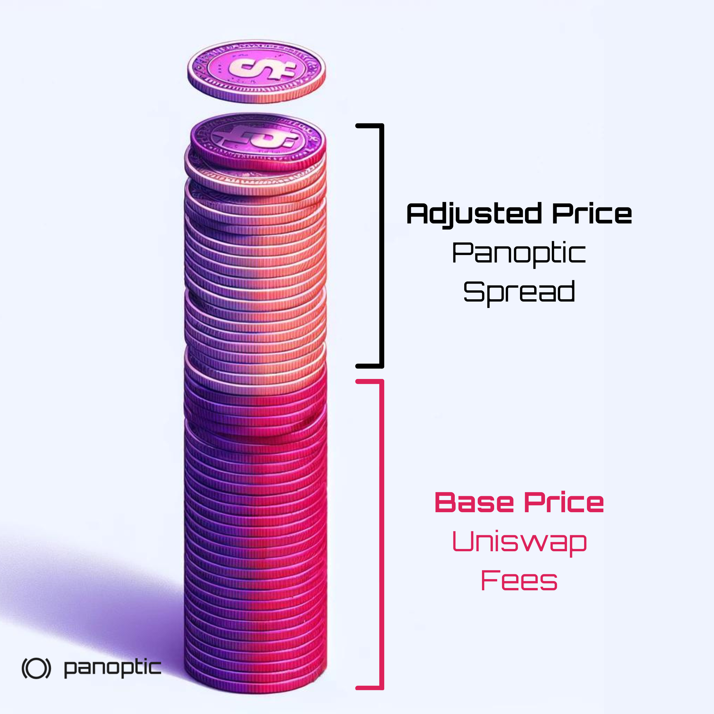

The concept of spread is pivotal in traditional finance, indicating market liquidity and the cost associated with trading by showing the gap between buying and selling prices. Panoptic's perpetual options pricing mechanism implements a liquidity-based spread, enhancing price discovery and efficiently adjusting prices in response to market forces.

Panoptic's pricing mechanism, as highlighted in the [streamia](https://panoptic.xyz/research/streamia-101) article, involves a base price supplemented by an adjusted price, where the spread acts as this vital adjustment mechanism.

### Questions We’ll Answer

-   What is the spread in Panoptic?
-   How does the spread relate to implied volatility (IV)?
-   How does the spread affect the cost of an option?
-   What strategies can buyers and sellers employ to take advantage of the spread?

## Spread in Panoptic

In Panoptic, the spread is a dynamic element within the perpetual options pricing model, adjusting option costs in line with market conditions, available liquidity, and trading activity. This innovative application ensures that option pricing remains responsive at all times.

The spread ranges from 1x to 3.25x and is visible on the trading page when a strategy has been selected. The spread is symbolized by the letter &nu;, short for vegoid, a variable reminiscent of the vega in traditional options pricing.

### Exploring Implied Volatility in Panoptic

Implied volatility (IV) represents the market's expectations for the volatility of an asset in the future. In Panoptic, the base price of an option depends on the realized volatility — the historical price movements, whereas the spread mirrors the implied volatility, offering insights into anticipated market movements and sentiment.

### Spread as Bonus Yield

In the context of Uniswap Liquidity Providers (LPs), the spread offers LPs an additional source of yield for lending out their LP tokens, which act of lending is [akin to selling a perpetual option](https://panoptic.xyz/research/defi-put-options-uniswap-backtest#lp--short-put). This arrangement enhances the returns on LPing, presenting an attractive opportunity for LPs to maximize their earnings.

## Impact of Spread on Option Costs

The spread directly influences the cost of options within Panoptic, with fluctuations reflecting changes in liquidity. When few options contracts have been sold, a wider spread results in a higher cost. When many options contracts have been sold, a narrower spread results in a lower cost.

### How Does the Spread Impact Sellers?

For sellers, the spread represents an opportunity to earn higher streamia on their options. As the spread widens, sellers receive more compensation, reflecting the higher demand associated with their provided liquidity.

### How Does the Spread Impact Buyers?

Buyers are affected by the spread as it determines the streamia they pay for options. A wider spread means a higher cost, which buyers must consider when making trading decisions. Understanding the factors that influence the spread can help buyers strategize and potentially minimize their costs.

### Example of the Spread in Action

Consider an ETH call option with a $2,000 strike purchased in Panoptic. Over a single block, suppose this option accrues a base amount of streamia equal to $0.01. With a spread of 3x, the total cost becomes $0.03. This cost consists of $0.01 from the base Uniswap fees plus $0.02 from the Panoptic spread, demonstrating how the spread effectively increases the cost associated with the option's base streamia.

## Strategies to Leverage the Spread

Both buyers and sellers can deploy strategies to capitalize on the spread dynamics:

-   For Sellers: Monitoring market trends and liquidity can help anticipate when the spread might widen, potentially increasing returns from options sold.
-   For Buyers: Identifying periods when the spread narrows could reduce the cost of purchasing options, enabling more strategic entry points into the market.
    

### Setting Spread Tolerance on the App

Panoptic allows traders to [set a maximum limit](https://panoptic.xyz/research/opening-a-position-on-panoptic#slippage-tolerance-and-spread-limit) on the spread when buying an option, providing a mechanism to manage risk when entering a position. It's important to note that this setting does not affect positions after they are opened. Traders should remain vigilant, as widening spreads after opening a position won't automatically adjust or close the position, emphasizing the need for active management and monitoring of open trades.

  
*Join the growing community of Panoptimists and be the first to hear our latest updates by following us on our social media platforms. To learn more about Panoptic and all things DeFi options, check out our docs and head to our website.*
