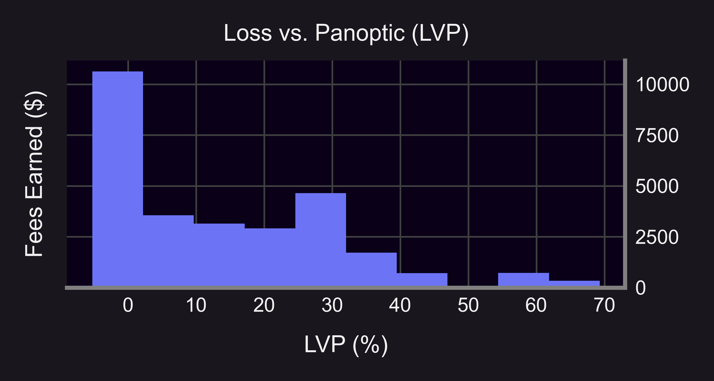
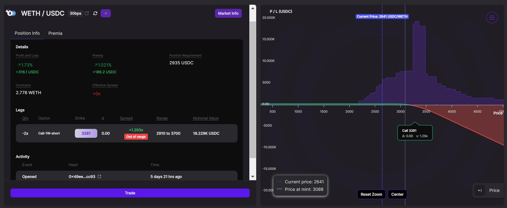
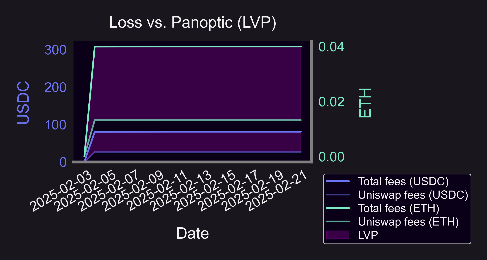
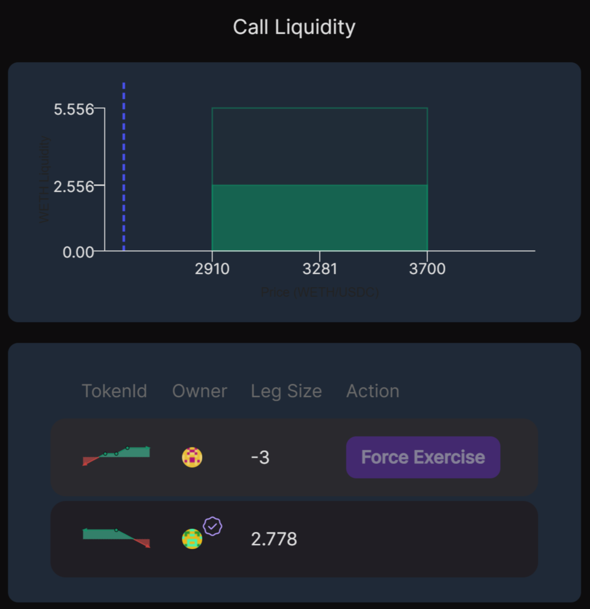
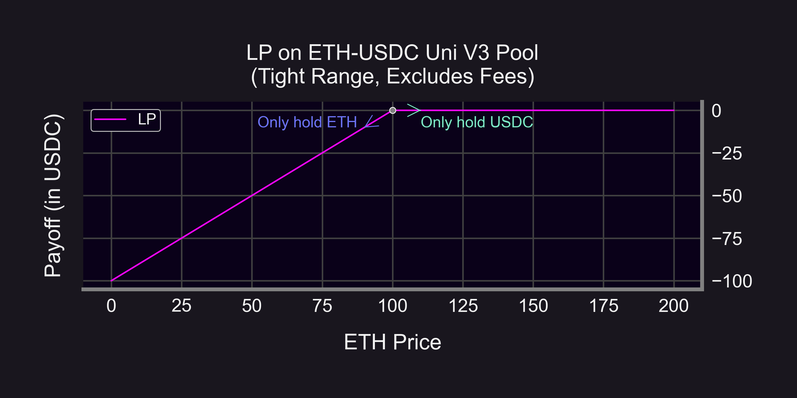

Liquidity providers (LPs) on Uniswap know that achieving the highest possible returns often boils down to positioning their capital in the most efficient way. But there’s a new metric that reveals just how much LPs may be leaving on the table: **Loss Versus Panoptic (LVP)**. LVP measures the difference between fees earned by providing liquidity **directly** on Uniswap versus **through** Panoptic, a protocol that layers a decentralized options market on top of Uniswap v3 and v4.

In certain pools, we’ve seen LVP climb as high as **67%**—meaning an LP position on Uniswap could be earning just **one-third** of what it would earn by being lent out on Panoptic. How does such a gap arise? Let’s dive deeper into how Panoptic works and why adding an options layer can transform a plain old LP position into a high-powered revenue generator.

----------

## What Is Panoptic?

Panoptic is an on-chain, perpetual options protocol built on top of Uniswap v3 and v4. It enables LPs to lend or “sell” their Uniswap LP positions to options traders. In return, LPs collect [additional premiums](/docs/product/streamia)—on top of standard swap fees—that reflect traders’ demand to speculate or hedge using calls and puts.

**1. Same position, higher returns:** Panoptic LPs earn everything they would on Uniswap plus additional option premiums.

**2. No idle liquidity:** If a portion of your LP is borrowed by an options trader, the protocol ensures you receive at least the Uniswap fees you otherwise would have earned, plus a spread-based bonus from the option buyer. 

**3. Strictly Greater Returns:** As long as there is a single option buyer on Panoptic, Uniswap LPs earn more by deploying through Panoptic versus directly on Uniswap.
    

----------

## Why LPs on Panoptic Outperform

### Panoptic’s On-Chain Options Layer

-   **Traditional Uniswap:** You deposit liquidity in a specified price range and earn swap fees when trades occur in that price range.
-   **Panoptic:** Your position is still deployed on Uniswap, but now it’s also available to be “borrowed” by option buyers. If someone wants to buy an option, they effectively borrow your LP token—paying you the Uniswap fees you would have earned plus an additional premium called the **Panoptic spread.**
    

### The “Panoptic Spread”

At the heart of Panoptic’s extra yield is the [spread](/docs/product/spread), a dynamic element that reflects implied volatility and demand for options. Here’s the key idea:

-   **Base fees:** Any borrowed LP position must pay the LP the same swap fees they’d have earned if the position stayed in Uniswap.
-   **Spread:** On top of that, Panoptic charges an additional cost (the spread) to the option buyer. The spread flows to the LP as extra income—effectively a “bonus yield” for lending out liquidity.
    

That difference—the spread—makes the Panoptic position strictly more profitable than a standard Uniswap position, so long as there is demand for options. The higher the demand, the higher the spread.

## LVP (“Loss vs. Panoptic”)

Loss Versus Panoptic (LVP) quantifies how much an LP loses out on by staying in vanilla Uniswap. If a Panoptic LP position can generate 3× more total fees, the LVP is roughly 67%—meaning the vanilla LP leaves two-thirds of potential revenue uncollected. We’ve seen typical LVP values hovering around 15–20% in the WETH–USDC pool.

| Borrowed LP Positions in WETH/USDC 0.3% | Loss vs. Panoptic (LVP) |
|-----------------------------------------|-------------------------|
| Mean                                    | 17.6%                   |
| Min                                     | 0.0002%                 |
| Median                                  | 8.3%                    |
| Max                                     | 69.3%                   |

If we plot the distribution of LVP in the WETH/USDC 0.3% pool, we see that LVP ranges from 0%-69%, with a significant spike around 30% LVP. That means that a significant amount of Uniswap LPs could be earning 1.43x more fees on Panoptic.

The other significant spike in LVP is around 0%, which tells us that a significant amount of LPs are earning the same amount on Panoptic as Uniswap. This is due to lack of buyer demand, which could indicate that these LPs are selling positions in less desirable price ranges or that option buyers are not taking advantage of the abundance of liquidity on Panoptic.

For those interested in a deeper dive into the data, feel free to explore our [open-source GitHub research repo](https://github.com/panoptic-labs/research/tree/main/_research-bites/20250213). You can replicate our analyses and run your own experiments with the underlying data.

----------

### Real-World Example: Borrowed Call Option

In a [recent WETH–USDC position](https://app.panoptic.xyz/positions/ethereum/0x2802fb20205003c8ad599c3a0ff?view_as=0xb15617cc71ece317e24360fc3b5643c6f5f51733), an LP would earn ~$61 in fees when providing directly on Uniswap v3. However, the identical position deployed through Panoptic captured ~$186. That’s a **3.1×** increase—translating to an LVP of 67% for the vanilla Uniswap strategy. Here’s the earnings broken down in terms of both tokens:

-   🦄 LP directly on Uniswap: $26.71 USDC & 0.013 ETH ($61)
-   🟣 LP on Uniswap through Panoptic: $80.66 USDC & 0.04 ETH (~$186)
    

(WETH-USDC 0.3% LP, price range from $2,910 to $3,700)

The 3.1x gains came from this [option buyer](https://app.panoptic.xyz/positions/ethereum/0x2802fb2080302802fb2030305002fb20603003c8ad599c3a0ff?view_as=0xfa1dfec1e8ed966c61c45797a3d58666cf2ae708&block_number=21808997) who borrowed the LP position as part of a more complicated trade to create a [covered call](//research/naked-covered-call-defi-options) position, which involved [buying a synthetic perp](//research/introduction-synthetic-perps) while selling a call option.

  

The process in which the additional yield driving LVP stems from is described below:

1.  **LP Lists an Option**  
    By depositing liquidity (e.g., WETH–USDC) into Uniswap through Panoptic, the LP signals willingness to sell an option. A portion of that liquidity is now available to be borrowed by anyone wanting to buy an option.
    
2.  **Trader Buys the Option**  
    A bullish or bearish trader sees an opportunity to leverage up on an ETH trade. They borrow and short the LP position—effectively purchasing an option.
    
3.  **LP Earns Extra Fees**  
    In addition to the usual Uniswap swap fees, the LP collects the option premium. This extra payment can significantly boost yield—resulting in the kind of outperformance we saw in the WETH–USDC example.
    

In a typical Uniswap arrangement, that same LP capital would have simply sat at its chosen price range, hoping for enough swaps in-range to generate fees. Now, thanks to the call buyer’s demand, the LP captures **extra** revenue from the option premium.

----------

## Bullish and Bearish LP Positions

A subtle but important feature is that Panoptic allows LPs to choose from **bullish, bearish, or delta-neutral positions**—far beyond what’s possible with traditional Uniswap positions:

-   **Uniswap:** Every LP position deployed in Uniswap will always lose value if the pool’s price falls. This is because [LP positions are naturally bullish](https://panoptic.xyz/blog/uniswap-lp-equals-options).

-  **Panoptic:** LP positions can be deployed as bullish, bearish, or delta-neutral. This is achieved through Panoptic’s built-in lending market, which lets LPs [combine the borrowing and shorting of underlying tokens with their LP position](https://lambert-guillaume.medium.com/how-to-deploy-delta-neutral-liquidity-in-uniswap-or-why-euler-finance-is-a-game-changer-for-lps-1d91efe1e8ac), effectively creating a neutral or bearish LP position.
    

This flexibility means that even in bearish markets, an LP can profit. For example, if ETH’s price drops, a Panoptic LP with a bearish position can earn the same Uniswap fees, pocket the additional options premium, and see the option end up worthless for the buyer—resulting in a net gain.

In the example above, the LP’s bearish position on Panoptic netted $316.10 in total profits.

-   $61 (19%) was from base Uniswap fees
-   $125.20 (40%) was from the additional options premium
-   $129.90 (41%) was from the ETH price dropping.
    

----------

## **Key Takeaways**

1.  **LVP (Loss vs. Panoptic) is Real**
	-   Empirical data shows an LVP as high as 67% in certain ranges, meaning Uniswap-only positions can under-earn by a wide margin compared to Panoptic.
3.  **Extra Fee Income from Options**
	-   Option premiums + swap fees often exceed what a comparable Uniswap-only position would generate.
5.  **Flexible Bullish or Bearish Exposure**
	-   Unlike vanilla Uniswap, Panoptic LPs can choose to be bullish, bearish, or even delta neutral when providing liquidity, reaping profits in different market conditions.
7.  **A More Complete Market**
	-   Panoptic effectively layers a robust options market on top of Uniswap, capturing a portion of traders’ demand for leverage or hedging—demand that, until now, was missed by standard liquidity providers.
    

----------

## **Conclusion**

If you’ve ever wondered how to amplify your Uniswap LP returns without constantly rebalancing or trying to time the market, Panoptic offers a compelling solution. By monetizing volatility via on-chain options, your liquidity is more actively employed, and you collect both swap fees and option premiums.

Ultimately, Loss Versus Panoptic is a reminder that liquidity left in a vanilla Uniswap position can miss out on significant income. Whether you expect markets to boom or bust, the flexibility to create bullish or bearish LP positions can turn typical LPing into a powerful, dynamic strategy.

*Join the growing community of Panoptimists and be the first to hear our latest updates by following us on our [social media platforms](https://links.panoptic.xyz/all). To learn more about Panoptic and all things DeFi options, check out our [docs](https://panoptic.xyz/docs/intro) and head to our [website](https://panoptic.xyz/).*
