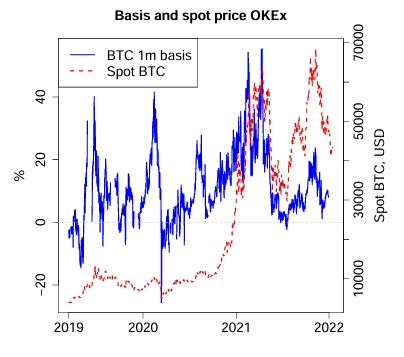

In recent decades, options trading strategies capitalizing on volatility suppression have ironically amplified the exact turmoil that these types of tactics are designed to subdue. [Market feedback loops](https://blogs.cfainstitute.org/investor/2019/01/07/robert-j-shiller-on-bubbles-reflexivity-and-narrative-economics/) have gradually become one of the primary drivers of underlying price dynamics through the advent of vehicles such as [structured products](https://cryptoeconomicsystems.pubpub.org/pub/evans-g3m-returns/release/4?readingCollection=a1e776d2) and [volatility carry](https://thehedgefundjournal.com/harvesting-the-volatility-risk-premium-globally/) strategies. A “tail-wagging-the-dog” precedent has steadily gained prominence to where mechanical hedging processes can dictate the direction of underlying prices as opposed to vice versa. How is this property manifested?

  

One notable example is the infamous [Black Monday](https://caia.org/sites/default/files/03_volatility_4-2-18.pdf) event of 1987, when the S&P 500 plummeted over 20% in a single trading session. Analysts today widely attribute this dramatic crash to the widespread use of [portfolio insurance](https://www.amazon.com/Demon-Our-Own-Design-Innovation/dp/0470393750)—a hedging strategy that functions like a rolling stop-loss mechanism, systematically selling index futures as underlying prices fall, thereby exacerbating downward pressure.

A more recent scenario unfolded in early 2021 with the GameStop (GME) saga. As GameStop's stock price surged, institutions with short [Out-of-The-Money](/docs/product/moneyness#introduction) (OTM) call positions were compelled to buy large amounts of the underlying stock to hedge their exposure. This hedging activity, in turn, pushed prices even higher, creating an accelerating feedback loop.

Both cases highlight a crucial connective element: [short volatility positions](https://arxiv.org/pdf/2106.14404) embedded within market structures create extreme and episodic volatility spikes when triggered. While such extreme volatility events are unusual quirks within equity markets, what if this phenomenon is actually a crypto market norm?

  

This article will explore how crypto market structures are inherently riddled with at least seven gamma traps that enable wild price action through self-perpetuating feedback loops.

## Deribit Coin-M Options

Deribit is the largest crypto options exchange in the world by volume and maintains an inherently reflexive margin system. Broadly speaking, [reflexivity](https://insights.deribit.com/market-research/momentum-bitcoin-and-reflexivity/) is a theory of market efficiency characterized by the conceptual [pillars](https://www.amazon.com/Alchemy-Finance-George-Soros/dp/0471445495) of markets always being biased in one direction or another as well as markets influencing events that they anticipate. But how does the banner of reflexivity apply to Deribit? Options listed on Deribit have the [inverse structure](https://onlinelibrary.wiley.com/doi/epdf/10.1111/mafi.12410) of being settled and [margined](https://statics.deribit.com/files/USDCContractSpecsandmargins.pdf) in crypto tokens, not USD.

  

  

Crypto derivatives products are largely categorized into distinct groups of being either USD-margined (USD-M) or coin-margined (Coin-M). Since Deribit options fall under the domain of being [Coin-M](https://www.coindesk.com/markets/2021/05/21/cme-returns-to-second-place-in-latest-rankings-of-bitcoin-futures-exchanges), the Deribit margin apparatus contains negative convexity, which in turn leads to “[liquidation cascades](https://www.coindesk.com/markets/2022/10/18/growing-popularity-of-cash-margined-bitcoin-futures-suggests-that-crypto-liquidation-cascades-might-become-rare)” as the collateral deposited on the exchange is as volatile as the trading positions themselves. This form of risk management and collateralization is truly a proverbial double-edged sword for traders due to increasing underlying prices being realized in increased positional “[dry powder](https://x.com/tradeparadigm/status/1619014867259908096),” while decreasing prices create compounded losses.

## Uniswap Price Doom Loop

Uniswap Liquidity Provider (LP) positions deployed in the ETH/USDC pool over a certain price range would be converted to ETH as the position dips below the lower bound of the price range, while conversely being converted to USDC as the position crosses the upper bound of the price range. So Uniswap LPs ostensibly face the same dilemma as Deribit depositors, but in this case, the dilemma is asymmetrically skewed to undercut token prices. We have already profiled the presence of the “[Uniswap Price Doom Loop](/research/derivatives-solve-uniswap-doom-loop#the-doom-loop)” resulting from this downward sequence of Uniswap LP rebalancing and hedging. LP positions are statistically akin to short [perpetual put options](/blog/uniswap-lp-equals-options#lps-are-options-sellers), meaning that downward fluctuations of the underlying token price would force the LP to short additional tokens for proper hedging. Thus, hedging Uniswap LP shares extends additional negative pressure to token prices.

  

## DeFi Option Vaults (DOVs)

DeFi Option Vaults (DOVs) deploy [strategies](https://uploads-ssl.webflow.com/665df6a78e9a68513d9631f6/6698372c5269a64cdd4e3ab6_TWO-PRIME_-DeFi-Option-Vaults.pdf) that are primarily limited to [covered calls](/docs/terms/covered) and [cash-secured puts](https://www.tastylive.com/concepts-strategies/cash-secured-put). Both tactics entail shorting volatility (gamma), be it OTM calls in the case of covered calls or OTM puts in the case of cash-secured puts, while also holding the underlying in covered calls or cash reserves to purchase the underlying in cash-secured puts. Both strategies are predicated on the motivation for [income generation](/research/reasons-why-options-important-in-crypto-market#3-income-generation) as well with options selling constituting a steady revenue stream for retail crypto traders. Although, it does bear noting that the [popularity](https://www.coindesk.com/markets/2024/04/10/the-rise-of-crypto-options-and-structured-products) of DOVs has recently dwindled with realized volatility (RV) having a more consistent premium to implied volatility (IV) subsequent to the apex of DOVs in late 2021/early 2022 when the opposite premium was occurring.

  

Not only are retail traders placed at a disadvantage with short gamma strategies if underlying prices tick strongly upward or downward by needing to chase the market for hedging, DOVs also place them in the unique position of having to combat the timing of auctions. DOV auctions are often anticipated and [front-run](https://www.coindesk.com/markets/2022/04/19/crypto-options-traders-adopt-new-strategies-to-profit-from-defi-volatility-gyrations) by crypto options market makers due to price pressures extended from these vaults when selling options through the auction process. Market makers will sell options ahead of DOV auctions to further contribute to this downward pressure, then summarily repurchase the options once the auction has concluded. Retail traders who participate with DOVs are then placed in the unenviable position of both being short gamma and having sold volatility at a seasonal low due to temporary deflation of IV and options premia by market makers. The below [visual](https://www.paradigm.co/blog/paradigm-defi-options-vaults) depicts how extreme the weekly ETH IV depression becomes when centered around the DOV auction process on Fridays.

## Gamma Exposure (GEX)

Options market makers have notionally long gamma inventory within traditional asset classes such as equities, but in less developed asset classes like crypto, there is increased potential for options market makers to have chokepoints of negative gamma inventory. A standard computation for the net gamma of market maker inventory was not accessible until a few years ago when SqueezeMetrics derived [Gamma Exposure](https://squeezemetrics.com/download/white_paper.pdf) (GEX).

The above [figure](https://squeezemetrics.com/download/The_Implied_Order_Book.pdf) indicates that SPX option market maker GEX only approached negative territory for a few fleeting periods within a 16-year span from 2004 to 2020.

Standing in stark contrast to SPX options, the above pair of charts narrowly cover only a 1-year span ranging all of 2023. Yet, BTC options market makers predominantly have negative GEX inventory for the duration of 2023 and the inventory of ETH options market makers crosses into negative GEX at a fairly high rate throughout 2023 as well. Considering the relatively nascent maturation stage of crypto derivatives markets, options market makers in crypto are demonstrably at higher risk of incurring negative GEX portfolios than equity options market makers. These commonplace negative GEX holdings then create a vacuum where these crypto options market makers are forced to buy into rallies and sell into downturns for attainment of delta-neutrality, exacerbating the severity of any underlying price gyrations.

## Sticky Delta Regime

Options traders conventionally have one central tenet that demands their collective attention: thorough and dynamic management of options [Greeks](/docs/terms/greeks) risk. Broadly speaking, traders can be divided into two main strategic categories: [reverse gamma scalping](/research/reverse-gamma-scalping) (selling [At-The-Money](/docs/terms/at_the_money)/ATM  [straddles](/research/defi-option-straddle-101), effectively providing market insurance on underlying realized volatility) and [vega](/research/understanding-the-greeks-series#vega-%CE%BD) relative-value trading (arbitraging market pricing inefficiencies across the full scope of the [volatility smile](/docs/terms/volSmile)). We have previously outlined that when options traders are net short gamma, they are subsequently forced to buy the underlying going into rallies and sell going into downturns to maintain [delta-neutrality](/research/options-market-making#delta-neutral-trading) for their respective portfolios (e.g. reverse gamma scalping). A key consideration for these strategies is whether implied volatility surfaces move alongside underlying prices—a phenomenon commonly described through different "[sticky](https://emanuelderman.com/wp-content/uploads/1999/03/risk-regimes_of_volatility.pdf)" volatility regimes.

  

The "sticky strike" model assumes implied volatilities are fixed at particular strike prices regardless of the underlying's movement, suggesting a range-bound market without meaningful volatility shifts due to price changes. The “sticky strike” paradigm is the rule of thumb that is also consistent with [Black-Scholes (BS)](/docs/terms/blackscholes) model parameters.

In contrast, the "sticky delta" regime emerges in trending markets, featuring a positive correlation between underlying price movements and implied volatility. Here, implied volatility remains relatively constant for a given level of moneyness rather than at a fixed strike. This correlation between price and implied volatility demands deeper analysis, as it can significantly impact hedging behaviors.

Recent data on BTC and ETH reinforces this point. Examining daily spot prices against their respective [DVOL](/research/comparing-uniswap-deribit-implied-volatilities#explanation-of-dvol) indexes shows a marked increase in positive correlation since January 2023, with approximately 71% of BTC 30-day windows and 65% of ETH 30-day windows exhibiting positive correlations compared to just 42% and 43%, respectively, from earlier periods. Based on this empirical trend, we operate under the assumption that crypto markets are currently dominated by a sticky delta regime.

  

Under the sticky delta regime, standard Black-Scholes [delta](/docs/terms/delta) calculations become less effective. Instead, traders must use a modified hedge ratio–the smile-implied delta–expressed as:

$$
\delta^{SD} = \delta^{BS} - \nu_{BS} \, \theta_m \, \frac{m}{F}
$$

_Where_  
$\delta^{SD} = \text{Smile-implied delta}$  
$\delta^{BS} = \text{Black-Scholes delta}$  
$\nu_{BS} = \text{Black-Scholes vega}$  
$\theta_m = \text{Implied volatility curve slope}$  
$m = \text{Options moneyness}$  
$F = \text{Underlying price}$  

Within a sticky delta regime (positive spot-vol correlation), hedging actions differ significantly from standard assumptions. Because of a positively sloped $\theta_m$ parameter, $\left( \nu_{BS} \, \theta_m \, \frac{m}{F} \right)$ the correction term (i.e. skew delta) is negative and the delta of call (put) options will be biased toward 0 (-1).

  

Consequently, a trader selling an out-of-the-money (OTM) put will systematically over-hedge by selling additional underlying assets as prices decline, amplifying downward price momentum. Conversely, selling an OTM call option results in systematic under-hedging. The trader buys insufficient quantities of the underlying such that an upward drift in price could result in a rush to correct the initial under-hedge and apply even more upside pressure, fueling explosive upward price moves in the event of a [gamma squeeze](https://www.tastylive.com/news-insights/gamma-squeeze-explained-basic-options-theory-and-how-it-works).

  

Notably, [recent evidence from January 2020 to 2022](https://www.tandfonline.com/doi/epdf/10.1080/14697688.2023.2181205?needAccess=true) shows that sticky delta–adjusted hedges provided better accuracy for BTC OTM calls and puts compared to standard Black-Scholes deltas.

  

Ultimately, sticky delta is one of the unique volatility-driven dynamics that shape crypto market structure, naturally facilitating significant feedback loops. Unlike traditional markets, where volatility-related anomalies are notable exceptions, crypto markets inherently have these volatility mechanisms, routinely triggering pronounced upward and downward price fluctuations through self-perpetuating hedging processes.

## Negative Vanna Gamma Squeeze

[Vanna](https://moontowermeta.com/how-options-confuse-directional-traders/) is a 2nd-order options Greek that characterizes either changes in delta with respect to changes in implied volatility ($\frac{\partial \Delta}{\partial \sigma}$) or changes in vega with respect to changes in the underlying spot price ($\frac{\partial \nu}{\partial S}$), so vanna functions as a Greeks-centric expression of evolving dynamics in spot-implied volatility correlation. OTM calls are [assigned](https://www.amazon.com/Volatility-Practical-Options-Theory-Finance/dp/111950161X) positive vanna and OTM puts are assigned negative vanna, while calls have positive delta and puts have negative delta. In the broader context of positive spot-volatility correlation, vanna would act as an explosive complement for net short gamma chokepoints to the upside (short OTM calls), while truncating spirals at net short gamma chokepoints to the downside (short OTM puts).

Being short an OTM call would render an options market maker both short gamma and vanna, meaning that if spot increased with implied volatility, the options market maker would be forced to buy even more of the underlying to delta-hedge as the negative vanna and negative gamma would have a dually depressing effect on the portfolio delta of the market maker. If spot decreases with implied volatility and the options market maker is short an OTM put option, the market maker would need to sell more of the underlying for delta-hedging the negative gamma position, but the market maker would also simultaneously need to buy more of the underlying due to the positive vanna position. The decline in implied volatility would translate to a decline in the portfolio delta in this short OTM put scenario, so negative gamma and positive vanna act as counterbalancing elements to possible downward price cascades in a positive spot-volatility regime. Conversely, a negative vanna supplement to a short OTM call gamma squeeze (i.e. [negative vanna gamma squeeze](https://x.com/dgt10011/status/1837278352823972147)) in this type of market climate would be an injection of potent ammunition for driving upward price trajectory.

## Convenience Yield

In commodities markets, the [convenience yield](/research/derivatives-solve-uniswap-doom-loop#derivatives-complete-spot-markets) measures the benefit of holding a physical commodity rather than futures contracts, particularly during shortages. Traditionally, this benefit can be [conceptually compared to owning a call option](https://www.sciencedirect.com/science/article/abs/pii/S0264999312002489), where holding the physical commodity provides flexibility to respond to supply disruptions.

  

However, crypto markets exhibit a different pattern: the convenience yield tends to be [negative](https://onlinelibrary.wiley.com/doi/abs/10.1002/fut.22216). Instead of acting like a call option (benefiting from scarcity), holding spot crypto conceptually behaves like owning a put option. This [negative convenience yield](https://www.tandfonline.com/doi/pdf/10.1080/14697688.2012.723463) arises primarily because traders prefer futures contracts for their leverage and speculative potential, leading to an elevated futures price relative to spot (widening futures basis). Additionally, this effect is reinforced by high demand for downside protection, evident in the crypto options markets through increasingly negative volatility skew and elevated put-call ratios. Crypto out-of-the-money (OTM) puts are particularly expensive due to retail traders' demand for [crash-risk insurance](https://papers.ssrn.com/sol3/papers.cfm?abstract_id=4268371).

  

Consequently, when crypto prices decline, the negative convenience yield intensifies selling pressure: spot holders are incentivized to sell, fueling further price declines and creating a self-perpetuating downward spiral. This dynamic was notably [observed in 2021](https://papers.ssrn.com/sol3/papers.cfm?abstract_id=4268371), where peaks in futures premiums preceded significant drops in BTC spot prices. Unlike traditional commodities, crypto’s negative convenience yield intensifies volatility and downward price cascades. Owning futures in conventional commodity markets is akin to selling a call option, whereas owning futures in crypto approximates selling a put option. The crypto convenience yield tracks similarly to the already highlighted “Uniswap Price Doom Loop” in that it is a structurally embedded and pervasive short put option within the crypto marketplace.
  

## Conclusion

In this study, we have detailed a seven-pronged cocktail of crypto-native gamma traps that could arise at any time to instigate self-cascading crypto price feedback loops. As with the vagaries of many commodities, certain market peculiarities solely pertain to that commodity and only that commodity, such as crypto volatility markets being rife with gamma traps. This immutable characteristic of crypto cannot then be deemed as resolvable, but it is tradable.

Panoptic seamlessly empowers traders to buy options by virtue of [shorting Uniswap LP shares](/research/panoptic-solves-lvr#solution-3-users-can-short-uniswap-lp-positions) as well as [passively collecting yield](/blog/bringing-passive-liquidity-to-uniswap#where-does-the-yield-come-from) through liquidity provision to option buyers. Described simply, going long on volatility is the only method through which to properly capitalize on these underlying price feedback loops. Panoptic enables traders to long volatility, all while remedying pervasive on-chain trading dilemmas through turning [LVR](/research/panoptic-solves-lvr) on its head and [reversing](/research/derivatives-solve-uniswap-doom-loop) the Uniswap Price Doom Loop. A newfound asset class like crypto with previously uncharted volatility scenarios demands an options protocol with the type of powerful versatility that only Panoptic can service.

*Join the growing community of Panoptimists and be the first to hear our latest updates by following us on our [social media platforms](https://links.panoptic.xyz/all). To learn more about Panoptic and all things DeFi options, check out our [docs](/docs/intro) and head to our [website](https://panoptic.xyz/).*
