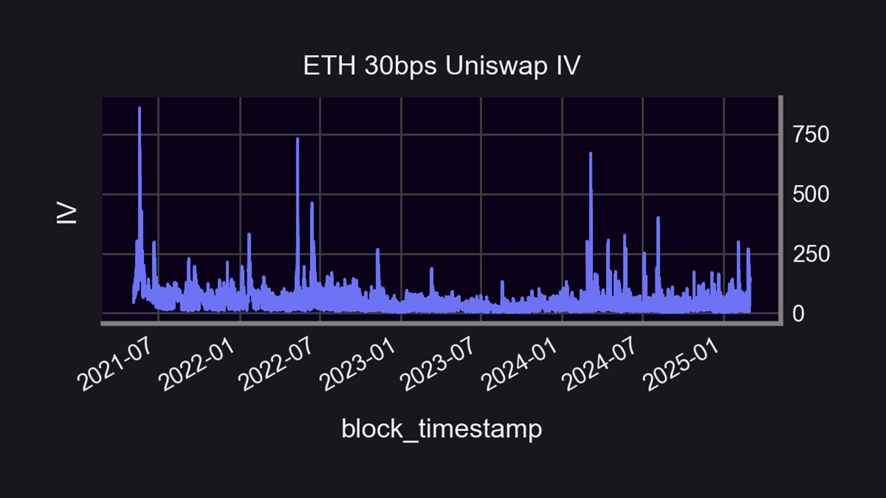
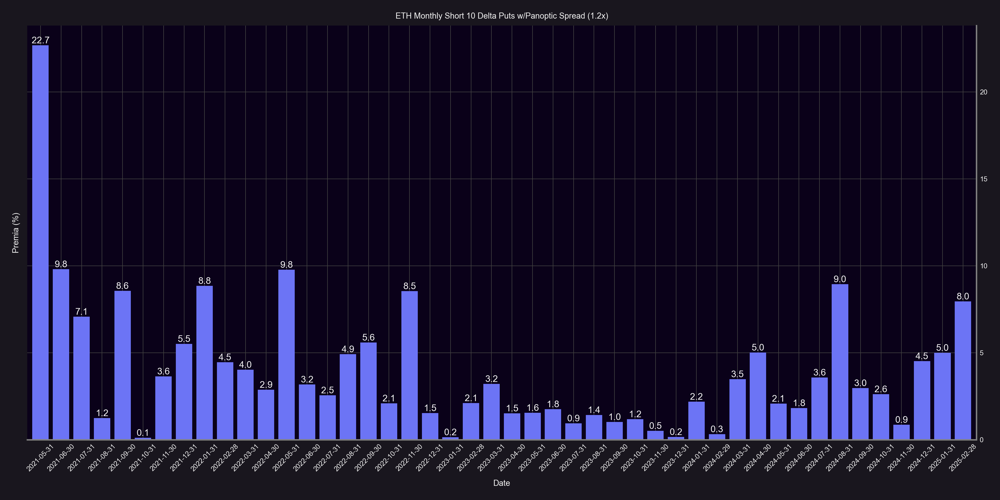
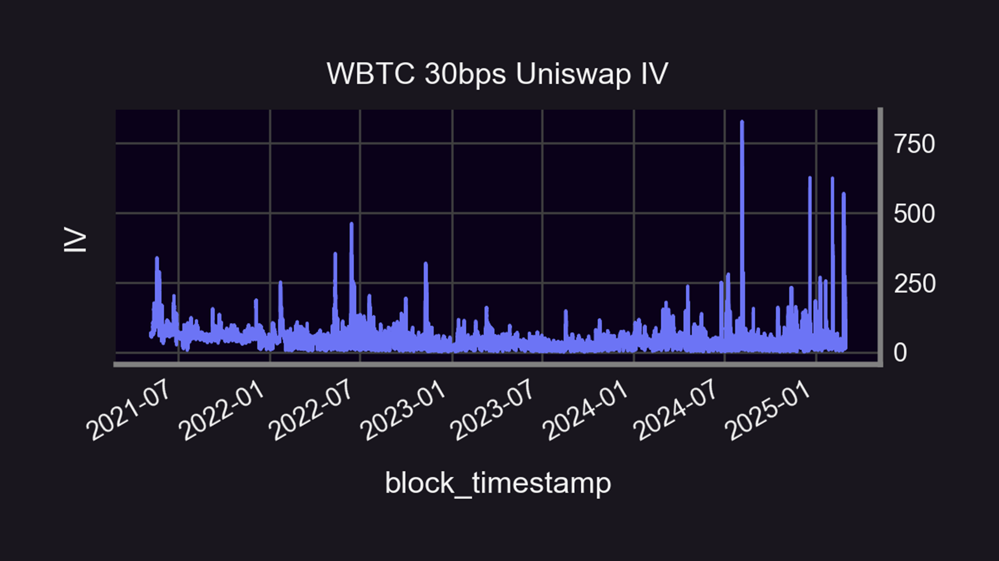
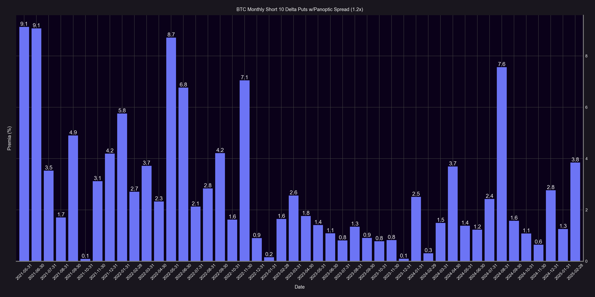
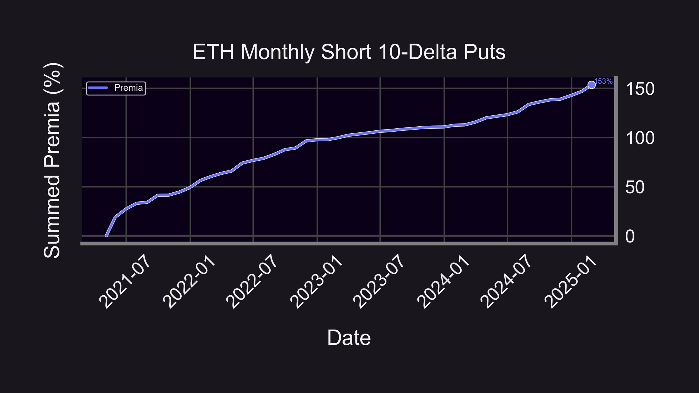
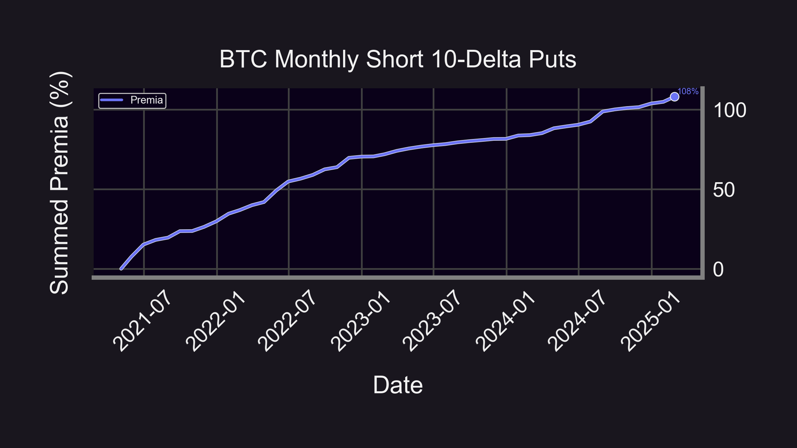
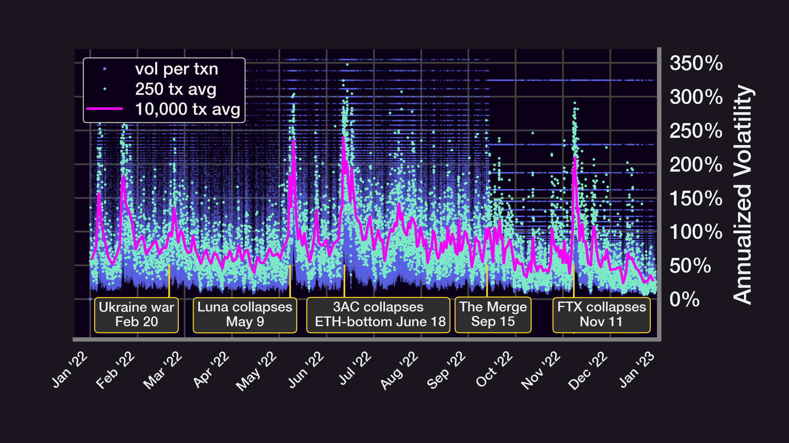

In volatility trading, the wings (also known as “teenies”) always merit additional scrutiny in that they contain the most [convexity](/research/gamma-scalping#positive-convexity) and thereby the most potential for explosive profit. But does this increased convexity translate to increased premia earned by wing sellers?

  

Panoptic has previously conducted [research](/research/streamia-vs-black-scholes) on how the [streamia](/research/streamia-101) accrued through [Panoptions](/docs/terms/panoption) compares to the [premia](/docs/terms/premium) collected through [Black-Scholes](/docs/terms/blackscholes)-priced vanilla options in various market conditions. The results of the study bear out that the streamia accumulated with Panoptions outpaces vanilla option premia when there is both higher historical volatility in liquidity pools and a shorter [time to expiry](/research/essential-options-strategies-to-know#how-panoptics-perpetual-options-have-effective-dtes). What if the line of reasoning in the prior analysis was modified to account for [moneyness](/docs/product/moneyness) as well? We will explore how implied volatility ([IV](/docs/terms/implied_volatility)) interrelates with streamia at deep out-of-the-money ([OTM](/docs/terms/out_of_the_money)) Panoption [put](/docs/terms/put) wings.

  

## Results

The above visualizations reveal how lucrative that 10-[delta](/research/understanding-delta-risk#what-is-delta) Panoption put selling has been on a month-over-month basis ranging from May 2021 to March 2025 for the ETH/USDC 30bps pool. The mean monthly premia for this strategy (code [here](https://github.com/panoptic-labs/research/tree/main/_research-bites/20250409)) is approximately 3.9% (58.6% annualized) with the maximum monthly premia of 22.7% (1076% annualized) corresponding with the largest upward spike of the [Uniswap](/research/new-formulation-implied-volatility) IV to around the 860% annualized level. Although the [1.2x average spread](/research/loss-versus-panoptic-why-lps-are-losing) (limited to December 2024 onwards) is applied here for demonstrative purposes, note that the raw monthly premia do not reflect the actual average Panoptic-specific [liquidity spread](/research/liquidity-spread) during this period due to historical data constrictions based on the Panoptic launch date.

  

The graphics above also display a consistently valuable pattern for 10-delta monthly Panoption put selling as it relates to the WBTC/USDC 30bps pool during an identical sample period and with the same 1.2x spread multiplier being applied. Although, with a mean monthly premia of nearly 2.8% (39.5% annualized), the BTC put selling tactic diverges from the ETH put selling strategy in that gains in BTC monthly streamia do not directly match with the proportion of IV spikes. For example, the maximum IV during the sample approached the 827% annualized level with a concurrent monthly streamia of 7.5% (139% annualized). The maximum monthly streamia of 9.1% (185.6% annualized) was collected in the consecutive months of May and June 2021 when the IV level was relatively subdued.

  

Across the breadth of the sample, the IV spikes that occur between the two pools differ in timing and level of severity as well. It can therefore be observed that while ETH streamia coincides with upward IV spikes on practically a 1:1 ratio, BTC streamia also increases alongside BTC IV level, but not to the same degree. The BTC put selling happens to be less valuable than ETH put selling as well with both lower mean premia and maximum premia percentages.

  

## Broader Discussion & Conclusions

  

  

The summed premia figures for the 10-delta ETH and BTC monthly put selling strategies show cumulative premia of 153% (27.4% annualized) and 108% (21.1% annualized) for the ETH and BTC tactics respectively spanning from May 2021 to March 2025. Why the disparity in not only premia, but IV-to-streamia correspondence between ETH and BTC? The answer lies in the [volatility risk premium](https://www.amazon.com/Positional-Option-Trading-Wiley/dp/1119583519).

  

Providing Just-in-Time (JIT) liquidity has previously been [equated](/research/demystifying-IL-LVR-JIT-MEV#3-just-in-time-jit-liquidity) to extremely short-dated put options sellers. It is now well-established that a liquidity provider (LP) position on Uniswap is both conceptually and empirically [akin](/blog/uniswap-lp-equals-options#lps-are-options-sellers) to selling a perpetual put option. JIT liquidity can be described as situationally supplied liquidity to capture heightened options premia. Hence, the rationale comes into focus behind why the Uniswap IV for both ETH and BTC repeatedly cycles through spiking to the upside, while almost immediately spiking back down to muted levels as the JIT liquidity absorbs any large price impact. But how does this elevated options premia come into being?

  

Within more traditional asset classes such as equities, OTM put selling is labeled under the domain of selling highly-valued [tail risk](/research/uniswap-violates-geometric-brownian-motion)  [insurance](https://papers.ssrn.com/sol3/papers.cfm?abstract_id=2990542). It stands to reason then that the higher the demand for insurance, the respective insurer is thus better compensated as well as the insured being better able to mitigate underlying [jump risk](https://papers.ssrn.com/sol3/papers.cfm?abstract_id=2909163), particularly regarding downside price action. Demand for optionality is gauged by the previously highlighted liquidity spread on Panoptic. In terms of options [Greeks](/research/understanding-the-greeks-series), jump risk is most accurately proxied by [gamma](/research/understanding-the-greeks-series#gamma-%CE%B3) and gamma in relation to [timescales](/research/timescales-in-panoptic) is at a peak for options quickly nearing expiration, e.g. JIT LPs.

  

The above [image](/research/stay-in-range-uniswap-v3) illustrates macro events during a calendar year (January 2022 to January 2023) of our full sample which led to transient spikes in Uniswap IV. A [variance risk premium](/research/reverse-gamma-scalping#variance-risk-premium) encapsulates every strike or degree of moneyness on an options chain where IV is valued at a consistent premium to realized volatility (RV), but a volatility risk premium is the same property being confined to a single selected strike or moneyness level. The internal logic outlined in this article is that JIT liquidity providers are harvesting options volatility risk premia within Uniswap pools as these external catalysts transpire. The catalysts supply the initial fuel for IV to fully ignite.

  

Strictly through the prism of viewing JIT LPs as short-term perpetual put options sellers, JIT LPs would naturally be attracted to the myriad of opportunities for extracting profit from the volatility risk premium during a catalyzed macro event. The Uniswap IV would spike upward in this scenario, demand for downside jump risk would concomitantly spike, and JIT LPs would infuse a pool with liquidity (short-term perpetual put options) to theoretically accommodate this episodic spike in downside optionality demand. The JIT liquidity would then blunt any major price impact within the pool, and the Uniswap IV encounters a violently downward spike as the fleeting demand and volatility risk premium is subsumed. These are intrinsic elements revolving around the Uniswap IV that are irrelevant to a comparable bellwether such as [DVOL](/research/comparing-uniswap-deribit-implied-volatilities).

  

As we consider crypto to be a [subset](/research/derivatives-solve-uniswap-doom-loop) of commodities, it bears noting that this enhanced compensation for OTM put selling can be transposed to certain commodities such as [crude oil](https://jpmcc-gcard.com/digest-uploads/2021-winter/GCARD%20Bouchouev%20Winter%202021.pdf). The discrepancies between ETH and BTC streamia and IV can be attributed to the common distinctions that occur between various [commodities](https://www.amazon.com/Retail-Options-Trading-Andrew-Mack/dp/B0DLBCWGBS) relative to volatility risk premia. A natural gas volatility trader would not necessarily be able to trade crude oil volatility, whereas a gold volatility trader would not automatically be capable of trading silver volatility, etc. As such, it would not be wise to default to an assumption of a BTC volatility trader being able to effectively trade ETH volatility.

  

The conclusions drawn from this study further support the results from the originally cited Panoptic [Black-Scholes versus streamia](/research/streamia-vs-black-scholes) research. Expanded volatility and abbreviated time horizons significantly add to the streamia collected by Panoptions sellers. We have however refined and narrowed the scope of those tenets to deep OTM put options given traditional finance (TradFi) volatility trading precedent and parameters. Not only do these volatility and time horizon characteristics apply to OTM Panoption puts, the impact of these qualities is considerably amplified by structural components such as JIT liquidity, prolific volatility risk premia capture, and [spread-quantified](https://x.com/guil_lambert/status/1882533579097518560) optionality demand as supplemental ammunition. Not unlike [idiosyncrasies](https://www.amazon.com/Virtual-Barrels-Quantitative-Springer-Economics/dp/3031361539) in other commodities markets, the unique factors which accentuate market volatility in crypto are even more acute when compared to equity counterparts. Panoptic enables accessibility to these more refined features that would otherwise be out of reach for a traditional Uniswap LP.

*Join the growing community of Panoptimists and be the first to hear our latest updates by following us on our [social media platforms](https://links.panoptic.xyz/all). To learn more about Panoptic and all things DeFi options, check out our [docs](/docs/intro) and head to our [website](https://panoptic.xyz/).*
