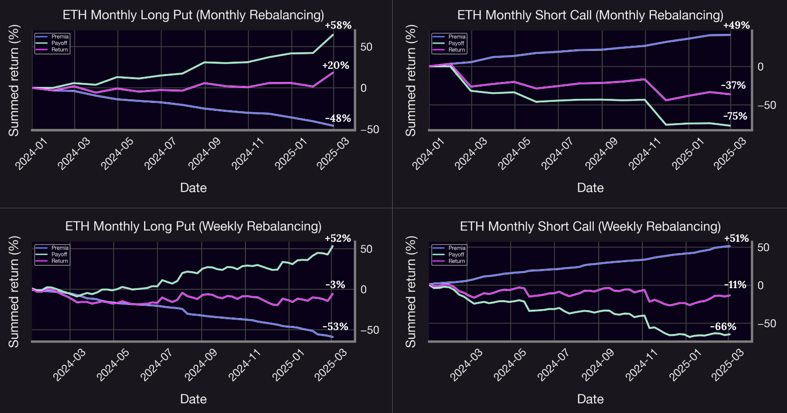
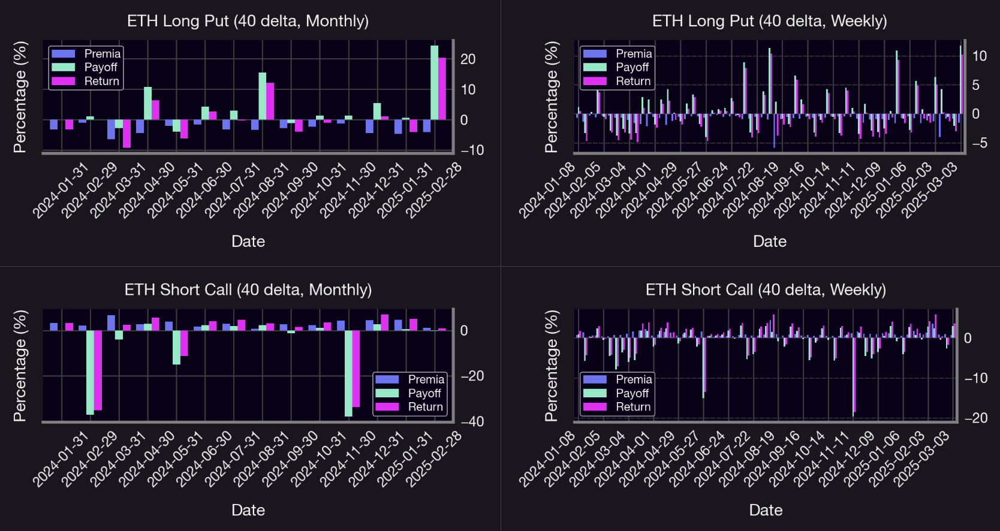
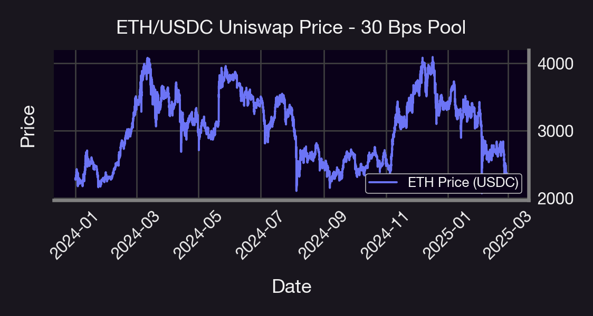

## Introduction

Options strategies provide traders with powerful tools for expressing market views and managing risk. Panoptic's innovative approach allows traders to access [option-like](/blog/uniswap-lp-equals-options#uniswap--amms-the-basics) payoffs through Uniswap V3 concentrated liquidity positions.

This research byte examines two popular bearish options strategies implemented through the Panoptic protocol: short calls and long puts on the WETH-USDC pool. While both strategies can profit from downward ETH price movements, they exhibit fundamentally different risk profiles, fee structures, and performance characteristics. Using historical data from the WETH-USDC 30bps pool, we analyze the returns, payoff structures, and premium patterns for each strategy.

On the other hand, a defining feature of Panoptic options (Panoptions) is their perpetual nature within a concentrated liquidity market. This structure means that when a Panoption is in range—with the spot price between its lower and upper bounds—it continuously accumulates [streamia](/docs/product/streamia): buyers incur a cost, while sellers earn yield. Once the option goes out of range, streamia accumulation halts—buyers no longer pay, and sellers stop receiving income. This dynamic creates a payoff structure that differs from traditional financial options.

### Short Calls

A short call in Panoptic involves a user acting like an option writer, providing liquidity in such a way that they benefit when the price of the underlying asset moves lower than when it started.

- **Mechanics**: The user sells a call option and the seller collects premia as time passes (no option decay since we are dealing with perpetual options).
- **If the underlying price increases above the strike**, the trader incurs losses, just like a traditional short call.
- **Maximum profit**: The maximum profit is limited to the streamia accumulated.
- **Unlimited risk**: The greatest risk is that losses can continue to grow if the asset’s price increases a lot, so managing risk is very important.
- **Ideal market**: Neutral and bearish markets.

### Long Puts

A long put in Panoptic gives the user the right to benefit when the underlying token’s price falls.

- **Mechanics**: The user buys a put option on ETH and pays streamia over time.
- **If the underlying price drops in the money**, the put becomes profitable.
- **Limited risk**: The maximum loss is limited to the streamia paid, providing a defined risk strategy.
- **Max gain**: Achieved when the underlying price falls to zero.
- **Ideal market**: Bearish market.

## Data & Implementation

We construct our strategies using the WETH/USDC 30 bps Uniswap v3 pool on Ethereum, covering the period from January 2024 through February 2025. Our code is publicly available on GitHub [here](https://github.com/panoptic-labs/research/tree/main/_research-bites/20250414). We implement rolling—also referred to as rebalancing—as a core component of our strategy. Rolling simply means closing an old position and opening a new one at a different strike, usually to keep the strategy updated with current market conditions. It helps keep things on track without starting from scratch each time. It is indeed crucial because, without it, as the ETH price moves, the option characteristics would drift away from the intended strategy. For example, an OTM short call might become ATM or ITM as prices change, significantly altering its risk profile.

## Results

In Panoptic's options simulation model, strategy returns consist of two key components. The premia represents fee collection for short calls (positive) or premium costs for long puts (negative), calculated through the swap fees captured within a position's [range](/docs/product/streamia#in-range-options-accumulate-streamia). The payoff reflects position value changes as the underlying asset price moves relative to the strike, with short calls experiencing potentially unlimited negative value during upward price movement and long puts gaining value during downward moves. Total return combines these elements in addition to the streamia accrued when the position moved further OTM. This decomposition illustrates how Panoptic translates traditional options behavior into Uniswap V3's concentrated liquidity framework.

## Analysis of The Results

Examining these visualizations reveals critical performance patterns across both strategy types and rolling frequencies.

Over the entire backtesting period, both strategies showed negative returns, except for the ETH long put with monthly rolling, which achieved over 20% returns. This outcome is consistent with expectations since the pool was very volatile and prices changed suddenly. However, it seemed that even a fully bearish strategy like long put performed surprisingly well. On the other hand, weekly rolling appeared to minimize the losses for the short call strategy, while monthly rolling led to positive returns for the long put since it gives the option more time to gain value if the price drops. To extract more nuanced insights, we decomposed the performance into monthly and weekly intervals. This higher-resolution analysis highlighted periods of relative outperformance and stability, underscoring the importance of temporal granularity when evaluating strategy robustness in volatile environments.

### Long Put Strategy Analysis

#### Monthly Rolling
The strategy’s returns follow a clear pattern, returns alternate between positive and negative roughly half of the time It performs best during market drops, with big positive returns in March, August, and February, which match sharp declines in ETH prices (as shown in the pool chart). This shows the strategy works well in times of market stress. Overall, returns tend to fall into two groups: strong gains during price drops and smaller losses when prices rise. The best months—April 2024, August 2024, and February 2025—brought returns of around 5%, 10%, and 20%, showing the long put's strong potential during volatile, bearish periods.

#### Weekly Rolling
At a higher level of granularity, the strategy reveals its “insurance policy” characteristics. Losses tend to be small—never exceeding -5%—while gains often surpass that threshold, especially during periods of market stress. The return pattern is marked by frequent, modest losses interrupted by sharp positive spikes when the market declines, highlighting the strategy’s role as a protective mechanism. Additionally, the strategy is more responsive to short-term price movements, allowing for quicker adjustments to changing market conditions. While the increased trading frequency leads to smaller individual returns, it enables more tactical positioning and better alignment with evolving market dynamics.

### Short Call Strategy Analysis

#### Monthly Rolling
The strategy’s returns component delivers steady, positive returns, averaging between 2% and 4% per month. However, this consistency comes at the cost of exposure to extreme downside risk. The returns reveal significant drawdowns in three periods: February 2024, May 2024 and November 2024, highlighting the inherent vulnerability of the position to sharp upward moves in the market. The strategy shows a clear imbalance in risk: it makes small gains in many months, but just a few big losses wipe out those profits. In particular, two major losses were close to -40%, much larger than any of the gains in good months. This shows that, even though the strategy earns steady income, it’s still very exposed to rare but extreme losses.

#### Weekly Rolling
Increasing the rolling frequency slightly reduces the severity of extreme losses, but it does not fully eliminate them. Several drawdowns still exceed -15%, showing that it’s still at risk of big losses. While premia collection becomes more consistent with more frequent rolling, the returns per instance are smaller in magnitude. Despite these adjustments, the strategy continues to exhibit a classic “picking up pennies in front of a steamroller” risk profile—generating steady, modest gains while remaining vulnerable to occasional but substantial losses.

### Cross-Strategy Interpretation

The analysis highlights three main points. First, there’s a clear difference in risk and reward between the strategies: long puts manage risk better by limiting losses and performing well during market drops, while short calls make small profits most of the time but can suffer big losses when the market moves sharply. Second, weekly rolling increases how often trades happen, which helps smooth out returns, but it doesn’t really change the overall behavior of the strategy. Lastly, the results show that WETH had major price drops in January 2024, March 2024, December 2024, and February 2025. The long put strategy took advantage of these moves, while the short call strategy struggled.

---

## Conclusion

In the Panoptic protocol, both short calls and long puts offer unique opportunities to express bearish views on the market—but with distinct tradeoffs. This analysis demonstrates why proper strategy selection based on market outlook and risk preferences is critical in options trading, with long puts offering defined risk/reward for bearish views while short calls present significant tail risk despite their positive carry characteristics.

| **Feature**      | **Short Call**                             | **Long Put**                           |
|------------------|--------------------------------------------|----------------------------------------|
| Directional Bet  | Neutral / Bearish                          | Bearish                                |
| Capital Cost     | Medium (20% collateral requirement)         | Low (10% collateral requirement)       |
| Profits From     | WTH price decreasing, flat market           | ETH price decreasing                   |
| Risks            | ETH price rising significantly              | ETH price staying flat or rising       |
| Best rolling     | Weekly                                      | Monthly                                |
| Max Return       | Limited to premium (5%+ observed)           | Potentially high (20%+ observed)       |
| Max Loss         | Potentially high                            | Limited to premium paid                |

> **Important Note**  
One key factor not accounted for in this analysis is the [spread multiplier](/docs/product/spread), which is likely greater than 1x. In fact, observed data shows an [average spread multiplier of approximately 1.2x](/research/loss-versus-panoptic-why-lps-are-losing). This implies that, when the spread multiplier is equal to 1, the option premium reflects its theoretical value with no adjustment. However, when the spread multiplier is greater than 1—in our case, 1.2x—the actual trading conditions deviate from the theoretical pricing. In this case, buyers pay 20% more than the baseline price, making options more expensive to purchase. Conversely, sellers benefit from this spread, earning 20% more than the base premium, which makes selling options more profitable under these conditions.

## Future Work

Several avenues remain open for future exploration. One potential direction involves evaluating long call and short put strategies—both expressing bullish market views—and comparing their performance with the bearish counterparts: short calls and long puts. Another promising extension is a cross-asset comparison, applying the current framework to other cryptocurrency pairs to assess the robustness and generalizability of the observed results. Additionally, future work could examine the effect of variable rolling frequencies, investigating how different rebalancing intervals influence strategy performance. Finally, incorporating option spreads into the analysis may provide insights into more complex and risk-adjusted returns structures.

*Join the growing community of Panoptimists and be the first to hear our latest updates by following us on our [social media platforms](https://links.panoptic.xyz/all). To learn more about Panoptic and all things DeFi options, check out our [docs](/docs/intro) and head to our [website](https://panoptic.xyz/).*
