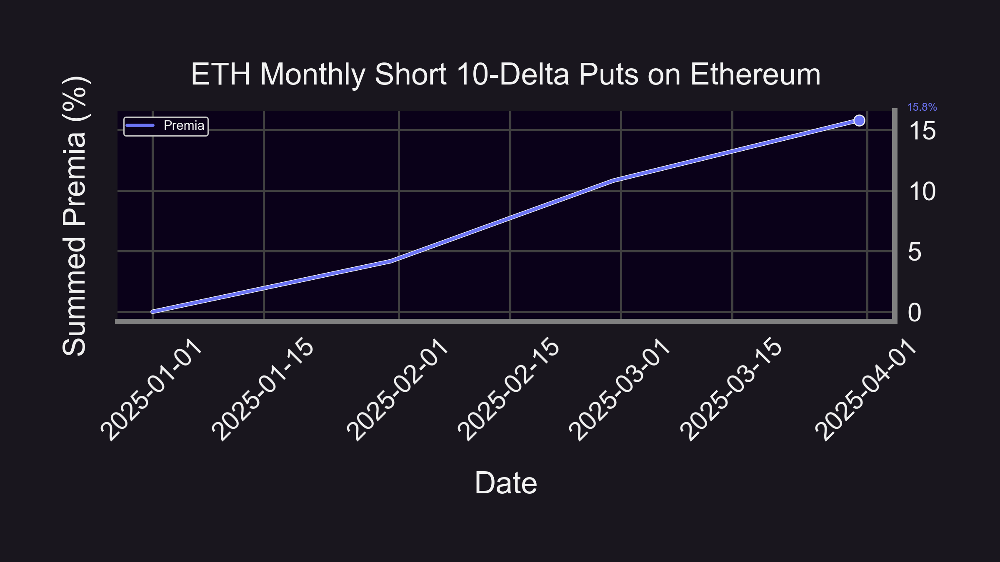

Previously, we examined deep out-of-the-money ([OTM](/docs/terms/out_of_the_money)) [Panoption](/docs/terms/panoption)  [put](/docs/terms/put) wings on Ethereum. How do streaming premia ([streamia](/research/streamia-101)) and the volatility risk premium ([VRP](/research/implied-volatility-put-wing-premia)) translate to a Layer 2 (L2) blockchain such as Base? Do the idiosyncratic properties that drive the lucrative accrual of streamia on Ethereum still apply when executing on Base?

  

This article puts the two chains head-to-head and explores the underlying elements behind these factors.

  
  
  
  
  
  
  
  
  
  
  
  
  

## Results

  

The graphics above reveal that the cumulative premia is identical when comparing the monthly sale of 10-[delta](/research/understanding-delta-risk#what-is-delta) Panoption puts from January 2025 through March 2025 for the ETH/USDC 30bps pool. The summed premia for Ethereum and Base over this period are similar with Ethereum producing 15.8% (80% annualized) and Base generating 16.5% (84% annualized) respectively. LPs on Panoptic earn around 20% more fees compared to the same position on Uniswap. Applying this [1.2x increase](/research/loss-versus-panoptic-why-lps-are-losing) in fees to the Uniswap backtest results, we find that the mean monthly premia on Base is 4.9% and on Ethereum is 4.7%, a marginal difference.

The above visuals are indicative of how the [spread-multiplied](/research/liquidity-spread) monthly premia for Base is incrementally higher than Ethereum over this 3-month range. Consistent with prior [findings](/research/implied-volatility-put-wing-premia#results), hiked premia for both chains corresponds with spikes in the [Uniswap](/research/new-formulation-implied-volatility) implied volatility ([IV](/docs/terms/implied_volatility)). The Uniswap IV on Ethereum crosses the 200% annualized level at three separate points and breaches the 800% annualized level on Base during the month of February. Meanwhile, the monthly returns accordingly crest for both Ethereum and Base in February at 8% (153% annualized) and 8.4% (164% annualized) respectively. The Uniswap IV also reaches its highest monthly mean level over the course of the sample period on both blockchains during February.

## Broader Discussion

There is a continual narrative weaving from Ethereum to Base in the attractiveness of selling Panoption put wings. The underlying driver of this joint profitability lies in the fact that neither Ethereum nor Base is immune from a couple of traits that contribute to the on-chain VRP–market incompleteness and jumps. But where do these shared fundamental qualities arise from?

  

We have previously [highlighted](/research/implied-volatility-put-wing-premia#broader-discussion--conclusions) how Just-in-Time ([JIT](/research/demystifying-IL-LVR-JIT-MEV#3-just-in-time-jit-liquidity)) liquidity providers (LPs), acting as short-term perpetual put options sellers, are capturing situationally elevated volatility risk premia as a byproduct of ascendant demand when IV rises. As LPs [equate](/blog/uniswap-lp-equals-options#lps-are-options-sellers) to perpetual put option sellers, there is a short-lived influx of [gamma](/research/understanding-the-greeks-series#gamma-%CE%B3) supplied by JIT LPs, but there is no structural demand to accommodate this supply glut as Uniswap is a one-sided (incomplete) options market. Hence, we see sudden upward and downward jumps in the Uniswap IV as the JIT LPs capitalize on volatility risk premia and subsequently blunt price impact in respective pools. These are the basic inhibitions on exchange mechanisms for the vast majority of automated market maker (AMM) architectures.

  

[Jump risk](https://papers.ssrn.com/sol3/papers.cfm?abstract_id=2909163) is most accurately proxied by gamma with relation to options [Greeks](/research/understanding-the-greeks-series), and gamma is at its apex for options rapidly approaching expiration in terms of [timescales](/research/timescales-in-panoptic). Research within traditional options markets has found that both increased jump volatility (gamma) and shorter time-to-expiration have statistically significant [widening effects](https://papers.ssrn.com/sol3/papers.cfm?abstract_id=2485038) on options [bid](/docs/terms/bid)-[ask](/docs/terms/ask) spreads along with a [jump risk premium](https://www.cambridge.org/core/journals/journal-of-financial-and-quantitative-analysis/article/pricing-of-volatility-and-jump-risks-in-the-crosssection-of-index-option-returns/48A7123D44269F898FCDB82B0CF96590) particularly contributing to OTM put option returns. Markets far more [complete](/research/derivatives-solve-uniswap-doom-loop#derivatives-complete-spot-markets) than Uniswap have proven to be impacted by similar forms of empirical quirks and anomalies. The below [figure](/research/uniswap-violates-geometric-brownian-motion) fittingly illustrates how jumps in the ETH/USDC 5bps pool (also applicable to the ETH/USDC 30bps pool) are statistically governed by a fat-tailed distribution known as the [power law](https://en.wikipedia.org/wiki/Power_law) distribution, implying larger kurtosis associated with jumps.

Taken together, whether on Ethereum or Base, the on-chain VRP and unilateral JIT liquidity provision exhibit fairly universal effects with relatively negligible distinctions. If jumps cannot be completely hedged away within the options markets of traditional finance (TradFi), they certainly cannot be hedged among the asymmetric options-selling confines of Uniswap. By design, the overwhelming preponderance of market microstructure for AMMs is incomplete, and Uniswap is no exception.

  

That said, we expect to see these jumps begin to gradually smooth over time as trade flows and volumes intended for buying options find an outlet. Whether on an L1 like Ethereum or an L2 like Base, this pent-up demand for optionality can be accessed on a platform such as Panoptic. As the migration of flows and volumes toward Panoptic steadily grows, enhanced stability for underlying Uniswap pools across many L1 and L2 blockchains is likely to follow.

*Join the growing community of Panoptimists and be the first to hear our latest updates by following us on our [social media platforms](https://links.panoptic.xyz/all). To learn more about Panoptic and all things DeFi options, check out our [docs](/docs/intro) and head to our [website](https://panoptic.xyz/).*
