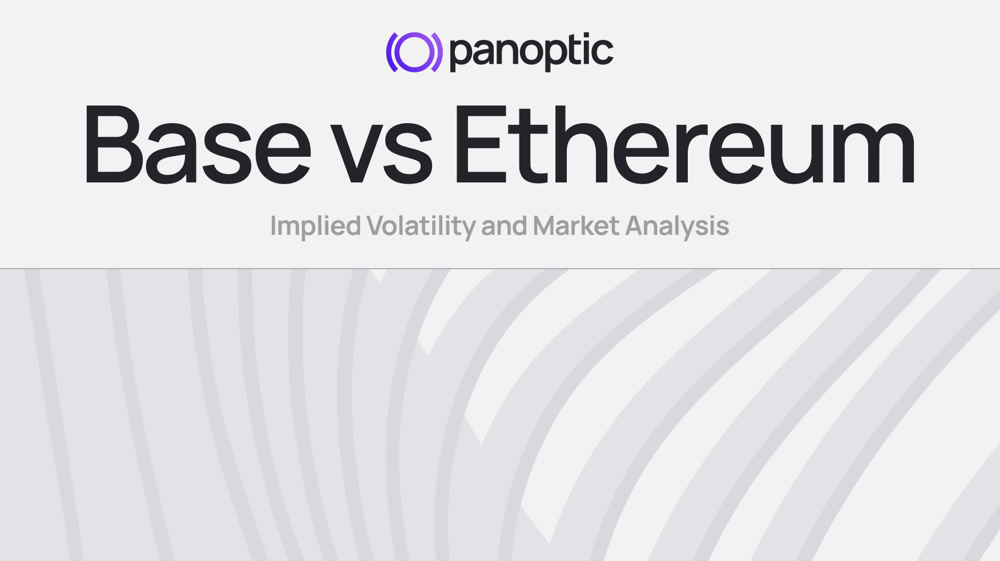
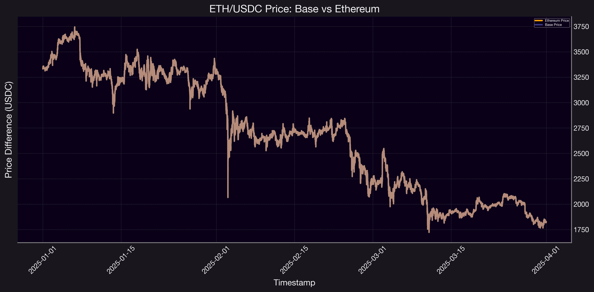
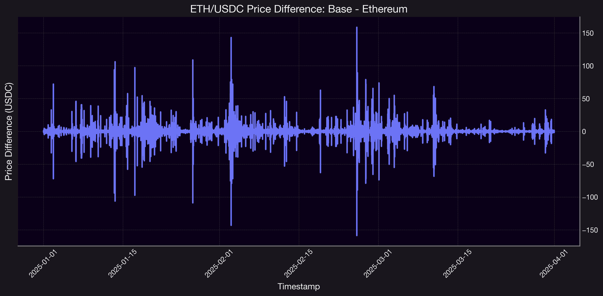

---

slug: base-vs-ethereum-iv
title: "Base vs Ethereum Blockchains: Implied Volatility and Market Analysis"
tags: [IV, Ethereum, Base, Uniswap, Bearish, Bullish]
image: /img/research/base-vs-ethereum-iv-banner.png
description: "This article presents a detailed quantitative comparison between the Ethereum and Base blockchains, evaluating ETH/USDC pool pricing, implied volatility, and Panoptions strategy performance. It reveals structural differences and trading implications across chains, helping DeFi strategists make more informed decisions."
authors: A
---------------------

**Feel free to check out our livestream video on YouTube!**
<iframe width="560" height="315" src="https://www.youtube.com/embed/Nv79LN6Tbbc?si=zRKLa_6xsu2pzO1O" title="YouTube video player" frameborder="0" allow="accelerometer; autoplay; clipboard-write; encrypted-media; gyroscope; picture-in-picture; web-share" referrerpolicy="strict-origin-when-cross-origin" allowfullscreen></iframe>

## Introduction

The emergence of perpetual options within decentralized finance (DeFi) has created novel opportunities for expressing directional market views and dynamically managing risk through composable, on-chain financial instruments. Panoptic leverages Uniswap V3's concentrated liquidity framework, enabling the replication of traditional options strategies in a permissionless environment with enhanced capital efficiency.

In this research, we perform a quantitative comparative analysis between Ethereum and Base blockchains, specifically focusing on the highly liquid ETH/USDC 5bps pool. Motivated by fundamental differences between these two ecosystems—such as liquidity depth, transaction costs, protocol responsiveness, and distinct user behaviors—our study evaluates how [implied volatility](/research/new-formulation-implied-volatility), pool pricing, and option strategies differ across both networks.

## Base vs Ethereum

Ethereum remains the benchmark smart contract blockchain, recognized for its decentralization, security, and foundational role in DeFi. It supports a vibrant ecosystem of over 3,000 dApps, including Uniswap, Aave, and Panoptic. Ethereum’s deep liquidity enables tighter bid-ask spreads, lower slippage, and more reliable price discovery—crucial for executing size-sensitive strategies such as delta hedging, volatility arbitrage, and gamma scalping. However, its 15-second average block time introduces latency risk, particularly for high-frequency strategies. Moreover, network congestion often results in gas fees exceeding 100 gwei, increasing execution costs and alpha variance.

Base, on the other hand, is a Layer 2 blockchain built on the Optimism OP Stack. It offers sub-second block times and transaction costs over 90% lower than Ethereum L1. This makes Base ideal for high-frequency strategies, like dynamic delta-neutral positioning or short-vol harvesting. However, Base's liquidity is thinner, leading to greater slippage, wider spreads, and frequent short-term price dislocations—especially during volatility spikes. These structural differences result in inflated implied volatility levels and noisier funding flows, which must be accounted for in model calibration and risk forecasting. Additionally, Base’s integration with Coinbase gives it a unique user base and hybrid behavior that quant traders can exploit.

## Data

We analyze ETH/USDC 5bps pool data on both chains. For implied volatility, we use hourly data from January 1, 2024 to March 31, 2025. Price dynamics are assessed using minute-level data between January 1 and March 31, 2025. Bullish and bearish strategies are modeled using monthly 30-delta out-of-the-money (OTM) options with a ±27% range, excluding the [spread multiplier](/docs/product/spread#spread-in-panoptic).

You can view the code [here](https://github.com/panoptic-labs/research/tree/main/_research-bites).

## Results & Analysis

### Price & Implied Volatility

** Figure 1** Minute-level price difference between ETH/USDC on Base and Ethereum from January to April 2025.

** Figure 2** Time series of ETH/USDC price basis between Base and Ethereum 5bps Uniswap v3 pools.

** Figure 3** Implied Volatility (IV) on Uniswap for ETH/USDC — Base vs. Ethereum (5bps Pool). This chart compares the minute-level implied volatility on Base and Ethereum from early 2024 through March 2025.
ETH/USDC price differences between Base and Ethereum showed repeated, short-lived spikes—sometimes exceeding ±150 USDC. These deviations are likely caused by sequencer delays, cross-chain latency, or JIT liquidity provisioning on Base. They often cluster around volatility events, creating arbitrage windows for high-frequency or cross-chain traders.

** Figure 4** Difference Between Implied Volatility (IV) on Base and Ethereum (ETH/USDC, 5bps Pool). This time series plots the spread between Base and Ethereum implied volatility from early 2024 to March 2025. The IV difference fluctuates around a slightly negative mean, indicating Base typically prices higher volatility.

The price chart (see Figure 1 and 2) shows the minute-level price difference between ETH/USDC on Base and Ethereum from January to April 2025. We observe repeated, sharp dislocations—sometimes exceeding ±150 USDC—indicating short-lived but significant deviations in price across chains. These transient spikes likely stem from cross-chain latency, sequencer delays, or JIT liquidity provisioning on Base. The clustering of these deviations around volatility events suggests that during periods of market stress, Base becomes more disconnected, introducing temporary arbitrage windows for high-frequency or cross-chain strategies.

The implied volatility charts (see Figure 4) reveals that while the overall shape and trend of implied volatility on Base and Ethereum closely mirror one another — reflecting a shared exposure to macro and crypto-native volatility events — the magnitude and sharpness of spikes vary significantly. Ethereum consistently shows sharper IV peaks, particularly during mid-2024, suggesting more reactive or leveraged market conditions. The second plot (see Figure 5), showing the IV spread (Base – Ethereum), confirms that most of the time, the difference hovers slightly above zero, implying Base IV tends to be marginally higher. However, Ethereum exhibits pronounced spikes that Base does not replicate, leading to temporary but substantial negative spreads (down to –100+). This suggests that Ethereum may be more susceptible to just-in-time (JIT) liquidity shocks or faster-moving speculative flows, while Base maintains a slightly elevated, more stable background IV. Traders using Panoptic can exploit these differences: short vol on Ethereum during spikes and long vol on Base during calm conditions may offer asymmetric opportunities when combined in a cross-chain portfolio.

**In summary**

* Uniswap IV on Ethereum is more volatile, with sharper spikes likely due to deeper liquidity and speculative flows.
* Base shows slightly higher baseline IV, but with smoother, less reactive dynamics.
* Traders can exploit cross-chain IV spreads by going long Base IV and short Ethereum IV during volatility events.

**Why do these differences exist?**

* Ethereum has deeper liquidity and more volatility due to larger capital flows.
* Base may have fewer bots, lower volatility assets, or less speculative trading.
* Concentrated liquidity effects on IV estimation may differ across chains.

### Bullish Strategy

** Figure 5** Performance of 30-delta Short Put and Long Put strategies on Ethereum and Base (Jan–Mar 2025)

The bullish strategy panel (see Figure 5) reveals a distinct skew in performance between short volatility and long volatility trades.

The Short Call strategy generated strong, consistent returns on both chains, with Base outperforming Ethereum (+17.65% vs. +14.76%). This outperformance was driven by higher implied volatility on Base, which inflated call premia without being matched by proportionate realized upside.

Meanwhile, the Long Call strategy struggled on both networks, producing negative net returns (Base: –18.06%, Ethereum: –14.76%), despite modest positive payoffs. This underperformance is a clear example of premium drag: the implied volatility priced into the calls was not justified by the realized volatility of ETH.

This divergence underscores a core principle: in markets with elevated implied vol but low realized vol, short convexity strategies (e.g., selling options) extract premium efficiently, while long convexity strategies suffer unless the market breaks trend.

### Bearish Strategy

** Figure 6** Performance of 30-delta Short Call and Long Call strategies on Ethereum and Base (Jan–Mar 2025).

The bearish side exhibits symmetrical payoff behavior but diverging return profiles:

Both Long Puts realized identical payoffs of +33.44%, reflecting the shared ETH price path. Yet, Ethereum’s Long Put yielded a higher net return (+17.58%) than Base (+13.42%). This suggests that put premia were cheaper on Ethereum, likely due to more stable implied volatility and deeper liquidity.

Conversely, Short Puts on Base delivered better relative returns (–13.42% loss vs. –17.58% on Ethereum)—a result of higher upfront premia on Base, which helped cushion the downside.

This asymmetry in premium structure across chains suggests that Base’s option market consistently prices in higher tail risk, benefiting sellers when price movements are muted, but penalizing buyers unless volatility is actually realized.

### Cross-Cutting Observations

Payoffs were chain-invariant, validating that the strategies were modeled on the same ETH/USDC price trajectory—this is crucial for attribution analysis. Premia, on the other hand, were consistently richer on Base, reinforcing the presence of a volatility risk premium or market segmentation effect, possibly due to fewer LPs, JIT liquidity, or thinner markets. From a hedging standpoint, long options didn’t pay off because price moves were limited, while short options earned steady returns by collecting premium in a low-volatility environment.

## Conclusion & Future Work

This analysis highlights how the structure and behavior of perpetual options vary meaningfully across chains like Ethereum and Base. While Ethereum offers more efficient pricing and smoother implied volatility, Base exhibits elevated IV and wider premia, creating asymmetries exploitable by short-volatility strategies. Future work will involve formalizing this into a systematic trading strategy, developing signal thresholds based on historical IV spreads, and backtesting PnL performance with transaction costs and funding flows accounted for. The goal: to construct a delta-neutral, cross-chain vol arb portfolio that captures mispricings in decentralized options markets in real time.

## References
* Base documentation: https://docs.base.org
* Introduction to Ethereum: https://ethereum.org/en/developers/docs/intro-to-ethereum
* 99Bitcoins. Base review: Everything you need to know. https://99bitcoins.com/cryptocurrency/base-review
* CoinLedger. Ethereum vs competitors: A comparative analysis. https://coinledger.io/tools/ethereum-vs-competitors

 
  
    
    

Join the growing community of Panoptimists and be the first to hear our latest updates by following us on our [social media platforms](https://links.panoptic.xyz/all). To learn more about Panoptic and all things DeFi options, check out our [docs](/docs/intro) and head to our [website](https://panoptic.xyz/).