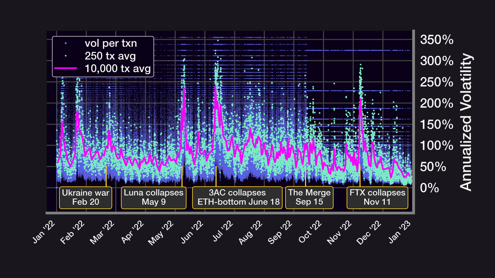

**Check out our livestream video on YouTube**

<iframe width="560" height="315" src="https://www.youtube.com/embed/gi2cval4FyY?si=RAkIKPiC8XnM7-NX" title="YouTube video player" frameborder="0" allow="accelerometer; autoplay; clipboard-write; encrypted-media; gyroscope; picture-in-picture; web-share" referrerpolicy="strict-origin-when-cross-origin" allowfullscreen></iframe>

Panoptic has explored in prior [research](/research/implied-volatility-put-wing-premia) how [streamia](/research/streamia-101) interrelates to implied volatility ([IV](/docs/terms/implied_volatility)) for deep out-of-the-money ([OTM](/docs/terms/out_of_the_money)) [Panoption](/docs/terms/panoption)  [put](/docs/terms/put) wings. But what about the opposite side of the options [moneyness](/docs/product/moneyness) spectrum? How does IV relate to deep OTM Panoption [call](/docs/terms/call) wings?

  

Analyzing call wings is relevant from a risk premia perspective because in certain commodities volatility markets, such as [crude oil](https://www.oxfordenergy.org/wpcms/wp-content/uploads/2025/01/Energy-Quantamentals-The-Revival-of-the-Volatility-Risk-Premium.pdf), it is found that selling call wings carries a higher embedded volatility risk premium ([VRP](https://www.amazon.com/Positional-Option-Trading-Wiley/dp/1119583519)) and accordingly demands more compensation than selling put wings. Both call and put wings inherently contain elevated [convexity](/research/gamma-scalping#positive-convexity) (potential for explosive payoffs), but does a similar structural asymmetry prevail within crypto volatility markets?

  

In this article, we will dive into the relative profitability of selling Panoption call wings as well as how the premia of these call wings corresponds with IV.

## Results

The above graphics highlight the monthly returns for selling 10-[delta](/research/understanding-delta-risk#what-is-delta) Panoption calls from May 2021 to April 2025 on the ETH/USDC 30bps pools (see code [here](https://github.com/panoptic-labs/research/tree/main/_research-bites/20250516)). The mean monthly premia for this strategy is around 2.8% (39.5% annualized) with the maximum monthly premia of 11.7% (279% annualized) aligning with a subdued [Uniswap](/research/new-formulation-implied-volatility) IV level over the course of July 2022. The collected call wing premia oscillates in an inverse fashion compared to put wing premia the majority of the sample period, while interestingly moving in direct concert with put wing premia at several isolated points when whipsawing price action was taking place.

  

Note that we assume a 1.2x [Panoptic premium](/research/liquidity-spread) to the backtested Uniswap fees based on Panoptic’s [historical average](/research/loss-versus-panoptic-why-lps-are-losing) since launch.

The above figures display a consistent IV-to-streamia correspondence for 10-delta monthly Panoption call selling as it relates to the WBTC/USDC 30bps pool during an identical sample period and with the same 1.2x spread multiplier being applied. The mean monthly premia for BTC call wing selling of 2.1% (28.5% annualized) is not as attractive as the case for ETH. Akin to the observed [properties](/research/implied-volatility-put-wing-premia#results) for Panoption put wing selling, the timing, proportion, and magnitude of premia hikes for selling Panoption call wings also differs from ETH to BTC, but the same general trend persists with both BTC and ETH call wing premia as there is a predominantly inverted relation to put wing premia for both tokens. The highest BTC call wing monthly premia of 6.1% (104% annualized) was also accumulated at the same point during our sample as ETH in July 2022.

## Broader Discussion & Conclusions

The summed premia figures for the 10-delta ETH and BTC monthly call selling strategies show cumulative premia of 114% (21% annualized) and and 85% (16.6% annualized) for the ETH and BTC tactics respectively spanning from May 2021 through April 2025. Over a slightly longer sample, the selling of call wings therefore underperforms the selling of put wings on both the cumulative and average levels for both tokens. But what explains the co-movement of Panoption call wing premia relative to Panoption put wing premia? We look to other asset classes for answers.

  

In more traditional asset classes such as equities, a resolution of market uncertainty will conventionally lead to what are known as “[relief rallies](https://www.sciencedirect.com/science/article/abs/pii/S0927539818300604).” For example, the CBOE Volatility Index (VIX) often plunges immediately following Federal Open Market Committee (FOMC) announcements from the Federal Reserve, simultaneously stemming upticks in the underlying equity market returns. The same steep IV index decline is also found to occur in [commodities](https://papers.ssrn.com/sol3/papers.cfm?abstract_id=4425021) markets such as crude oil and gold subsequent to FOMC announcements. This characteristic specific to equities is reflected in the abnormal trading volume of at-the-money ([ATM](/docs/terms/at_the_money)) call options leading up to FOMC announcements having a positive and statistically significant predictive [relationship](https://onlinelibrary.wiley.com/doi/abs/10.1002/fut.22277) with index returns in the aftermath of FOMC announcements.

Despite the Uniswap IV being generally muted in times of heightened call wing premia, a similar predictive [trait](https://papers.ssrn.com/sol3/papers.cfm?abstract_id=4737260) is quantified in BTC markets where BTC returns positively and significantly relate to ATM IV for BTC call options. [Macro catalysts](/research/stay-in-range-uniswap-v3) (like those pictured above) often spike the Uniswap IV upwards along with Panoption put wing premia, but after sustained episodes of higher Uniswap IV, there are quieter voids where the Uniswap IV diminishes and underlying returns expand. In contrast to crude oil volatility markets, there is a clear structural bias for put wing premia as opposed to call wing premia in the context of Panoptions. The fact remains though that in more peaceful market environments, Panoption call wing premia drifts higher and supplies steady returns in a phenomenon that we dub as the “relief risk premium.”

  

An excited state for an IV index such as the Uniswap IV [portends](https://www.amazon.com/Market-TremorsQuantifying-Structural-Risks-in-Modern-Financial-Markets/dp/3030792528) a wide distribution of forward underlying returns, including relief rallies. As a consequence of the [volatility smile](/docs/terms/volSmile), an OTM call option migrating to the status of being ATM [imputes](https://www.amazon.com/Greeks-Hedging-Explained-Financial-Engineering/dp/1137350733) a lower overall market IV. It then stands to reason as “Fear-Of-Missing-Out” ([FOMO](https://www.amazon.com/Retail-Options-Trading-Andrew-Mack/dp/B0DLBCWGBS)) market dynamics take root, underlying prices rise as implied volatility decreases. BTC and ETH Panoption wings exhibit a solid overall VRP [symmetry](https://www.cambridge.org/core/services/aop-cambridge-core/content/view/48A7123D44269F898FCDB82B0CF96590/S0022109022000333a.pdf/div-class-title-the-pricing-of-volatility-and-jump-risks-in-the-cross-section-of-index-option-returns-div.pdf) regardless of a put wing bias, but in the specific case of Panoption call wings, underlying market tranquility (relief risk premium) can be segmented from the market fear (VRP) typically associated with put wings as the climate for generating superior premia.

*Join the growing community of Panoptimists and be the first to hear our latest updates by following us on our [social media platforms](https://links.panoptic.xyz/all). To learn more about Panoptic and all things DeFi options, check out our [docs](/docs/intro) and head to our [website](https://panoptic.xyz/).*
