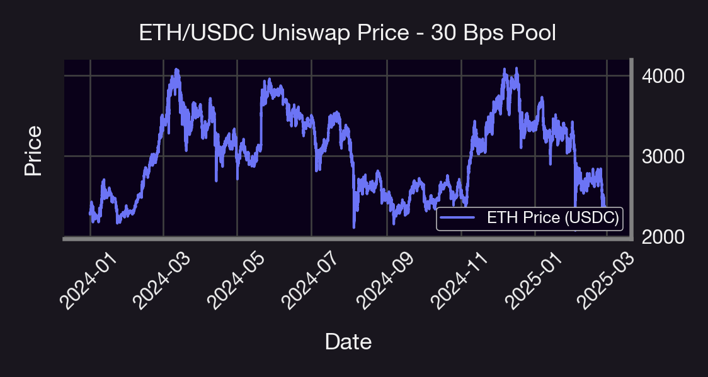
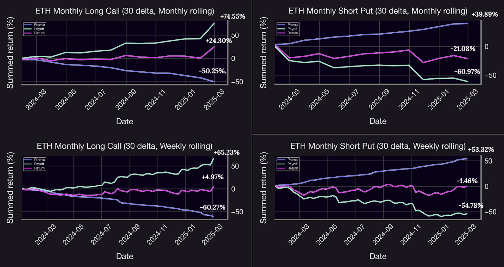
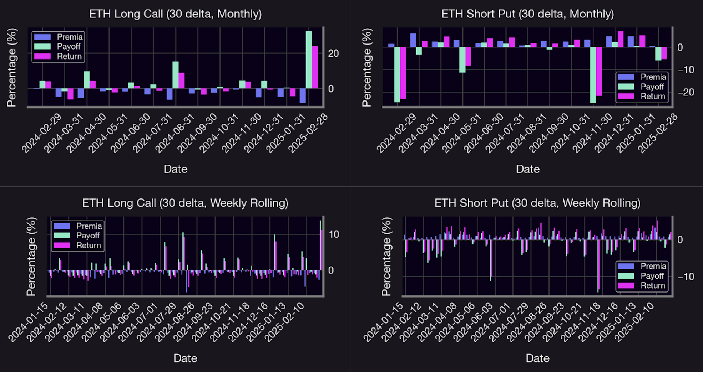

### Long Call

A long call in Panoptic gives the buyer the right to benefit from upward ETH movement.

- Profit if ETH price increases  
- **Max gain**: theoretically unlimited as ETH rises  
- **Risk**: downside is capped at the total streamia paid, offering a clearly defined loss  
- **Ideal market**: strongly bullish  

## Data & Implementation

We simulate both strategies using the WETH/USDC 30 bps Uniswap pool from January 2024 to February 2025. We employ rolling (rebalancing) to update positions as the price evolves.

- Use **30-delta puts and calls** — in other words, we use out-of-the-money options.
- **Monthly options** are approximated via a [range factor](https://panoptic.xyz/research/uniswap-lp-calculate-price-range) of **1.25**, which roughly translates to a one-month option.
- **Rolling** is applied at two frequencies: weekly and monthly.
- The same **DTE (days to expiry)** formula from part 1 applies, mapping Panoptic width to implied option expiry. *[Insert link]*
- We compute **accumulated payoffs, premia, and net returns** for each strategy and rolling frequency:
  - **Payoff** is the profit or loss profile of an option as the spot price moves, shaped by the liquidity position’s range and type (e.g., short call, short put).
  - **Returns** represent the net profit or loss from an options strategy, calculated as the sum of payoff and earned fees, minus commissions (zero in our case), plus any additional yield from providing liquidity. This reflects the total performance of a position over time, accounting for both market movement and protocol-level earnings.

You can view the code here

## Results 

** Figure 5** The WETH/USDC spot price is sourced from the Uniswap V3 30 bps pool, covering the period from January 2024 to February 2025. This timeframe exhibits significant volatility, characterized by a wide range of dynamic price patterns.

** Figure 5** Weekly and monthly decomposition of ETH monthly long call and short put returns, premia, and payoff for weekly and monthly rolled options.

** Figure 5** Weekly and monthly decomposition of ETH monthly long call and short put returns, premia, and payoff for weekly and monthly rolled options.

## Analysis of The Results

### Long Call Strategy Analysis

**Monthly Rolling:**  
The long call strategy demonstrates strong positive performance during sustained bullish trends, with cumulative returns reaching +24.30% by February 2025. The strategy shows a clear pattern where payoff (green line) is the primary driver of returns during strong upward ETH price movements. While the strategy consistently pays premiums (blue line trending downward to -50.25%), these costs are more than offset by significant payoff gains during bullish periods. The monthly bars reveal several standout months with returns exceeding 15%, particularly in February 2025. This highlights the strategy's leveraged nature - while premium costs are consistent, payoffs can be substantial when the market moves favorably. The strategy demonstrates its effectiveness as a directional bet on ETH price appreciation, particularly during the strong uptrend from late 2024 into early 2025.

**Weekly Rolling:**  
With more frequent position adjustments, the long call strategy achieves even stronger performance, with cumulative returns reaching +8% to +10% in July 2024, August 2024, and the beginning of 2025, and still ends with positive returns of around 5%.  
Weekly rolling allows the strategy to better capture intermediate price movements and adjust positions more dynamically as market trends develop, even though it seems that monthly returns are more interesting for generating more net returns—24% against 5%. On the other hand, premium costs are higher (blue line reaching -60.27%) due to more frequent trading, but payoff potential is  reduced (green line reaching above 65%). The weekly component bars show numerous small positive return instances punctuated by several larger spikes exceeding 10%, demonstrating how the strategy can capitalize on shorter-term price movements. Notably, the cumulative return line shows more consistent upward momentum compared to the monthly rolling version, suggesting that more frequent adjustments help the strategy maintain alignment with the market direction throughout the trading period.

### Short Put Strategy Analysis

**Monthly Rolling:**  
The short put strategy demonstrates consistent premium income (blue line trending upward to +39.89% cumulatively), highlighting its primary function as an income-generating strategy. However, this comes at the cost of occasional significant drawdowns in the payoff component (green line), which represents the inherent risk of selling downside protection. The overall return (pink line) shows modest negative performance (-21.08% cumulatively), suggesting that the premium income, while steady, was insufficient to offset the losses incurred during downside market movements. The monthly bars reveal a pattern of relatively consistent premium collection punctuated by larger negative payoffs during market corrections. This illustrates the classic "collecting pennies in front of a steamroller" risk profile often associated with selling options - the strategy earns steady income but remains vulnerable to substantial losses during adverse market movements.

**Weekly Rolling:**  
With more frequent rolling, the short put strategy achieves better overall performance, with the return line showing only a slight negative result (-1.46%) by February 2025. Weekly adjustment allows the strategy to mitigate some of the larger drawdowns seen in the monthly approach, though significant negative payoffs still occur (green line reaching -54.78%). Premium income is enhanced (blue line reaching +53.32%), demonstrating how more frequent adjustments can optimize income generation. The component bars reveal a more balanced pattern of small gains and losses, with fewer extreme events compared to the monthly rolling approach. This suggests that increasing rolling frequency helps the strategy better adapt to changing market conditions, providing more opportunities to avoid positions becoming deeply unprofitable during market downturns.

### Cross-Strategy Interpretation

The analysis highlights several key insights across these bullish strategies. First, there's a fundamental risk/reward tradeoff: long calls offer potentially higher returns during strong bullish trends but require paying ongoing premiums, while short puts generate consistent income but face potential large losses during market corrections. The cumulative results across the testing period suggest that long calls outperformed short puts in this particular market environment, which featured significant upward price movement in ETH from January 2024 to February 2025.

Second, rolling frequency significantly impacts performance: weekly rolling enhanced returns for long calls by allowing better capture of price movements, while it improved risk management for short puts by enabling more frequent position adjustments. For both strategies, more frequent rolling created a smoother return profile with fewer extreme outcomes.

Third, the results demonstrate how these strategies complement each other in a portfolio context. Long calls perform best during strong directional uptrends, while short puts excel during periods of modest upward or sideways movement with low volatility. The important outperformance of the weekly-rolled long call strategy (+65.23%) is particularly noteworthy, suggesting that in strongly trending markets, directional option strategies with frequent adjustments can significantly outperform more passive approaches.

## Conclusion

| **Feature**        | **Short Put**                                       | **Long Call**                              |
|--------------------|-----------------------------------------------------|--------------------------------------------|
| Directional Bet    | Bullish                                             | Strongly Bullish                           |
| Profits From       | ETH rising or flat                                  | ETH rising sharply                         |
| Risks              | ETH dropping sharply                                | ETH staying flat or dropping               |
| Best Rolling       | Weekly                                              | Monthly                                    |
| Max Return         | Limited to streamia (+7% weekly observed )                  | High (+24% monthly observed)                       |
| Max Loss           | Potentially high (-6% monthly observed)                 | Limited to streamia paid (-22% weekly observed)                   |

> **Important Note:**  
> One key factor not accounted for in this analysis is the spread multiplier, which is likely greater than 1x. In fact, observed data shows an average [spread multiplier](https://panoptic.xyz/research/loss-versus-panoptic-why-lps-are-losing) of approximately 1.2x. This implies that, when the spread multiplier is equal to 1, the option premium reflects its theoretical value with no adjustment. However, when the spread multiplier is greater than 1—in our case, 1.2x—this means the actual trading conditions deviate from the theoretical pricing. In this case, buyers pay 20% more than the expected price, making options more expensive to purchase. Conversely, sellers benefit from this spread, earning 20% more than the base premium, which makes selling options more profitable under these conditions.

## Future Work

Several avenues remain open for future exploration. One potential direction involves introducing additional legs—such as spreads, straddles, or protective puts—to build more complex payoff structures that can optimize for skew, convexity, or specific market views within the perpetual options framework. Another promising extension is a cross-asset comparison, applying the current framework to other cryptocurrency pairs to assess the robustness of the observed results. Additionally, extend this comparative study to other chains like Base like we did [here](https://panoptic.xyz/research/base-vs-ethereum-iv) to evaluate how gas costs, liquidity depth, and latency impact strategy performance.

_Join the growing community of Panoptimists and be the first to hear our latest updates by following us on our [social media platforms](https://links.panoptic.xyz/all). To learn more about Panoptic and all things DeFi options, check out our [docs](/docs/intro) and head to our [website](https://panoptic.xyz/)._

