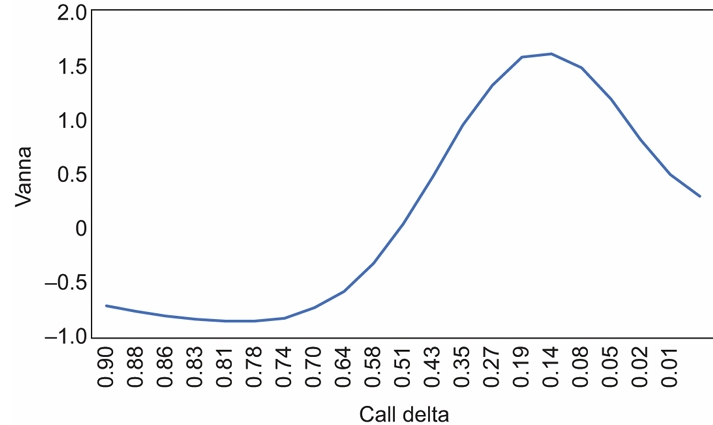
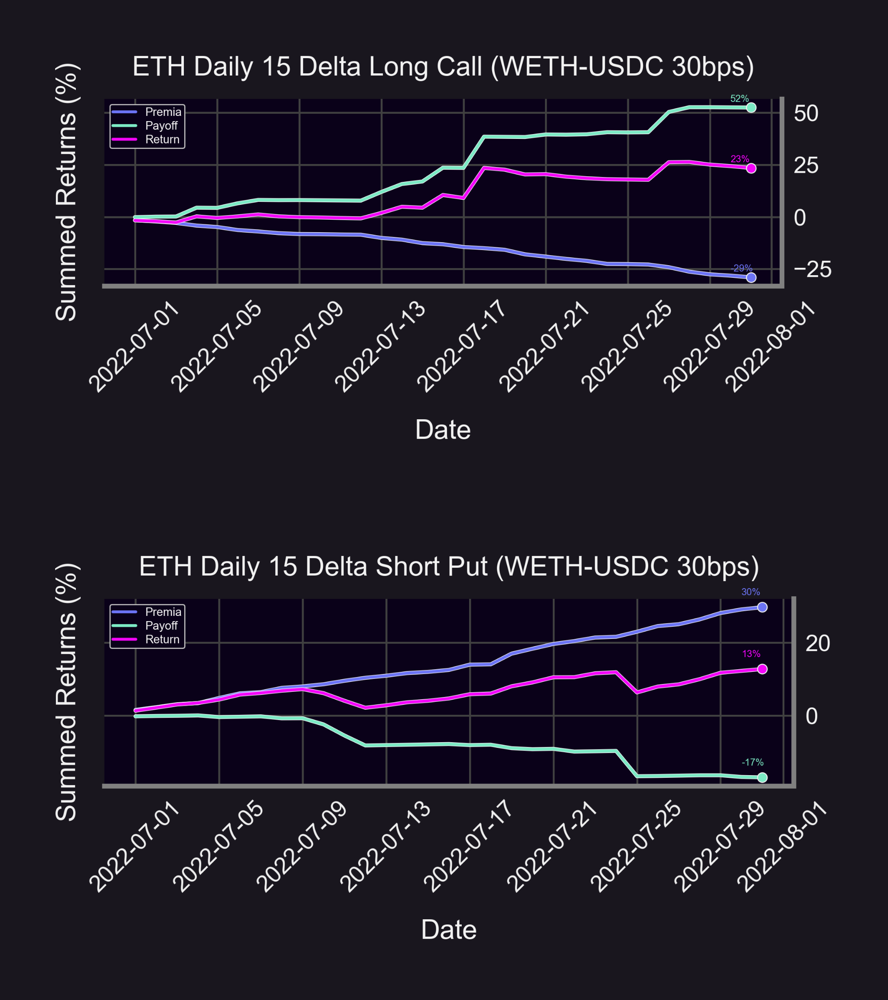
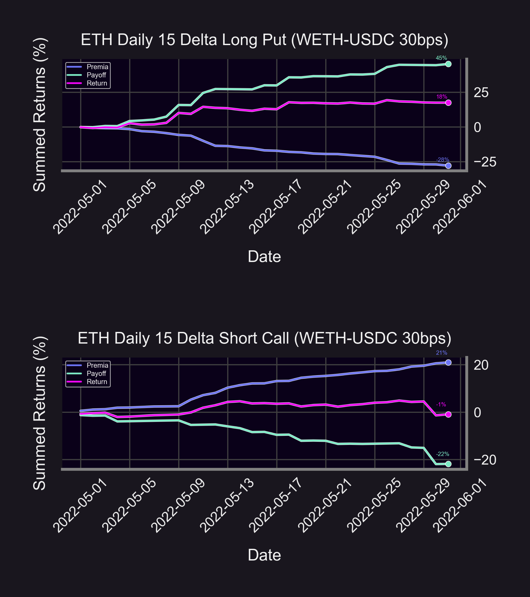
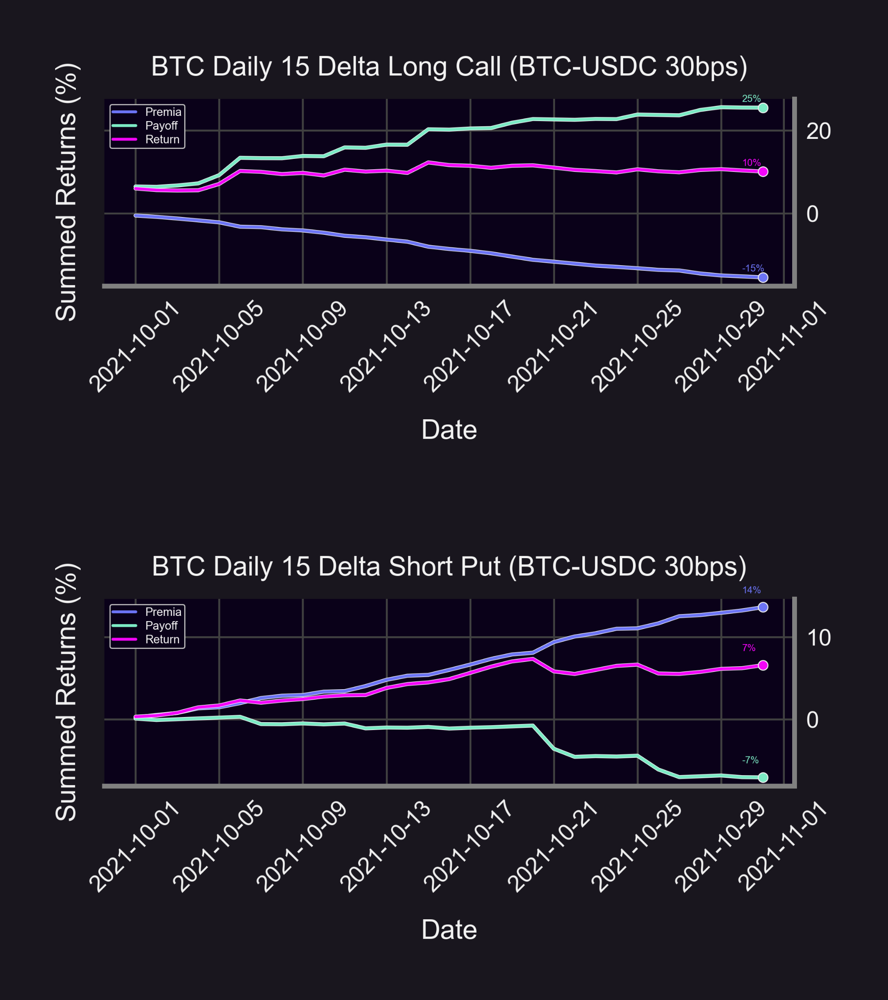
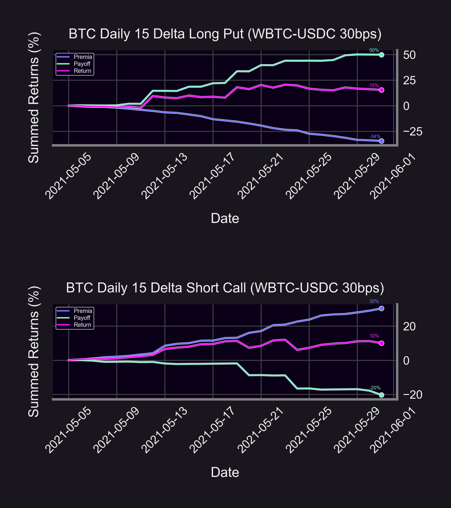
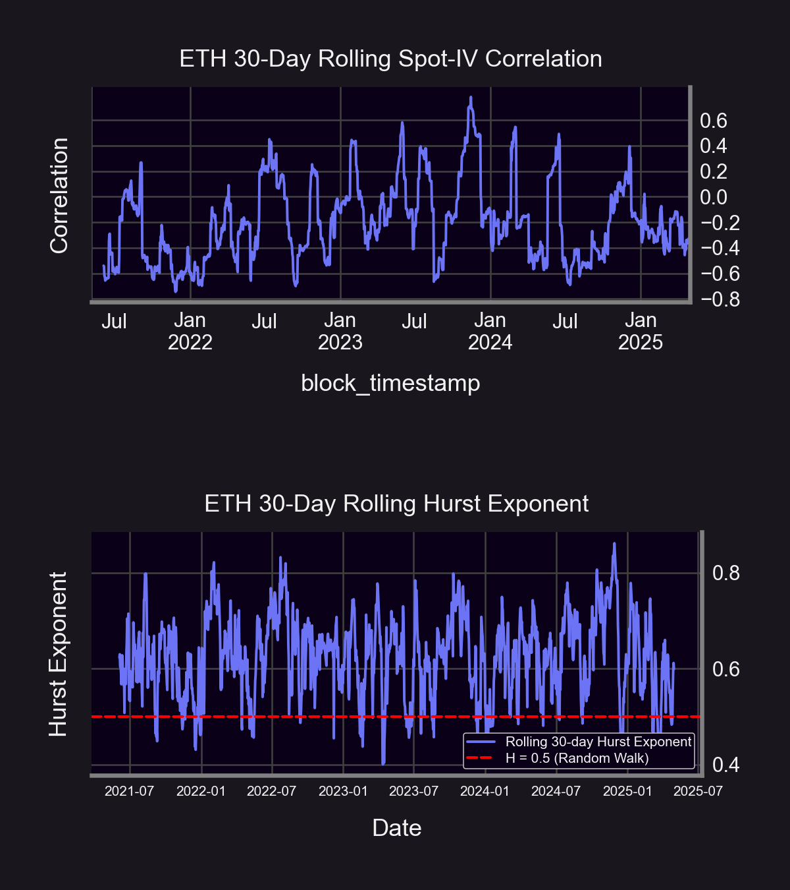
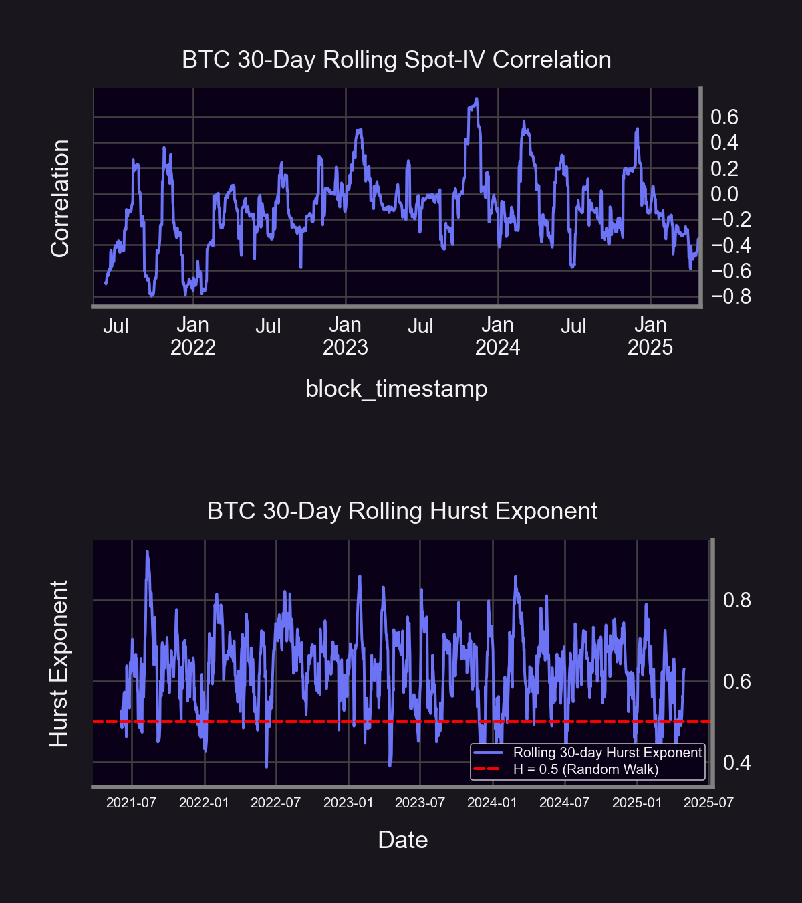
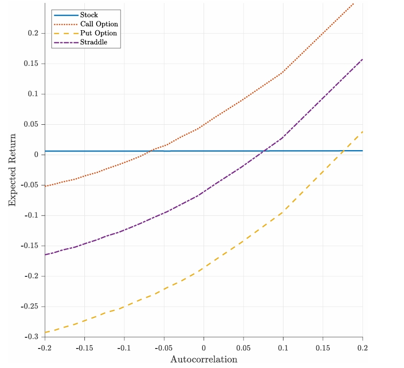

**Feel free to check out our livestream video on YouTube!**
<iframe width="560" height="315" src="https://www.youtube.com/embed/MnYfjcOBGto?si=h8NTqVPslwZGLBzE" title="YouTube video player" frameborder="0" allow="accelerometer; autoplay; clipboard-write; encrypted-media; gyroscope; picture-in-picture; web-share" referrerpolicy="strict-origin-when-cross-origin" allowfullscreen></iframe>

  

One of the more prevalent and pervasive higher-order options [Greeks](/research/understanding-the-greeks-series) is encapsulated by [vanna](https://moontowermeta.com/how-options-confuse-directional-traders/), which can be interpreted in two different ways: (1) changes in [delta](/research/understanding-delta-risk#what-is-delta) with respect to changes in implied volatility ([IV](/docs/terms/implied_volatility)) ($\frac{\partial \Delta}{\partial \sigma}$) or (2) changes in [vega](/research/understanding-the-greeks-series#vega-%CE%BD) with respect to changes in the underlying spot price ($\frac{\partial \nu}{\partial S}$). Vanna fundamentally quantifies the exposure of an options portfolio to spot-implied volatility (or spot-vol) correlation.

  

Now that the conceptual foundation for spot-vol correlation has been established, it is also worth asking:

  

How do asymmetries in spot-vol correlation manifest themselves in various asset classes?

  

[Equity indexes](https://www.sciencedirect.com/science/article/abs/pii/S0378426608000356) are known to exhibit a strongly negative spot-vol correlation, meaning that as IV rises, equity prices conventionally decline. Whereas in certain commodities such as [gold](https://onlinelibrary.wiley.com/doi/abs/10.1002/fut.21717), the opposite process transpires in that prices elevate alongside IV, otherwise known as positive spot-vol correlation. Meanwhile, crypto spot-vol correlation has displayed a tendency to [oscillate](https://blog.amberdata.io/the-btc-volatility-surface-q1-2023-deep-dive-into-defi-options-lyra) between both positive and negative territory.

  

In this article, we will dive into patterns that define onchain crypto spot-vol correlation as well as how to capitalize on these patterns through [Panoptions](/docs/terms/panoption).

## Results

We elected to trade on our view of underlying spot-vol correlation and maximize respective vanna exposures by conducting backtests for 15-delta Panoption [risk reversals](https://www.investopedia.com/terms/r/riskreversal.asp) on the ETH/USDC and WBTC/USDC 30bps Uniswap pools. A positive (negative) risk reversal is an options strategy consisting of buying (selling) an [OTM](/docs/terms/out_of_the_money)  [call](/docs/terms/call) option, while simultaneously selling (buying) an OTM [put](/docs/terms/put) option. The 15-delta level was selected as the optimal [moneyness](/docs/product/moneyness) for the risk reversal backtests as vanna is maximized at that delta threshold (as shown per the [figure](https://papers.ssrn.com/sol3/papers.cfm?abstract_id=3968542) below).

  

  

15-delta calls are assigned positive vanna with 15-delta puts being assigned negative vanna, so 15-delta positive risk reversals will theoretically benefit from extremes in positive spot-vol correlation, while 15-delta negative risk reversals will reap the rewards of extremes in negative spot-vol correlation. Per standard prescription of [volatility skew](https://predictingalpha.com/volatility-skew/), the intuitive reasoning behind these vanna designations being that the IV for call options rises as the underlying price rises, but the IV for put options conversely rises as the underlying price decreases.

  

We have also chosen to showcase the months with the highest risk reversal returns over a 4-year sample ranging from May 2021 to May 2025. Although risk reversals are capable of generating steady yields through many market climates, the primary purpose of this study is to emphasize how certain indicators can be used to empirically pinpoint inflection points in directional trends. Specifically, we will hone in on rolling spot-vol correlations and underlying return persistence as tools to aid in detecting ripe environments for maximally deploying either long or short vanna positions.

  

This regime-dependent approach will allow us to explore the deeper nuances of these indicators to optimize the timing and structure of risk reversals for comparison across abbreviated, pressurized periods defined by particular market attributes. The situational nature of profit maximization for risk reversals is very much in line with the conditional criteria and ephemeral base necessary for fruitful [gamma scalping](/research/gamma-scalping#gamma-scalping).

  

Spanning from May 2021 through May 2025, the above graphics reveal that the most profitable period for the ETH/USDC 30bps pool positive (negative) risk reversal on an intra-month basis during that sample was July 2022 (May 2022) with a 36% return (17% return). Those monthly returns amount to annualized totals of 3,910% and 559%, respectively, for the 15-delta positive and negative Panoption risk reversals (see code [here](https://github.com/panoptic-labs/research/tree/main/_research-bites/20250610)). The ETH/USDC 30bps pool comparatively proves to be more conducive for positive vanna exposure (long vanna) over an abbreviated period rather than negative vanna exposure (short vanna). Although there is a prevailing bias towards positive spot-vol correlation, the combined monthly return of 53% stemming from both risk reversals reveals that Panoptions on the ETH/USDC 30bps pool are prone to spot-vol correlation sensitivity of either positive or negative directionality.

The above illustrations unveil the results for 15-delta Panoption risk reversals on the WBTC/USDC pool with selected monthly returns from the same overall sample as the ETH/USDC pool. The positive (negative) risk reversal yielded a return of 17% (25%) during October 2021 (May 2021), those figures, respectively, translating to annualized returns of 559% and 1,357%. In addition to the Panoption risk reversals on BTC being cumulatively less profitable than those on ETH over the course of a one-month snapshot, the BTC risk reversals also diverge from ETH in that being short vanna is more lucrative than being long vanna. BTC risk reversals thus produce a combined return of 42% with a heightened sensitivity to negative spot-vol correlation over positive spot-vol correlation.

## Broader Discussion & Conclusions

The charts below display the 30-day rolling spot-vol correlation from May 2021 throughout May 2025 for both the ETH/USDC and WBTC/USDC Uniswap pools alongside the 30-day rolling Hurst exponent for both pools during the same sample. The [Hurst exponent](https://insights.deribit.com/market-research/momentum-bitcoin-and-reflexivity/) is a metric designed to quantify the degree of [autocorrelation](https://www.investopedia.com/terms/a/autocorrelation.asp) or trendiness within a time series.

  

A Hurst exponent on asset returns greater than 0.5 is indicative of a favorable trading environment for momentum with a value less than 0.5 signaling a favorable climate for mean-reversion, while asset returns that generate a value around 0.5 are deemed to be governed by a “[random walk](https://www.investopedia.com/terms/r/randomwalktheory.asp)” stochastic process. In conjunction with the Hurst exponent in our analysis being applied to simple spot returns, the spot-vol correlation results are derived by measuring the rolling correlation between simple spot returns and [Uniswap](/research/new-formulation-implied-volatility) IV.

Based on the above displays, there are two distinct parallels shared by ETH and BTC throughout the sample. One is that not only the absolute level, but the relative “[acceleration](https://papers.ssrn.com/sol3/papers.cfm?abstract_id=2645882)” of spot-vol correlation–either upward or downward over a given time period–is relevant to risk reversal returns. The other is that steep increases in the Hurst exponent coincide with steep increases in spot-vol correlation, while sudden drops in the Hurst exponent align with sudden drops in spot-vol correlation. Trendier returns thereby serve as a factor in augmenting spot-vol correlation, and mean-reverting returns play a role in diminishing spot-vol correlation.

(./08.png)

These results extend the conclusions of [prior literature](https://papers.ssrn.com/sol3/papers.cfm?abstract_id=4150310) which found that persistent autocorrelation (or trend) is empirically associated with equity bull markets and autocorrelation anti-persistence (or mean-reversion) presents itself during equity bear markets, as the above graph helps to illustrate with the S&P 500 index.

  

Separate [research](https://papers.ssrn.com/sol3/papers.cfm?abstract_id=3363331) also corroborates these findings as increasing underlying return autocorrelation is discovered to be a statistically significant and positive predictor of At-The-Money ([ATM](/docs/terms/at_the_money)) equity call option returns over put option returns. The comparable superiority of call option returns in the presence of magnified autocorrelation is visualized below with put option and [straddle](/research/defi-option-straddle-101) returns also benchmarked. It bears noting that the returns and statistical significance for these respective options positions is only enhanced when the supplement of [delta-hedging](/research/options-market-making#delta-neutral-trading) is added to the portfolio.

The common theme between our spot-volatility correlation and Hurst exponent findings is that the rate of change relative to both metrics merits further scrutiny and examination. Magnitude and speed of upward or downward fluctuations in spot-vol correlation or the Hurst exponent act as integral complements to the absolute level of either measurement, particularly in periods when the two do speedily fluctuate in concert with each other.

  

This joint property becomes apparent while specifically observing the timing of when the positive and negative risk reversal returns for ETH and BTC were maximized. Neither ETH nor BTC achieved maximum risk reversal returns during months when the spot-vol correlation or Hurst exponent were at absolute sample peaks or troughs, but all four risk reversals produced outsized gains in tandem with rapid shifts in the two quantities occurring as well as local peaks or troughs in each measure being reached.

  

This analysis then expands into the rationale of asking: what is the upward/downward “acceleration” threshold for spot-vol correlation and the Hurst exponent to portend higher returns for directional options positions such as the risk reversal? How could such a threshold be derived? And does the rate of change for one of these metrics (spot-vol correlation and Hurst exponent) quantitatively presage the other one? We leave these questions to future research.

  
*Join the growing community of Panoptimists and be the first to hear our latest updates by following us on our [social media platforms](https://links.panoptic.xyz/all). To learn more about Panoptic and all things DeFi options, check out our [docs](/docs/intro) and head to our [website](https://panoptic.xyz/).*
