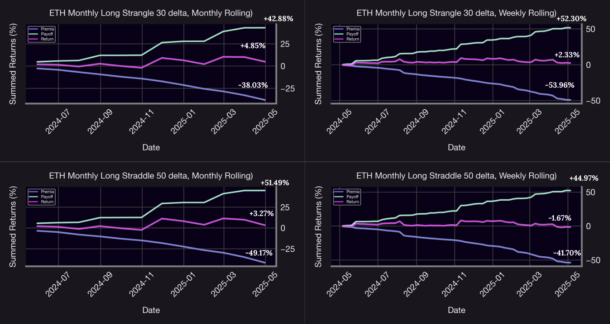

**Feel free to check out our livestream video on YouTube!**

<iframe width="560" height="315" src="https://www.youtube.com/embed/OeK2TdAC8e4?si=Jcuy6rhrDtwYXzwd" title="YouTube video player" frameborder="0" allow="accelerometer; autoplay; clipboard-write; encrypted-media; gyroscope; picture-in-picture; web-share" referrerpolicy="strict-origin-when-cross-origin" allowfullscreen></iframe>

## Introduction

In volatile, range-bound markets, traditional directional strategies often underperform due to frequent price reversals and uncertain trend conviction. For DeFi-native option protocols like **Panoptic**, this presents a unique opportunity: to harvest volatility through streaming fees by deploying non-directional, high-theta strategies such as multi-legs strategies. By multi-legs, we generally mean that we are involving simultaneously buying and selling multiple options contracts with different strikes, expirations, or both. They're designed to profit from specific market conditions while managing risk and capital efficiency. Here in our case there’s no expiration date since the options in Panoptic are perpetual which makes things even more interesting, profit-wise. Multi-legs options strategies offer primary advantages that make them attractive to sophisticated traders especially from a risk management perspective, they provide limited maximum loss exposure with clearly defined profit zones and breakeven points while requiring less capital than single option positions.

This research byte investigates two multi-legs strategies: straddles and strangles. These  strategies are implemented on the `ETH/USDC 30 bps` Uniswap v3 pool using Panoptic’s option framework. This is a part three of our Panoptions strategies research series, where we systematically backtest both long and short positions on calls and puts. In this installment, we extend the analysis to multi-legs volatility strategies—specifically straddles and strangles—and examine their performance under different rolling intervals using Panoptic’s streaming premium model.

## Strategy Mechanics

### Straddle

Straddles are volatility-focused options strategies that involve buying both a call and put option at the same strike price (typically at-the-money). This creates a symmetric "V-shaped" payoff profile where the strategy profits when the underlier moves significantly in either direction

- Profit if the underlying price moves significantly in either direction.
- Max gain: unlimited upside if the underlier rises, or large gain if ETH falls sharply.
- Risk: limited to the total streamia paid for both legs.
- Ideal market: highly volatile with large, unpredictable moves.

### Strangle

Strangles, on the other hand, offer a more cost-effective approach to volatility trading by purchasing out-of-the-money call and put options at different strike prices, creating a wider "profit dead zone" between the strikes. This strategy requires larger price movements to become profitable since the underlier must break beyond either OTM range, but compensates with lower costs compared to straddles. 

- Profit if the underlying price moves beyond either OTM strike level.
- Max gain: unlimited if the underlier trends strongly up or down.
- Risk: limited to the total streamia paid, typically lower than for a straddle.
- Ideal market: directional breakout after low volatility.

This strategy mirrors the perpetual straddle in structure but modifies the placement of the legs to simulate a strangle. Instead of centering both legs at the current price, the long call and long put are positioned further out-of-the-money. This potentially lowers costs, but requires larger price moves for the strategy to become profitable. The strategy still relies on streaming fee accumulation once price reaches either leg’s defined zone. The strangle benefits more from strong directional breakouts and minimizes premium
drag during sideways markets.

**Notes:** Straddles and strangles are both delta-neutral at initiation — they don’t care which direction the market moves, only that it moves, making them perfect for traders who lack directional conviction but expect volatility. Furthermore, straddles are placed right at the current price (ATM), so they react quickly to even small moves, but that precision comes with a higher premium. A compelling aspect is that before major events like Fed meetings, earnings announcements, or crypto upgrades, straddle prices often spike, since they’re a direct bet on expected volatility. As a final point, strangles let you choose how far out-of-the-money to place each leg, giving you control over the width of your profit zone — deeper OTM strikes **cost less**, but require larger price moves to pay off, making them ideal for betting on big swings at a lower cost.

In Panoptic, options are perpetual, and premiums accrue as streaming fees over time when liquidity is in-range. For straddle and strangle **sellers**, this transforms theta from a decaying liability into a positive revenue stream. These straddle strategies are designed to maximize time-in-range for both call and put legs. On the other hand, it is important to note that by frequently rolling both legs around the ATM price, each strategy harvests volatility, not through price direction, but through *mean reversion and touch frequency*. In effect, these are **theta-maximizing, delta-neutral** positions for DeFi-native traders.

**Figure 1** Payoff comparison between long straddle and long strangle strategies, illustrating how both benefit from large price movements in either direction, with the straddle activating closer to the spot and the strangle requiring a wider move to generate returns.

**Figure 2** Payoff Comparison of Long Strangle vs. Long Straddle on Panoptic — This figure displays the UI payoff curves for two volatility strategies on Panoptic: the Long Strangle (left) and the Long Straddle (right). The Long Strangle combines an out-of-the-money call (strike 3128) and put (strike 2345).

## Data

To evaluate the performance of straddle and strangle strategies on ETH/USDC, we simulate monthly option positions with a [range factor](https://panoptic.xyz/research/uniswap-lp-calculate-price-range) of 1.27. The backtest period is one year, from May 2024 to April 2025. For the straddle, we construct a symmetric exposure by simultaneously entering both a call and a put option at the current market price. For the strangle, we place the call and put further apart from the current price to reflect OTM exposure on both sides. These positions are designed to capture profits from price volatility without taking a directional view. For the purpose of this backtest, all strategies are fully collateralized, incur no trading commission, and are evaluated using historical Uniswap v3 pool data with a 0.3% fee tier on the Ethereum network.

In this backtest, we evaluate both weekly and monthly rolling frequencies to measure how often straddle and strangle positions are reset around the market price. Weekly rolling offers tighter alignment with short-term volatility, while monthly rolling captures broader directional moves and amplifies long-term payoff dynamics.

Feel free to check out the code [here](https://github.com/panoptic-labs/research/tree/main/_research-bites/20250612)

**Important Note:**  
One key factor not accounted for in this analysis is the [spread multiplier](https://panoptic.xyz/docs/product/spread), which is likely greater than 1x. In fact, observed data shows an average [spread multiplier](https://panoptic.xyz/research/loss-versus-panoptic-why-lps-are-losing) of approximately 1.2x. This implies that, when the spread multiplier is equal to 1, the option premium reflects its theoretical value with no adjustment. However, when the spread multiplier is greater than 1—in our case, 1.2x—This means the actual trading conditions deviate from the base pricing due to increased option buyer demand. In this case, buyers pay 20% more than the expected price, making options more expensive to purchase. Conversely, sellers benefit from this spread, earning 20% more than the base premium, which makes selling options more profitable under these conditions.

## Results & Interpretation

**Figure 3** ETH/USDC price dynamics from May 2024 to April 2025 in the 30 bps Uniswap v3 pool. The market shows both strong price moves and long sideways periods—making it a great environment to test how straddles and strangles perform using Panoptic’s streaming fee model.

Looking at this ETH price chart spanning from May 2024 to April 2025, we can see some really interesting patterns that are perfect for our options backtesting. ETH started around three thousand dollars, rallied to over four thousand in late 2024, but then got hit hard and dropped all the way down to about eighteen hundred dollars - that's a massive 56% decline from the peak. What's fascinating here is how the price moves in these distinct phases. You can see we had this sideways, choppy period through most of 2024 where ETH was just grinding. Then boom - we get this explosive decrease in the beginning of 2025.

This kind of price action is exactly what we want when testing straddles and strangles. During those choppy, low-volatility periods, straddles would have been collecting premium nicely as the price stayed range-bound. But then during these big breakout moves especially that massive drop we're seeing now that's where strangles really shine, particularly if you had those out-of-the-money puts positioned correctly.

**Figure 4** Cumulative performance of ETH long straddle and strangle strategies across weekly and monthly rolling intervals. The charts break down total returns into fee income (premia), directional gains (payoff), and net results, illustrating how volatility regimes and rolling frequency influence the trade-off between premium decay and realized PnL.

The comparative performance of long straddle and long strangle strategies on ETH/USDC, as illustrated in the figures, highlights how structure and cost sensitivity shape their outcomes under Panoptic’s perpetual option framework. All short strategies show strong premium collection - short straddles earning 45-52% and short strangles 43-51% demonstrating the power of selling volatility in crypto markets. Moreover, monthly rebalancing consistently outperforms weekly by twice as much for both long straddles and long strangles, showing that less frequent adjustments on long positions capture price swings more effectively.

The long straddle, which places both the call and put at the at-the-money strike, responds more quickly to short-term price fluctuations. However, this sensitivity comes at a cost. Because both legs are active around the spot price, premium accrues continuously, even in low-volatility environments where neither leg generates meaningful payoff. This results in a performance profile where cumulative payoffs trend upward but are largely offset by the persistent drag of streaming fees. What's even more fascinating is that even though straddles have an immediate activation of the legs, strangle still outperformed the straddles at the end of the one year backtest: 3.28% for straddles against 10.46% for strangles. In fact, the long strangle—constructed with out-of-the-money legs—shows a more favorable risk/reward profile. Since each leg activates only when ETH moves beyond a wider threshold, premium decay is lower and more episodic. This design allows the strangle to perform well during breakout phases while remaining relatively insulated during quiet periods.

**Figure 5** Performance breakdown of ETH long straddle (50 delta) and strangle (30 delta) strategies across weekly and monthly rolling intervals, highlighting differences in fee accumulation, directional payoff, and overall return dynamics under varying volatility conditions. 

When examining the granular return charts, we observe that generally speaking, there isn't much difference in the performances of these two strategies in terms of the patterns of the returns. However, straddles seem to have the highest monthly return in both rolling frequencies, while, strangles still outperformed the straddles at the end of the backtest.

Ultimately, straddle and strangles returns are higher with monthly rolling because the longer holding period allows each leg to stay active and capture larger price moves, increasing the chance of significant directional payoff. In contrast, weekly rolling resets more frequently, keeping the position close to spot but often missing extended trends. Since these strategies always sit near the current price, they continuously incur streaming fees in Panoptic. Monthly rolling gives the strategy more time to overcome this fee drag, while weekly rolling effectively caps upside potential.

## Conclusion

At the end of the chaotic one-year backtest, the long strangle outperforms in breakout-driven markets due to its lower cost and wider profit range. Nevertheless, it lags during low-volatility periods when price stays between its strikes. The long straddle, while more sensitive to small price moves near the entry point, suffers from higher fee accumulation over time. However, the data shows straddles can make you between 10% and 15% monthly when there's a conviction of volatility. Furthermore, rolling frequency does matter at the end of the day: monthly rebalancing captures larger directional moves more effectively.

On the other hand, a natural next step is to extend this analysis to short straddle and short strangle strategies, which invert the payoff profile and introduce asymmetric risk in exchange for steady premium accumulation. Studying these positions would allow us to quantify theta harvesting opportunities and stress-test capital efficiency under tail events.

Another promising direction is to dynamically adjust the delta and width of each leg based on realized or implied volatility regimes. For example, tightening strikes in low-volatility environments or widening them ahead of anticipated macro events could enhance performance through volatility targeting.

It would also be valuable to explore multi-legs combinations, such as iron condors or butterfly spreads, which may offer more favorable risk-adjusted returns in range-bound markets with lower directional bias.

Moreover, to make the simulation more realistic, future work could use actual historical tick data to measure how long price stays in each range and estimate fee accrual more accurately. The analysis could also be expanded to include other assets and different fee tiers, like 5 bps pools, to better understand how Panoptic strategies perform across various market conditions.

In the end, whether you choose straddles or strangles, you're essentially making the same bet: that ETH will move big, move fast, and move in your favor. Just remember - in the world of long volatility strategies, you're not just trading options, you're trading on chaos itself. And in crypto, chaos always delivers...eventually!

_Join the growing community of Panoptimists and be the first to hear our latest updates by following us on our [social media platforms](https://links.panoptic.xyz/all). To learn more about Panoptic and all things DeFi options, check out our [docs](/docs/intro) and head to our [website](https://panoptic.xyz/)._

