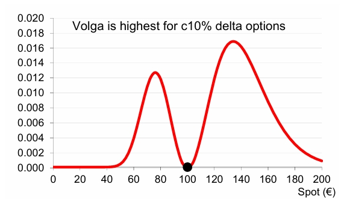
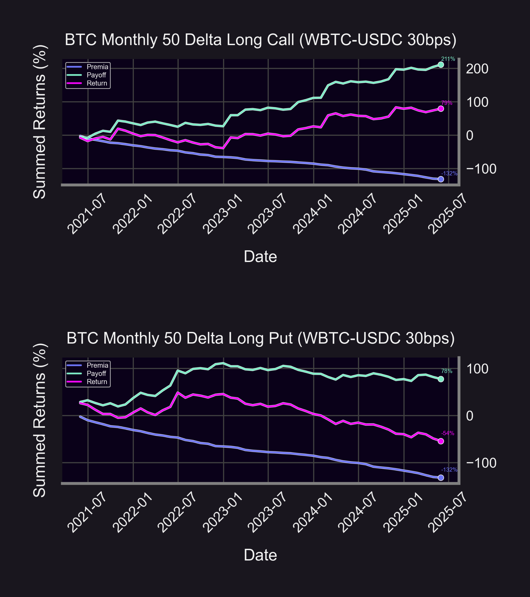

**Feel free to check out our livestream video on YouTube!**

  

<iframe width="560" height="315" src="https://www.youtube.com/embed/E62_m77SttE?si=7myizbvqRhkAnepU" title="YouTube video player" frameborder="0" allow="accelerometer; autoplay; clipboard-write; encrypted-media; gyroscope; picture-in-picture; web-share" referrerpolicy="strict-origin-when-cross-origin" allowfullscreen></iframe>

  

One of the more relatively underexplored elements of volatility trading is the volatility of implied volatility ([IV](/docs/terms/implied_volatility)) or “vol-of-vol.” This empirical property is tradable through the options [Greek](/research/understanding-the-greeks-series) of volga, which expresses changes in [vega](/research/understanding-the-greeks-series#vega-%CE%BD) with respect to changes in IV ($\frac{\partial \nu}{\partial \sigma}$). The logical question for our purposes then becomes how does volga present itself in [Panoptions](/docs/terms/panoption) trading?

  

A key parallel to comprehend is that volga is shorthand for “volatility [gamma](/research/understanding-the-greeks-series#gamma-%CE%B3),” meaning that explicitly trading in this higher-order Greek bears a mechanical resemblance to either [gamma scalping](/research/gamma-scalping#gamma-scalping) or [reverse gamma scalping](/research/reverse-gamma-scalping#reverse-gamma-scalping) depending on whether a long or short volga position is undertaken. However, a core distinction to understand is that where gamma trading relates to [convexity](/research/gamma-scalping#positive-convexity) or payoff curvature concerning underlying spot price, volga trading is predicated on convexity with regard to volatility or vega. Purchasing or selling volga is fundamentally akin to respectively longing or shorting the convexity of volatility.

  

Liquidity provider (LP) shares on Uniswap have already thoroughly proven to contain negative gamma or negative price convexity as they essentially function as short [perpetual put option](/blog/uniswap-lp-equals-options#lps-are-options-sellers) positions. This embedded asymmetry leads to the “Uniswap Price [Doom Loop](/research/derivatives-solve-uniswap-doom-loop#the-doom-loop)” where the underlying must be sold amid price downturns to maintain [delta-neutrality](/research/options-market-making#delta-neutral-trading). What if this structurally biased dynamic also extends over to vega convexity for Uniswap-based [perpetual options](/docs/terms/perps)? And, if so, how could such a trait be profitably navigated and traded?

## Results

In the context of this study, volga exposure is maximized and traded through running backtests on Panoption [reverse iron butterflies](https://www.investopedia.com/terms/b/butterflyspread.asp) for the ETH/USDC and WBTC/USDC 30bps Uniswap pools. The reverse iron butterfly strategy consists of a long At-The-Money ([ATM](/docs/terms/at_the_money)) [straddle](/research/defi-option-straddle-101) and short Out-of-the-Money ([OTM](/docs/terms/out_of_the_money)) [strangle](/research/defi-option-strangle-straddle). Deep OTM options contain peak volga, while volga bottoms for ATM options. ATM options are limited to only linear exposure with respect to volatility with deep OTM options (wings) possessing convexity with respect to volatility. Options wings majorly benefit from magnified vol-of-vol due to the enhanced probability of migrating from deep OTM to In-the-Money ([ITM](/docs/terms/in_the_money)).

| **Iron Butterfly**                                                                 | **Reverse Iron Butterfly**                                                                 |
|------------------------------------------------------------------------------------|---------------------------------------------------------------------------------------------|
| Long Volga                                                                         | Short Volga                                                                                 |
| Long OTM Strangle, Short ATM Straddle                                              | Long ATM Straddle, Short OTM Strangle                                                      |
| Sell Vega as IV rises, Buy Vega as IV drops                                       | Buy Vega as IV rises, Sell Vega as IV drops                                                |
| Payoff peaks when spot price [hovers](https://optionalpha.com/strategies/iron-butterfly) around short ATM strikes (as displayed by below visual) | Payoff peaks when spot price [drifts](https://optionalpha.com/strategies/reverse-iron-butterfly) beyond short OTM wing strikes (as displayed by below visual) |

The [call](https://panoptic.xyz/docs/terms/call) and [put](/docs/terms/put) option legs featured in our backtested strangle were selected to be struck at the 10-[delta](/research/understanding-delta-risk#what-is-delta) level as volga crests at this [moneyness](/docs/product/moneyness) tier (displayed per the [graphic](https://www.trading-volatility.com/Trading-Volatility.pdf) above). Given the potential predisposition to short vega convexity environments for Panoptions that was previously outlined, we specifically selected the reverse iron butterfly to backtest as it is intrinsically a short volga strategy. As the above table aids in delineating, the conventional iron butterfly (long OTM strangle, short ATM straddle) naturally stands in contrast as a long volga strategy.

The above charts reveal the reverse iron butterfly monthly results on the ETH/USDC 30bps pool ranging from May 2021 through May 2025 (see code [here](https://github.com/panoptic-labs/research/tree/main/_research-bites/20250626)). The cumulative return through this period sums to 59% (12% annualized). This short volga strategy supplies a steady year-over-year yield over an array of market climates throughout this 4-year sample. On a monthly basis, the strategy performs well whenever there is extreme [volatility skew](/research/spot-vol-correlation) of either directionality, but this effect is specifically more pronounced in the presence of accentuated positive skew. This observation aligns with the “[relief risk premium](/research/implied-volatility-call-wing-premia)” property where vol-of-vol is significantly reduced in the wake of market uncertainty resolution.

As shown above, the WBTC/USDC pool reverse iron butterfly monthly returns are muted by comparison when backtested during an identical sample period as the ETH/USDC pool. The returns for the 4-year span accumulate to a total of 17%, which translates to a mere 3.9% return when annualized. Month-over-month, the same general trend observed with ETH also applies to BTC where strategy performance is enhanced by volatility skew extremities of either direction. Though the highest monthly strategy returns for BTC, much in the same vein as ETH, are spurred on by abnormally positive volatility skew.

  

Although, both ETH and BTC are rarities when viewed against other asset classes in the sense that they generate positive returns at all when deploying a long-term, short vol-of-vol strategy. Why is this the case with ETH and BTC being short volga standouts? We look to further statistical analysis.

## Broader Discussion & Conclusions

  

Spanning from May 2021 through May 2025, the above graphics showcase the rolling 30-day standard deviations of daily changes in the [Uniswap](/research/new-formulation-implied-volatility) IV for the ETH/USDC and WBTC/USDC pools as well as the rolling 30-day correlation between daily changes in Uniswap IVs and their respective rolling standard deviations during that time. While ETH and BTC each exhibit individual trends in terms of vol-of-vol, the correlation of IV to vol-of-vol of both assets occupy positive territory for a fairly sizable duration of the sample. The full sample correlations are 0.51 and 0.35, respectively, for ETH and BTC with ETH deviating more than BTC around the mean of 0. ETH also has a marginally higher vol-of-vol for the sample than BTC. These are all contributing factors to ETH being assessed with an elevated vol-of-vol [risk premium](https://papers.ssrn.com/sol3/papers.cfm?abstract_id=4291955).

  

The vol-of-vol risk premium is a premium stemming from the heightened perception of possible vol-of-vol risk for the underlying asset. So as with any risk premia, there is an opportunity to “fade” or bet on the eventual mean-reversion of the premia to a more normalized level. The short volga trade resultantly becomes more attractive for ETH and BTC predominantly due to increased IV/vol-of-vol correlations. For the sake of comparison, the [VIX/VVIX](https://web.archive.org/web/20200505222854id_/https://www.cambridge.org/core/services/aop-cambridge-core/content/view/9D8ABBDE874D8259A5176FA455C674B7/S0022109018001436a.pdf/div-class-title-volatility-of-volatility-risk-div.pdf) correlation is observed to be 0.27, lower than both ETH and BTC. A long volga strategy is generally more conducive for equities as demonstrated by the below [chart](https://papers.ssrn.com/sol3/papers.cfm?abstract_id=4854521).

The “BWB” metric on the above visualization is indicative of excess returns for a portfolio of S&P 500 equities where the underlying equities with the highest iron butterfly returns are systematically bought, and accordingly, the equities with the lowest iron butterfly returns are systematically sold over the course of a 24-year timeline. This portfolio management technique consistently outperforms the baseline S&P 500 market benchmark (“MKTRF”) for a healthy portion of the sample in question.

  

When accounting for a subdued IV/vol-of-vol correlation, a long volga strategy such as a conventional iron butterfly is hence proven capable of reaping in considerable alpha within equities because the asset class-specific vol-of-vol risk premium is not deemed to be as steep. The opportunity for a mean-reversion trade is expanded in tandem with a temporarily inflated perception of risk, so it stands to reason that as an IV/vol-of-vol correlation is abnormally hiked, there is a greater likelihood for vol-of-vol risk to be mispriced in the interim. Such a mispricing becomes apparent when analyzing how reverse iron butterfly returns align in perfect descending order with the associated IV/vol-of-vol correlation for ETH, BTC, and S&P equities.

  

The shared intuition between hedging gamma and volga has already been illustrated in this analysis, but the potential reverberations from negative vega convexity hedging on Panoptic have yet to be fully realized. Just as the process underpinning reverse gamma scalping entails buying the underlying into rallies and selling the underlying into downturns to delta-hedge, short volga trading involves buying options as IV rises and selling options as IV declines for the objective of vega-hedging. This joint trading intuition also bears out mathematically through the following equations in that:

*Reverse Gamma Scalping P&L*:

([1](https://www.amazon.com/Positional-Option-Trading-Wiley/dp/1119583519)) 
$$\text{P\&L}_{\text{Reverse Gamma Scalping}} = \text{Vega} \cdot \left( \sigma_{\text{implied}} - \sigma_{\text{realized}} \right)  
$$
&
*Short Vol-of-Vol P&L*:

([2](https://papers.ssrn.com/sol3/papers.cfm?abstract_id=4291955))
$$
\text{P\&L}_{\text{Short Vol-of-Vol}} = \frac{1}{2} \sigma_{\text{ATM}}^2 \cdot \text{Volga} \cdot \left( \nu_{\text{imp}}^2 - \nu_{\text{real}}^2 \right) \Delta t 
$$
$$
\text{where } \nu_{imp} \text{ and } \nu_{real} \text{ denote implied and realized vol-of-vol parameters.}
$$

Both tactics hinge on implied parameters surpassing their realized counterparts over an elapsed period of time with volatility being the relevant component for reverse gamma scalping and vol-of-vol pertaining to short volga trading. Whereas underlying price [reflexivity](https://insights.deribit.com/market-research/momentum-bitcoin-and-reflexivity/) is a byproduct of reverse gamma scalping when peak prices are pushed higher and troughed prices are pushed lower to hedge, an apex IV would be forced higher and a depressed IV would be forced lower due to the machinations of short volga trading.

  

Does a viable short vega convexity climate for Panoptions lay a solid foundation for a uniquely reflexive volatility feedback loop on the platform? Or does a similarly outsized vol-of-vol risk premium occur in offchain crypto options trading as well? Reconciling these answers could possibly amount to a panoply of arbitrage opportunities.

  

*Join the growing community of Panoptimists and be the first to hear our latest updates by following us on our [social media platforms](https://links.panoptic.xyz/all). To learn more about Panoptic and all things DeFi options, check out our [docs](https://panoptic.xyz/docs/intro) and head to our [website](https://panoptic.xyz/).*