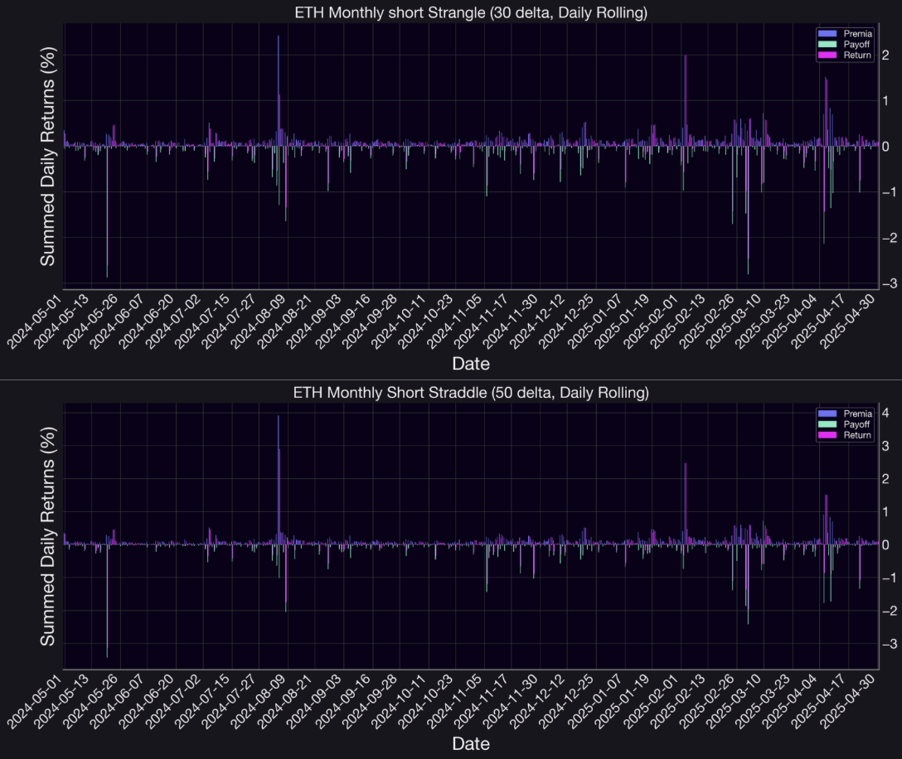

## Introduction

In markets where prices move back and forth without a clear trend, traditional directional trades often perform poorly because of sudden reversals and uncertainty. Panoptic, a DeFi protocol offering perpetual options, takes a different approach: it allows traders to earn from volatility by using non-directional strategies that collect fees over time. One of the most effective tools in this setup is the use of multi-leg strategies, which involve entering multiple option positions—usually a call and a put—at different strike prices. These strategies don’t rely on predicting whether the market will go up or down. Instead, they aim to earn steady income from price staying within a range, while managing risk in a balanced way.

Unlike traditional options, Panoptic’s contracts are perpetual and on-chain, with no expiration date. This introduces an additional layer of flexibility for strategy construction: yield is determined by time-in-range rather than time-to-expiry. Multi-leg strategies in this framework allow traders to define precise risk/reward corridors and collect fees based on option activity rather than one-off premium pricing.

This research byte—**Part 4** of the *Panoptions Strategies* series—focuses on two multi-leg volatility strategies: the **short straddle** and **short strangle**. These are implemented on the `ETH/USDC 30 bps` Uniswap v3 pool using Panoptic’s perpetual options framework. In contrast to [Part 3](https://panoptic.xyz/research/delta-neutral-strangle-vs-straddle), where we analyzed the **long versions** of these strategies (which benefit from directional breakouts and expanding volatility), this installment examines the inverse: short volatility positions that thrive when prices remain range-bound and muted.

We compare the performance of short straddles and strangles under various rolling frequencies, assess breach behavior, and quantify fee harvesting efficiency. This transition from long to short volatility gives us a full-spectrum understanding of how to position across different market conditions using Panoptic’s streaming premium model.

---

## Strategy Mechanics

### Straddle

Short straddles are volatility-selling strategies where traders simultaneously sell a call and a put at the same strike price (typically at-the-money). This results in an inverted "V-shaped" payoff, where profits are maximized if the underlyer stays near the strike and losses occur with large directional moves.

- Profit if the underlying price stays close to the strike.
- Max gain: total streamia collected while both legs remain in-range.
- Risk: unlimited loss if ETH moves sharply up or down.
- Ideal market: low volatility, mean-reverting price action.

This strategy mirrors the perpetual straddle structure by placing a short call and put directly at the spot price, forming a narrow, high-premium range. The short straddle maximizes fee collection when ETH stays near the strike but is more sensitive to directional moves. It thrives in low-volatility, mean-reverting environments — ideal for harvesting theta when price remains tightly contained.

### Strangle

Short strangles reduce cost and risk exposure by selling out-of-the-money puts and calls at different strikes, generating revenue across a wider price band. The trader profits if ETH remains between the two strike prices but can face large losses if the price breaks out in either direction.

- Profit if the underlying stays between the OTM strike levels.
- Max gain: limited to the total streamia collected.
- Risk: significant if ETH trends beyond either leg.
- Ideal market: stagnant or range-bound conditions.

This strategy mirrors the perpetual straddle structure but repositions the short call and put legs further from the spot price, forming a strangle. This wider range can improve profitability by staying in-range longer, albeit with potentially less streamia collected. The short strangle thrives when ETH meanders between the strikes and decays quickly if price stays contained — ideal for harvesting theta without taking a strong directional view.

> ### Note on Delta Neutrality
> **Are short straddles and strangles delta-neutral strategies?**
>
> Yes — but only initially. Both short straddles and short strangles are *delta-neutral at entry*, meaning they have no immediate directional bias. A short straddle sells both an at-the-money (ATM) call and put, which offsets deltas symmetrically. Similarly, a short strangle sells out-of-the-money (OTM) options on both sides with matching deltas, resulting in a net delta of 0.
>
> However, as the underlying price moves, the position's delta drifts. If price rises, the short call becomes more sensitive (more negative delta), and if price falls, the short put dominates (more positive delta). Without rolling, the strategy becomes increasingly directional.
>
> In Panoptic, since options are perpetual and not automatically re-anchored, this drift happens continuously. Rolling the position daily or weekly helps maintain practical delta neutrality by re-centering the strategy around the new spot price.
>
> *In summary: short straddles and strangles are delta-neutral at entry, but only remain so with active rolling or dynamic hedging.*

**Figure 1:** Payoff comparison between short straddle and short strangle strategies, illustrating how both benefit from prices remaining near the strike(s). The short straddle generates returns as long as the price stays close to the spot, while the short strangle requires the price to remain within a wider range to avoid losses. Both strategies collect fees over time, but are exposed to losses if the price moves significantly beyond the strike boundaries.

**Figure 2:** Payoff Comparison of Long Strangle vs. Long Straddle on Panoptic — This figure displays the UI payoff curves for two volatility strategies on Panoptic: the Long Strangle (left) and the Long Straddle (right). The Long Strangle combines an out-of-the-money call (strike 3128) and put (strike 2345).

---

## Data

To evaluate the performance of short straddle and short strangle strategies on ETH/USDC, we simulate monthly option positions using a [range factor](https://panoptic.xyz/research/uniswap-lp-calculate-price-range) of 1.27, the equivalent of an LP position that is concentrated 27% above and 27% below the current price. The backtest period spans one year, from May 2024 to April 2025, just like in part 3. For the short straddle, we take simultaneous short positions in both a call and a put option at the current market price, thereby maximizing fee collection near the spot price. For the short strangle, the call and put positions are placed further apart to reflect out-of-the-money exposure, aiming to collect fees across a broader range. These strategies are designed to profit from low volatility and price stability, earning streaming fees as long as ETH remains within the defined range. Although options are undercollateralized on Panoptic, we assume strategies are fully collateralized for these backtests, incur no trading commissions, and are evaluated using historical Uniswap v3 pool data with a 0.3% fee tier on the Ethereum network.

In this backtest, we evaluate daily, weekly and monthly rolling frequencies to measure how often straddle and strangle positions are reset around the market price. daily rolling offers tighter alignment with short-term volatility, while weekly and monthly rolling captures broader directional moves and amplifies longer term payoff dynamics.

Feel free to check out the code [here](https://github.com/panoptic-labs/research/tree/main/_research-bites/20250630)

**Important Note:**  
One key factor not accounted for in this analysis is the [spread multiplier](https://panoptic.xyz/docs/product/spread) , which is likely greater than 1x. In fact, observed data shows an average [spread multiplier](https://panoptic.xyz/research/loss-versus-panoptic-why-lps-are-losing) of approximately 1.2x. This implies that, when the spread multiplier is equal to 1, the option premium reflects its theoretical value with no adjustment. However, when the spread multiplier is greater than 1—in our case, 1.2x—This means the actual trading conditions deviate from the base pricing due to increased option buyer demand. In this case, buyers pay 20% more than the expected price, making options more expensive to purchase. Conversely, sellers benefit from this spread, earning 20% more than the base premium, which makes selling options more profitable under these conditions.

## Results & Interpretation

**Figure 3:** ETH/USDC price dynamics from May 2024 to April 2025 in the 30 bps Uniswap v3 pool. The market shows both strong price moves and long sideways periods—making it a great environment to test how straddles and strangles perform using Panoptic’s streaming fee model.

**Figure 4:** Daily, weekly, and monthly percentage changes in ETH price from May 2024 to April 2025. These changes dynamics provide important context for evaluating short straddle and strangle performance, particularly under different rolling frequencies.

Looking at this ETH price chart, spanning from May 2024 to April 2025, we can identify several distinct phases that are ideal for evaluating short straddles and strangles. ETH began near three thousand dollars, rallied to over four thousand by late 2024, and then sharply declined to around eighteen hundred in early 2025 — a dramatic 56% drawdown from the peak.

What’s particularly interesting is how the price action unfolds: we see a prolonged choppy, sideways period throughout much of 2024, where ETH remained tightly range-bound. These low-volatility conditions are ideal for short straddles and strangles, as the price staying within the option range allows sellers to accumulate streaming fees without significant exposure to directional risk.

However, the sharp drop at the beginning of 2025 presents a stark contrast. These types of sudden directional moves are exactly the kind of events that can challenge short volatility strategies, especially strangles, where wider wings may still get breached. That said, with tight rolling frequency (e.g., daily), short sellers may have managed risk effectively by frequently re-centering their exposure. But clearly, this drawdown period underscores the importance of active management and dynamic strike placement when running short gamma strategies in Panoptic.

In the backtest results, cumulative performance of ETH short straddle and strangle strategies across daily, weekly, and monthly rolling intervals. Each subplot highlights how premia collection, directional payoff, and net return vary under different volatility regimes and strategy designs. To evaluate the risk-return characteristics of short volatility strategies on ETH, we compare short straddles (monthly 50 delta options) and short strangles (monthly 30 delta options) across three rolling intervals: daily, weekly, and monthly. The charts decompose returns into premia (fees earned while the option remains out-of-the-money), payoff (realized token movement due to price breaches), and the net return, allowing for detailed insight into how these strategies perform under different market regimes.

**Figure 5:** Daily-rolling returns for ETH short strangle (30 delta) and short straddle (50 delta) strategies from May 2024 to April 2025.

**Figure 6:** Weekly-rolling returns for ETH short strangle (30 delta) and short straddle (50 delta) strategies from May 2024 to April 2025.

**Figure 7:** Monthly-rolling returns for ETH short strangle (30 delta) and short straddle (50 delta) strategies from May 2024 to April 2025.

**Table 1:** Summary statistics and Sharpe ratios for short straddle and short strangle strategies across rolling intervals

| Rolling | Metric         | Straddle Premia | Straddle Payoff | Straddle Return | Strangle Premia | Strangle Payoff | Strangle Return |
|---------|----------------|------------------|------------------|------------------|------------------|------------------|------------------|
| Monthly | Min            | 1.515            | -16.797          | -13.683          | 1.485            | -14.107          | -11.065          |
|         | 25% Quartile   | 2.521            | -5.600           | -2.444           | 2.567            | -4.925           | -2.241           |
|         | Median         | 3.076            | -0.954           | 1.803            | 2.762            | -1.219           | 1.254            |
|         | 75% Quartile   | 4.246            | -0.095           | 2.702            | 4.145            | -0.155           | 2.585            |
|         | Max            | 6.652            | -0.018           | 6.623            | 5.282            | -0.008           | 5.206            |
|         | Sharpe Ratio   | 2.404            | -0.711           | -0.048           | 2.883            | -0.764           | -0.082           |
| Weekly  | Min            | 0.234            | -8.032           | -7.072           | 0.234            | -6.531           | -5.678           |
|         | 25% Quartile   | 0.506            | -1.191           | -0.376           | 0.506            | -1.056           | -0.342           |
|         | Median         | 0.711            | -0.452           | 0.203            | 0.701            | -0.489           | 0.298            |
|         | 75% Quartile   | 1.014            | -0.054           | 0.531            | 1.012            | -0.060           | 0.578            |
|         | Max            | 5.483            | -0.000           | 5.269            | 3.954            | 0.019            | 3.973            |
|         | Sharpe Ratio   | 1.072            | -0.643           | 0.018            | 1.199            | -0.685           | -0.028           |
| Daily   | Min            | 0.008            | -3.428           | -3.140           | 0.008            | -2.878           | -2.613           |
|         | 25% Quartile   | 0.060            | -0.113           | -0.015           | 0.060            | -0.155           | -0.031           |
|         | Median         | 0.094            | -0.037           | 0.037            | 0.094            | -0.028           | 0.046            |
|         | 75% Quartile   | 0.157            | -0.009           | 0.091            | 0.157            | 0.011            | 0.097            |
|         | Max            | 3.916            | 0.000            | 2.898            | 2.426            | 0.019            | 1.995            |
|         | Sharpe Ratio   | 0.552            | -0.421           | 0.021            | 0.691            | -0.427           | -0.002           |

---

Starting with the daily rolling interval, both straddle and strangle strategies exhibit relatively low volatility and tight clustering around zero. Occasional drawdowns do appear, especially in response to abrupt price movements like those in March 2025. However, the short straddle clearly benefits more from the daily re-centering effect. It consistently collects higher premia due to its at-the-money (ATM) positioning and exhibits greater return stability across the year. In contrast, the short strangle, while more resilient to minor intraday fluctuations due to its wider range, captures less premium and shows slightly more vulnerability during fast directional moves.

The weekly rolling plots offer a balanced perspective. Both strategies achieve more stable return profiles compared to the monthly charts while allowing for more capital efficiency than daily rolling. Weekly straddles produce consistent fee accumulation and moderate drawdowns, typically not exceeding -6%. The weekly strangle also improves in stability compared to the monthly version, but still underperforms the straddle overall. The shorter rolling horizon ensures quicker strike re-centering after large moves, which helps contain loss severity and allows return recovery in the following weeks.

In the monthly rolling plots, the differences become more pronounced. Both strategies are exposed to more prolonged directional risk, but the short strangle demonstrates significantly deeper losses. For instance, in months like August 2024 and March 2025, the short strangle reaches drawdowns as steep as -14%, while the short straddle tends to limit its worst-case returns to the -11% range. Despite this, both strategies show strong positive returns during calm months like October 2024, February 2025, and April 2025, with the short straddle again outperforming due to its richer fee collection. The monthly strangle, while capable of producing good returns in sideways markets, suffers heavily when ETH breaks out directionally, reflecting the high gamma exposure over extended windows.

Quantitatively, the short straddle dominates in terms of sharpe ratio and return consistency. Its tighter strike placement yields greater premia, and the frequent OTM condition ensures fee income builds up reliably. The strangle only outperforms in long, low-volatility phases where the spot price drifts but stays well within its OTM range. However, when breached, its wider wings deliver harsher payoffs and slower recovery. This makes the strangle strategy particularly vulnerable under high-volatility breakouts.

Rolling frequency is a critical determinant of performance. Daily rolling minimizes directional exposure and quickly re-centers positions, making it ideal for volatile environments. Weekly rolling strikes a balance between fee harvesting and directional risk. Monthly rolling is capital-efficient but risky unless volatility remains low for extended periods.

### Win Rate Analysis Across Frequencies

To further quantify the reliability of short straddle and short strangle strategies, we evaluate their empirical *win rate* — defined as the percentage of periods with strictly positive net returns. This metric offers a complementary perspective to the Sharpe ratio, highlighting the consistency of profitable outcomes rather than their magnitude or volatility-adjusted efficiency.

**Table 2:** Win rates across rolling intervals for short straddles and short strangles.

| Rolling Frequency | Short Straddle Win Rate | Short Strangle Win Rate |
|-------------------|-------------------------|--------------------------|
| Monthly           | 66.67%                  | 66.67%                   |
| Weekly            | 58.49%                  | 60.38%                   |
| Daily             | 70.96%                  | 68.22%                   |

As shown in Table, both strategies exhibit moderate-to-high win rates across all rolling intervals. Daily rolling displays the strongest consistency, with short straddles achieving a 70.96% win rate and short strangles closely following at 68.22%. Weekly frequencies also perform reliably, with win rates clustering near 58.49% for short straddle and 60.38% for short strangles. Monthly rebalancing, while more volatile in terms of payoff magnitude, still achieves a 66.67% win rate for both strategies, indicating that even with fewer rolling opportunities, premium collection and range containment often yield net-positive outcomes.

## Conclusion & Future Work

In conclusion, short straddles exhibit peak gamma exposure precisely when the underlying hovers near the strike, meaning even small price movements around that level can trigger disproportionately large changes in directional risk. In Panoptic, the risk associated with these strategies is distinctly nonlinear—losses are not solely triggered by a breach of the LP range but grow the deeper the price pushes into either leg. Both the magnitude and the speed of price movement matter: a slow drift beyond the strike may still result in manageable losses, while a sharp spike can rapidly unwind multiple cycles of accrued fees. 

Additionally, since Panoptions stream yield only while one or more legs remains in range, the timing of price movement is critical. If ETH breaches a leg early in the cycle, that leg ceases to collect fees, dramatically reducing net returns. Consequently, two price paths ending near the same level can yield vastly different outcomes based on how long each leg remained inactive. Furthermore, while short straddles and strangles may be delta-neutral at entry, they are not risk-neutral. Convexity—i.e., gamma risk—grows the longer the strategy is left unadjusted. 

On the other hand, more frequent rolling helps maintain neutrality but increases exposure to re-entry at potentially less favorable volatility levels. Ultimately, these strategies display a characteristically skewed return profile: many small, steady wins punctuated by rare but severe losses. With win rates commonly exceeding 60%, a single volatile move (i.e. a sudden $1,000 drop in ETH) can wipe out months of gains, underscoring the importance of position sizing and risk limits in DeFi-native volatility harvesting.

This study opens several promising avenues for future research. First, applying the short straddle and strangle framework to other Uniswap v3 pools—such as `WBTC/USDC` or `ETH/stETH` would help evaluate strategy robustness across different volatility profiles and liquidity conditions. Second, deeper delta optimization could be achieved by conditioning strike selection on historical breach frequency or volatility clustering, enabling more responsive positioning. Third, incorporating risk-adjusted metrics like Sharpe and Sortino ratios would offer a clearer view of return consistency and tail risk across rolling intervals. Finally, exploring alternative rebalancing triggers such as volatility spikes, breach proximity, or fee decay thresholds may significantly improve risk management and capital efficiency compared to fixed calendar-based rebalancing.

Join the growing community of Panoptimists and be the first to hear our latest updates by following us on our [social media platforms](https://linktr.ee/panopticxyz). To learn more about Panoptic and all things DeFi options, check out our [docs](/docs/intro) and head to [our website](https://panoptic.xyz/).

