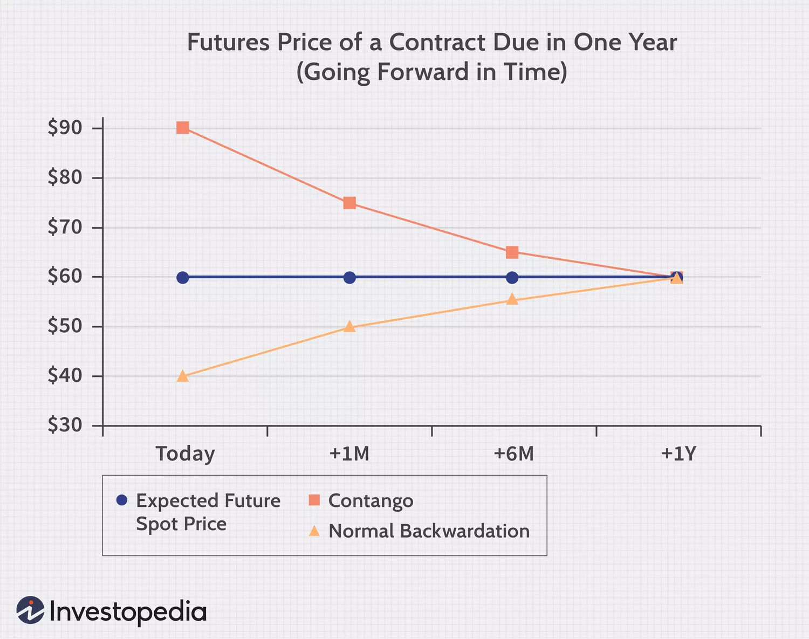
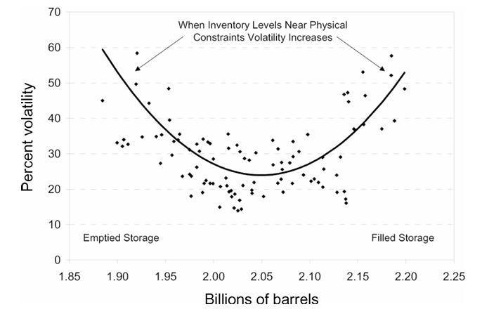
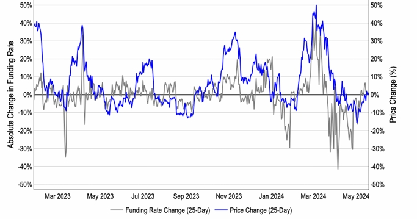
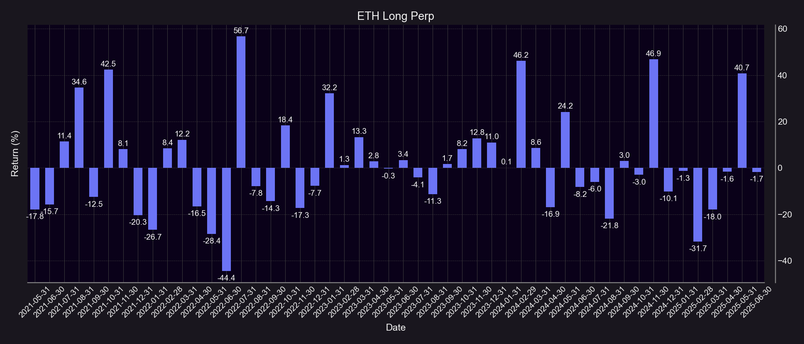
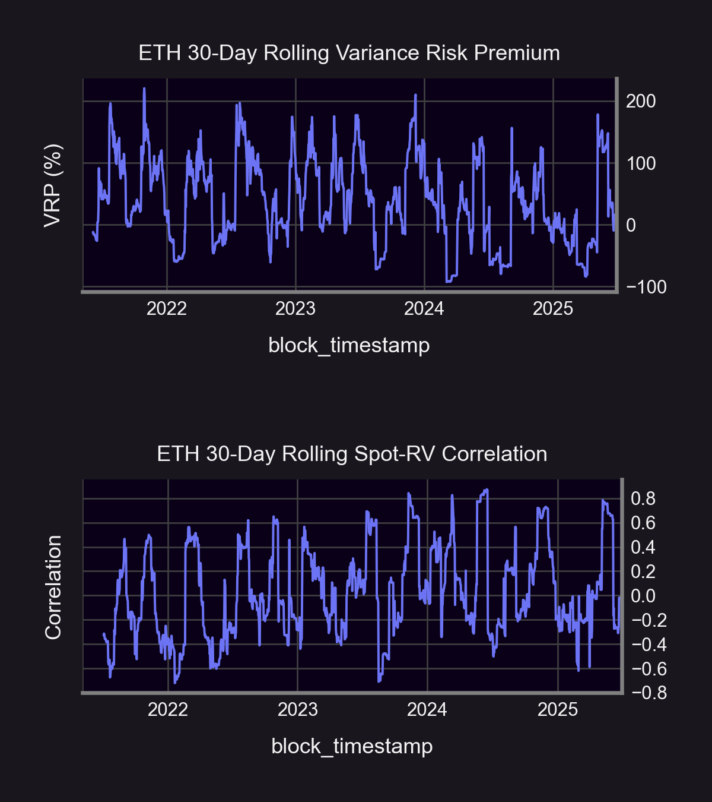
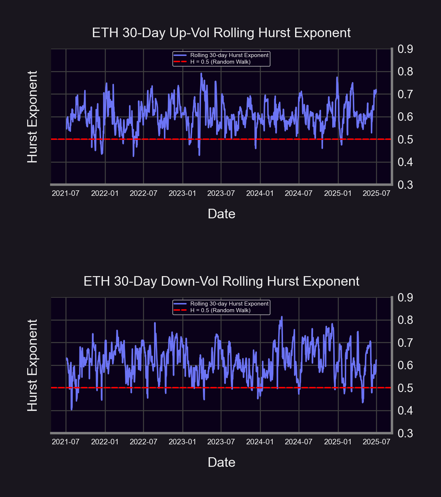
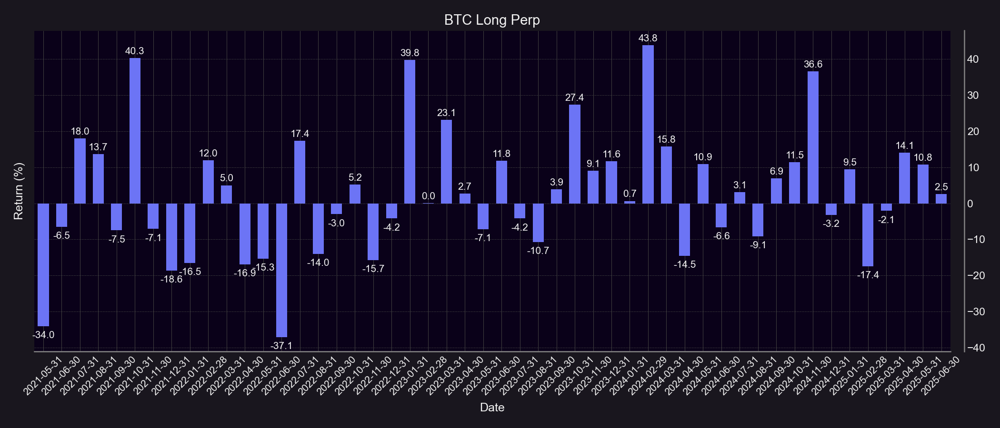
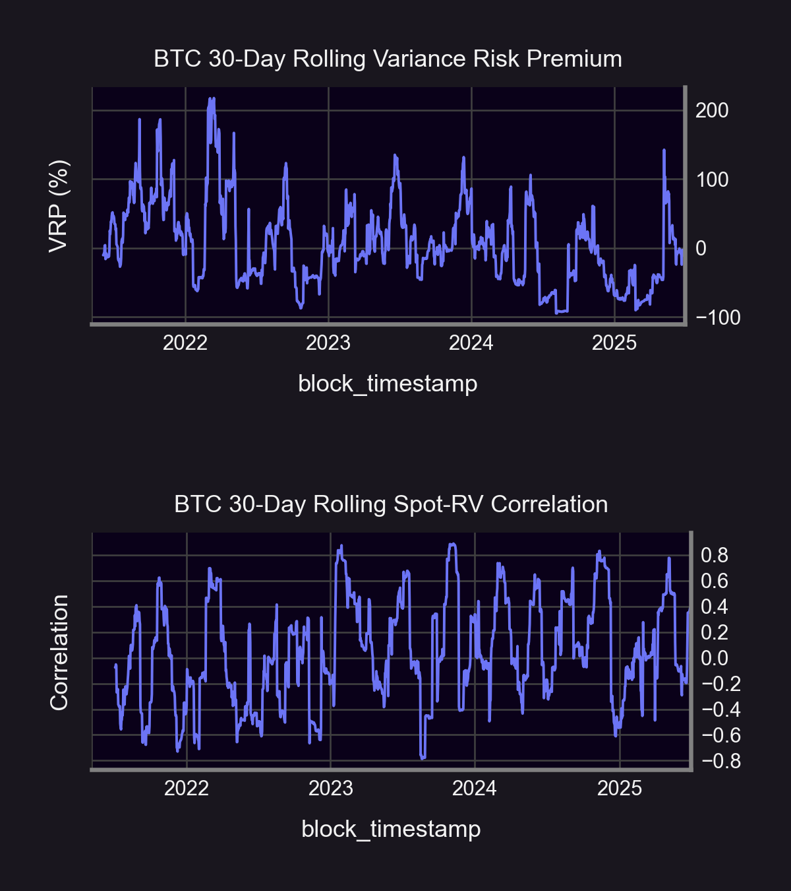
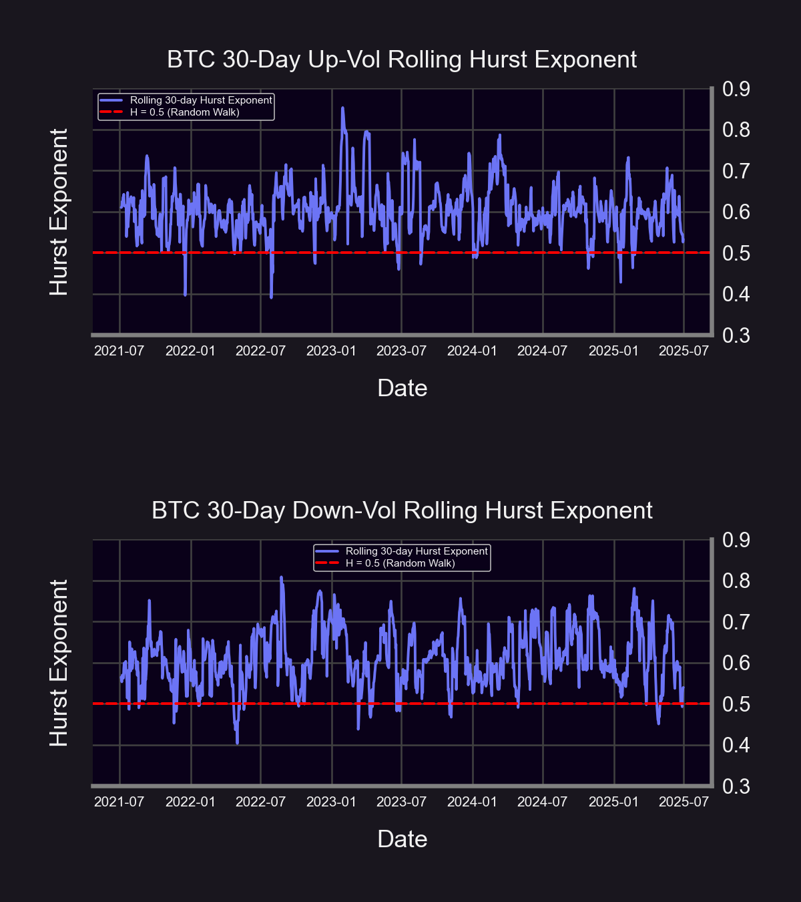
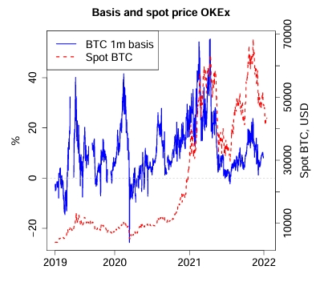

**Feel free to check out our livestream video on YouTube!**
<iframe width="560" height="315" src="https://www.youtube.com/embed/_uqSYgkC0lY?si=B7x9jUC3ZmS-SBAk" title="YouTube video player" frameborder="0" allow="accelerometer; autoplay; clipboard-write; encrypted-media; gyroscope; picture-in-picture; web-share" referrerpolicy="strict-origin-when-cross-origin" allowfullscreen></iframe>

  

An underdeveloped area of research within traditional markets is how [futures term structure](https://www.cmegroup.com/education/courses/introduction-to-ferrous-metals/what-is-contango-and-backwardation.html) interacts with and can precipitate underlying volatility. [Contango](https://www.investopedia.com/terms/c/contango.asp) characterizes an upward-sloping futures term structure where spot trades at a discount to futures prices, while [backwardation](https://www.investopedia.com/terms/b/backwardation.asp) characterizes a downward-sloping futures term structure where spot trades at a premium to futures prices. Both term structure regimes entail an eventual convergence to the spot price with contangoed futures declining and backwardated futures rising at expiration as the below [graphic](https://www.investopedia.com/articles/07/contango_backwardation.asp) conveys. We will pinpoint exactly how excess volatility can be a byproduct of extremal points in the futures term structure, how these futures polarities coincide with underlying spot prices as well as the implied components of options markets, and how these properties can be collectively harnessed and capitalized upon through [Panoptions](/docs/terms/panoption) trading.

Prior [studies](https://www.sciencedirect.com/science/article/abs/pii/S0264999312002489) have demonstrated how price volatility displays a “V-shaped” pattern in relation to the extremes of a futures term structure. The below [visual](https://onlinelibrary.wiley.com/doi/abs/10.1111/j.1540-6261.2009.01466.x) portrays this smile-like trend in the case of crude oil. Acute backwardation signals an increased desire to hold an underlying asset due to a high [convenience yield](https://www.investopedia.com/terms/c/convenienceyield.asp) and depressed levels of physical storage, thereby propping up spot prices to trade at a premium to futures prices. The opposite mechanics occur when detailing the origins of severe contango. There is an inverse correlation between the convenience yield and physical storage whereby when the convenience yield for a commodity is high (low), there is a connotation that physical storage is low (high). This conventional interrelationship in commodities does not hold when applied to crypto though, which we will detail later in this article.

Since frenetic activity in the futures term structure is primarily reflected through underlying realized volatility ([RV](/research/reverse-gamma-scalping#reverse-gamma-scalping)), we employ a statistical barometer such as the variance risk premium ([VRP](/research/reverse-gamma-scalping#variance-risk-premium)) to gauge how RV moves in concert with the options lens of implied volatility ([IV](/docs/terms/implied_volatility)) by deducting implied variance from realized variance to compute the VRP as shown in the below formula. The VRP bears a key distinction as a metric from the volatility risk premium in that it permits the IV for every strike on an options chain to be encapsulated rather than the IV at a single strike price, so we elected to feature the VRP in our analysis due to its all-encompassing potency in quantifying the evolution of RV-IV dynamics.
  
$VRP_{t,T} = N * [RV_{t,T}^2 - IV_{t,T}^2]$

where $N$ is a notional amount, $RV$ is realized volatility, and $IV$ is implied volatility.
  

Although, the VRP cannot explain futures returns in a state of either heightened contango or backwardation. We accordingly chose to further [deconstruct](https://papers.ssrn.com/sol3/papers.cfm?abstract_id=3416414) the realized variance component of the VRP into the [semi-volatilities](https://www.sciencedirect.com/science/article/abs/pii/S2405851323000211) of upside and downside RV by calculating volatility realized for simple positive underlying returns (r>0) or simple negative underlying returns (r<0) respectively. But a question remains as to whether upside or downside RV accounts for a larger proportion of overall realized variance? How can this line of inquiry be resolved with the added dimension of underlying spot movement? The answer lies in the degree of [volatility clustering](https://www.tastylive.com/news-insights/new-research-big-market-moves-tend-to-cluster) for either realized semi-volatility.

  

Volatility clustering is a well-established empirical trait observed with movements in financial time series where large returns of either direction tend to follow large returns, small returns tend to follow small returns, etc. This property effectively expresses the extent to which volatility persists or [autocorrelates](https://www.investopedia.com/terms/a/autocorrelation.asp) (i.e. “clusters”) during a given period. Disaggregating the persistence of the upside and downside realized semi-volatility will permit us to analyze which types of returns (positive or negative) contribute more to a realized variance spike within a regime of elevated contango or backwardation. Within the prism of the VRP, the question then becomes how does IV move in relation to RV amid these spikes?

  

The scope of this article will interweave three separate conceptual arenas in futures term structure, the VRP, and volatility clustering to supply differentiated insights. The indicators that we explore will outline how to time and execute certain onchain options strategies when futures markets are in flux. RV dynamics can be truly distinct from IV dynamics, but we will lay out the steps as to how to capture the differential between the two through trading volatility on Panoptic. We will also be commentating on why embedded cyclicality tied to the three variables in our analyses are unique to crypto volatility markets.

## Results

As Panoptic is a [perpetual options](/docs/terms/perps) trading platform, the backtests that were deployed on the ETH/USDC and WBTC/USDC 30bps Uniswap pools to assess dated or expirable futures market activity were specifically adjusted through the filter of [perpetual futures](/research/perpetual-futures-vs-options#what-are-perps) (perps) by way of trading [synthetic perps](/research/introduction-synthetic-perps#synthetic-perps-on-panoptic)(see code [here](https://github.com/panoptic-labs/research/tree/main/_research-bites/20250722)). A long synthetic perp position is formed by coupling a long At-The-Money ([ATM](/docs/terms/at_the_money)) 50-[delta](/research/understanding-delta-risk#what-is-delta) Panoption [call](/docs/terms/call) with a short 50-delta Panoption [put](/docs/terms/put). While conventional perps would entail long positions paying a [funding rate](/research/perpetual-futures-vs-options#perps-funding-rate) to short positions during contango and vice versa during backwardation, long synthetic perp positions on Panoptic will accrue outsized positive returns amid contango and outsized negative returns (positive returns for short synthetic perp positions) amid backwardation.

We utilize Panoptic-native synthetic perps returns as proxies for contango and backwardation due to the BTC trend depicted by the above [figure](https://coinbase.bynder.com/m/61e31f57f674ff53/original/MktIntel_2024-06-10_Perps-1.pdf). The chart reveals how the BTC funding rate derived from various centralized exchanges (CEXs) changes in accordance with the underlying BTC price. This illustration demonstrates how underlying BTC price tends to increase (decrease) alongside CEX BTC funding rate increases (decreases), indicating that severe perp funding rate contango (backwardation) would serve as an adjunct to steep price increases (decreases). Hence, we transpose this logic concerning perp-price interdynamics offchain to our synthetic perps trading onchain.

The above graphic reveals the long synthetic perp monthly backtest results on the ETH/USDC 30bps pool for a sample period spanning from May 2021 through June 2025. The maximum monthly return of 56.7% (21867% annualized) for the position was attained in July 2022 with the largest gain of 44.4% (8133%) for a short synthetic perp position being realized during the immediately prior month of June 2022. Assuming a persistent positive correlation between underlying prices and perp funding rates, we extrapolate that this ETH pool was likely under contango in July 2022 and backwardation in June 2022. We can thus proceed with looking to identify how the VRP and certain directional volatility persistence present themselves and accompany magnified contango and backwardation during these pressurized periods.

The above visualizations unveil results concerning the 30-day rolling VRP, spot-RV correlation (correlation between simple spot returns and RV), and semi-volatility persistence over the course of the previously mentioned sample period. We parametrize volatility persistence by virtue of the [Hurst exponent](https://www.efmaefm.org/0EFMAMEETINGS/EFMA%20ANNUAL%20MEETINGS/2022-Rome/papers/EFMA%202022_stage-3032_question-Full%20Paper_id-265.pdf). The Hurst exponent is a metric designed to quantify the degree of autocorrelation or trendiness within a time series. A Hurst exponent on RV greater than 0.5 is indicative of elevated volatility clustering with a value less than 0.5 signifying subdued volatility clustering, while RV that generates a value around 0.5 is deemed to be governed by a purely stochastic process.

  

Rises in the VRP predominantly coincide with increases in spot-RV correlation, which is further statistically supported by synchronized timing with heightened upside realized volatility persistence. Conversely, declines in the VRP largely align with decreases in spot-RV correlation and intensified downside realized volatility persistence. The most sweeping interpretation that can be discerned from this suite of analytics is that contango for the pool primarily transpires in conjunction with an augmented VRP-upside volatility persistence regime, whereas backwardation occurs alongside the opposite state with diminished VRP and enhanced downside volatility persistence. Intuitively, we are then incentivized to long (short) underlying ETH through spot, perps, expirable futures, synthetic perps, etc., as early-stage contango (backwardation) deepens.

The same synthetic perp backtest was conducted on the WBTC/USDC 30bps pool during an identical sample. Although the maximized returns for long and short BTC synthetic perps are not as great in absolute terms as ETH, the largest gain for the BTC long synthetic perp position outweighs the largest gain for the short synthetic perp position, which is observed as being the case with ETH as well. The top monthly return for the long BTC synthetic perp position was 43.8% (7732% annualized), and the top monthly return for the short BTC synthetic perp position was 37.1% (4317% annualized). With the same assumptions as before, we extrapolate that this Bitcoin pool was likely under contango in February 2024 and backwardation in June 2022. Once again, we go on looking to identify the same technical markers as we did with ETH.

Also akin to ETH, there is a nexus between the BTC VRP and directional volatility persistence, but it does not appear to be as pronounced until the onset of 2023. When taking stock of both ETH and BTC pools, there is a clear asymmetry with regard to increased upside volatility clustering contributing to overall realized variance spikes disproportionately more than increased downside volatility clustering. A defined void has been illustrated between the severe contango-expanded VRP-bolstered upside volatility clustering linkage versus the severe backwardation-reduced VRP-concentrated downside volatility clustering paradigm. In both pools, the most direct trading synopsis is to directionally long (short) the underlying through whatever directional means as contango (backwardation) is sharpened during nascent phases. But this perspective begs the question from an implied standpoint as to how we can trade the market if either underlying contango or backwardation has seemed to have already reached a local summit?

## Broader Discussion & Conclusions

Despite there being a demonstrably asymmetric impact of upside RV on enlarging the VRP for both ETH and BTC, the inverse dynamic prevails concerning implied variance. The VRP for both assets diminishes in the wake of rising downside volatility persistence, meaning that implied variance overwhelms realized variance in the midst of falling markets. Downside [volatility skew](/docs/terms/volSmile) thereby dominates the implied variance component of the VRP, firmly contrasting with upside volatility reigning quantitatively supreme over the VRP realized variance segment. What explanation lies at the base of this major realized-implied divergence? We contend that the root of such a marked bifurcation is predicated on the downwardly-biased [feedback loop](/research/crypto-gamma-traps#convenience-yield) that is the [crypto-native convenience yield](/research/derivatives-solve-uniswap-doom-loop#derivatives-complete-spot-markets).

  

In commodities markets, the convenience yield measures the benefit of holding a physical commodity rather than futures contracts, particularly during shortages. Swings in physical storage are what principally dictate futures term structure in TradFi commodities as already highlighted with crude oil. Traditionally, this benefit can be [conceptually compared to owning a call option](https://www.sciencedirect.com/science/article/abs/pii/S0264999312002489), where holding the physical commodity provides flexibility to respond to supply disruptions.

  

However, crypto markets exhibit a different pattern: the convenience yield tends to be [negative](https://onlinelibrary.wiley.com/doi/abs/10.1002/fut.22216). Instead of acting like a call option (benefiting from scarcity), holding spot crypto conceptually behaves like owning a put option. This [negative convenience yield](https://www.tandfonline.com/doi/pdf/10.1080/14697688.2012.723463) arises primarily because traders prefer futures contracts for their leverage and speculative potential, leading to an elevated futures price relative to spot (widening futures [basis](https://www.paradigm.co/blog/back-to-the-basis-all-you-need-to-know-to-get-started-trading-basis-on-bybit) or contango). Additionally, this effect is reinforced by high demand for downside protection, evident in the crypto options markets through increasingly negative volatility skew and elevated put-call ratios. Crypto Out-Of-The-Money ([OTM](/docs/terms/out_of_the_money)) puts are particularly expensive due to retail traders' demand for [crash-risk insurance](https://papers.ssrn.com/sol3/papers.cfm?abstract_id=4268371).

  

When crypto prices decline, the negative convenience yield amplifies selling pressure: spot holders are incentivized to sell, fueling further price declines and creating a self-perpetuating downward spiral. This sequence was notably [observed in 2021](https://papers.ssrn.com/sol3/papers.cfm?abstract_id=4268371), where peaks in futures premiums preceded significant drops in BTC spot prices. Unlike traditional commodities, crypto’s negative convenience yield magnifies volatility and downward price cascades. Owning futures in conventional commodity markets resembles selling a call option, while owning futures in crypto approximates selling a put option. The crypto convenience yield tracks similarly to the “[Uniswap Price Doom Loop](/research/derivatives-solve-uniswap-doom-loop#the-doom-loop)” in that it is a structurally intrinsic and pervasive short put option within the crypto marketplace.

Crypto can be broadly categorized as an asset class interlaced with steady “Fear-Of-Missing-Out” ([FOMO](https://www.paradigm.co/blog/the-shape-of-opportunity-futures-term-structure-in-crypto-vs-tradfi-and-impact-on-volatility)) upside RV and the complementary specter of ominously steep downside IV. Simply put, crypto prices adhere to an “up the stairs, down the elevator” framework. As underlying prices gradually drift upwards under the domain of futures contango, an [implied variance asymmetry](https://papers.ssrn.com/sol3/papers.cfm?abstract_id=3108007) develops where the perception of future downside risk looms over that of future upside risk. This comparative imbalance in IV continues to bear out when viewing the relative valuation of OTM Panoption [put wings](/research/implied-volatility-put-wing-premia) over OTM Panoption [call wings](/research/implied-volatility-call-wing-premia).

  

The empirical status quo within the crypto niche is that realized price upticks are ostensibly followed by impending options-implied doom. This notion is solidified even more so when factoring in that [directional persistence](https://core.ac.uk/download/pdf/151156524.pdf) is sharpened during states of accentuated futures contango or backwardation. RV happens to also be additionally [cluster-prone](https://papers.ssrn.com/sol3/papers.cfm?abstract_id=3221887) through hiked periods as opposed to suppressed periods, and regarding crypto, hiked RV has clearly proven to reside within the confines of contango. The raised IV preceding periods of backwardation simply acts as a forward-looking counterbalance.

  

Hearkening back to a question in a previous portion of this study as to how to trade maximized underlying contango or backwardation through options, the answer appears to be to undertake a contrarian view. When contango (backwardation) and upside (downside) realized directional persistence culminate to unusually exhaustive levels, the natural response in the volatility markets is to trade an outlook that portends to be counter to those underlying extremes, probably in the form of OTM option wings. It does bear reiterating though that the recurring theme generally observed within crypto consists of underlying contango and upward persistence attaining new heights, while collaterally on the implied side, downside price [convexity](/research/gamma-scalping#positive-convexity) exposure is being accumulated through long OTM put wings as perceived preparation for negatively slated future price risk. This realized versus implied pricing rubric is analogous to a quantitative rollercoaster where what actually goes down is sequentially forecasted to go up and vice versa.

  

In this article, we have unified the conceptual buckets of futures term structure, the VRP, and volatility clustering. This union not only constitutes a distinctive approach to identify when and how longing/shorting synthetic perps on Panoptic would be profitable, but it represents exactly why crypto is a rarefied sub-asset class in terms of RV-IV interplay as well. This type of trading prescription is simple and has potential to be highly lucrative. Lean into crypto underlying extremes from a realized perspective, while trading opposite from an implied perspective. Such a realized-versus-implied crypto dichotomy presents a myriad of actionable disparities in trading options against underlying [delta-one](https://www.ig.com/uk/glossary-trading-terms/delta-one) instruments across a full spectrum of centralized and decentralized platforms.

  

*Join the growing community of Panoptimists and be the first to hear our latest updates by following us on our [social media platforms](https://links.panoptic.xyz/all). To learn more about Panoptic and all things DeFi options, check out our [docs](/docs/intro) and head to our [website](https://panoptic.xyz/).*