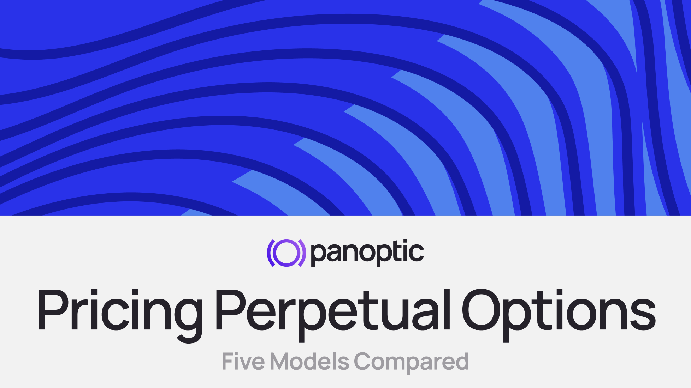

## Introduction

Perpetual options are a new class of financial instruments that extend the flexibility of traditional derivatives by removing fixed maturity. Unlike standard European or American options[^1], perpetual options offer the holder indefinite exposure to an underlying asset or strategy, often in exchange for a continuous fee or funding rate.

The pricing of these options poses a unique challenge. Without an expiry, classical models such as Black-Scholes become structurally incompatible, requiring either re-interpretation or novel mathematical frameworks. At the same time, the growth of decentralized finance has created new constraints and opportunities: oracles may be unreliable, expiries may be inefficient, and liquidity provisioning may act as implicit option selling.

This paper presents a comparative study of five distinct pricing models for perpetual options, each with a different motivation, mathematical structure, and degree of compatibility with DeFi protocols. These include:

- **Panoptic’s Streaming Theta Model**, a DeFi-native framework where pricing emerges path-dependently from AMM mechanics.
- **Paradigm’s Everlasting Options**, which emulate Black-Scholes via perpetual funding rates.
- **Sidani’s Probabilistic Expiry Model**, which interprets perpetual options as distributions over standard options.
- **Gapeev & Rodosthenous’ Compound Perpetuals**, which solve optimal stopping problems for layered contracts.
- **Grossinho et al.’s Nonlinear Volatility Model**, which accounts for risk feedback by making volatility a function of gamma.

For each model, we provide both a rigorous mathematical explanation and an intuitive plain-language interpretation. Our goal is to distill the assumptions, mechanics, and tradeoffs of each framework, and then evaluate how each model fits into a future of fully on-chain, composable financial primitives.

[^1]: A *European option* can be exercised only at expiry, while an *American option* can be exercised at any time before or at expiry.

## Model I: Panoptic – Streaming Premium from On-Chain Liquidity

### Quantitative Explanation

Panoptic introduces a DeFi-native pricing model for perpetual options, built entirely on-chain and without relying on oracles, expirations, or snapshots. Instead of computing a theoretical value, Panoptic derives the cost of an option from the time-weighted Uniswap v3 and v4 trading activity within a chosen liquidity range.

**Core Assumptions:**

- Options are perpetual and do not expire.
- No oracle or external volatility input is used.
- LPs implicitly write short options by supplying liquidity in specific tick ranges.
- Option holders pay a fee based on the time spent within the LP range and actual trading volume.

**Streaming Premium Mechanism:**

The core idea is that Uniswap LPs accumulate fees when the price stays near their tick range — especially when liquidity is concentrated, this payoff resembles short option exposure. Panoptic lets users take the long side by paying a fee proportional to:

$$
\text{Premium} = \int_0^T \text{FeeRate}(S_t, L, U, \text{Volume}_t) \cdot \mathbb{1}_{\{S_t \in [L, U]\}} \, dt
$$

Where:

- $S_t$ is the spot price of the underlying asset at time $t$, as observed directly from Uniswap v3 or v4 ticks.
- $L$ is the lower bound of the LP’s tick range (acts like the strike floor).
- $U$ is the upper bound of the LP’s tick range (acts like the strike ceiling).
- $T$ is the total duration of the option position (not expiry, but how long the trader holds the position).

The indicator function $\mathbb{1}_{\{S_t ∈ [L, U]\}}$ ensures that fees are only accrued while the spot price is within the specified LP range.

The protocol defines a function `FeeRate` based on:

- Tick spacing (width of range),
- Volume traded inside the range,
- Amount of base liquidity,
- Historical fees collected.

### Theoretical Approximation via Theta Integration

While not used for computation, the protocol shows that in expectation:

$$
\int_0^T \theta(S_t, K, \sigma) \cdot \mathbb{1}_{\{S_t \in [L, U]\}} \, dt \approx \text{Streaming Premium}
$$

This links Panoptic's emergent pricing to the classical Black-Scholes model offering a mathematical benchmark. Under diffusive price paths (e.g., GBM), Monte Carlo simulations show that this streaming premium distribution converges to the Black-Scholes option price in expectation, though with wide variance. Some options cost nearly zero, others exceed Black-Scholes pricing depending on path risk.

In fact, Panoptic doesn’t pre-price an option, it charges dynamically as market activity unfolds. When the price lingers near the strike, more fees accrue. If the market stays away, no cost is incurred. This turns options into a metered service rather than a prepaid contract. In short: users pay for *realized risk*, not theoretical exposure.

**Key distinction:**  
Unlike oracle-driven models, Panoptic infers implied volatility and pricing directly from liquidity and volume. This makes it not only oracle-free but also inherently composable with any Uniswap v3 and v4-compatible asset.

### Plain-Language Explanation

Panoptic doesn’t try to predict how much an option is worth using a math formula. Instead, it lets the option's cost emerge from what actually happens on-chain.

Here’s the idea: when a trader wants to go long an option, they do it by entering a position that can cause losses to an LP, someone who provides liquidity in a specific price range on Uniswap v3 and v4. The closer the market price is to that range, the more risk the LP faces. So, Panoptic charges the trader a fee that depends on how long the price stays in that “danger zone.” The longer the price remains near the strike, the more fees accumulate. This is similar to how traditional options lose value over time (called theta), but in Panoptic, it’s not based on a formula, it’s based on real trading activity and liquidity movement.

This fee is charged continuously, block by block, and only while the price is inside the strike range. If the price moves away, the trader stops paying. That’s why Panoptic options feel more like a “metered service” than a fixed contract; you're paying rent only when your position is risky.

The protocol doesn’t use oracles or external pricing models. Instead, it relies entirely on Uniswap data: ticks, liquidity, and trading volume. This makes the system fully decentralized and resistant to manipulation.

## Model II: Paradigm – Everlasting Options

### Quantitative Explanation

Paradigm’s everlasting options are synthetic perpetual options priced through a continuous funding mechanism inspired by perpetual futures. The buyer gains ongoing exposure to a standard European option but pays a time-based fee that mimics the option's time decay.

This model was introduced by Dan Robinson and Sam Bankman-Fried in their 2021 paper *“Everlasting Options”*, published by Paradigm. It draws clear conceptual parallels with the perpetual futures model pioneered at FTX, where a funding rate aligns the market price with a theoretical anchor. Here, instead of mirroring an asset price, the goal is to synthetically replicate an option’s fair value using a perpetual mechanism.

**Core Assumptions:**

- The option has no expiry.
- A Black-Scholes model defines the “fair value” of the option.
- An oracle provides the real-time inputs (spot, volatility) for pricing.
- A funding rate is used to enforce convergence between market and model value.

**Black-Scholes Foundation:**  
Let $C_{\text{BSM}}(S, K, \sigma, r, \tau)$ denote the price of a European option with some fixed reference maturity $\tau$ (for example 1 day). This value becomes the mark price:

$$
V_{\text{BSM}} = C_{\text{BSM}}(S, K, \sigma, r, \tau)
$$

**Black–Scholes Pricing Formula Variables:**

- $S$: the spot price of the underlying asset  
- $K$: the strike price of the option  
- $\sigma$: the implied volatility of the underlying asset  
- $r$: the risk-free interest rate  
- $\tau$: the reference expiry used for BSM anchoring (e.g., 1 day)

**Funding Rate:**  
The buyer pays funding at each moment based on the BSM theta:

$$
\text{Funding Payment per unit time} = \theta(S, K, \sigma, \tau)
$$

with theta defined as:

$$
\theta = -\frac{S \sigma}{\sqrt{2\pi \tau}} \exp\left( -\frac{[\log(S/K) + (r + \sigma^2/2)\tau]^2}{2 \sigma^2 \tau} \right)
$$

**Market Dynamics:**  
The actual market price $V_{\text{mkt}}$ may differ from the theoretical $V_{\text{BSM}}$. This difference incentivizes arbitrage, creating a funding flow that realigns the two.

**Trader Payoff:**  
The trader's delta-neutral payoff in the Paradigm model is given by:

$$
\frac{d \Pi}{dt} = q \cdot \left[ \theta + \frac{dV_{\text{mkt}}}{dt} \right]
$$

Where:

- $\Pi$: the total value of the trader’s position over time (mark-to-market PnL)  
- $q$: the quantity of options held by the trader (assumed delta-neutral)  
- $\theta$: the Black–Scholes theta, representing time decay  
- $V_{\text{mkt}}$: the actual market price of the perpetual option

This equation represents the rate of change of the trader’s profit over time when their position is hedged against movements in the underlying asset. The term $\theta$ accounts for the time decay of the option as defined in the Black-Scholes model, while  $\frac{dV_{\text{mkt}}}{dt}$ captures the market-driven price change of the perpetual option. Together, they determine the trader’s net return per unit time in a funding-based system like Paradigm’s.

**Liquidation:**  
Positions are margin-bound. If market losses or theta payments reduce collateral below the maintenance threshold, liquidation occurs just as in perp markets.

**Interpretation:**  
This structure emulates option holding costs in a perpetual fashion. The holder pays the equivalent of daily theta decay to keep the position open, just as a perp trader pays funding. While elegant, this design assumes oracle accuracy, volatility stability, and a liquid hedging infrastructure which are requirements more natural to centralized venues than DeFi.

**Key difference from Panoptic:**  
Panoptic embeds the same intuition — theta-based pricing — but derives it naturally from Uniswap v3 and v4 activity, without external data. Paradigm models decay; Panoptic observes and charges it.

### Plain-Language Explanation

Imagine you want to hold an option forever, but instead of paying everything upfront, you just pay a small “rent” every block. This rent reflects how much the option would normally decay over time in a standard pricing model like Black-Scholes.

Paradigm’s everlasting options are built exactly around this idea. They are inspired by perpetual futures contracts: just as a perp tracks an asset through a funding rate, the everlasting option tracks the value of a traditional option by charging a *funding rate* based on its time decay, or theta.

Each second, the protocol calculates what a normal short-term option would be worth and then charges or credits the trader accordingly. If the market price drifts too far from this “theoretical” value, arbitrageurs step in buying low and selling high which helps pull prices back in line.

But to make this work, the system depends heavily on oracles. It needs to know the live price of the asset and estimate volatility accurately. If the oracle is wrong, the whole pricing breaks down. This structure fits very well in centralized environments, where you can compute Black-Scholes precisely, but is more fragile in DeFi where data is fragmented or noisy.

Paradigm starts from a pricing model and builds a mechanism to match it pulling the market toward a Black-Scholes anchor. Panoptic does the opposite: it lets pricing emerge from how traders interact with the protocol, using streaming fees from LP positions. Paradigm needs an oracle; Panoptic doesn’t.

## Model III: Sidani – Probabilistic Expiry via Option Mixtures

### Quantitative Explanation

Sidani proposes a novel pricing model for perpetual options by treating them as an infinite series (or integral) of standard European options, each with a random expiry. Instead of assigning a fixed maturity, the perpetual option is valued as a probabilistic average over vanilla options drawn from an expiry distribution.

**Model Setup:** The perpetual option value is derived as the expected value of a European option whose expiry $T$ is drawn from a known probability distribution.

**Step 1 – Discrete-Time Formulation:**  
The original form of the model is expressed as a discounted sum:

$$
V = \sum_{t=1}^\infty \delta (1 - \lambda)^{t-1} \cdot V_{\text{BSM}}(t)
$$

where:

- $\delta \in (0,1)$ is a constant reflecting the investor’s time preference or discount factor,  
- $\lambda \in (0,1)$ is the decay parameter of the geometric distribution,  
- $V_{\text{BSM}}(t)$ is the price of a vanilla European option with maturity $t$.  

This expression represents a perpetual option as a portfolio of European options, where shorter expiries are more heavily weighted.

**Step 2 – Probabilistic Interpretation:**  
Let $T \sim \text{Geo}(\lambda)$ be a random variable with:

$$
\mathbb{P}(T = t) = \lambda (1 - \lambda)^{t - 1}, \quad t = 1, 2, \ldots
$$

Then, the perpetual option price becomes:

$$
V_{\text{Perp}} = \mathbb{E}_{T \sim \text{Geo}(\lambda)}\left[ \delta^T \cdot V_{\text{BSM}}(T) \right]
$$

The use of $\delta^T$ inside the expectation reflects exponential discounting over time.

**Step 3 – Continuous-Time Approximation:**  
For continuous maturity $T \sim \text{Exp}(\lambda)$, we obtain the integral form:

$$
V_{\text{Perp}} = \int_0^\infty V_{\text{BSM}}(T) \cdot \lambda e^{-\lambda T} \, dT
$$

**Interpretation of Parameters:**
- $\lambda$ controls the shape of the distribution. A higher  $\lambda$ implies shorter expected expiry $\mathbb{E}[T] = \frac{1}{\lambda}$.
- $\delta$ discounts future values and can be interpreted as a funding adjustment or time preference.

**Connection to Funding Rate:**  
While this model does not directly use a funding rate like Paradigm, the decay of weight over time ($\lambda$) acts as a proxy for the economic cost of holding exposure; shorter expiries dominate because longer-term exposure is discounted.

**Conclusion:**  
This formulation offers a mathematically clean, expectation-based pricing for perpetual options. It does not rely on path-dependence or external price oracles (unless $V_{\text{BSM}}$ needs to be fed via oracle). The model is intuitive, composable, and compatible with both analytical and Monte Carlo methods.

### Plain-Language Explanation

You can think of the Sidani model as a blend between uncertainty and flexibility. Since you don’t know when the option might mature, the model prices in a whole distribution of possible expiries. This adds a kind of “weighted imagination”, you imagine every possible European option across time and combine them. The result is a smooth, continuous valuation that reflects both short-term and long-term risk. It’s as if the market constantly rolls the dice on expiry and charges you based on the average cost of all those possible outcomes.

Sidani’s model answers a tricky question: “How do you price something that never expires?” Instead of trying to force-fit a formula, it says: what if we imagine the expiry is unknown like a spinning wheel that could land on 1 day, 10 days, or 100 days, but with shorter expiries more likely?

Then, we price a normal option (using the Black-Scholes model) for every possible expiry, and take the average weighted by how likely that expiry is. If short expiries are more likely, they get more weight. If we use an exponential curve, the price looks a lot like what you’d expect for a perpetual option.

This approach is clean, flexible, and easy to simulate. You can run a Monte Carlo with expiry drawn randomly, or integrate it analytically if you know your distribution.

**Key difference from Panoptic:**  
Sidani mixes snapshots of standard options with different time horizons. Panoptic tracks the real path of the price over time and charges based on how long it stays risky. One uses a probabilistic mixture; the other uses a real-time stream.

## Model IV: Gapeev & Rodosthenous – Compound Perpetual American Options

### Quantitative Explanation

This model studies the valuation of **compound perpetual American options**, i.e., options whose underlying assets are themselves perpetual American options. These contracts involve a nested exercise structure, leading to a multi-layer optimal stopping problem under continuous-time diffusion models.

**Contextual Note:**  
Although compound options differ from the other models in this paper: in that their underlying is itself an option rather than a spot asset, we include the Gapeev & Rodosthenous model to expand the conceptual boundaries of perpetual option pricing. By introducing perpetuality at multiple layers of optionality, this framework showcases how the perpetual structure can be embedded recursively. It provides a valuable theoretical benchmark and highlights the potential complexity and richness of derivative instruments when expiry is removed entirely.

**Underlying Framework:**
- The underlying asset $S_t$ follows a geometric Brownian motion with dividend yield $\delta$:
  $$
  dS_t = (r - \delta) S_t \, dt + \sigma S_t \, dB_t
  $$
  where:
  - $r$ is the risk-free interest rate.
  - $\delta$ is the dividend yield of the underlying asset.
  - $B_t$ is the standard Brownian motion.
 
- The option is perpetual and American-style: exercisable at any time, without expiration.
- The compound option payoff depends on the early exercise of an inner perpetual option.
- Closed-form solutions are derived using martingale methods and optimal stopping theory.

**Compound Structures Analyzed:**
- **Call-on-Call:** Right to buy a call option.
- **Put-on-Call:** Right to sell a call option.
- **Call-on-Put:** Right to buy a put option.
- **Put-on-Put:** Right to sell a put option.
- **Chooser Option:** Right to choose between a perpetual call or put at optimal exercise.

Each structure yields a different value function, depending on the composition of the inner and outer exercise rules. The general solution form for many of these contracts is:

$$
V(s) =
\begin{cases}
A \left( \frac{s}{b^*} \right)^{\gamma_+}, & s < b^* \\\\
\text{Inner payoff} - K_{\text{outer}}, & s \geq b^*
\end{cases}
$$

Where:
- $\gamma_\pm = \frac{1}{2} - \frac{r - \delta}{\sigma^2} \pm \sqrt{ \left( \frac{1}{2} - \frac{r - \delta}{\sigma^2} \right)^2 + \frac{2r}{\sigma^2} }$
- $b^*$ is the critical exercise boundary for the outer option. *Boundary refers to a critical price level of the spot asset at which it becomes optimal to exercise the option. In this model, it is a threshold value of the spot price* $s$ *(typically denoted* $b^*$) *that solves the optimal stopping problem.*
- $A$ is chosen to satisfy value-matching and smooth-pasting conditions.
- $s$ is the spot price of the underlying asset (since the underlying asset is an option).

**Example – Call-on-Call:**  
Let $K_2$ be the strike of the inner perpetual call and $K_1$ the cost to acquire it. The value function is:
$$
V^*_{call}(s) =
\begin{cases}
\frac{b_1^*}{\gamma_+} \left( \frac{s}{b_1^*} \right)^{\gamma_+}, & s < b_1^* \\\\
(s - K_2) - K_1, & s \geq b_1^*
\end{cases}
$$
with critical boundary:
$$
b_1^* = \frac{\gamma_+ (K_1 + K_2)}{\gamma_+ - 1}
$$

**Optimality Conditions:**
- Martingale verification (Snell envelope)
- Value matching and smooth-pasting conditions
- Analytical solution of free-boundary PDEs

**Interpretation:**  
Pricing a compound perpetual option requires identifying the optimal stopping time for both the outer and inner options. These solutions reflect both continuation and early exercise regions and give closed-form expressions for value and boundaries. This approach offers a rare, explicit benchmark for multi-layer optionality.

### Plain-Language Explanation

Imagine an option — but instead of giving you the right to buy an asset, it gives you the right to buy another option. That’s a *compound option*. It’s like financial nesting dolls: one option layered inside another. And in this case, both the inner and outer options are **perpetual** and **American-style**, meaning they can be exercised at any time and never expire.

Let’s walk through a concrete example: a *call-on-call*.

You pay a premium today for the right (at any point in the future) to purchase a perpetual call option on a stock. That inner call option also doesn’t expire and gives you the right to buy the stock. So you’re essentially buying *optionality on optionality*.

Now here's the tricky part: you want to exercise the outer option only if the inner one is worth it. That means you need to know:

- When is the inner option “in the money” enough?
- And how much value would be left after paying the outer strike?

The paper solves this problem by finding the optimal moment — or price level — at which it makes sense to pull the trigger. These price levels are called *critical boundaries*, and the math uses martingale theory and optimal stopping to calculate them.

The result is a set of clear formulas:

- If the asset price is below a certain boundary, you wait.
- If it's above, you exercise the outer option, claim the inner one, and then you're in the game.

Each compound structure — whether it’s a call-on-put, chooser, or put-on-call — has its own logic and boundary. But the idea is always the same: wait until it’s worth unlocking the next layer.

**Key difference from Panoptic:**  
While Panoptic relies on continuous fee accrual driven by path-dependent Uniswap activity, the Gapeev & Rodosthenous model assumes no trading activity and instead solves for closed-form optimal exercise boundaries in a frictionless market. Panoptic options are paid as-you-go and can be held indefinitely, while this compound model requires an explicit stopping decision at well-defined price levels. Unlike Panoptic’s emergent pricing from market mechanics, this model is fully analytical and assumes complete market observability.

## Model V: Nonlinear Volatility in Perpetual American Put Options (Grossinho, Faghan, & Ševčovič, 2017)

### Quantitative Explanation

This model extends the classical Black-Scholes framework for pricing perpetual American put options by allowing the volatility function \( \sigma \) to depend nonlinearly on the second derivative (Gamma) of the option price.

**Variable Definitions for Grossinho et al. Model**

- $S$ is the spot price of the underlying asset.  
- $V$ is the value of the perpetual American put option.  
- $SV$ is the shorthand notation for the second derivative of $V$ with respect to $S$, i.e., the option’s *gamma*: $SV = \frac{d^2V}{dS^2}$.
- $\rho$ is the feedback parameter that scales how volatility responds to the option’s convexity (gamma).
- $r$ is the risk-free interest rate. 
- $E$ is the strike price of the put option.  
- $\sigma_0$ is the base level (unperturbed) volatility when feedback is zero.  
- $H$ is the optimal exercise boundary; the critical spot price below which it becomes optimal to exercise the option.  

**Core Setup:**

- Underlying follows a geometric Brownian motion.  
- Option is perpetual and American-style.  
- Volatility is state-dependent: $\sigma = \sigma(S, H)$ with $H = S V''(S)$.  

The resulting nonlinear PDE for the option value $V(S)$, valid for $S > \rho$, is:

$$
\frac{1}{2} \sigma(S, S V''(S))^2 S^2 V''(S) + rS V'(S) - rV(S) = 0
$$

with early exercise boundary conditions:

$$
V(\rho) = E - \rho, \quad V'(\rho) = -1, \quad V(S \to \infty) \to 0
$$

**Example Nonlinear Volatility Form:**

$$
\sigma^2 = \sigma_0^2 (1 + \lambda H^{1/3})
$$

where $\lambda$ is a sensitivity parameter capturing feedback effects from Gamma.

**Classical Case (Merton):**  
When $\sigma \equiv \sigma_0$ is constant, the closed-form solution reduces to:

$$
V(S) = 
\begin{cases}
E - S, & S \le \rho \\
\frac{E}{1+\gamma}\left( \frac{S}{\rho} \right)^{-\gamma}, & S > \rho
\end{cases}
\quad \text{with} \quad
\gamma = \frac{2r}{\sigma_0^2}, \quad
\rho = \frac{\gamma E}{1 + \gamma}
$$

**Methodology:**

- Existence and uniqueness of a solution for general $\sigma(H)$  
- An implicit equation for the free-boundary $\rho$ 
- Numerical solutions for the option value and stopping region  

### Plain-Language Explanation

This model tweaks a standard perpetual put by making volatility respond to risk.

Think of it like this: if the option value changes rapidly with price (i.e., high Gamma), the market becomes more volatile. This might reflect increased trading friction, hedging demand, or liquidity sensitivity.

So instead of assuming fixed volatility, the model lets it grow when the option is “more dangerous.”

You still get a critical price $\rho$: below it, you’d exercise the put immediately. Above it, you wait. But now this boundary depends on more complex market dynamics.

If there’s no feedback (i.e., $\lambda = 0$), the solution becomes the classical Merton perpetual put. But when feedback is present, the exercise region can shift wider or narrower depending on how reactive volatility is.

**Why it matters:**  
This model adds realism by accounting for nonlinear effects. It is useful in illiquid markets or protocols with reflexive price behavior.

**Relation to Other Models:**  
While Paradigm and Sidani use static volatility and external pricing, this model is internally dynamic. It doesn’t require an oracle; but it also doesn’t yet fit natively in DeFi. Still, it shows how feedback pricing could inspire future mechanism design in protocols.

**Important Question: Why is most perpetual option research focused on American-style options?**

Because American-style options are inherently tied to optimal stopping problems, they remain meaningful even when there is no expiry. European options with no expiry don’t make much sense. In fact, if you can only exercise at $T = \infty$, you never actually receive a payoff.  

Thus, a perpetual European option is often considered trivial or degenerate. American options, by contrast, give the holder the right to choose *when* to exercise. When the expiry is removed, the problem becomes:

> “What is the optimal price level at which to exercise, regardless of how long it takes to reach it?”

This setup leads to mathematically rich *free-boundary problems*, which can be analyzed and solved using tools from *optimal stopping theory*.

## Summary Comparative Table

| **Feature** | **Panoptic** | **Paradigm** | **Sidani** | **Gapeev & Rodosthenous** | **Grossinho et al.** |
|-------------|--------------|--------------|------------|-----------------------------|------------------------|
| **Core Idea** | Streaming premium via theta accumulation over time on Uniswap v3 and v4 | Funding-based perpetual option with Black-Scholes anchor | Probabilistic expiry: mixture of European options | Compound perpetual American options via optimal stopping | Perpetual American put with volatility driven by option gamma |
| **Expiry** | None (truly perpetual) | None | Randomized (Exp or Geo) | None | None |
| **Pricing Method** | Time-integrated theta, path-dependent | Theta as funding; price tracks oracle BSM value | Integral over BSM prices with time distribution weights | Two-layer optimal stopping; closed-form with GBM | Free-boundary PDE with nonlinear volatility function |
| **Oracle Needed?** | No | Yes (mark price) | Optional (only if BSM used) | No | No |
| **Hedging Model** | Not hedgeable in traditional sense; relies on LP mechanics | Delta/gamma hedging via mark price and funding | Theoretical hedge depends on expiry weights | Requires boundary-aware, layered exercise logic | Volatility feedback complicates standard hedging |
| **Path Dependency** | Yes (accumulates based on time spent near strike) | No (price snapshot) | No (distribution-driven) | No (exercise boundary is static) | No (but volatility is state-dependent) |
| **On-Chain Compatibility** | Fully native (built on AMM tick data) | Difficult; oracle and off-chain needed | Medium; numerical methods needed | Difficult; compound logic not natively modular | Challenging; requires nonlinear PDE solver |
| **Greeks View** | Theta-based revenue, gamma bounded by LP range | Classic delta/gamma model; theta funds flow | Average Greeks across expiries | Multiple Greeks layered; sensitive to boundary rules | Volatility is a function of gamma; nonlinearity impacts all Greeks |
| **Innovation** | Oracle-free, real-liquidity derived perpetual options | Replicates option decay via perps-style funding | Elegant link between perpetual options and vanilla blends | First closed-form perpetual compound American options | Introduces feedback-sensitive volatility into perpetual puts |
| **Main Limitation** | No closed-form price; requires simulation; high path variance | Dependent on oracle accuracy; off-chain components | Ignores real-time path; more theoretical than practical | Complex to implement and nest in composable DeFi | Hard to solve analytically; parameter calibration is complex |

**Comparative table of perpetual option pricing models**

## Conclusion

Perpetual options represent more than an innovation in pricing, they signal a shift in how we design financial primitives. Without expiry, the boundaries of flexibility, composability, and on-chain autonomy expand. The challenge is no longer how to replicate Wall Street on-chain, but how to invent new forms of risk, flow, and strategy that are native to decentralized markets. Pricing becomes a question of incentive alignment, liquidity behavior, and protocol dynamics. As the ecosystem evolves, perpetual options may power the next generation of credit, leverage, insurance, and structured products; all live, modular, and governed by code. The future of derivatives is not just continuous. It is programmable.

## References

- **Panoptic Protocol Team**  
  *Panoptic Whitepaper v1.3.1*. Published in 2023.  
  https://docs.panoptic.xyz/

- **Dan Robinson and Sam Bankman-Fried**  
  *Everlasting Options*. Paradigm Research, 2021.  
  https://www.paradigm.xyz/2021/05/everlasting-options

- **Sidani, W.**  
  *Pricing Perpetual Options Using a Distribution over Expiry*.  
  (Private draft/notes, circulated in DeFi research community), 2023.

- **Gapeev, P. V., and Rodosthenous, N.**  
  *Perpetual American Compound Option Valuation*.  
  Quantitative Finance, Volume 13, Issue 1, 2013, pp. 129–139.  
  https://doi.org/10.1080/14697688.2011.647972

- **Grossinho, M. R., Faghan, M., and Ševčovič, D.**  
  *Pricing Perpetual Put Options by the Black–Scholes Equation with a Nonlinear Volatility Function*.  
  arXiv preprint arXiv:1611.00885, 2017.  
  https://arxiv.org/abs/1611.00885

- **Ekström, E., and Lu, B.**  
  *Perpetual American Options with Stochastic Volatility*.  
  Mathematical Finance, Volume 31, Issue 2, 2021, pp. 757–785.  
  https://doi.org/10.1111/mafi.12271

Join the growing community of Panoptimists and be the first to hear our latest updates by following us on our [social media platforms](https://linktr.ee/panopticxyz). To learn more about Panoptic and all things DeFi options, check out our [docs](/docs/intro) and head to [our website](https://panoptic.xyz/).

