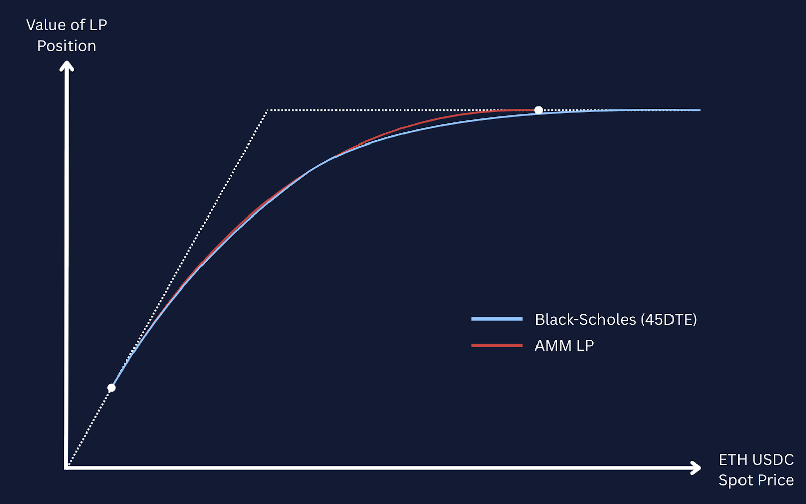
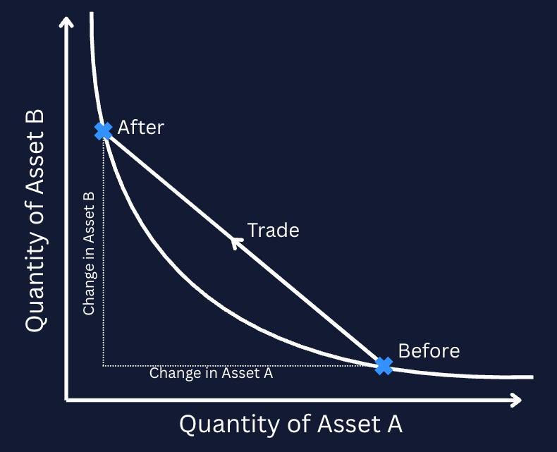
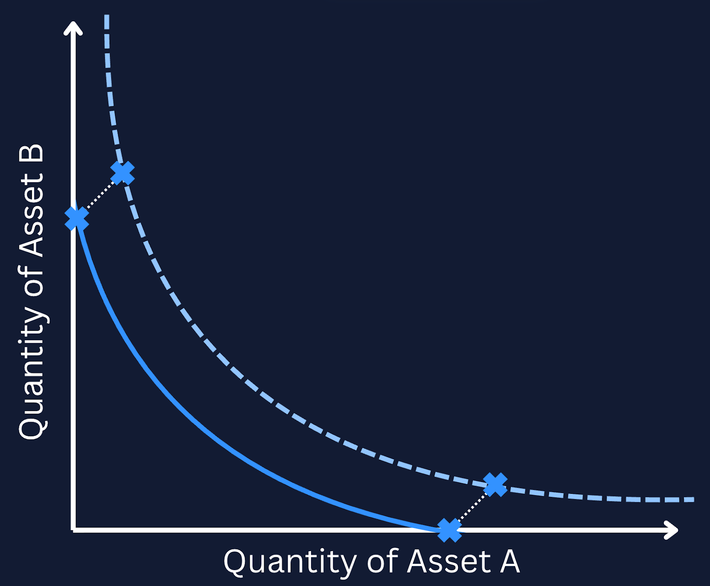
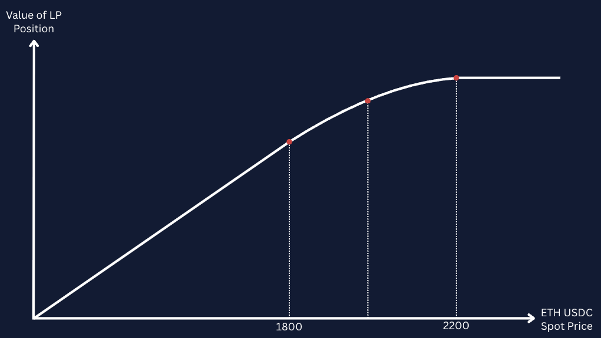
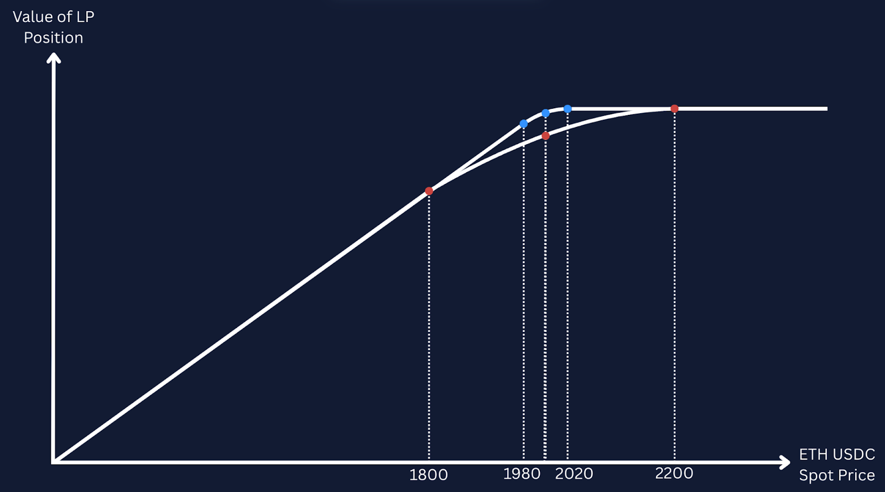
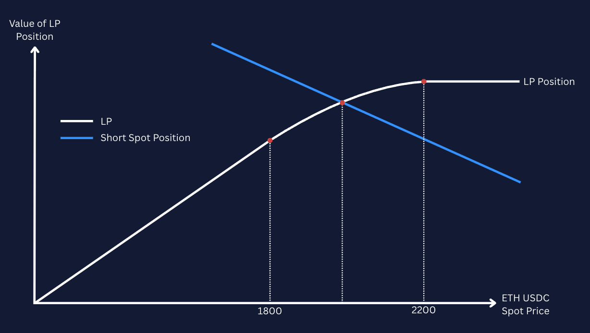
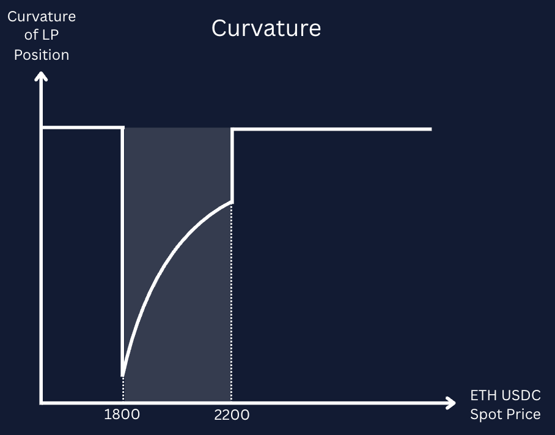
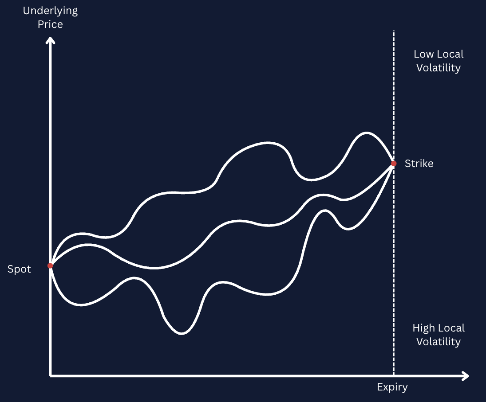
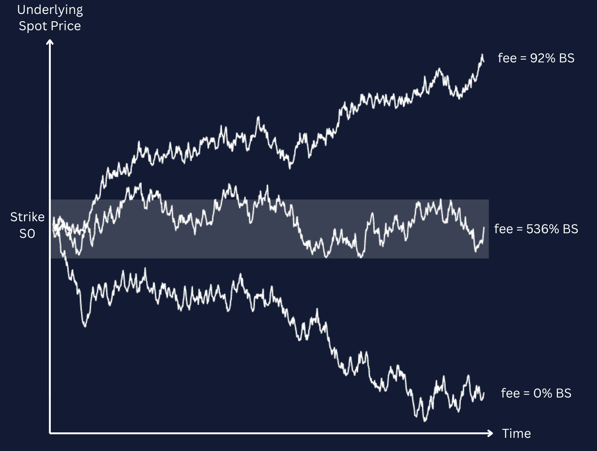
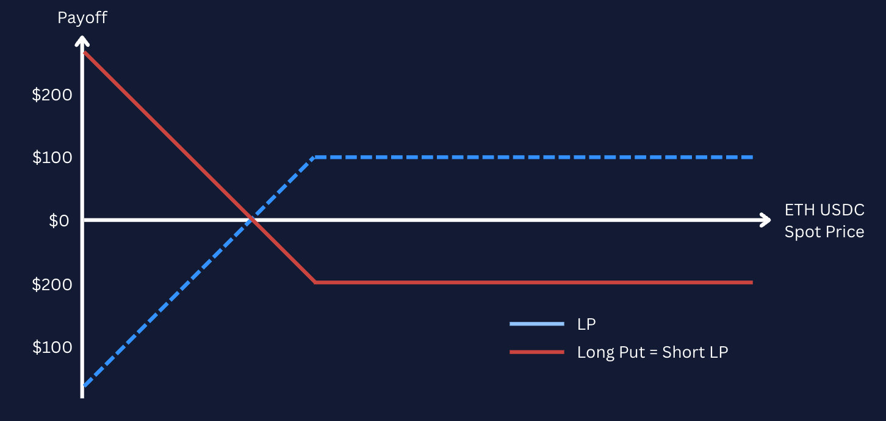

>_This article was originally published by Block Scholes on August 20, 2025. We are republishing it here with permission for broader accessibility. You can view the original report [here](https://www.blockscholes.com/research/block-scholes-x-panoptic-perpetual-option)._

## Perpetual Options

What if options never expired? Perpetual options are a new financial primitive that behave like traditional options that are continuously rolled forward. Instead of expiring, they maintain a fixed time-to-expiry horizon, say 30 days, by automatically rolling each day. The key benefit of this structure is efficiency: unlike manual rolling, perpetual options avoid repeated transaction fees and bid-ask spreads, making them significantly cheaper to maintain over time. They exhibit similar exposures to those of a traditional option, while smoothing volatile, market-dependent upfront costs into a continuous funding rate.

One of the core advantages of perpetual options is the substantial reduction in gamma risk since expiration never occurs. Because the time to maturity remains constant, the sharp increase in gamma seen in traditional options near expiry, particularly the pin risk, is largely avoided.

However, gamma exposure is not eliminated entirely; directional convexity still exists and must be managed, especially in volatile markets. The cost to dynamically delta hedge perpetual options with short gamma must be weighed against the floating premium paid for a perpetual option, which is itself dependent on the realized volatility of the underlying asset. The difference between these two volatility-dependent cash flows may offer opportunities for capture.

The idea of perpetual option writing naturally emerges in DeFi through liquidity provisioning (LP) in Automated Market Makers (AMMs) like Uniswap. LP positions, when modeled correctly, closely resemble short perpetual options: LPs are short gamma, long theta, and earn fees over time. These positions are effectively rolled forward every 12 seconds, each Ethereum block, and the fees earned are constantly priced by the market.

Despite their structural similarity to options, most LPs don't realize they are engaged in passive options selling. They often lack the tools or awareness to evaluate whether the fees they collect adequately compensate for the risks they're taking. As a result, the implied funding rate in AMMs is often too low due to an oversupply of short perpetual options. Protocols like Panoptic allow users to take the other side of this trade, to "buy" perpetual options, capturing mispriced convexity and helping correct these persistent market inefficiencies.  
  
This report is the first in a series of articles that explore how AMMs inadvertently created the perfect infrastructure for perpetual options. It begins by examining how LP positions function as short perpetual options before introducing Panoptions, Panoptic's implementation that makes these positions explicitly tradeable. We will then describe how Panoptions behave differently from vanilla options, particularly in their Greeks and pricing dynamics, and why these differences create unique opportunities. Finally, we demonstrate how Panoptions complete the AMM ecosystem. By enabling both sides of the volatility trade, they provide a mechanism to correct the systematic underpricing that has persisted since Uniswap AMMs [first launched](https://docs.uniswap.org/contracts/v1/overview) in 2018.

## What are Perpetual Options?

Perpetual options are akin to perpetual futures (an instrument made popular on crypto exchanges): the instruments offer synthetic, leveraged exposure to an underlying asset, the extra cost of exposure via a derivative is paid on a continuous basis over the lifetime of the position, and the burden of continually rolling contracts is alleviated. While the fee structure for perpetual futures is largely predicated on either positive or negative underlying sentiment, the premia of perpetual options are path-dependent, closely tied to the realized volatility of the underlying asset.

Despite their exotic nature, perpetual options positions have a much more straight-forward exposure to Gamma: constant over time. As a result, the impact of the option’s exposure to realized volatility is far clearer, meaning that scalping or reverse scalping gamma based on underlying price action does not depend on an exposure that increases as the contract approaches an expiry. Perpetual options have previously been compared to baskets of vanilla options with varying expiries – when considered as a basket of continuously rolled, 0 days-to-expiration (0DTE) options, the constant gamma exposure attribute of perpetual options becomes easier to see.

*Panoptions* are Panoptic’s implementation of perpetual options. A Panoption provides long or short exposure to a constant payoff curve with convex exposure to the exchange rate between an arbitrary pair of assets. Instead of paying a premium upfront (as with vanilla options), Panoptions are paid for continuously as a function of the amount of time that an underlying asset spends within a specified price range. As the exposure profile of the position is constant, the usual concepts familiar to vanilla options traders are reframed: gamma is constant as a function of time (if not of the underlying spot price), the position's value does not change over time due to theta decay, and implied volatility must be treated with some care.

### What is a Panoption really?

Panoptic’s implementation of perpetual options takes advantage of an inherent optionality found in the liquidity provider (LP) positions of onchain exchanges like Uniswap. While Uniswap allows liquidity providers (LPs) to earn yield on a portfolio of assets by facilitating onchain trades between them, the automated quoting of exchange rates results in the LPs being exposed to an embedded short-optionality position. Here, we describe how onchain Automated Market Makers (AMMs) like Uniswap are leveraged by Panoptic to create perpetual option positions.

#### Decentralized exchanges – How spot prices are quoted automatically

Decentralized exchanges (DEXs) for spot trading are a key innovation in Decentralized Finance (DeFi), representing a significant proportion of transaction activity on leading blockchains like Ethereum and Solana. DEXs are able to automatically quote prices to swap between a pair of assets without human input (and hence without a central limit order book) using an Automated Market Maker (AMM).

The most popular AMMs (as measured by total trade volume) function as a pool of two (or more) assets to be traded against one another, where the exchange rate that is quoted by the pool is derived from the ratio of the two tokens held by the pool. Any trader that wants to buy token A and remove it from the pool must deposit an amount of token B that preserves the product of the reserves of the two assets. The amount of token B that must be supplied for each unit of token A removed is the resulting price quoted by the pool for the trade.

Small trades that remove a small amount of the reserves are quoted at a price that is close to the (instantaneous) gradient of the constant curve (in blue above). Larger trades that remove a large amount of token A from the pool require a larger number of B tokens per A token, resulting in a worse execution price for the buyer of token A.

#### Providing liquidity – Being the AMM

As well as trading against the prices quoted by an AMM, users can deposit both tokens to the pool in order to act as the market maker that takes the other side of trades with the pool. To do so, they must supply both assets to the pool in the same proportion as the assets already held by the pool and, in return, receive a Liquidity Provider (LP) token. The LP token entitles the holder to redeem the two assets at any time – but not necessarily in the same ratio in which they initially deposited them.

Therefore the LP token represents a right to redeem a portfolio consisting of two assets, whose ratio is dependent on the prevailing exchange rate between the two tokens quoted by the AMM. As a result, the LP position’s total value has an embedded convexity profile.
  
‘Convexity', in this context, refers to how the value of the LP token changes in relation to price movements of the underlying assets. In simpler terms, the rate at which the LP token's value changes isn't constant; it can accelerate or decelerate as prices shift – leaving a trader more exposed to selloffs *during a selloff*, and less exposed to rallies *during rallies*. Positive convexity behaves inversely, and is generally an attractive property for a portfolio to have.

The AMM model discussed thus far consists of liquidity providers that facilitate trades across an infinite range of prices. This means that, at any particular range (even those where trades are less likely to occur), there is liquidity. Not only does this mean liquidity providers may execute trades at prices they are not willing to trade at, it is also capital inefficient – as liquidity is wasted at ranges where price takers themselves are unlikely to transact in.

Take the example of any dollar-pegged stablecoin – assuming the token maintains its peg to $1 at all times, having capital deployed at $10 is inefficient given that it is an unlikely quoted price. To solve this, newer iterations of AMMs (such as Uniswap v3 and later versions) allow liquidity providers to specify a finite range of prices at which they would like to deploy their liquidity.

Relating the range of prices to the gradient of the curve above, we see that providing liquidity between a finite range of prices is equivalent to translating the price curve to the axes so that the liquidity provided is active between two points on the curve only. At either extreme, where the spot price quoted by the pool is above or below the range of prices that a liquidity provider has agreed to trade in, the portfolio redeemable by the LP token consists entirely of token A or token B. In these price ranges, none of the liquidity deposited by the liquidity provider is used to facilitate the pool's trades and the portfolio’s composition is static as a function of the spot price.

When the price quoted by the pool is within the range agreed by the liquidity provider, the liquidity deposited by the provider is “used up” by the pool, and the assets deposited by the LP token holder are bought or sold incrementally as the exchange rate between the assets changes. The change in composition of the portfolio as a function of the exchange rates between the two constituent assets between them is the key source of convexity in an LP token position.

#### Embedded convexity – Option-like payoff

Deploying liquidity in this manner is essentially creating a range order – the liquidity provided by the LP will be fully converted from one token in the pool to the other as price moves through their chosen tick range.

Let’s see the effect of that observation by evaluating the value of an LP token as a function of the change in spot price. In the chart below, we assume a liquidity provider has taken a position in an ETH-USDC AMM pool and is willing to facilitate trades between 1800 and 2200, at a prevailing spot price of 1600 USDC per ETH.

At entry, the spot price is below the lower bound of the price range, and the LP token is redeemable for a portfolio consisting of ETH only. As the ETH-USDC spot price moves closer towards (but does not touch) the lower bound of the liquidity provider’s chosen range, the value of the ETH-only portfolio changes linearly with the change in the exchange rate between the two tokens.

When the spot price rises above 1800, however, and therefore enters the liquidity provider’s chosen range, some of the LP’s ETH is converted into USDC (by traders utilising the liquidity deposited by the LP to execute trades against the LP). The value of the portfolio at this point has curvature, because the composition of the portfolio shifts into USDC at exactly the same time that ETH appreciates in value against USDC.

Then, as the spot price crosses above the upper bound of the range at 2200, the portfolio is converted entirely into USDC. The value of the LP token is constant for spot prices above the upper price range boundary of 2200. Here, the LP token is redeemable for USDC only, and so its value does not change as a function of the ETH-USDC spot price.

An interesting consequence of the design of the AMM LP position is that the value of the LP token as a function of ETH spot price varies in a similar manner to a short put options contract. When the range of prices chosen by the liquidity provider is very tight, the curvature of the value of the portfolio is much higher nearer to the range and zero outside of it, and the value of the portfolio as a function of spot price resembles the familiar “hockey-stick” payoff curve of a short put contract very close to expiry. When the range is wider, the curvature is less strong but applies over a much wider range, and the curve looks a lot closer to a put option further away from its expiry date.

An equivalent short call option position can be constructed if the user borrows ETH to create that position, by taking advantage of the put-call parity identity (where a short put and short stock position holds an equivalent pay off to a short call).

This observation is not merely a coincidence – providing liquidity to an AMM and allowing traders to trade against you is conceptually similar to selling an option. In the example explored above, the liquidity provider gives away the right for someone to buy ETH from them at a given price, just like selling a vanilla put option with a pre-determined strike.

## Matching Streaming Premium to a More Familiar Setting

#### Streamed Premiums are how Panoption traders pay for convexity

The existence of a streamed premium (rather than a payment upfront) may sound counter-intuitive, but it matches a core tenet known to derivatives traders: positions with long convexity don’t come for free.

We’ve seen how LP positions have an inherently short gamma profile. We’ve also seen how Panoptic provides the infrastructure to trade and lend these positions freely, allowing traders to invert the gamma exposure in order to be long convexity (much like a vanilla call or put option). Finally, we saw that the streaming premia (“streamia”) paid by long holders of a Panoption is paid dynamically over the holding of the option depending on the time that price spends within the position’s range.

Therefore, while a Panoption’s accumulated fees are a function of the (somewhat arbitrary) parameters set by the underlying Uniswap pool as well as the liquidity that has been deposited at each price tick, it is most importantly a function of the delivered volatility.

More specifically it is a function of the volatility that gets delivered within the range held by the option – the more time that price spends within the range, the more fees that are paid by traders of the underlying AMM pool, and the higher the fee collected by the LP position.

#### Delta hedging a Panoption should cost the same as the accumulated streamia

Recall the value of a short panoption position – the value of an LP position as a function of the underlying spot price. To hedge this position, a trader can take an offsetting position in the underlying asset in order to hedge their exposure. A long delta position (as shown in the ETH short put example below) would require the trader to short an amount of ETH in order to hedge against changes in the exchange rate between ETH and USD.

This is similar to reverse gamma scalping. However, appearances and analogies to a short put are once again deceiving – the delta profile is not equivalent to a vanilla short put position. The LP has a constant delta outside of the specified range: it is constantly one below the range, and constantly zero above it. Within the range, the delta varies continuously, but gamma does not vary smoothly. Instead the gamma profile is closer to an indicator function.

As with a vanilla option, dynamically rebalancing the delta of a short gamma position incurs a systematic cost to the trader. Intuitively, this is because the act of rebalancing the delta necessitates the trader to buy when prices are high (having accumulated a larger short delta position) and sell when prices are low (having accumulated a larger long delta position). The potential profitability of such a strategy rests on the collection of fees paid for theta being able to outweigh realized underlying price movements during a certain span. Changes in the exchange rate between the two underlying tokens change the exposure of the position to delta, and so any hedge must be rebalanced.

However, taking a short put position in this way on an AMM also allows the trader to collect the streamed premium – the net position of a short position and a dynamic delta hedge results in two cash flows:

-   The trader pays delta hedging P&L
-   The trader receives the streamed premia from trading activity within their range on an AMM
 
Both of which are a function of the volatility that is delivered by the spot price of the underlying in the range within specified by the LP position. The natural question then is “Do they match?”

For no arbitrage assumptions to hold, the systematic cost of delta hedging the LP position should match the fee accumulated by providing liquidity on the AMM as the trader (assuming a perfect hedge and no transaction fees) takes no risk. However, in practice it is not at all clear that the fee structure specified by AMMs should result in an LP position accruing the same value in fees as was spent on the dynamic delta hedge. In addition, the pathwise nature of both cashflows further complicates the calculation of the expected value of either of these rates.

### Comparison to Black Scholes – Panoptions are not vanilla options, but they’re close

We showed above that the value of an LP function varies continuously with the exchange rate between the two tokens, with the curvature of the payoff resembling a short put position with a time to expiry that depends on the width of the range of prices that the liquidity is deployed to.

However, there are several key differences between an LP position and a vanilla option that make the analogy to vanilla options imperfect:
-   **LP positions do not decay** – While the value curve of an LP token looks like a short put option, this is only true instantaneously. As time ticks forward, the value of a vanilla put option will decrease (and its curvature will increase), but the value of the LP token remains constant, assuming spot price does not move.
-   **LP positions can be exercised at any time** – Instead of selling the right to buy a token at a specific time in the future, liquidity provision positions can be exited at any time. This makes them closer to an american option, with a strong path dependency.
-   **LP positions do not receive a premium upfront** – Despite inherently selling optionality by deploying liquidity, liquidity providers do not receive a premium upfront as a vanilla options seller would. Instead, liquidity providers collect a fee for every trade that their provided liquidity range facilitates via the AMM.
   
These differences mean that, while they appear similar, an LP token cannot be perfectly hedged using a static portfolio of vanilla options. Instead, Panoptions are a more unique instrument, with convex exposure to the underlying asset that is instantaneously close to that of an options contract, but whose Greeks do not change dynamically with time.

 
#### Streaming Premium – What is the relationship to Black Scholes?

Just as the value of an LP position is analogous to the payoff of short perpetual puts, the fees collected by LP positions are analogous to the premium of a vanilla option. The premium Panoptic charges from buyers to sellers of Panoptions is called streaming premium or “streamia.”

Streamia collection is contingent on the amount of time that the underlying price remains between the lower and upper price range.

Considering that the payment of a Panoption’s premium is conditional on the spot price remaining within range, it is natural to ask, “How does streamia compare to the Black-Scholes computation of vanilla options premia?” The answer lies in the union between local to implied volatilities and path-dependency.

Local volatility constitutes the instantaneous volatility of an underlying at any given local point, while Black-Scholes implied volatility represents the average of all local volatilities for price paths from the current spot price to the strike price.

Where the Black-Scholes implied volatility and Panoption-specific implied volatility differ can be attributed to the Black-Scholes implied volatility being assigned to a market of multiple vanilla options, which exhibit a skew to the volatility smile that violates the Black-Scholes assumption of a single, constant volatility level. Yet, Panoptions are path-dependent exotic options with cumulative properties. Panoptions can naturally accumulate more premia than vanilla counterparts at various junctures based on a significant amount of time spent in-range, and Panoption can also conversely be much lower than that of vanillas when underlying price largely migrates out-of-range.
  
However, just as local volatilities over a certain range average to Black-Scholes implied volatility, streamia has been statistically shown to eventually converge with Black-Scholes premia in expectation estimates. It is the designed path-dependency of Panoptions at any given discrete point that causes a temporary disparity in implied volatility and resulting premia.

This accrual embedding can also be reflected in an elevated Panoption implied volatility relative to Black-Scholes implied volatility.

In practice, however, panoptions accumulate streamia and local volatilities over a single delivered price path of the underlying, rather than an average of them. The results can amount to Panoption streamia and implied volatility being multiples higher than observed with Black-Scholes. The same empirical testing has borne out that [16%](https://paper.panoptic.xyz/) of all streamia realized over a set of price paths would be twice as large as the Black-Scholes estimates of vanilla options premia.

Vanilla options of certain expiries could be traded to replicate a comparably fixed-width Panoption. For example, continually rolling 0-days-to-expiration (0DTE) vanilla options every 12 seconds (or every block) would maintain a static gamma and structurally equate to a fixed-width Panoption.

For the sake of context, the natural corollary of being short gamma with a short options position is to also be long theta. Another distinction between Panoptions and vanilla options though is that theta is accrued for short Panoption positions as opposed to short vanilla option positions. The variation of expected streamia for a short Panoption position is accordingly far more dispersed when a Panoption is held for a shorter period of time. It is the imbued “cumulative” property of Panoptions spanning across the components of premia, theta, implied volatility, etc., that truly distinguish this instrument from other forms of exotic options. Local volatilities, streamia, and theta all accumulate based on the amount of time that the underlying for a Panoption remains within a specified price range.

  
  
  
  
  
  
  
  
  
  
  
  
  
  
  

## Panoptic provides infrastructure that enables trading of perpetual options positions
Despite carrying an embedded optionality component, LP positions can only be taken with short optionality exposure. Being unable to buy optionality means that existing AMMs function as incomplete options markets. The Panoptic protocol expands the functionality of AMMs to enable the trading of LP positions in both directions: long and short.

Natively, LP positions only allow short optionality positions as the liquidity provider gives up the right to choose when to execute a trade to traders. By providing a market place to borrow (for a fee) and sell LP positions, Panoptic allows LP shares to be shorted to invert the exposure and attain long optionality. In addition, perpetual call options can be traded by borrowing the underlying asset to create the LP position by taking advantage of put-call parity.

Panoptic’s trading and market infrastructure then greatly widens the universe of derivatives strategies that are able to be deployed onchain, as LP shares can then be speculated upon and hedged. Panoptic also permits more direct speculation on the underlying through the coupling of long perpetual at-the-money call positions with short perpetual ATM put positions, generating a synthetic perpetual futures position. Those synthetic futures can then be traded against off- or on-chain perpetual swaps, or even against expirable futures to produce arbitrage opportunities.

As AMM LP positions empirically equate to short perpetual put options, these positions are inherently short convexity. Therefore, allowing traders to take *long* optionality positions as well as short means that LP positions can be used to trade volatility more efficiently, monetising on the difference between realized and *implied* volatility in vanilla options markets by taking offsetting positions in each market.
  
The protocol also completes an otherwise unbalanced market, which already expresses itself in inefficient market dynamics. If the underlying spot price of a hedged LP position drifts below the lower bound of its range, the LP is forced to rebalance their position by redeploying liquidity at another price range and selling more of the underlying asset. This leads to a feedback loop known as the “Uniswap Price Doom Loop”, where LPs naturally depress underlying token prices by their rebalancing asymmetries. Allowing positions to be taken long as well as short provides a balancing force as LPs can perform this action in reverse, instead of all in the same direction.

Therefore, the unique value proposition of Panoptions trading is the expansion of AMM market microstructure, combined with the enabling of an onchain, perpetual option market. The platform aims to serve as a gateway to a more complete access to an underlying options market that already exists onchain. The added availability of exotic options also offers exciting opportunities to replicate and hedge exposure using standardized, exchange-traded products.

We detailed in this report how Panoptions compare to vanilla options intuitively, but what about empirically? For the next installment in this series on the Panoptic protocol, we will quantitatively hash out how Panoptions can be statistically simulated and hedged in practice.

_Join the growing community of Panoptimists and be the first to hear our latest updates by following us on our [social media platforms](https://linktr.ee/panopticxyz). To learn more about Panoptic and all things DeFi options, check out our [docs](/docs/intro) and head to [our website](https://panoptic.xyz/)._