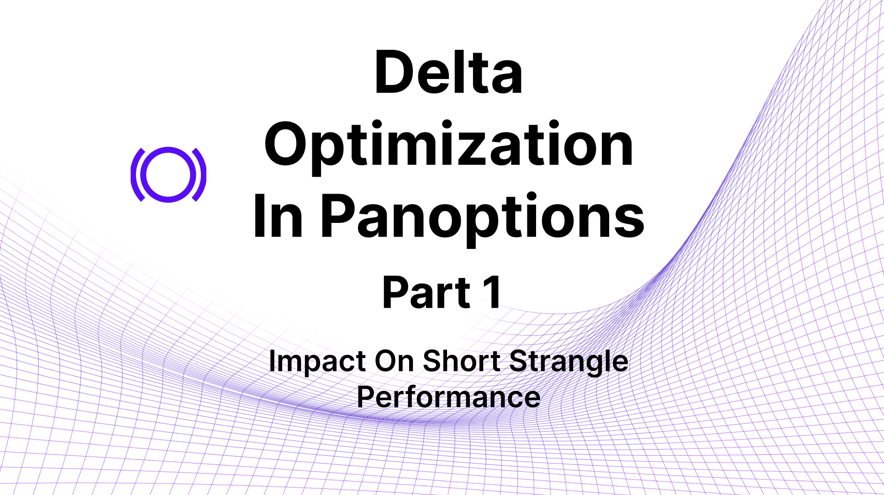
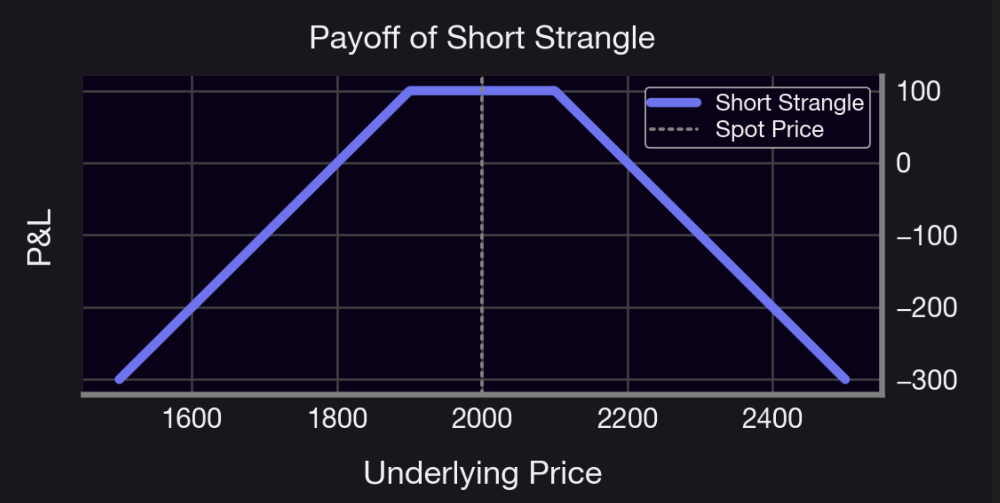
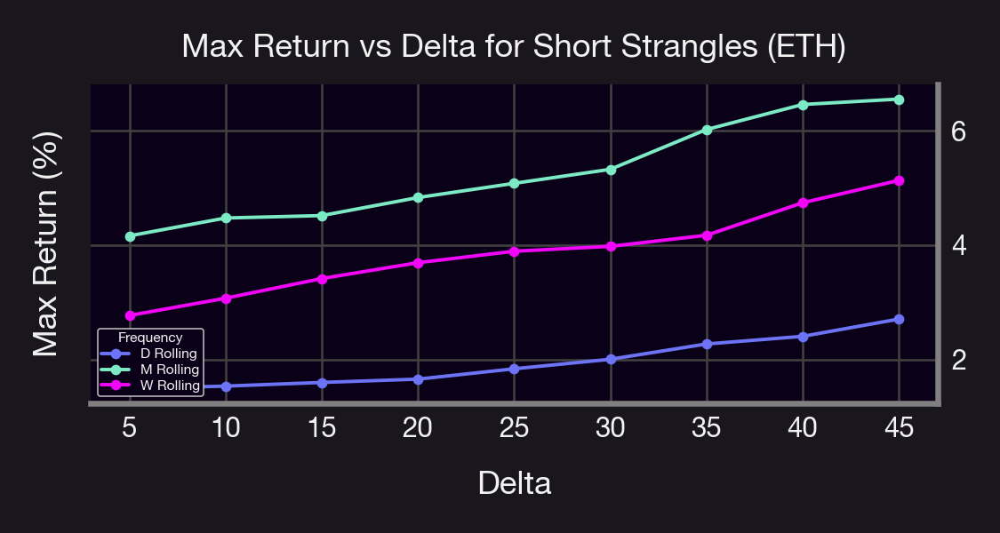
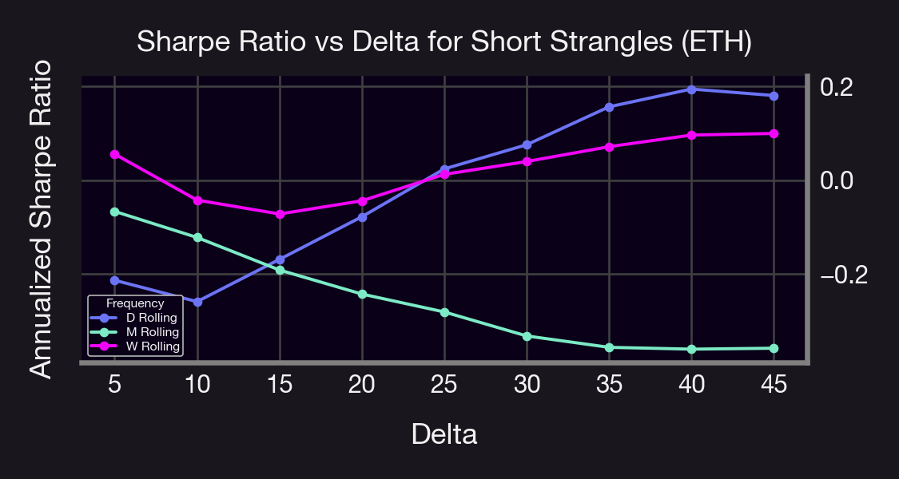
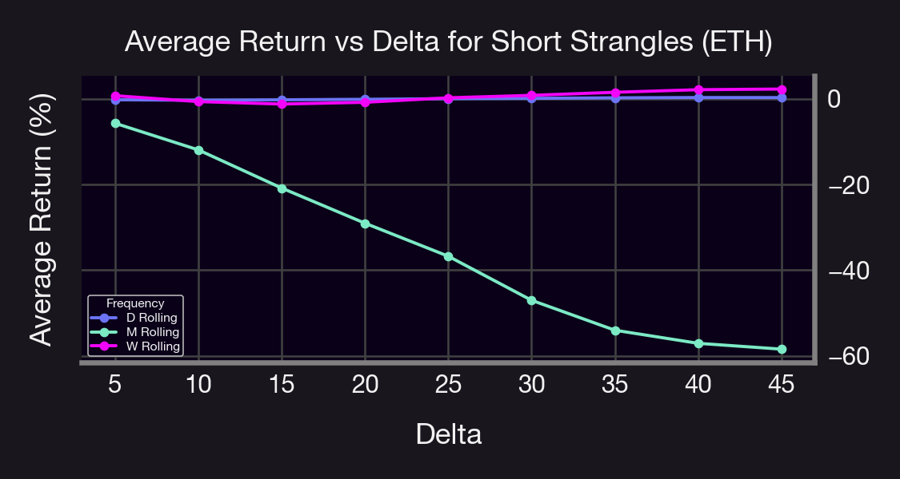
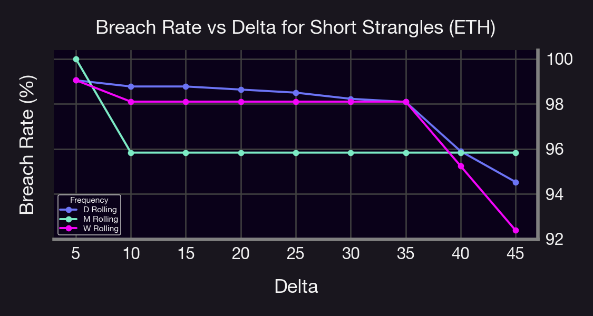
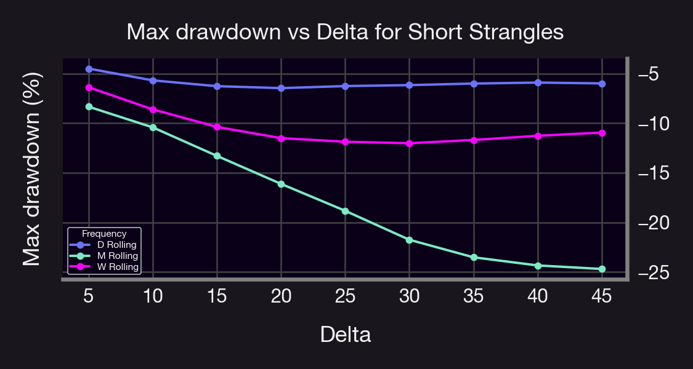
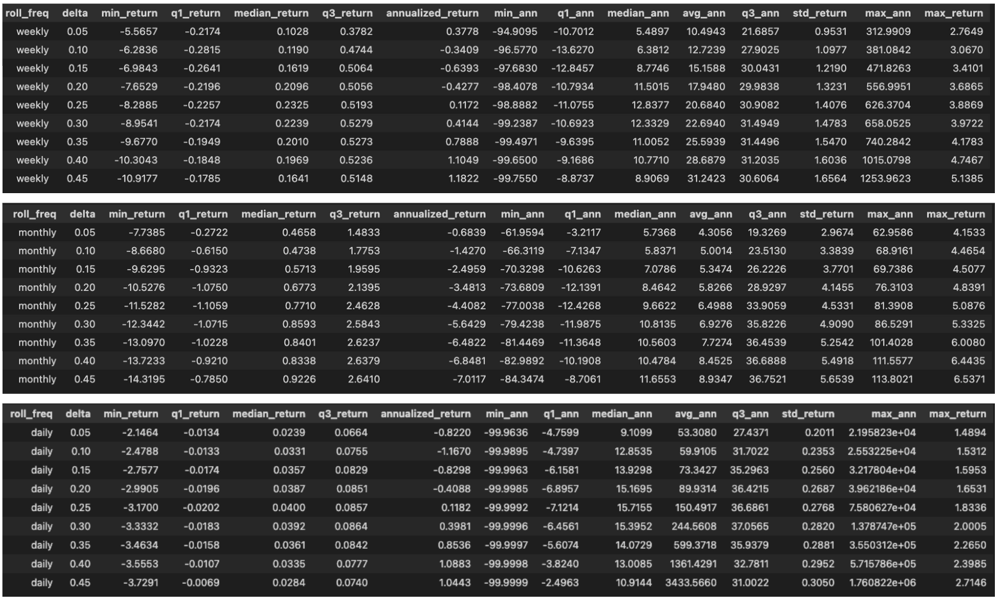

## Introduction

Uniswap v3 liquidity positions are known to replicate the payoff of perpetual short options, giving liquidity providers exposure similar to that of option sellers. Within Panoptic, this option-like behavior can be tuned further by adjusting the tick range, which controls both delta and the effective time to expiry (Tr). This built-in flexibility removes the need for traditional expiration dates or external derivatives infrastructure.  

In classical options theory, delta represents the sensitivity of an option's value to changes in the price of the underlying asset. In Panoptic, delta is encoded through the position's price range, and its behavior varies depending on whether the price is within, outside, or at the edge of that range. This makes delta a key parameter for strike selection and ultimately determines whether a strategy favors more fee generation or more directional risk.  

In this research byte, we explore how delta placement affects performance in short option strategies, particularly short strangles, which are a delta-neutral volatility-selling strategy. Since strangles aim to profit from price stability and implied volatility decay, understanding how delta influences strike placement is crucial for optimizing both premium capture and breach risk.  

We backtest different out-of-the-money (OTM) deltas, comparing statistical performance across Sharpe ratios, win rates, breach frequency, and drawdown behavior. Our goal is to develop a framework for systematic delta selection that balances fee generation with controlled risk, particularly under varying market conditions.  

Uniswap v3 LP positions replicate perpetual short options; you can control effective time-to-expiry ($T_r$) and delta by selecting price ticks $(t_l, t_h)$. No need for external derivatives infrastructure.

## Strategy: Short Strangles

### Conceptual Framework

A foundational observation in Panoptic is that a Uniswap v3 liquidity position can be decomposed into a portfolio equivalent to a short put and a short call, in other words, a short strangle.  

A short strangle in Panoptic is implemented by simultaneously placing a narrow liquidity band below spot (short put) and another above spot (short call). The position collects streaming premiums whenever the spot revisits either band, monetizing the volatility risk premium. Unlike in TradFi, the payoff has no fixed expiry, but the economic intuition is similar: premium accrual is the maximum gain, realized incrementally over time, while losses occur when price trends beyond a leg and the LP’s token balances are forced into an unfavorable composition. In theory, maximum profit is limited to the cumulative fees collected, whereas maximum loss is unbounded since adverse spot moves can continue indefinitely past either strike. This asymmetry defines the short strangle’s risk–return profile in Panoptic: steady premium collection punctuated by potentially large tail losses.  

From an options-theoretic perspective, the sensitivity of each leg to the underlying is captured by its *delta*. In the Panoptic setting, the delta of a position corresponds to the change in token balances of the LP position with respect to changes in the underlying price. Thus, the strike selection in Panoptic is essentially a choice of delta placement and vice-versa.  

**Figure:** Payoff of the short strangle strategy

### Mechanics of the Strategy

A short strangle earns premium by monetizing the volatility risk premium and mean-reverting tendencies of the underlying asset. In Panoptic, premium accrues in the form of *streaming theta*, as fees accumulate whenever the spot price traverses the liquidity bands. Losses materialize when price drifts directionally and remains inside one of the legs, resulting in adverse token rebalancing and eventual position closure.  

Delta drift plays a central role in shaping the LP’s exposure. Narrow tick ranges generate high gamma, leading to rapid changes in token composition, elevated fee accrual, and greater tail risk. Conversely, wider ranges correspond to lower gamma, slower delta evolution, and smoother but less lucrative PnL profiles. This inherent trade-off between stability and yield underscores the importance of delta optimization when designing short-strangle strategies.

### Motivation for Delta Optimization

In Panoptic, delta ultimately determines strike selection by mapping target sensitivities to specific price ranges.  
Optimizing delta placement is therefore critical for liquidity providers, as it shapes both token exposure and the location of premium collection. Static strangles at fixed deltas provide a clean experimental framework, but they also highlight the fragility of non-adaptive positioning in volatile markets, where strikes remain fixed despite shifting spot and volatility regimes. Systematically studying performance across deltas allows us to identify configurations where premium collection reliably outweighs breach-driven losses, thereby clarifying which strike placements yield the most favorable risk–return profiles.  

### Backtest Design
*Code notebook can be found in our public research repository. Click [here](https://github.com/panoptic-labs/research/tree/main/_research-bites/20250912/Real_Panoptions_Backtester_delta.ipynb) to check it out.*

To empirically investigate performance, we conduct a systematic backtest of short strangles across multiple delta thresholds. The experimental setup is as follows:  

- **Underlying asset:** ETH/USDC 30 bps pool.  
- The backtest spans two years of ETH/USDC data from July 2023 to June 2025, yielding approximately 730 daily observations for the daily roll, 104 for the weekly roll, and 24 for the monthly roll.  
- **Roll frequencies:** daily, weekly, and monthly.  
- **Metrics:** average return per trade, max return per trade, max drawdown per trade, win rate, and breach rate.  
  - **Win rate:** proportion of trades with strictly positive realized PnL.  
  - **Breach rate:** proportion of trades in which spot touched at least one leg during the holding window.  
- **Risk-adjusted performance:** Sharpe ratio computed at each return cadence (daily, weekly, monthly), with annualization using the appropriate scaling factor (e.g., 365 for daily in crypto markets). Sharpe ratios are computed ex post using the full two-year sample distribution of returns, ensuring stable estimates of mean and volatility.  
- Each delta configuration is therefore evaluated over the full set of realized trades at the specified rolling cadence.  
- For each configuration, we compute both the mean and standard deviation of realized returns, which serve as the basis for Sharpe ratio calculations.  

#### Sharpe ratio (definition and annualization)

For a given rolling cadence (daily/weekly/monthly), let $\{r_i\}_{i=1}^n$ denote the series of realized per-trade (or per-period) returns for a configuration (delta, width, cadence). The sample mean and standard deviation are  

$$
\bar r \;=\; \frac{1}{n}\sum_{i=1}^n r_i,
\qquad
s \;=\; \sqrt{\frac{1}{n-1}\sum_{i=1}^n (r_i-\bar r)^2}\,.
$$

With risk-free rate set to zero (crypto convention), the per-cadence Sharpe is  

$$
SR_{\text{cad}} \;=\; \frac{\bar r}{s}\,.
$$

Annualization uses $\sqrt{N}$ with $N$ equal to the number of periods per year for the cadence:  

$$
SR_{\text{ann}} \;=\; \sqrt{N}\, SR_{\text{cad}}, 
\qquad 
N \in \{365 \;\text{(daily)},\; 52 \;\text{(weekly)},\; 12 \;\text{(monthly)}\}.
$$

All Sharpe ratios are computed ex post over the full two-year sample for each configuration; we use the unbiased standard deviation ($n-1$ denominator).  

This framework enables us to isolate the relationship between delta placement, rolling frequency, and strategy performance. In doing so, we evaluate whether the incremental premium collected at higher deltas is sufficient to compensate for the greater likelihood and severity of breaches, and whether frequent rebalancing mitigates these risks relative to longer holding horizons.  

#### Annualization technique

To compare daily, weekly, and monthly results on a common horizon, we convert each single–period simple return $r_i$ (in decimal form) to its *geometrically annualized* equivalent:  

$$
r_i^{\mathrm{ann}} \;=\; (1+r_i)^{N} - 1
$$

where $N$ is the number of periods per year ($N=365$ for daily, $N=52$ for weekly, $N=12$ for monthly).  

### Important Note on the Spread Multiplier and Premium Adjustment

One key factor not incorporated in this backtest is the **spread multiplier**, which adjusts option premia above their theoretical baseline.  

- **Theoretical baseline (multiplier = 1x):** Option premia reflect their model-implied value, with no adjustment.  
- **Observed reality (multiplier > 1x):** Empirical data shows an average spread multiplier of approximately **1.2x** in Panoptic markets. This deviation arises from trading conditions, particularly increased buyer demand.  
- **Implication:** With a spread multiplier of 1.2x, option buyers pay ~20% more than the theoretical price, while option sellers earn ~20% more than the base premium.  

Therefore, the results presented in this analysis are **conservative**, since the additional 20% premium uplift has **not been included** in the backtest. In practice, actual strategy performance would be stronger for sellers, with **higher** realized returns and Sharpe ratios than those reported here.  

### Backtest Results

#### 1. Max Return vs Delta

**Figure:** Max Return vs Delta. Non-annualized maximum realized return across deltas and rolling frequencies. Monthly rolls achieve the largest extremes, though these outcomes are not sustained in expectation.

The maximum realized returns increase monotonically with delta across all rolling frequencies, though the magnitude of improvement is strongly frequency-dependent. Monthly rolls deliver the highest extremes, reaching above 6% at 40–45 delta, while daily rolls exhibit more muted outcomes, rarely exceeding 3%. This indicates that longer holding periods allow the strategy to capture larger episodic gains, consistent with higher exposure to convexity in rare market moves. However, these tail outcomes should be interpreted alongside elevated drawdowns and risk measures, as they represent isolated peaks rather than sustainable performance.  

#### 2. Sharpe Ratio vs Delta

**Figure:** Sharpe Ratio vs Delta. Annualized Sharpe ratio across deltas for daily, weekly, and monthly rolls. Only daily rolling delivers consistently positive risk-adjusted performance.

The annualized Sharpe ratio reveals a divergence between raw returns and risk-adjusted efficiency. Daily rolling short strangles exhibit a positive slope, with Sharpe peaking near 0.2 at 40 delta, suggesting that frequent rebalancing tempers volatility sufficiently to yield a modest improvement in risk-adjusted terms. Conversely, monthly rolls show steadily declining Sharpe ratios, becoming negative for deltas above 20, despite higher maximum returns. Weekly rolls fall in between, delivering slightly positive Sharpe across most deltas but never exceeding 0.1. This pattern highlights the non-trivial interaction between rebalance frequency and risk distribution, where higher return potential does not translate into superior risk-adjusted outcomes.

#### 3. Average Return vs Delta

**Figure:** Non-annualized average Return vs Delta. Mean realized return as a function of delta. Monthly rolls deteriorate sharply at higher deltas, while daily and weekly remain close to break-even.

The mean return profile underscores the fragility of the strategy. For monthly rolls, average returns decline sharply with delta, plunging from near zero at 5 delta to approximately –60% at 45 delta. Daily and weekly rolls, by contrast, remain close to break-even across all deltas, oscillating within a narrow band around zero. This suggests that while extended holding periods can produce large isolated gains, they are overwhelmed by persistent losses in expectation. In contrast, shorter rolling frequencies offer more stability, though at the cost of suppressing any material upside. This asymmetry reflects the inherent negative carry of short strangles when not frequently rebalanced.  

#### 4. Breach Rate vs Delta

**Figure:** Breach Rate vs Delta. Frequency with which spot breached at least one leg of the strangle. Breach rates exceed 90% across all deltas, underscoring the structural fragility of static strangles.

Breach rates remain exceptionally high across the parameter space, exceeding 90% in all cases, with only modest variation across delta and rolling frequency. Monthly rolls stabilize near 96%, daily rolls decline gradually from 99% to 95% as delta rises, and weekly rolls fall as low as 93% at 45 delta. These consistently elevated breach frequencies indicate that strikes are routinely penetrated, reinforcing the riskiness of the strategy and explaining both the observed drawdowns and negative average returns. The marginal reduction in breach rates at higher deltas merely reflects wider strike placement rather than a structural mitigation of exposure.  

#### 5. Max Drawdown vs Delta

**Figure:** Max Drawdown vs Delta. Largest observed drawdown across deltas and roll frequencies. Drawdowns increase monotonically with delta, with daily rolling containing losses most effectively.

Maximum drawdowns scale with delta, confirming the asymmetric downside of the strategy. For monthly rolls, drawdowns deepen monotonically from –12% at 5 delta to nearly –25% at 45 delta, far outpacing those observed under weekly (–10% to –12%) and daily (–5% to –6%) frequencies. The combination of infrequent adjustments and wide strangle placement results in prolonged vulnerability to adverse moves, which is only partially mitigated by the higher peak returns. By contrast, daily rolling contains drawdowns within a relatively tight band, illustrating the benefit of systematic rebalancing in truncating extreme tail losses. Collectively, these results show that while short strangles can be tuned across delta and frequency, the fundamental trade-off between return potential and downside risk remains inescapable.  

The low maximum returns observed for daily rolling strangles arise from their truncated exposure to market moves. Because positions are reset every day, premium accrual is limited to short windows, and the likelihood of capturing a large price displacement before rebalancing is minimal. This frequent resetting effectively cuts off the extreme right tail of the return distribution: daily rolls collect modest, consistent premia but do not remain open long enough to realize outsized gains. By contrast, weekly and especially monthly rolls leave positions exposed for longer, allowing occasional large volatility events to generate substantial positive outcomes, albeit at the cost of higher drawdowns and more negative average performance.  

All in all, while monthly rolls deliver the highest isolated returns, they also suffer from severe drawdowns and negative average performance. By contrast, daily rolls sacrifice peak outcomes but achieve the lowest drawdowns and the only positive Sharpe ratios, making them the only cadence with sustainable risk-adjusted performance.  

**Summary:**  
The backtest highlights sharp contrasts between rolling frequencies in short strangle strategies on ETH/USDC. Monthly rolls achieve the largest maximum returns (exceeding 6% at 40–45 delta) but at the cost of severe average losses (–60% at high deltas), extremely high breach rates (~96%), and the deepest drawdowns (–25%). Weekly rolls perform as an intermediate case, with moderate returns and drawdowns (–10% to –12%), but never achieve compelling risk-adjusted efficiency. Daily rolls, while delivering smaller maximum returns (≤3%), consistently minimize drawdowns (–5% to –6%) and produce the only positive Sharpe ratios (~0.2 at 40 delta), making them the most sustainable approach.  

#### More Stats

**Figure:** Short Strangles (ETH/USDC): Per-Period Quantiles & Annualized Metrics by Delta × Roll Frequency (Daily/Weekly/Monthly), Jul 2023–Jul 2025.

**Daily (D Rolling).**  
Across deltas $5\%$–$45\%$, daily rebalancing shows the cleanest distribution: tight interquartile ranges, per–period medians $\approx 0.02\%$–$0.03\%$, and low dispersion with $\sigma \approx 0.20\%$–$0.31\%$. The linear annualized mean drifts from slightly negative at low $\delta$ to about $+1\%$ for $\delta \gtrsim 0.35$, indicating modest positive carry with limited tail exposure.  

**Weekly (W Rolling).**  
Weekly rebalancing lifts central tendency but with much higher variance. Medians sit around $0.10\%$–$0.23\%$ per period, while dispersion widens to $\sigma \approx 0.95\%$–$1.66\%$ and the left tail deepens (min returns $-5.6\%$ to $-10.9\%$). The linear annualized mean improves with $\delta$, reaching roughly $+1.1\%$–$1.2\%$ at the high end, but the distribution is clearly more volatile.  

**Monthly (M Rolling).**  
Despite higher per–period medians ($\approx 0.47\%$–$0.92\%$), monthly carries the heaviest tail risk: $\sigma \approx 2.97\%$–$5.65\%$ and minima $-7.7\%$ to $-14.3\%$. These adverse moves dominate typical gains, yielding a linear annualized mean that is negative across all deltas ($\approx -0.7\%$ to $-7.0\%$).  

**Bottom line.**  
Daily offers the best stability with a small positive drift at higher deltas; weekly is a higher–variance alternative with modestly higher expected return; monthly is dominated by tail losses and is not favoured for short–strangle deployment.  

**Best configurations:**  
- **Monthly:** highest max return at 45 delta, but economically unattractive due to negative average performance.  
- **Weekly:** modest performance across deltas, with no clear optimal point.  
- **Daily:** best balance at 40 delta, where Sharpe is maximized and drawdowns remain contained.  
- **Quant’s conclusion:** daily rolling around 40 delta is the most robust short-strangle configuration; monthly may deliver extreme tail wins but is not viable as a systematic strategy.  

## Conclusion

Taken together, the two-year backtest yields two clear findings:

1. **Delta band.** Short strangles are most resilient with target deltas around 40 to 45, which balances premium capture against breach frequency and tail risk.  
2. **Static policy is inadequate.** A static, fixed delta and fixed roll approach is not viable as a standalone strategy. Robust performance requires adaptive risk management that reacts to market conditions rather than anchoring to a fixed strike.  

Across the sample, occasional large gains at higher deltas and longer rolls are outweighed by negative average returns, frequent band exits, and deep drawdowns. Risk-adjusted results remain weak, with daily rolling the only cadence that produces a small positive Sharpe ($\approx 0.2$). In short, the inability to adapt to volatility, skew, and liquidity leaves fixed delta strangles systematically exposed to adverse paths.  

**What to change next.** Move from static placement to an adaptive framework:  

- *Adaptive delta and width.* Recalibrate strikes and tick width with volatility and skew so that containment and premium intensity co-move with regime.  
- *Breach responsive management.* Restrike on breach or near breach, and vary cadence with realized conditions rather than on a calendar.  
- *Gamma control.* Narrow ranges act like short-dated, high gamma exposures that demand frequent intervention; wider ranges lower yield but smooth inventory risk. Choose width dynamically.  
- *Inventory and exposure limits.* Cap notional and set drawdown and assignment guardrails to prevent prolonged adverse drift.  

This shift from static rules to adaptive dynamic control is the direct lever to lift Sharpe and reduce the persistent fragility observed in the two-year study.

## Appendix
### Delta of Panoptic Legs: Setup, Formulas, and Derivation

#### Setup
Take token1 as the numéraire and let $S$ be the spot price of token0 in units of token1.  
A Panoptic leg is a Uniswap v3 band with lower and upper prices  

$$
t_L=\frac{K}{r},\qquad t_H=K\,r,\qquad r>1,
$$

where $K$ is the geometric center (the strike) and $r$ is the range factor.  
Let $L$ be the Uniswap v3 liquidity of the band. Define the edge inventory  

$$
\Delta_E \;\equiv\; L\!\left(\frac{1}{\sqrt{t_L}}-\frac{1}{\sqrt{t_H}}\right)
\;=\; L\,\frac{r-1}{\sqrt{K\,r}}
\quad(>0),
$$

which is the constant token0 units held at and below $t_L$.  
We use $m\in\{-1,+1\}$ to encode long or short:  

$$
m=\begin{cases}
-1 & \text{long leg},\\
+1 & \text{short leg}.
\end{cases}
$$

### Delta formulas used in the backtester

In Panoptic, Uniswap v3 liquidity positions are used to replicate short option payoffs by placing liquidity between a lower and upper price bound, $t_L$ and $t_H$. The sensitivity of the LP’s value to price changes — its *delta* — depends entirely on the position of the current price $P$ relative to these bounds.

**Put leg**  

$$
\Delta_{\text{put}}(S;K,r)=
\begin{cases}
m, & S<\dfrac{K}{r},\\[8pt]
m\,\dfrac{\sqrt{\dfrac{K r}{S}}-1}{\,r-1\,}, & \dfrac{K}{r}\le S\le K r,\\[10pt]
0, & S> K r.
\end{cases}
$$

**Call leg**  

$$
\Delta_{\text{call}}(S;K,r)=
\begin{cases}
0, & S<\dfrac{K}{r},\\[8pt]
m\!\left(\dfrac{\sqrt{\dfrac{K r}{S}}-1}{\,r-1\,}-1\right), & \dfrac{K}{r}\le S\le K r,\\[10pt]
-\,m, & S> K r.
\end{cases}
$$

These are the piecewise curves implemented by your functions and used in the plots, with $m=-1$ for long and $m=+1$ for short.  

### Derivation from Uniswap v3 mechanics

#### 1) Uniswap v3 token inventories
For a band $[t_L,t_H]$ with liquidity $L$, the token balances are  

$$
x(S)=
\begin{cases}
L\!\left(\dfrac{1}{\sqrt{t_L}}-\dfrac{1}{\sqrt{t_H}}\right), & S\le t_L,\\[8pt]
L\!\left(\dfrac{1}{\sqrt{S}}-\dfrac{1}{\sqrt{t_H}}\right), & t_L<S<t_H,\\[8pt]
0, & S\ge t_H,
\end{cases}
\qquad
y(S)=
\begin{cases}
0, & S\le t_L,\\[6pt]
L\!\left(\sqrt{S}-\sqrt{t_L}\right), & t_L<S<t_H,\\[8pt]
L\!\left(\sqrt{t_H}-\sqrt{t_L}\right), & S\ge t_H.
\end{cases}
$$

#### 2) Value in token1 and delta
The band value in token1 is  

$$
V(S)=y(S)+S\,x(S).
$$

Inside the band, using $s=\sqrt{S}$,  

$$
\frac{\partial y}{\partial S}=\frac{L}{2s},\qquad
\frac{\partial x}{\partial S}=-\,\frac{L}{2s^{3}},
$$

so  

$$
\delta(S)\;\equiv\;\frac{\partial V}{\partial S}
=\frac{\partial y}{\partial S}+x(S)+S\frac{\partial x}{\partial S}
=\frac{L}{2s}+x(S)-\frac{L}{2s}
= x(S).
$$

Therefore  

$$
\boxed{\;\delta(S)=x(S)\;}
$$  

for all $S$, with the piecewise form inherited from $x(S)$. In particular:  

$$
\delta(S)=
\begin{cases}
\Delta_E, & S\le t_L,\\[6pt]
L\!\left(\dfrac{1}{\sqrt{S}}-\dfrac{1}{\sqrt{t_H}}\right), & t_L<S<t_H,\\[8pt]
0, & S\ge t_H.
\end{cases}
$$

#### 3) Normalized interior shape and change of variables
Normalizing by the edge inventory $\Delta_E$ removes the dependence of delta on the absolute liquidity $L$, yielding a dimensionless measure that captures only the shape of the exposure. This normalization ensures that delta evolves smoothly between 1 at the lower tick and 0 at the upper tick, making results comparable across different ranges and liquidity sizes.  

Divide by $\Delta_E$ and rewrite with $K=\sqrt{t_L t_H}$ and $r=\sqrt{ \frac{t_H}{t_L}}$:  

$$
\frac{\delta(S)}{\Delta_E}
=\frac{\dfrac{1}{\sqrt{S}}-\dfrac{1}{\sqrt{t_H}}}{\dfrac{1}{\sqrt{t_L}}-\dfrac{1}{\sqrt{t_H}}}
=\frac{\sqrt{\dfrac{K r}{S}}-1}{\,r-1\,},
\qquad t_L<S<t_H.
$$

This shows that the interior delta runs from $1$ at $S=t_L$ to $0$ at $S=t_H$.  

#### 4) From the band to put and call legs
A Panoptic *put leg* is exactly this band, used with a sign $m$ for long or short. Hence the normalized interior formula above, together with saturation to $\{m,0\}$ outside, gives the put leg piecewise rule stated earlier.  

A Panoptic *call leg* is the complementary exposure that is zero below $t_L$ and reaches full magnitude above $t_H$. Algebraically define  

$$
x_{\text{call}}(S)\;\equiv\;x(S)-\Delta_E,
$$  

which satisfies $x_{\text{call}}=0$ for $S\le t_L$, $x_{\text{call}}=-\Delta_E$ for $S\ge t_H$, and inside the band  

$$
\frac{x_{\text{call}}(S)}{\Delta_E}
=\frac{x(S)}{\Delta_E}-1
=\frac{\sqrt{\dfrac{K r}{S}}-1}{\,r-1\,}-1.
$$

With the sign $m$ this yields exactly the call leg rule above, with clipping to $\{0,-m\}$ outside.  

#### 5) Boundary checks and monotonicity
At $S=t_L$:  

$$
\delta(t_L)=\Delta_E, \qquad
\frac{\delta(t_L)}{\Delta_E}=1,
$$  

and at $S=t_H$:  

$$
\delta(t_H)=0, \qquad
\frac{\delta(t_H)}{\Delta_E}=0.
$$  

Inside the band, $\delta(S)$ is strictly decreasing since $\dfrac{d}{dS}(1/\sqrt{S})<0$.  
Thus the put leg transitions from plateau to zero, while the call leg transitions from zero to plateau, matching the economic interpretation of OTM to ITM across the band.  

Furthermore, we can rewrite this in terms of the scaling factor $r = \sqrt{t_H/t_L}$ and the strike price $K = \sqrt{t_H\,t_L}$ to get:  

$$
\delta(P) = \frac{\sqrt{\dfrac{rK}{P}} - 1}{\,r - 1\,}.
$$

As a benchmark, an at-the-money option has $\Delta = 0.5$.  
Evaluating the LP delta at $S=K$ gives  

$$
\Delta(K) \;=\; \frac{\sqrt{r}-1}{\,r-1\,},
$$

which approaches $0.5$ only in the infinitesimal-band limit $r \to 1+\varepsilon$ with $\varepsilon \to 0$:  

$$
\Delta(K) \;=\; \tfrac{1}{2} - \tfrac{\varepsilon}{8} + \tfrac{\varepsilon^{2}}{16} + O(\varepsilon^{3}).
$$

<Space h={32} />

_Join the growing community of Panoptimists and be the first to hear our latest updates by following us on our [social media platforms](https://linktr.ee/panopticxyz). To learn more about Panoptic and all things DeFi options, check out our [docs](/docs/intro) and head to [our website](https://panoptic.xyz/)._

