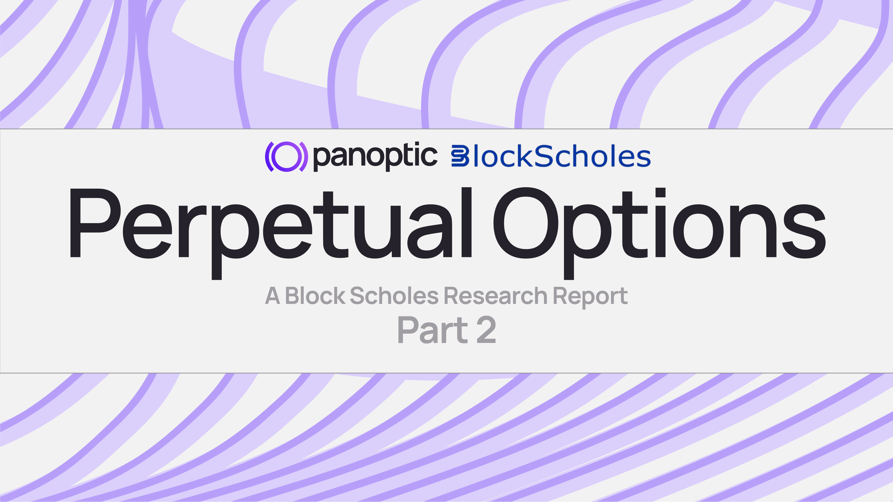

## Panoptic unlocks long gamma positions onchain

Inherent deficiencies with liquidity provisioning (LP) on Automated Market Makers (AMMs), such as impermanent loss, are well-known to DeFi traders, despite not being recognized for the short optionality positions that they are. While many mechanisms have attempted to address such issues, Panoptic adopts a radically different and much more intuitive approach: enabling traders to go long on optionality in an environment where this trade would otherwise be impossible.

In the first [article](https://www.blockscholes.com/research/block-scholes-x-panoptic-perpetual-option) of this report series, we illustrated that Panoptions are structured as exotic options and present opportunities to capitalize on inefficiencies within AMM market microstructure. The contents of this report will be focused on empirically validating those opportunities – how the streaming premia (streamia) paid for Panoptions is often underpriced relative to an illustrative simulation of the profit-&-loss (PnL) of scalping the gamma of a long optionality/convexity position.

Uniswap functions as an incomplete options market by design, allowing a large supply of short optionality via liquidity provisioning without an easy way for traders to take exposure in the opposite direction. The resulting oversupply of short optionality positions leads to underpricing Uniswap LP positions relative to their exposure to realized volatility. In this report, we will pinpoint exactly how and why these incomplete market inefficiencies can be exploited through gamma scalping on Panoptic.

## Uniswap lets traders be short convexity

Uniswap (and other AMM) LP positions allow traders to deposit a pair of assets and earn a rolling fee (called streamia) that is based on the volume and frequency of trades that their capital facilitates. However, hedging the delta of an LP position comes at a cost: by being a buyer in a rally and a seller in a sell-off, an LP is naturally short convexity. If the delta risk is hedged by taking long or short positions in spot and adjusting them dynamically as the spot price changes, that convexity still poses a systematic cost to the hedged LP position, sometimes called “reverse gamma scalping.”

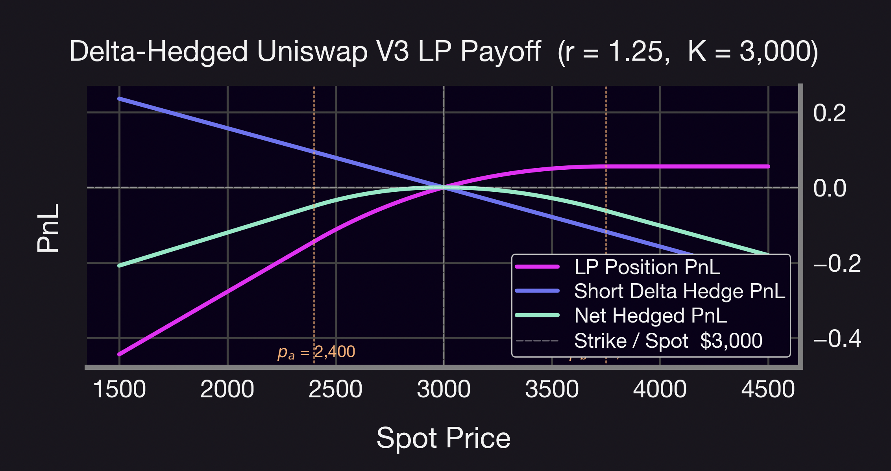

This means that a “delta-hedged” Uniswap LP position gives exposure to two cash flows, both of which are dependent on realized volatility (RV). In one, the LP pays a systematic cost in order to maintain their hedge against exposure to movements in the underlying exchange rate between the tokens in the pool, paying the so-called “reverse gamma scalping” rate. In the other, depositing liquidity in the pool allows the LP to collect the fees paid by traders utilizing the liquidity that they have deposited in the pool.

However, there is no reason to believe that the design of the AMM’s fee structure should match the reverse gamma scalping rate. The amount that an LP stands to collect from an AMM pool over any period is dependent on:

  

-   the volume traded in the pool (Uniswap lists pools for most token pairs in 1bp, 5bps, and 30bps fee tiers)
    
-   the liquidity deposited by other users (who are allocated shares of the total fees collected by the pool proportional to the size and effectiveness of their LP position)
    
-   The nature of flow seen by the pool (retail price-takers tend to adjust the AMM price with more volatility and volume than price arbitrageurs).

The only common driver between the Uniswap trading fees and the cost to maintain a dynamic delta hedge is volume, and even that link is only indirect via its relationship to volatility. In fact, as we will show, there are many cases where the rate paid to an LP is drastically lower than the cost to maintain a delta-hedged position. For example, fees paid to LPs of the ETH-USDC 30bps Uniswap pool were up to 18% less than the cost of gamma-scalping their delta exposure from January 2024 to December 2025.

The design of Uniswap (and other AMM) LP positions means that users can only take one side of this trade – short convexity – by owning an LP position. As a result, LPs are only able to pay the expensive rate (reverse gamma scalping) and receive the (often lower) trading fees.

The lack of venues to trade the long convexity side leads to a systemic inefficiency that prevents LPs from being paid fairly. Two-sided markets enabling participation in long convexity positions are essential to correcting this inefficiency. A sample of this asymmetric dynamic at play is displayed in the below chart of illustrative PnL using theoretical mid prices, where a 46% loss is suffered when deploying a reverse gamma scalping strategy in the ETH-USDC 30bps pool from January 2024 to December 2025.

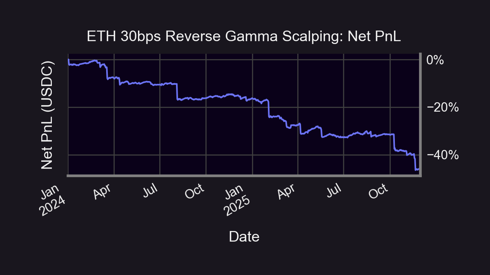

## Do Uniswap LP fees compensate for short-convexity?

To test the difference between the delta-hedging PnL and Uniswap fee, we simulated the performance of hedging a long perpetual call position across multiple Uniswap v3 pools, considering a range of fee tiers and token pairs.

### Notes on the Simulation

As shown in the previous report, long-optionality Panoption positions are created by borrowing and selling short an LP position, “inverting” the exposure to gamma of the LP position. Similarly, long perpetual call Panoption positions can be created by trading a long put and going long spot (an application of put-call parity), meaning that the gamma profile (and so delta-hedging) of a put Panoption is the same as a call Panoption. Thus, results for calls also generalize to puts, with results for short positions obtained by taking the negative of the corresponding long positions.

While Panoptions are perpetual, meaning that they do not expire, the curvature (or gamma) of the value profile can be controlled by changing the price range at which the trader is willing to provide liquidity for the underlying Uniswap LP position. Tighter price ranges correspond to shorter effective “tenors” with higher curvature, while longer tenors can be mimicked by wider price liquidity ranges. In a similar way, the delta of the Panoption at entry can be chosen by centering the price range around different strikes relative to the prevailing spot price. To see a fuller explanation of this effect, please refer to the [previous article](https://www.blockscholes.com/research/block-scholes-x-panoptic-perpetual-option) in this series or Guillaume Lambert’s Medium [articles](https://lambert-guillaume.medium.com/how-to-create-a-perpetual-options-in-uniswap-v3-3c40007ccf1).

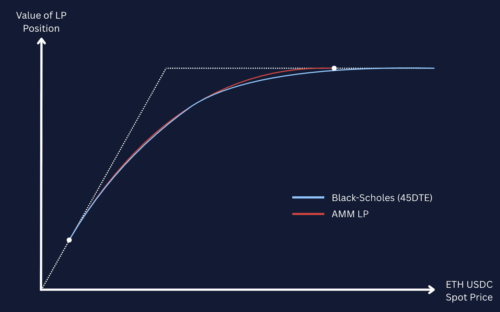

We simulated hedging the delta of the position at entry, and thereafter allowed it to vary within a small range around 0 as spot prices moved over time. When the delta of the Panoption crossed that threshold, the position was re-hedged by buying or selling the appropriate number of units of the underlying asset. We tested a range of delta thresholds and reported the best performing selections below.

The Uniswap V3 positions that underlie Panoption positions require specifying a price liquidity range (which Panoptic uses to create synthetic “strikes” and “tenors” of panoptions, as shown above). As a result, the gamma of the Panoption is zero above and below the price range, which no longer requires the hedge position to be adjusted further since its delta remains unchanged at zero, and consequently the gamma-hedging PnL also remains unchanged. Correspondingly, there is no fee paid to hold the long Panoption as the liquidity deployed on Uniswap is not used to facilitate trading.

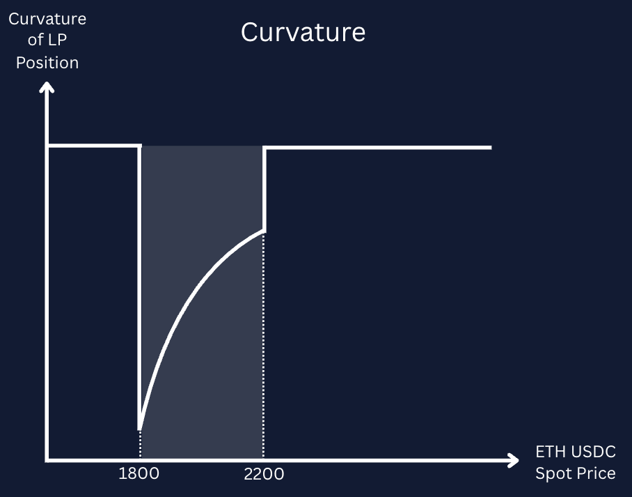

As a result, we simulate “rebalancing” the Panoption by closing out the position once the spot price leaves the target price range, re-entering a new position centred on the new spot price, and hedging the delta of the newly opened position. Assuming that the position is well delta-hedged at the time of rebalancing and ignoring gas costs, this process should incur no change in PnL.

A long call position has positive gamma, which means that by dynamically delta-hedging the Panoption, the trader receives a profit. That cost is weighed against the streamia paid continuously to hold the call Panoption. The chart below shows the theoretical performance of this process for a long 50-delta weekly Panoption in the ETH-USDC 5bps tier pool between 2024 and 2025. The delta was allowed to range between -5 and 5 before it was re-hedged.

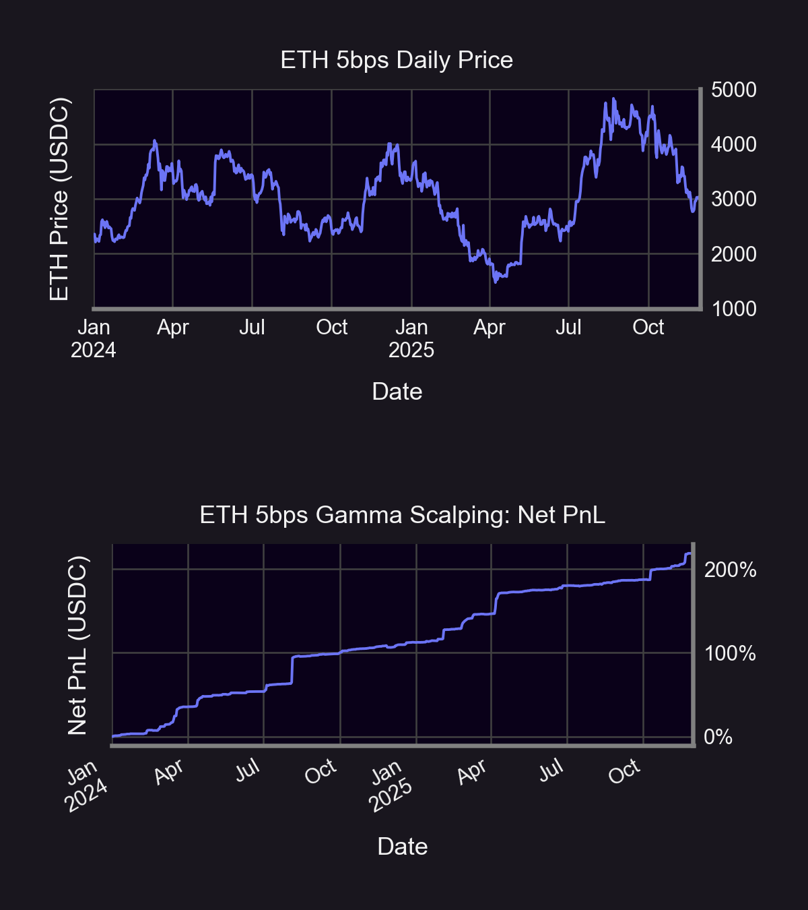

In the chart above, the theoretical cumulative net PnL collected by the trader due this 5bps pool gamma scalping tactic largely exhibits a stable, “stairstep” pattern. Conversely, the ETH pool price endures massive fluctuations throughout the same sample period. This underlying turbulence is reflected in a buy-and-hold strategy within the ETH 5bps pool yielding only 31% returns while gamma scalping produces a lofty 219% return. In this simulation, gamma scalping provided a dual advantage through stability amid volatile market conditions as well as a demonstrable amplification in simulated profits.

The cumulative net simulated PnL of gamma scalping is arrived upon by deducting paid fees from the total raw payoff of the strategy. The two series are also highly correlated, as both are dependent on the RV of the spot price in the pool – whenever spot price moves, the delta of the position changes and requires an adjustment to the delta hedge. Similarly, price movements on other trading venues create arbitrage opportunities that drive trading activity in the Uniswap pool. These trades incur fees, which in the case of Panoptions are paid by the call option holder in the form of streamia.

Note that the two cashflows from hedging and streamia are different in two important ways. Firstly, the amount earned from gamma scalping is larger in almost all cases, resulting in a net profit across the full period. Secondly, the two series need not move at the same time. Owing to the fact that the number of units of spot in the delta hedge position is only updated when the absolute value of the delta moves above a given threshold, the capture of realized volatility is not perfect – spot may move around within the delta threshold bands without ever once breaching the bands and locking in hedging profits. However, the streamia fees paid to hold the long position are collected per-trade, meaning that every movement of spot adds to the streamia cost.

### The Impact of Fee Tiers on Volatility

Uniswap hosts trading pools for many assets across three different fee tiers (usually 1bp, 5bps, and 30bps of trade notional). As a result, the fees collected by LPs (and thus paid as streamia by long Panoption positions) are of a different magnitude. However, the fee tier also impacts pool fees through its effect on trade size and frequency.

Here, we replicate the analysis of the ETH-USDC pool as before (which one may naively expect to have the same volatility profile) to illustrate this effect. In this analysis the thresholds are broadened to an absolute of 15 delta to maximize the revenue of a call option in the  ETH-USDC 30bps pool (as opposed to the 5-delta bands that were most profitable in the 5bps pool simulation).

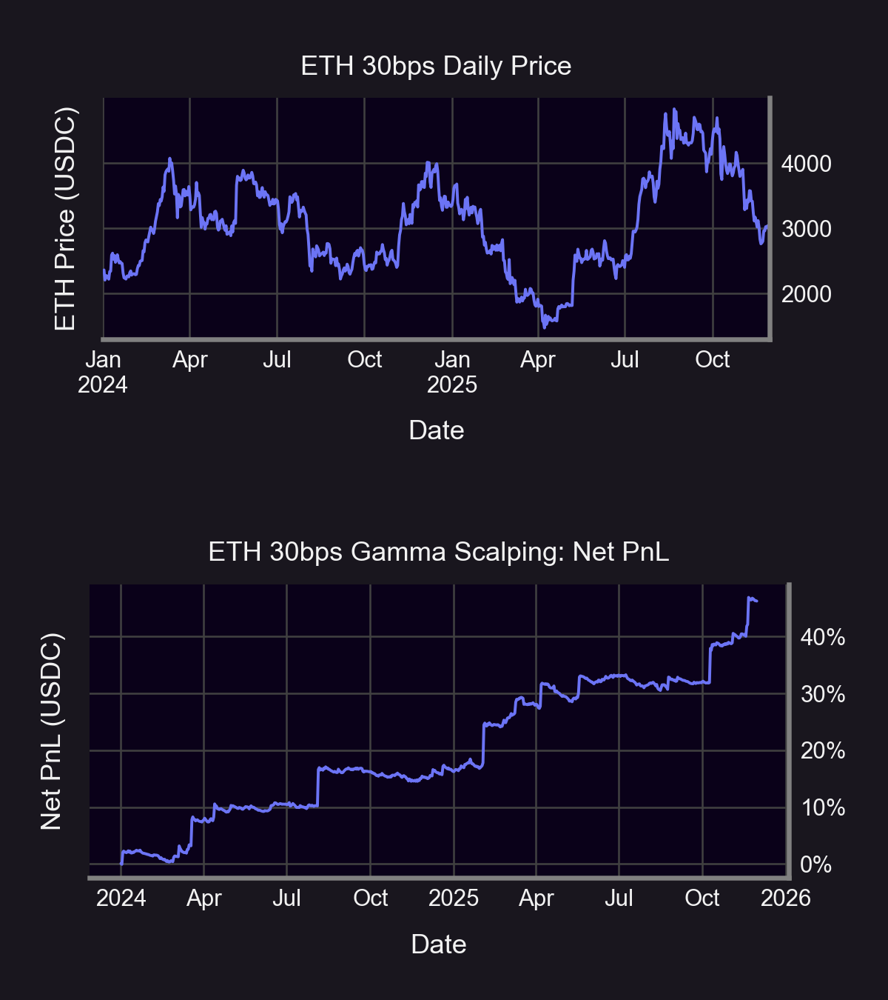

The simulated performance is similarly positive (the simulated gamma scalping returns outweigh the relatively paltry recorded streamia fee collected by Uniswap LPs), but at a lower magnitude. The gamma scalping returns amounted to around 46%, while the buy-and-hold returns of ETH within the 30bps pool were 28%. 

The reason for this disparity is simple: the price quoted by the 5bps pool is more volatile than that of the 30bps pool, requiring a more frequent delta hedge. As an example, the ETH-USDC 30bps call has a maximum of only 37 intraday hedges (albeit at larger sizes at the wider 15 delta bands), while the ETH-USDC 5bps call recorded up to 493 per day. 

Below is a summary of the hypothetical annualized returns to gamma scalping using various delta thresholds in both the ETH/USDC 5bps and 30bps pools.

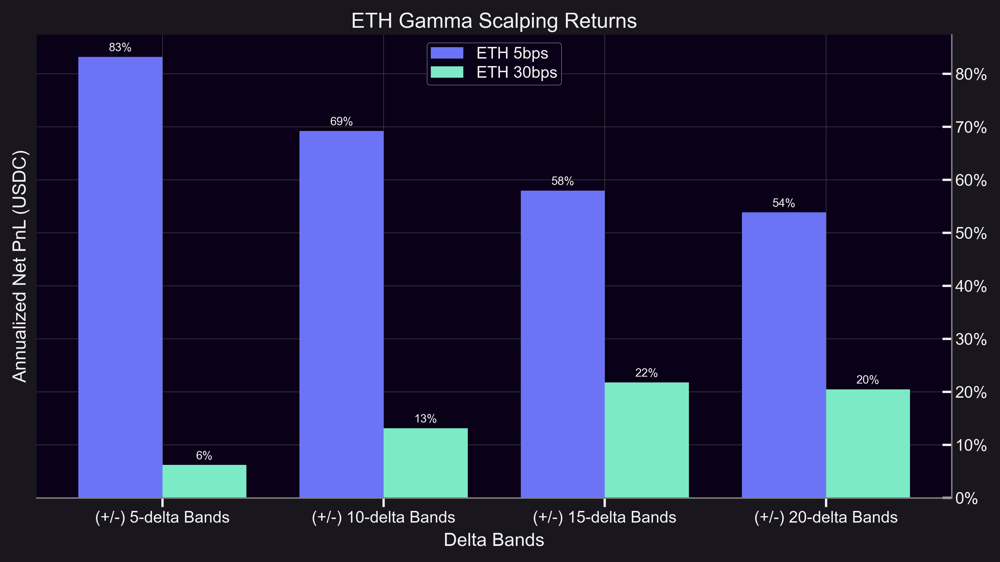

### Under-supply of LP positions means that long convexity is more expensive

The result is not unique to only high volume pools. The simulation run on WBTC-USDC 30bps pool also shows the same result for gamma scalping a 10-delta monthly call Panoption, but for a markedly different reason.

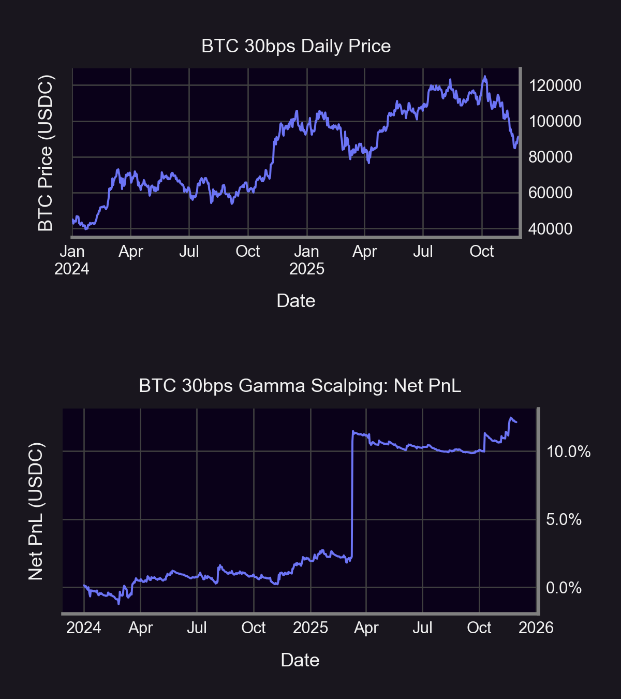

The chart above shows a net positive performance due to several “jumps” in hedging returns, despite the cost of streamia outweighing hedging profits over much of the sample period. Further examination of the data reveals that these large jumps in PnL are caused by large, volatile moves resulting in up to  66 hedges performed in a single day.

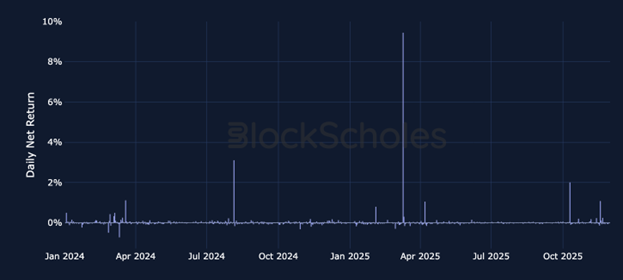

In contrast to the prior examples, the buy-and-hold return for BTC substantially outperformed the gamma-scalping return of 12% in the 30 bps pool. Simply holding WBTC over the same sample period yields a 105% return. This outcome illustrates the relationship between the supply of short-convexity through Uniswap LP positions and the effective “pricing” of volatility exposure.

ETH–USDC pools are among the most liquid AMM pools, with a large number of LP positions supplying liquidity. WBTC pools had relatively lower LP participation, resulting in a lower supply of short-convexity and higher streamia cost to the Panoption holder.

### Gamma-scalping altcoins

Uniswap’s AMM design supports trading pools for a wide range of token pairs. As a result, Panoptic’s infrastructure enables options trading on base–quote pairs that are not typically supported for trading on many other DEXs or CEXs, including memecoins.

This means traders can take onchain, long-optionality positions on tokens such as Shiba Inu (SHIB), PEPE, and Uniswap (UNI). We repeat the gamma scalping simulations on the SHIB-ETH 30bps pool, which pairs the Shiba Inu memecoin against ETH. Here, we keep the delta threshold to trigger re-hedging at an absolute value of 5 delta.

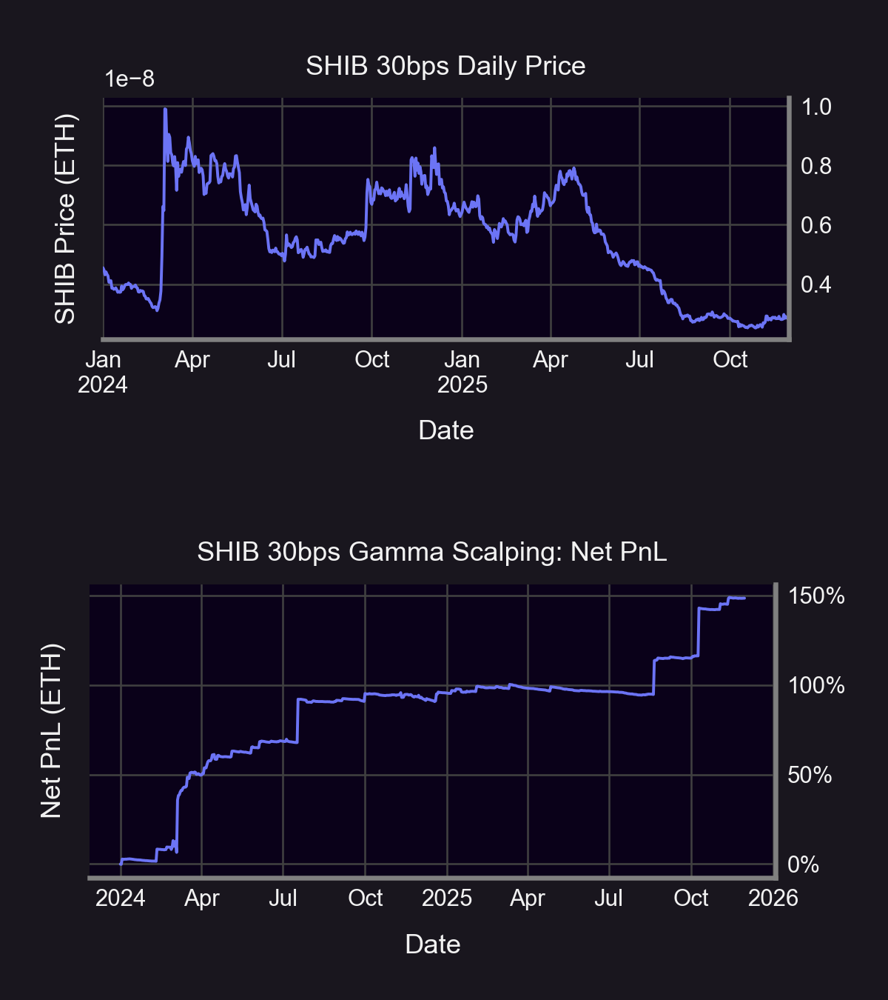

A similar “stairstep” pattern on the gamma scalping PnL appears. Notably, the maximum number of intraday hedges over this sample period was 500 – a natural result of the high  volatility of the SHIB-ETH price. 

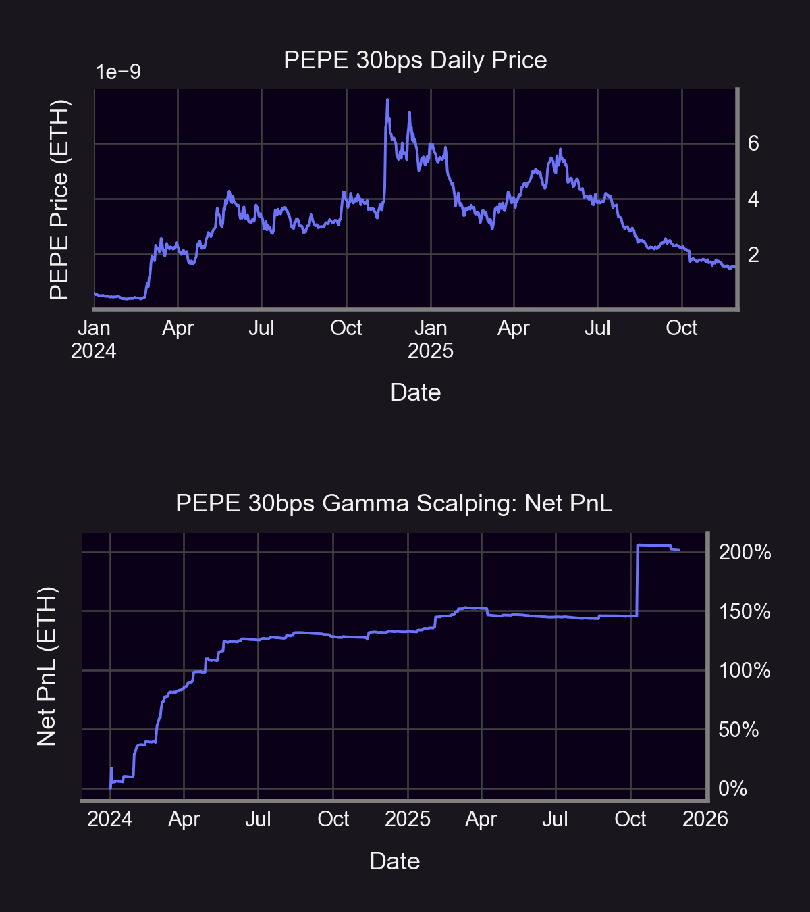

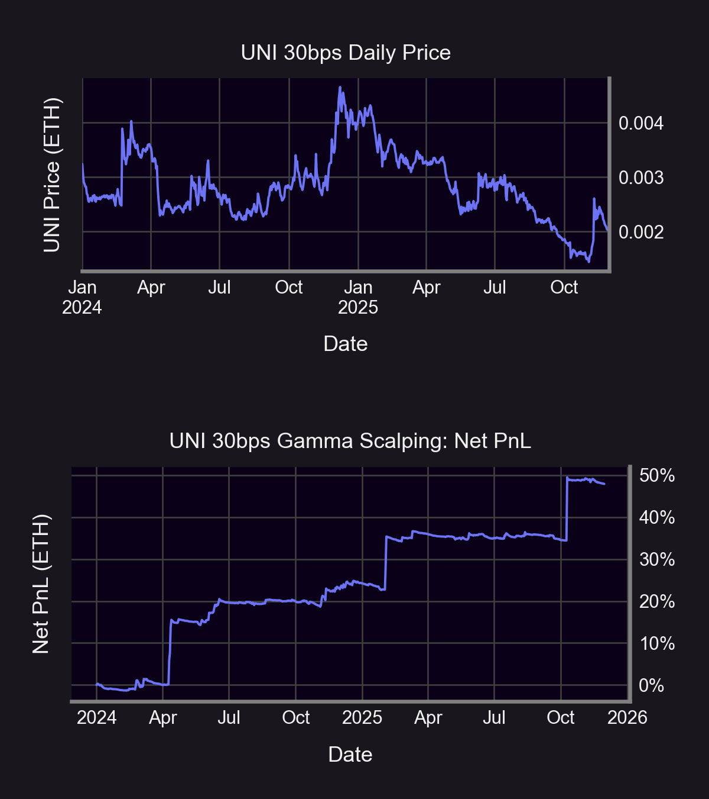

The two charts above compare the net returns from gamma scalping alongside the performance of the underlying spot price for the PEPE–ETH and UNI–ETH 30 bps pools. Monthly calls with delta bands of 5 and 20 were used for the PEPE–ETH and UNI–ETH pool, respectively.
Gamma scalping in the PEPE–ETH pool produced a net return of 202%, while the UNI–ETH pool yielded a net return of 48% over the sample period. The longer-dated Panoption structure also resulted in fewer intraday hedges, with the maximum number of hedges in a single day being 126 for PEPE–ETH and 14 for UNI–ETH.

| *Pool* | *Buy-&-Hold Simulated Returns* | *Gamma Scalping Simulated Returns* |
|--------|--------------------------------|------------------------------------|
| UNI-ETH 30bps  | -37.47% | +47.93% |
| SHIB-ETH 30bps | -38.56% | +150.01% |
| PEPE-ETH 30bps | +154.18% | +201.69% |                       

As highlighted by the above table, the versatile attractiveness of gamma scalping among these three pools is further exemplified over buying-and-holding these tokens. The advantage of gamma scalping over buying-and-holding is demonstrated to persist over a variety of  token pairs and fee tiers. 

### LP fees can be charged without a chance to lock in gamma scalping PnL

LP fees can be charged even without a corresponding opportunity to lock in gamma scalping profits. This phenomenon was observed in a scenario where a massive spike in streamia occurred despite the spot price, when viewed on an hourly chart, never moving into the LP position range. Consequently, there was no change in delta, and thus no gamma scalp was locked in for the LP on the hourly basis.

Further examination revealed an "intra-block" flash crash, where the spot price briefly traded back within the LP range and then returned above it before the end of the block. These trades within the range triggered the payment of fees on the long call Panoption, yet the rapid reversal meant no gamma-hedging was performed within the hour.

This highlights that Uniswap’s market structure is inherently different from conventional markets, meaning that there are unique features to AMMs like intra-block trades that impact the results of gamma-scalping.

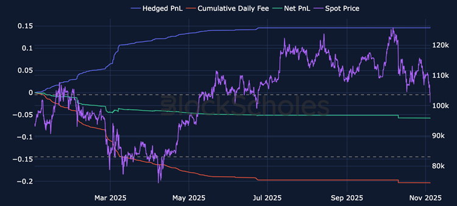

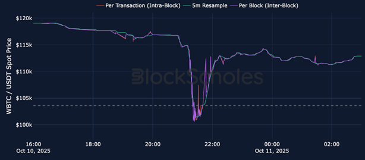

## Conclusion
This report quantitatively demonstrates that the over-supply of Uniswap LP positions’ short optionality can be monetized through the purchase and dynamic hedging of Panoptic’s options infrastructure.

Across multiple pools and fee tiers, our empirical results support this mechanism, showing that gamma scalping can be economically viable rather than merely synthetically replicable. We find that the magnitude and persistence of this effect depend on fee tier, liquidity depth, realized volatility, and the temporal resolution of hedging and fee accrual.

Finally, we show that optimizing delta-hedging parameters enables gamma scalping profitability across a broad range of Uniswap pools, including higher-volatility and niche assets not typically supported for options trading by centralized venues such as Shiba Inu and PEPE. Panoptic’s [upcoming V2 platform](/docs/getting-started/vaults) will make gamma scalping accessible in the convenient form of a perpetual option vault (POV). Future work in this report series will examine volatility surface calibration and the structural distinctions between Panoptions and vanilla options.

*Join the growing community of Panoptimists and be the first to hear our latest updates by following us on our [social media platforms](https://links.panoptic.xyz/all). To learn more about Panoptic and all things DeFi options, check out our [docs](/docs/intro) and head to our [website](https://panoptic.xyz/).*
