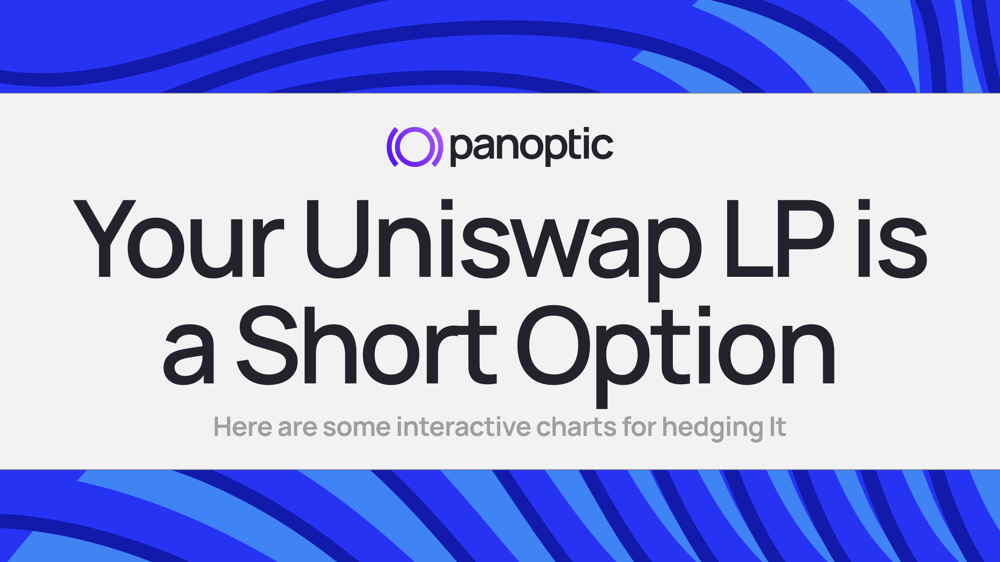

import {LpShortPut} from '@site/src/components/LpHedge';

Every Uniswap v3 or v4 LP position is an options trade, whether the LP knows it or not. While price is inside the range, swappers sell you the falling token and buy the rising one. You end up holding more of the asset as it drops and less as it rallies. That's option-like, short-gamma exposure, not the expiration payoff of a vanilla sold put or covered call: the LP's value curve bends smoothly while price is in range. DeFi calls the resulting shortfall impermanent loss; an options trader would call it the cost of being short gamma. Swap fees are what you're paid for taking that risk.

We've written about this before ([LP = options](/blog/uniswap-options), [reverse gamma scalping](/research/reverse-gamma-scalping)). This time we built something you can play with.

<!--truncate-->

## Try it

Move the starting price and change the range width. The left chart is the LP's P&L; the right chart is what the position actually holds. Narrow the range and the curve bends harder: more fees per dollar, but sharper losses when price leaves.

<LpShortPut />

## What you can do about it

Once you see the LP as a short-gamma position, hedging it is an options question. The new [How to hedge a Uniswap LP position](/docs/product/uniswap-lps/hedge) guide has an interactive chart for each approach:

- **Hedge delta with a loan.** Borrow ETH and sell it. This removes direction but keeps the curvature, so large moves still hurt.
- **Buy a put at a lower strike.** The LP and the long put form a put credit spread, and your loss stops growing below the long strike.
- **Buy a put at the same strike with a wider range.** On Panoptic, range width plays the role of time to expiry, so this is a calendar spread with defined risk on both sides.
- **Sell a call too.** A short put plus a short call is a short straddle that starts close to delta neutral.
- **Sell options instead of LPing.** Selling an option on Panoptic is providing Uniswap liquidity, but buyers who use it pay you streamia on top of swap fees, multiplied by a spread that rises with utilization.

Each chart shows the payoff and the tokens the combined position holds, including debt from loans and long options, so you can see where your exposure actually comes from.

## Why this matters

Most LPs size their range by gut feel and find out about impermanent loss after the fact. The tools to manage it have existed in TradFi for decades; they just weren't available on the same liquidity LPs already provide. Panoptic's perpetual options and loans sit on the same Uniswap pools, so the hedge and the position live side by side.

[Explore the full guide →](/docs/product/uniswap-lps/hedge)

*Join the growing community of Panoptimists and be the first to hear our latest updates by following us on our [social media platforms](https://links.panoptic.xyz/all). To learn more about Panoptic and all things DeFi options, check out our [docs](/docs/intro) and head to our [website](https://panoptic.xyz/).*
